# Git, GitHub Platform & Platform Engineering Cheatsheet

> Quick-reference cheatsheet, built incrementally. Part 1: Git Foundations.

---

# PART 1 — Git Foundations

## Core Concepts at a Glance

| Term | Definition | Mutates history? |
|---|---|---|
| **Repository** | Object DB + refs + config (`.git/`) | — |
| **Working Tree** | Checked-out files on disk | No |
| **Staging Area (Index)** | Pending snapshot for next commit | No |
| **Commit** | Immutable snapshot + parent link, SHA-addressed | No (immutable) |
| **Branch** | Movable named pointer to a commit | No |
| **Tag** | Fixed label, usually for releases | No |
| **HEAD** | "You are here" pointer (branch or commit) | No |
| **Reflog** | Local log of ref movements (recovery tool, ~90 days) | No |
| **Merge** | Combine histories → new merge commit | Adds, doesn't rewrite |
| **Rebase** | Replay commits onto new base | **Yes** — new hashes |
| **Cherry-pick** | Copy one commit's diff elsewhere | New commit, new hash |

## Git Objects

| Object | Contains |
|---|---|
| **Blob** | Raw file content (no name/metadata) |
| **Tree** | Directory listing: mode, type, hash, filename |
| **Commit** | Tree pointer + parent(s) + author/date/message |
| **Annotated Tag** | Pointer + metadata + optional GPG signature |

- SHA = `hash(type + size + content)` → content-addressed, dedup'd, tamper-evident.
- **Pack files** (`.pack` + `.idx`) = compressed, delta-encoded loose objects → smaller repo, faster clone.
- **GC**: unreachable objects (after reset/rebase) survive via reflog (~90d) then get pruned by `git gc --prune`.

## Merge vs Rebase vs Cherry-pick — When to Use

| Action | Use when | Avoid when |
|---|---|---|
| **Merge** | Shared/long-lived branches; want true history of divergence | History clutter isn't a concern |
| **Rebase** | Cleaning up a *local/unshared* feature branch before PR | Branch already pushed & others built on it |
| **Cherry-pick** | Backporting one fix (e.g., hotfix → release branch) | Repeated bulk-syncing between branches |

## Quick Diagram — Working Tree → Staging → Commit

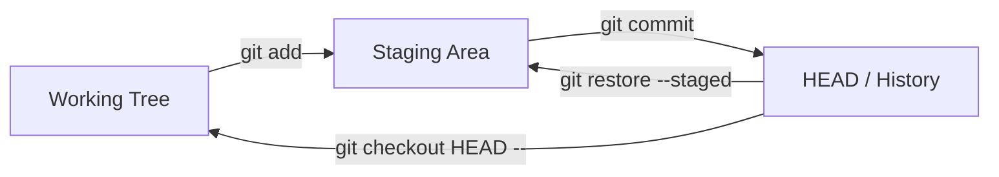

---

*End of Part 1. Next: Part 2 — Git CLI Complete Cheat Sheet.*

---

# PART 2 — Git CLI Complete Cheat Sheet

## Repository Management

| Command | Purpose | Common Flags | When to Use |
|---|---|---|---|
| `git init` | Create new repo | `--bare`, `--object-format=sha256` | Starting a new project |
| `git clone <url>` | Copy remote repo + history | `--depth=1` (shallow), `--branch <b>`, `--recurse-submodules` | Getting an existing repo locally / CI checkout |
| `git config` | Set config (user, aliases, behavior) | `--global`, `--local`, `--list` | Identity setup, repo-specific overrides |
| `git remote` | Manage remote connections | `-v`, `add`, `remove`, `rename`, `set-url` | Linking to GitHub/GitLab, multi-remote setups |

## Daily Development

| Command | Purpose | Common Flags | When to Use |
|---|---|---|---|
| `git status` | Show working tree/staging state | `-s` (short) | Before/after every change |
| `git add` | Stage changes | `-p` (patch/hunks), `-A`, `.` | Preparing a commit |
| `git commit` | Record staged snapshot | `-m`, `-am`, `--amend`, `-S` (sign) | Saving logical units of work |
| `git push` | Upload commits to remote | `-u`, `--force`, `--force-with-lease`, `--tags` | Sharing work |
| `git pull` | Fetch + integrate remote changes | `--rebase`, `--ff-only` | Syncing local branch with remote |

**Recovery note**: `--force-with-lease` > `--force` — fails safely if remote has commits you haven't seen.

## Branching

| Command | Purpose | Common Flags | When to Use |
|---|---|---|---|
| `git branch` | List/create/delete branches | `-a`, `-d`, `-D`, `-m`, `-vv` | Branch management |
| `git switch` | Switch branches (modern) | `-c` (create+switch), `-d` (detach) | Preferred over checkout for branch switching |
| `git checkout` | Switch branches / restore files (legacy, multi-purpose) | `-b`, `--`, `-- <file>` | Older syntax; still used for detached HEAD, file restore |
| `git merge` | Combine branch histories | `--no-ff`, `--squash`, `--abort` | Integrating completed feature into target branch |
| `git rebase` | Replay commits on new base | `-i`, `--onto`, `--abort`, `--continue` | Clean up local history before PR |
| `git cherry-pick` | Apply one commit elsewhere | `-x` (record origin), `--no-commit` | Backport a single fix |

## History & Inspection

| Command | Purpose | Common Flags | When to Use |
|---|---|---|---|
| `git log` | View commit history | `--oneline`, `--graph`, `--all`, `-p`, `--stat`, `-- <path>` | Reviewing history, debugging |
| `git show` | Show a specific object/commit | `<commit>:<path>` | Inspect one commit's full diff/content |
| `git blame` | Per-line authorship | `-L <range>`, `-w` (ignore whitespace) | Tracing when/why a line changed |
| `git diff` | Show changes between states | `--staged`, `HEAD~1`, `<branch1>..<branch2>` | Reviewing before commit/PR |

## Recovery

| Command | Purpose | Common Flags | When to Use | Recovery Scope |
|---|---|---|---|---|
| `git reset` | Move HEAD/branch pointer | `--soft`, `--mixed` (default), `--hard` | Undo commits (soft=keep staged, hard=discard all) | Reflog recovers commits, **hard discards working tree changes** |
| `git revert` | New commit that undoes a prior commit | `-n` (no auto-commit), `-m` (for merge commits) | Undo on **shared/public** branches safely | Fully recoverable — adds history, doesn't rewrite |
| `git restore` | Restore working tree/staged files | `--staged`, `--source=<commit>` | Discard local edits or unstage files | Working tree changes lost unless committed/stashed |
| `git clean` | Remove untracked files | `-f`, `-d`, `-x` (incl. ignored), `-n` (dry run) | Clear build artifacts, scratch files | **Not recoverable** — always `-n` first |
| `git reflog` | Show local ref history | `show`, `expire` | Recover "lost" commits after reset/rebase | Primary recovery tool, ~90-day window |

## Advanced

| Command | Purpose | Common Flags | When to Use |
|---|---|---|---|
| `git stash` | Shelve uncommitted changes | `push -m`, `pop`, `apply`, `list`, `-u` (untracked) | Context-switch without committing |
| `git bisect` | Binary-search history for a bad commit | `start`, `good`, `bad`, `run <script>` | Finding which commit introduced a regression |
| `git worktree` | Multiple working trees from one repo | `add`, `list`, `remove` | Work on hotfix + feature simultaneously, no stash needed |
| `git notes` | Attach metadata to commits w/o changing them | `add`, `show`, `list` | CI results, review annotations on immutable commits |
| `git sparse-checkout` | Check out only part of repo tree | `init --cone`, `set <paths>` | Huge monorepos — only pull needed subdirectories |
| `git submodule` | Embed another repo at a path | `add`, `update --init --recursive`, `sync` | Shared library as a pinned external dependency |
| `git filter-repo` | Rewrite history (remove files/paths) | `--path`, `--invert-paths` | Purge secrets/large files from entire history |

---

*End of Part 2. Next: Part 3 — Git Internals.*

---

# PART 3 — Git Internals

## How Git Stores Data

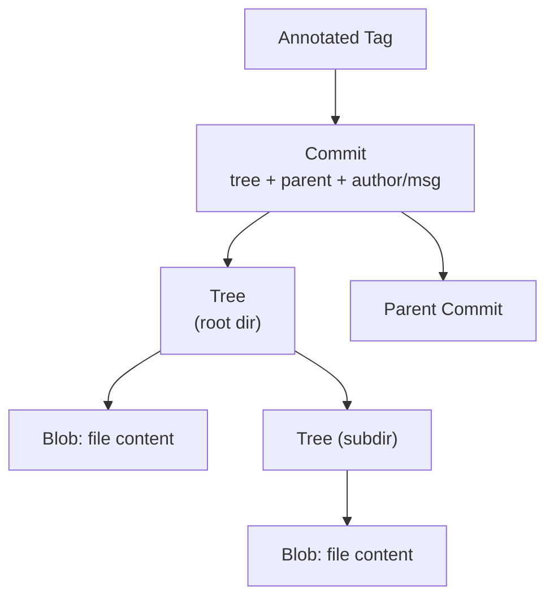

## Internals Commands

| Command | Purpose | When to Use |
|---|---|---|
| `git cat-file -p <hash>` | Pretty-print any object's content | Inspect raw blob/tree/commit objects |
| `git cat-file -t <hash>` | Show object type | Debugging object references |
| `git rev-parse` | Resolve refs/shorthand to full SHA | Scripting, resolving `HEAD`, `HEAD~2`, etc. |
| `git hash-object <file>` | Compute the blob hash of a file (without storing) | Verify content matches a known object |
| `git fsck` | Check repo integrity, find dangling objects | Corruption checks, recovery before `gc` |

## Refs, Tags, Packfiles, GC

| Concept | Location | Notes |
|---|---|---|
| **Refs** | `.git/refs/heads/`, `.git/refs/tags/`, `.git/refs/remotes/` | Plain files (or packed-refs) pointing to SHAs |
| **HEAD** | `.git/HEAD` | Symbolic ref → `refs/heads/<branch>` |
| **Packfiles** | `.git/objects/pack/*.pack` + `.idx` | Compressed, delta-encoded object storage |
| **Loose objects** | `.git/objects/xx/yyyy...` | Pre-pack storage; compacted by `git gc` |
| **Garbage Collection** | `git gc`, `git gc --prune=now` | Repacks loose objects, prunes unreachable objects past reflog expiry |

**Lifecycle**: commit becomes unreachable (reset/rebase/amend) → stays recoverable via reflog (~90d default) → `git gc --prune` removes it once expired.

---

*End of Part 3. Next: Part 4 — Git Workflow Strategies.*

---

# PART 4 — Git Workflow Strategies

## Comparison Matrix

| Strategy | Pros | Cons | Scaling Limit | Best Team Size |
|---|---|---|---|---|
| **GitHub Flow** | Simple: `main` + short-lived feature branches + PR + deploy | No formal release branches; needs strong CI/CD & feature flags | Scales well with good CI | Small–large, continuous deployment shops |
| **Git Flow** | Structured (develop/release/hotfix/feature branches), good for versioned releases | Heavyweight, slow, merge-conflict prone, poor fit for CD | Struggles with high commit velocity | Teams shipping versioned/on-prem software |
| **Trunk-Based Development** | Single shared trunk, tiny short-lived branches (<1 day), feature flags for incomplete work | Requires excellent test automation & flags discipline | Scales very well (Google-style) | Medium–large, high CI maturity |
| **Release Branching** | Stabilize a branch for release while `main` moves on; cherry-pick fixes | Cherry-pick overhead, divergence risk | Moderate — many concurrent releases get painful | Teams w/ multiple supported versions |
| **Monorepo Workflow** | Atomic cross-project commits, unified tooling/CI, easy refactors | Tooling complexity, CI scaling, access-control challenges | Needs sparse-checkout/VFS at scale | Platform teams, shared-library-heavy orgs |
| **Multi-Repo Workflow** | Clear ownership boundaries, independent versioning/CI | Cross-repo changes are hard, dependency drift | Coordination overhead grows with repo count | Org with clear service boundaries (microservices) |

## Decision Tree

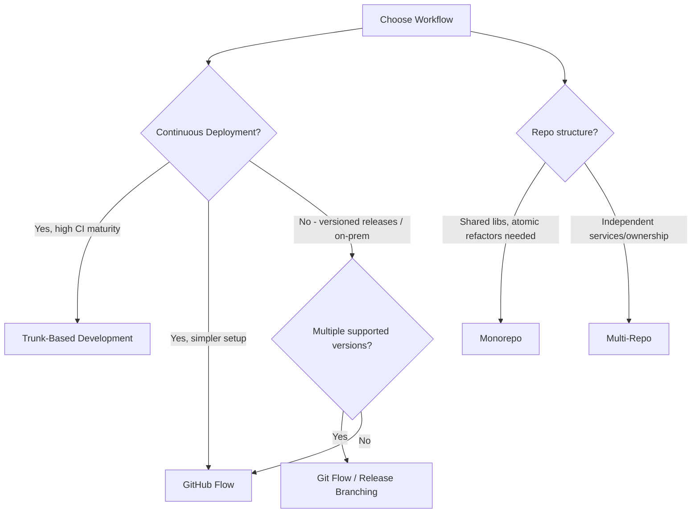

## Enterprise Adoption Notes

- **GitHub Flow + Trunk-Based** is the dominant pattern for SaaS/cloud-native orgs (2024–2026 norm), paired with feature flags (LaunchDarkly, etc.) and merge queues.
- **Git Flow** persists in regulated/on-prem/embedded software where releases are infrequent and versioned support windows are long.
- **Monorepos** require investment in sparse-checkout, CODEOWNERS-based path ownership, and CI path-filtering (only build affected projects) to remain viable past a few hundred engineers.

---

*End of Part 4. Next: Part 5 — GitHub Platform Deep Dive.*

---

# PART 5 — GitHub Platform Deep Dive

## Core Collaboration Features

| Feature | Purpose | Workflow Use | Governance / Enterprise Notes |
|---|---|---|---|
| **Repositories** | Code + history container | Base unit of access control & CI | Visibility (public/private/internal), org-owned vs personal |
| **Organizations** | Container for repos, teams, billing | Central admin for company/product | SSO, SCIM, audit log scope (Part 21) |
| **Teams** | Group users for permissions | Map to squads/departments | Nested teams, repo-level permission grants |
| **Pull Requests** | Propose & review code changes | Core review/merge unit | Required reviews, status checks, merge queue |
| **Issues** | Track bugs/tasks/requests | Backlog, bug tracking | Templates, labels, linked PRs |
| **Discussions** | Async Q&A / RFC-style conversation | Design discussions, community Q&A | Not tied to code changes; good for ADRs |
| **Projects** | Kanban/table/roadmap views over issues+PRs | Sprint planning, roadmaps | Custom fields, automation (see Part 8) |
| **Labels** | Categorize issues/PRs | Triage, filtering | Org-wide label sets via templates |
| **Milestones** | Group issues/PRs by release/date | Release planning | Progress tracking per milestone |
| **Templates** | Pre-filled issue/PR forms | Standardize bug reports, PR checklists | `.github/ISSUE_TEMPLATE/`, `PULL_REQUEST_TEMPLATE.md` |
| **Draft PRs** | PR not yet ready for review | WIP visibility, early CI feedback | Prevents premature review/merge |
| **Saved Replies** | Reusable comment snippets | Faster triage responses | Personal or org-level canned responses |

## Pull Requests — Review & Merge

| Feature | What It Does | When to Use |
|---|---|---|
| **Reviews** | Approve / request changes / comment | Standard code review gate |
| **Required Reviews** | Branch protection rule requiring N approvals | Enforce review on protected branches (main, release) |
| **Review Assignment** | Auto-assign reviewers (round-robin, CODEOWNERS) | Balance review load across team |
| **Auto-merge** | Merge automatically once checks/reviews pass | Reduce manual babysitting of green PRs |
| **Merge Queue** | Serializes merges, re-tests against latest base before merging | High-traffic `main` branches — prevents "semantic conflict" breakage |

## Merge Strategies

| Strategy | Result | Best For | Avoid When |
|---|---|---|---|
| **Merge Commit** | Preserves full branch history + adds merge commit | Need full audit trail of feature development | History readability matters more than detail |
| **Squash Merge** | All PR commits → one commit on target branch | Clean linear history, one commit per feature/PR | Need to preserve granular commit-by-commit history |
| **Rebase Merge** | PR commits replayed individually onto target, no merge commit | Linear history while preserving individual commits | PR has messy/WIP commits not worth preserving |

**Recommendation**: Squash merge for most product repos (clean `main`, easy revert of whole features); merge commits for release-branch integrations where you need full traceability.

## CODEOWNERS

| Aspect | Detail |
|---|---|
| **File location** | `.github/CODEOWNERS`, `CODEOWNERS`, or `docs/CODEOWNERS` |
| **Purpose** | Auto-request review from path-specific owners |
| **Governance use** | Enforce that infra/security-sensitive paths require specific team approval |
| **Security implication** | Combine with required reviews + branch protection to prevent unreviewed changes to CI configs, secrets handling, IaC |
| **Anti-pattern** | One catch-all `* @whole-org-team` — defeats the purpose, causes review bottlenecks |

---

*End of Part 5. Next: Part 6 — GitHub Wiki & Part 7 — GitHub Pages.*

---

# PART 6 — GitHub Wiki

| Aspect | Detail |
|---|---|
| **Architecture** | Git-backed repo (`<repo>.wiki.git`), Markdown pages, cloneable/editable like code |
| **Use cases** | Runbooks, architecture docs, onboarding guides, SOPs |
| **Strength** | Zero extra tooling, versioned, integrated with repo permissions |
| **Weakness** | Weak search, no rich nesting/taxonomy, no diagrams-as-code rendering beyond Mermaid |

## Wiki vs Alternatives

| Tool | Best For | Weakness |
|---|---|---|
| **GitHub Wiki** | Lightweight, repo-scoped docs | Poor cross-repo search/structure |
| **Confluence** | Org-wide structured knowledge base, rich permissions | Separate tool, sync drift from code |
| **Notion** | Flexible docs + databases, great UX | Not git-versioned, harder to enforce as source-of-truth |
| **MkDocs** | Markdown → static docs site, versioned with code | Requires CI/Pages setup |
| **Docusaurus** | Feature-rich docs site (versioning, search, React) | Heavier setup/maintenance |

**Recommendation**: Use MkDocs/Docusaurus + GitHub Pages for product/API docs that need versioning and search; GitHub Wiki for lightweight team runbooks; Confluence/Notion for cross-team org knowledge.

---

# PART 7 — GitHub Pages

| Aspect | Detail |
|---|---|
| **What it is** | Free static site hosting directly from a repo (branch or `/docs` folder, or Actions-built artifact) |
| **Common uses** | Product docs, API reference, engineering handbooks, internal developer portals |
| **Static site generators** | Jekyll (native support, no build step needed), MkDocs (Python/Markdown), Docusaurus (React/Markdown) |

## Deployment Workflow (Generic)

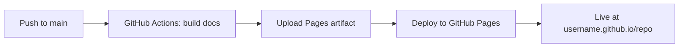

```yaml
# Minimal MkDocs -> Pages workflow
name: Deploy Docs
on:
  push:
    branches: [main]
permissions:
  pages: write
  id-token: write
jobs:
  deploy:
    runs-on: ubuntu-latest
    steps:
      - uses: actions/checkout@v4
      - uses: actions/setup-python@v5
        with:
          python-version: '3.12'
      - run: pip install mkdocs-material
      - run: mkdocs build
      - uses: actions/upload-pages-artifact@v3
        with:
          path: site
      - uses: actions/deploy-pages@v4
```

**When to use**: Public/internal docs that should be versioned alongside code and built via CI. **When not to use**: Anything needing server-side logic, auth-gated content (without extra proxy), or dynamic data.

---

*End of Parts 6–7. Next: Part 8 — GitHub Projects.*

---

# PART 8 — GitHub Projects

| Feature | Description | Use Case |
|---|---|---|
| **Boards** | Kanban-style columns (To Do / In Progress / Done) | Sprint boards, simple workflow tracking |
| **Tables** | Spreadsheet-like view of issues/PRs with custom fields | Backlog grooming, filtering/sorting at scale |
| **Roadmaps** | Timeline/Gantt-style view | Quarter/release planning |
| **Custom Fields** | Add fields (priority, estimate, team, sprint) to items | Tailor tracking to team's process |
| **Automation (workflows)** | Auto-move items based on PR/issue state changes | Reduce manual board grooming |

## Use Cases

- Sprint planning (board + custom fields for story points)
- Roadmaps (timeline view across milestones)
- Incident tracking (label + project combo for postmortem follow-ups)
- Release tracking (table view filtered by milestone/label)

## Comparison vs Dedicated PM Tools

| Tool | Strength | Weakness vs GitHub Projects |
|---|---|---|
| **Jira** | Mature workflows, extensive reporting, enterprise integrations | Separate from code, sync overhead, cost at scale |
| **Azure Boards** | Deep Azure DevOps integration, enterprise reporting | Best only if already on Azure DevOps |
| **Linear** | Fast UX, opinionated workflows, great keyboard-driven flow | Separate billing/tool, requires GitHub sync for code linkage |
| **Asana** | General-purpose PM, non-eng friendly | Weak code/issue linkage |
| **GitHub Projects** | Native issue/PR linkage, free with GitHub, good for eng-only teams | Less mature reporting/cross-team PM features |

**Recommendation**: GitHub Projects for engineering-only teams wanting tight code/issue coupling without extra tooling/cost. Jira/Linear when product/eng/design need shared cross-functional workflows and richer reporting.

---

*End of Part 8. Next: Part 9 — GitHub Packages.*

---

# PART 9 — GitHub Packages

| Registry Type | Package Format | Typical Command |
|---|---|---|
| **Container Registry (GHCR)** | OCI/Docker images | `docker push ghcr.io/org/app:tag` |
| **npm** | Node packages | `npm publish --registry=https://npm.pkg.github.com` |
| **PyPI-compatible** | Python packages | `twine upload --repository-url https://pypi.pkg.github.com/...` (via configured index) |
| **Maven** | Java/JVM artifacts | `mvn deploy` (with GitHub Packages repo configured) |
| **NuGet** | .NET packages | `dotnet nuget push --source github` |

## Package Management Strategy Notes

- **Scoping**: GitHub Packages are tied to org/repo permissions — good for internal/private packages shared across an org's repos.
- **Container images**: GHCR is the most commonly adopted (vs Docker Hub) for private images due to unified auth with GitHub Actions (`GITHUB_TOKEN`).
- **Public package registries** (npmjs.com, PyPI, Docker Hub) remain standard for OSS; GitHub Packages typically used for internal/private artifacts.
- **Supply chain**: Pair with SBOM generation and image signing (Cosign) — see Part 19.

---

# PART 10 — GitHub Releases

| Concept | Description |
|---|---|
| **Tags** | Git tags (usually annotated) mark the exact commit for a release |
| **Release Notes** | Markdown description attached to a tag; can be auto-generated from merged PRs |
| **Changelogs** | Often generated from conventional commits or PR labels |
| **Semantic Versioning** | `MAJOR.MINOR.PATCH` — breaking / feature / fix |
| **Automated Releases** | CI creates tag + release + changelog + artifacts on merge to main or on manual trigger |

```yaml
# Automated release example
- uses: softprops/action-gh-release@v2
  with:
    generate_release_notes: true
    files: dist/*.tar.gz
```

**Best practice**: Use Conventional Commits (`feat:`, `fix:`, `chore:`) + `semantic-release` or `release-please` to fully automate version bumps, changelogs, and tagging.

---

*End of Parts 9–10. Next: Part 11 — GitHub Codespaces.*

---

# PART 11 — GitHub Codespaces

| Aspect | Detail |
|---|---|
| **What it is** | Cloud-hosted, container-based dev environments defined via `.devcontainer/devcontainer.json` |
| **Dev Containers** | Standardized image + tooling/extensions, reproducible across all team members |
| **Prebuilds** | Pre-build the container/dependencies on push so Codespaces start in seconds |
| **Why it exists** | Eliminates "works on my machine", removes local setup friction, enables ephemeral/disposable environments |

## Comparison

| Option | Strength | Weakness |
|---|---|---|
| **Codespaces** | Zero local setup, scales with GitHub permissions, prebuilds | Per-hour cost, requires good devcontainer config |
| **Local Development** | Full control, no usage cost, offline-capable | Environment drift, onboarding friction |
| **Gitpod** | Similar cloud dev-env model, multi-VCS support | Separate billing/platform from GitHub |
| **DevBox (Jetify)** | Reproducible local envs via Nix, no cloud dependency | Still local — doesn't solve "needs powerful cloud compute" |
| **VS Code Remote (SSH/Containers)** | Use existing remote servers/containers, no new platform | Requires you to manage the remote infra yourself |

**When to use**: Onboarding (new hires productive in minutes), short-lived contributions (OSS contributors, contractors), consistent environments for large teams. **When not to use**: Heavy local-hardware-dependent work (GPU-bound ML training without cloud GPU SKUs), cost-sensitive teams with already-standardized local setups.

---

*End of Part 11. Next: Part 12 — GitHub CLI.*

---

# PART 12 — GitHub CLI (`gh`)

| Aspect | Detail |
|---|---|
| **Installation** | `brew install gh` / `winget install GitHub.cli` / apt/dnf packages |
| **Authentication** | `gh auth login` (browser or token-based), `gh auth status` |
| **Architecture** | Thin wrapper over GitHub REST/GraphQL APIs + git; extensible via `gh extension` |

## Core Commands

| Command | Purpose | When to Use |
|---|---|---|
| `gh repo create` | Create new repo (local+remote) | New project bootstrap |
| `gh repo clone` | Clone with auth handled | Standard clone shortcut |
| `gh issue create` / `gh issue list` | Manage issues from terminal | Triage without context-switching to browser |
| `gh pr create` | Open PR from current branch | After pushing feature branch |
| `gh pr view` | View PR details/diff | Review in terminal |
| `gh pr merge` | Merge a PR | Finalize after approval |
| `gh workflow list` | List Actions workflows | Check available CI workflows |
| `gh run list` / `gh run view` | List/inspect workflow runs | Debug CI from terminal |
| `gh release create` | Create a release + upload assets | Release automation/scripting |

## Automation Example

```bash
# Create issue, then PR referencing it, then watch CI
gh issue create --title "Fix login bug" --body "Repro steps..." 
gh pr create --fill --base main
gh run watch
```

---

*End of Part 12. Next: Part 13 — GitHub Actions Complete Guide.*

---

# PART 13 — GitHub Actions Complete Guide

## Core Concept Hierarchy

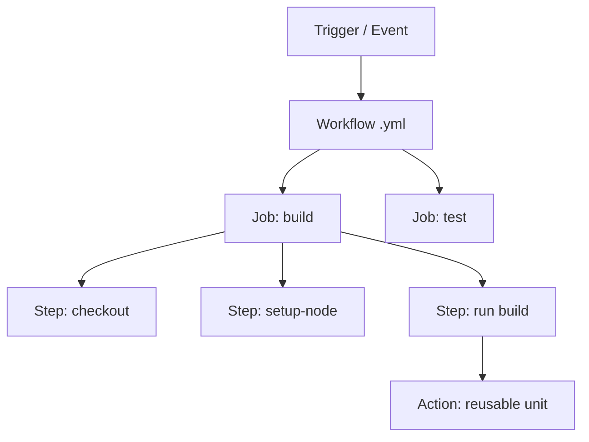

## Key Concepts

| Concept | Description | When to Use |
|---|---|---|
| **Workflow** | YAML file in `.github/workflows/`, triggered by events | One per pipeline (CI, release, deploy) |
| **Job** | Group of steps on one runner; jobs run in parallel by default | Split build/test/deploy stages |
| **Step** | Single command or action invocation | Smallest unit of execution |
| **Action** | Reusable packaged step (Docker, JS, or composite) | Don't reinvent common tasks (checkout, setup-lang) |
| **Composite Action** | Bundle multiple steps into one reusable action | Share multi-step logic across workflows/repos |
| **Reusable Workflow** | Entire workflow called via `workflow_call` | Standardize CI across many repos org-wide |
| **Matrix Builds** | Run job across combinations (OS x version x ...) | Test across multiple environments |
| **Artifacts** | Files passed between jobs / downloadable after run | Build outputs, test reports, coverage |
| **Secrets** | Encrypted values (org/repo/environment scoped) | API keys, credentials (prefer OIDC where possible) |
| **Variables** | Non-secret config values (org/repo/environment) | Feature flags, environment names |
| **Environments** | Named deployment targets w/ protection rules | Require approval before prod deploy |
| **Self-hosted Runners** | Your own compute instead of GitHub-hosted | Special hardware, network access, cost control |
| **OIDC Authentication** | Short-lived cloud credentials via token exchange, no stored secrets | AWS/Azure/GCP deploys (see Part 22) |

## Trigger Reference

| Trigger | When to Use |
|---|---|
| `push` | Run on commits to specified branches |
| `pull_request` | CI checks on PRs (tests, lint, security scans) |
| `schedule` (cron) | Nightly builds, scheduled cleanup/reports |
| `workflow_dispatch` | Manual trigger from UI/API with inputs |
| `release` | Run when a release is published |
| `workflow_call` | Make workflow reusable/callable by others |

---

# PART 14 — Most Common GitHub Actions

| Action | Purpose | Popularity | Enterprise Usage | Alternatives |
|---|---|---|---|---|
| `actions/checkout` | Clone repo into runner | Near-universal (first step in ~all workflows) | Standard everywhere | N/A |
| `actions/cache` | Cache deps/build outputs between runs | Very high | Speeds up CI cost & time at scale | `actions/setup-*` built-in caching |
| `actions/setup-python` | Install/configure Python | Very high | Pin versions org-wide via reusable workflows | `uv`-based setup |
| `actions/setup-node` | Install/configure Node.js | Very high | Same as above for JS/TS | `volta`, manual install |
| `actions/setup-java` | Install/configure JDK | High (JVM shops) | Standardize JDK versions | `sdkman`-based setup |
| `docker/build-push-action` | Build & push Docker images | Very high | Combine with GHCR/ECR + Cosign signing | `kaniko`, manual docker CLI |
| `github/codeql-action` | SAST scanning (CodeQL) | High (Advanced Security users) | Required in regulated orgs | Semgrep, SonarQube |
| `aws-actions/configure-aws-credentials` | OIDC-based AWS auth | High (AWS shops) | Replaces long-lived AWS keys | Static `AWS_ACCESS_KEY_ID` secrets (discouraged) |
| `azure/login` | OIDC-based Azure auth | High (Azure shops) | Same pattern for Azure | Service principal secrets (discouraged) |
| `google-github-actions/auth` | OIDC-based GCP auth | High (GCP shops) | Same pattern for GCP | Service account key JSON (discouraged) |

---

*End of Parts 13–14. Next: Part 14b — AI Agent Platforms (Agent HQ, Copilot, Spark).*

---

# PART 14b — AI Agent Platforms on GitHub (2026)

> Landscape moves fast — verify current state via GitHub docs before relying on specifics below.

## GitHub Agent HQ

| Aspect | Detail |
|---|---|
| **What it is** | A platform feature for orchestrating AI agents from multiple providers (OpenAI, Anthropic, Google, custom) directly inside GitHub, acting as a unified control center. |
| **Status** | Launched in public preview across GitHub, GitHub Mobile, and VS Code for Copilot subscribers, integrating Claude and Codex alongside Copilot. |
| **Core value prop** | Removes multi-day setup friction by embedding agent context directly in the platform, and shifts the question from "which single AI assistant is best" to "how does a fleet of agents improve the whole workflow." |
| **Primary workflow** | Open or create a GitHub issue describing the task, pick an agent, and a PR appears — typically within 5–20 minutes depending on agent and task complexity. You can also direct an agent via PR comment to make follow-up changes. |
| **PR transparency** | Agent-authored PRs are clearly marked with the agent's identity, include a full run trace of tool calls/files/commands, a token/cost summary, and signed commits. |
| **Governance controls** | Org admins can require human approval before agents push to protected branches, allow/restrict draft PRs from agents, and set other guardrails under Copilot → Agent HQ settings. |
| **Ecosystem direction** | Additional agents (e.g., Google's Jules, Cognition's Devin, xAI) are being integrated, alongside a Copilot Metrics Dashboard (public preview) for comparing agent performance, and an MCP Registry in VS Code connecting agents to external tools like Stripe, Figma, and Sentry. |

### Agent HQ Workflow Diagram

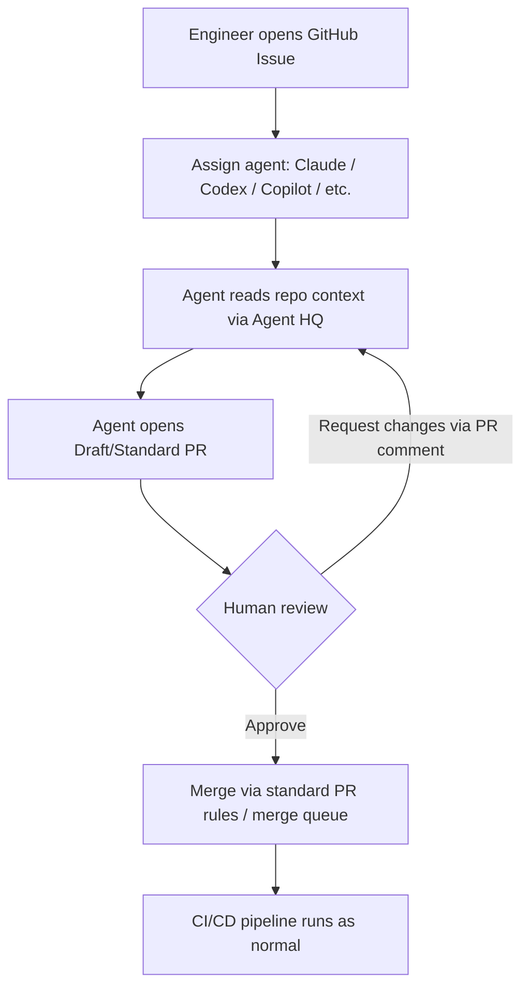

```bash
# Local interaction with an agent-authored PR
gh pr checkout 42        # check out the agent's branch
npm install && npm test  # validate locally
# Leave a follow-up instruction as a PR comment for the agent to act on
```

## GitHub Copilot — 2026 Capability Map

| Capability | Description | Plan Tier |
|---|---|---|
| **Inline completions** | Original autocomplete feature — single-line, multi-line, and full-function suggestions as you type | All tiers |
| **Coding Agent** | Fully autonomous PR creation from an assigned issue/task | Pro+/Enterprise (via Agent HQ) |
| **Agentic Code Review** | Gathers full project context before suggesting changes, and can pass suggestions to the coding agent to generate fix PRs automatically | Higher tiers |
| **GitHub Spark** | Natural-language app building — describe an app in plain English and get generated code with a live preview | Pro+ ($39/month) and Enterprise ($39/user/month) |
| **Semantic code search** | Context-aware search across codebase semantics, not just text | Higher tiers |
| **IDE breadth** | Available across more platforms than competitors — VS Code, JetBrains IDEs, Eclipse, Xcode, etc. | Varies by tier |

### GitHub Spark — When to Use

- **Use for**: rapid prototyping of internal tools, proof-of-concept UIs, "idea to working prototype" bridging for non-specialist builders.
- **Don't use for**: production-grade systems without subsequent engineering review — generated apps still need standard code review, security scanning (Part 18), and CI/CD onboarding like any other code.
- **Workflow fit**: Spark output should land in a normal repo/PR flow — treat it as a fast-start scaffold, not a bypass of platform engineering controls.

## Multi-Agent Decision Matrix

| Need | Recommended Approach |
|---|---|
| Autonomous PR for well-scoped issue | Assign via Agent HQ to coding agent (Copilot/Claude/Codex) |
| Deep reasoning / complex refactor across files | Claude (via Agent HQ or Claude Code directly) |
| Fast prototype / internal tool from a description | GitHub Spark, then promote to standard repo workflow |
| Org-wide agent performance comparison | Copilot Metrics Dashboard |
| Connect agents to external SaaS (Stripe, Figma, Sentry) | MCP Registry (VS Code) |
| Compliance/governance over agent actions | Agent HQ org settings: required human approval, branch protection, audit logging |

**Security note**: Agent-authored commits being signed and run-traced (Part 14b) directly supports the supply-chain and audit requirements covered in Parts 19–21 — treat agent identity like any other CI identity requiring least-privilege scoping.

---

*End of Part 14b. Next: Part 15 — Python Engineering Toolchain.*

---

# PART 15 — Python Engineering Toolchain

## Dependency Management

| Tool | Strength | Weakness | Recommendation |
|---|---|---|---|
| **uv** | Extremely fast (Rust-based), drop-in for pip/venv/poetry workflows, lockfiles | Newer, smaller ecosystem of guides | **Default choice for new projects (2025–2026)** |
| **Poetry** | Mature, lockfile + packaging in one tool, good dependency resolution | Slower than uv, occasional resolver edge cases | Solid if already adopted; migrate to uv opportunistically |
| **pip** | Universal, simplest, always available | No lockfile by default, manual venv management | Fine for scripts/simple cases; pair with `pip-tools` for repeatability |
| **pip-tools** | Adds lockfiles (`requirements.in` → `.txt`) on top of pip | Two-file workflow, manual venv | Lightweight upgrade path from raw pip |
| **PDM** | PEP 582/621 native, fast | Smaller community vs Poetry/uv | Niche choice; uv generally preferred now |

```bash
# uv quickstart
uv init myproject
uv add requests
uv run python main.py
uv lock && uv sync
```

## Formatting

| Tool | Command | Notes |
|---|---|---|
| **Black** | `black .` / `black --check .` | Opinionated, zero-config formatter — standard default |
| **isort** | `isort .` | Import sorting; often run via Ruff instead now |

## Linting

| Tool | Command | Comparison |
|---|---|---|
| **Ruff** | `ruff check .` / `ruff check . --fix` | Rust-based, extremely fast, replaces Flake8 + isort + many plugins; **2025–2026 default** |
| **Flake8** | `flake8 .` | Mature, plugin ecosystem, slower; largely superseded by Ruff |
| **Pylint** | `pylint src/` | Deepest static analysis (design/convention checks), slowest, noisiest by default |

| Criterion | Ruff | Flake8 | Pylint |
|---|---|---|---|
| Speed | Very fast | Moderate | Slow |
| Config simplicity | High | Moderate | Low (verbose) |
| Depth of checks | High (growing) | Moderate (plugin-dependent) | Very high |
| Recommended role | Primary linter+formatter helper | Legacy/incremental migration | Supplementary deep-analysis pass |

## Type Checking

| Tool | Performance | Accuracy | IDE Integration |
|---|---|---|---|
| **MyPy** | Moderate | High, most mature type-checking rules | Good (most editors) |
| **Pyright** | Fast (incremental, used by Pylance) | High, excellent inference | Best-in-class in VS Code |

**Recommendation**: Pyright/Pylance for editor feedback (fast, incremental); MyPy in CI for strict, repo-wide enforcement (`mypy .`).

## Testing — Pytest

| Command | Purpose |
|---|---|
| `pytest` | Run all tests |
| `pytest -v` | Verbose output |
| `pytest --cov` | With coverage (requires `pytest-cov`) |
| `pytest -k "pattern"` | Run tests matching name pattern |
| `pytest -x` | Stop on first failure |

| Concept | Description |
|---|---|
| **Unit Tests** | Isolated, fast, no external dependencies |
| **Integration Tests** | Test interactions across components/services |
| **Fixtures** | Reusable setup/teardown (`@pytest.fixture`) |
| **Mocking** | Replace dependencies (`unittest.mock`, `pytest-mock`) |
| **Parameterization** | `@pytest.mark.parametrize` — run same test with multiple inputs |

## Coverage

```bash
coverage run -m pytest
coverage report
coverage html   # generate browsable report
```

## Documentation

| Tool | Best For |
|---|---|
| **MkDocs** | Markdown-based docs, fast setup, Material theme popular |
| **Sphinx** | Auto-generated API docs from docstrings, reStructuredText, long-standing standard for libraries |

## Packaging

| Tool | Command | Notes |
|---|---|---|
| **build** | `python -m build` | PEP 517 standard build frontend |
| **hatch** | `hatch build` | Modern project management + packaging |
| **poetry build** | `poetry build` | If using Poetry for deps |
| **uv build** | `uv build` | If using uv for deps — fastest, consistent toolchain |

---

*End of Part 15. Next: Part 16 — Software Quality Engineering & Part 17 — SonarQube.*

---

# PART 16 — Software Quality Engineering

| Concept | Description | Tooling |
|---|---|---|
| **Code Quality** | Adherence to style, conventions, complexity limits | Ruff, Pylint |
| **Technical Debt** | Accumulated cost of shortcuts/suboptimal code | SonarQube debt ratio metric |
| **Maintainability** | Ease of future modification (complexity, duplication) | SonarQube maintainability rating |
| **Reliability** | Likelihood of bugs in production | SonarQube reliability rating, test coverage |
| **Test Coverage** | % of code exercised by tests | `coverage.py`, Codecov |
| **Quality Gates** | Pass/fail criteria blocking merge/release | SonarQube Quality Gate, CI required checks |

## Quality Gate Strategy

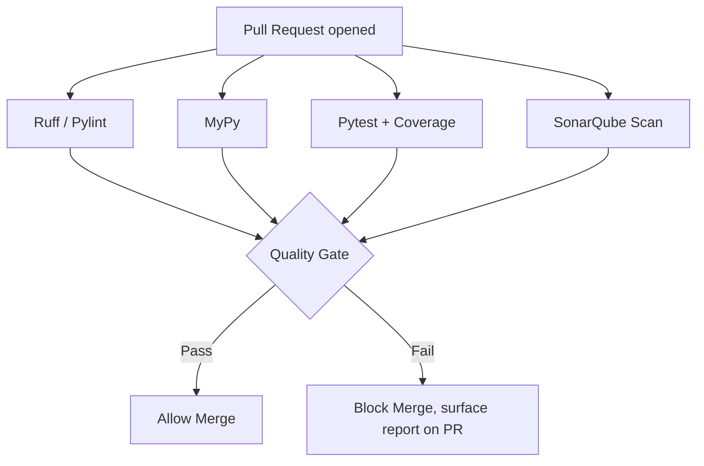

**Best practice**: Start gates as "warn only" on existing codebases (avoid blocking on pre-existing debt), then ratchet to "blocking on new code" (SonarQube's "new code" period concept) before full-repo enforcement.

---

# PART 17 — SonarQube Deep Dive

| Aspect | Detail |
|---|---|
| **Architecture** | Server (web UI + DB) + Scanner (CLI/CI plugin) that analyzes code and uploads results |
| **Scanners** | `sonar-scanner` CLI, language-specific (Maven/Gradle/.NET/JS) integrations |
| **Quality Gates** | Configurable pass/fail conditions (e.g., coverage on new code ≥ 80%, zero new bugs) |
| **Security Hotspots** | Code patterns needing manual security review (not auto-fail, but flagged) |
| **Coverage** | Imported from test tool reports (e.g., `coverage.xml`) |
| **Duplication** | % of duplicated code blocks |
| **Technical Debt** | Estimated remediation time for all issues |

## Key Metrics

| Metric | What It Measures |
|---|---|
| **Bugs** | Code that is demonstrably wrong / will misbehave |
| **Vulnerabilities** | Exploitable security weaknesses |
| **Code Smells** | Maintainability issues (not bugs, but bad practice) |
| **Reliability Rating** | A–E based on bug severity/density |
| **Security Rating** | A–E based on vulnerability severity/density |
| **Maintainability Rating** | A–E based on technical debt ratio |

```yaml
# Example: SonarQube scan in GitHub Actions
- uses: SonarSource/sonarqube-scan-action@v4
  env:
    SONAR_TOKEN: ${{ secrets.SONAR_TOKEN }}
    SONAR_HOST_URL: ${{ secrets.SONAR_HOST_URL }}
- uses: SonarSource/sonarqube-quality-gate-action@v1
  timeout-minutes: 5
  env:
    SONAR_TOKEN: ${{ secrets.SONAR_TOKEN }}
```

---

*End of Parts 16–17. Next: Part 18 — DevSecOps Toolchain.*

---

# PART 18 — DevSecOps Toolchain

## Toolchain by Category

| Category | Tools | Purpose |
|---|---|---|
| **SAST** | CodeQL, Semgrep, SonarQube | Find vulnerable code patterns via static analysis |
| **Dependency Scanning** | Dependabot, Snyk, pip-audit, Safety | Detect known-vulnerable dependencies (CVEs) |
| **Secret Detection** | GitHub Secret Scanning, Push Protection, Gitleaks, TruffleHog | Catch committed credentials/keys |
| **Container Security** | Trivy, Grype | Scan container images for CVEs/misconfig |
| **Infrastructure Security** | Checkov, tfsec, Terrascan | Scan IaC (Terraform/CloudFormation) for misconfig |
| **Kubernetes Security** | Kubescape, Polaris, Kyverno, OPA Gatekeeper | Cluster config/policy enforcement |

## Pipeline Architecture

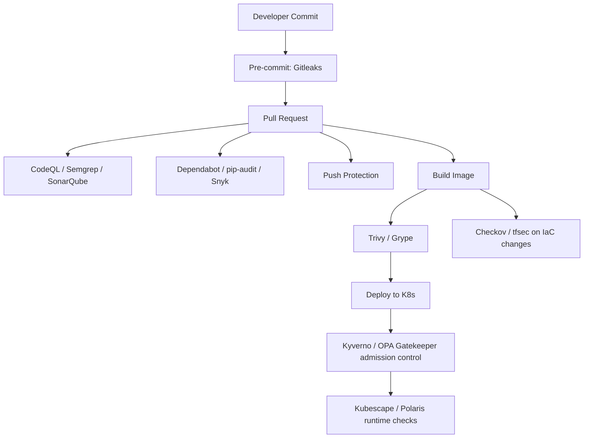

## Tool Selection Notes

| Decision | Guidance |
|---|---|
| CodeQL vs Semgrep | CodeQL: deep semantic analysis, GitHub-native, free for public repos, part of GHAS (cost for private). Semgrep: faster, simpler rules, easier custom rule authoring, good OSS tier. |
| Gitleaks vs TruffleHog | Both scan for secrets; Gitleaks is lighter/faster for CI; TruffleHog adds verification (checks if found secrets are *live*). |
| Trivy vs Grype | Both solid for container/image CVE scanning; Trivy also covers IaC/SBOM/secret scanning in one tool — often preferred for breadth. |
| Kyverno vs OPA/Gatekeeper | Kyverno: Kubernetes-native YAML policies, easier to author. OPA/Gatekeeper: Rego-based, more powerful/general but steeper learning curve. |

```yaml
# Example: Trivy container scan
- uses: aquasecurity/trivy-action@master
  with:
    image-ref: 'myorg/myapp:${{ github.sha }}'
    severity: 'CRITICAL,HIGH'
    exit-code: '1'
```

---

*End of Part 18. Next: Part 19 — Supply Chain Security.*

---

# PART 19 — Supply Chain Security

| Concept | Description | Tooling |
|---|---|---|
| **SBOM** (Software Bill of Materials) | Inventory of all components/dependencies in a build | Syft (generate), formats: SPDX, CycloneDX |
| **SPDX / CycloneDX** | Standard SBOM formats | Interchangeable via Syft/other generators |
| **Cosign / Sigstore** | Sign & verify container images and artifacts | `cosign sign`, `cosign verify` |
| **SLSA Levels 1–4** | Supply-chain integrity framework — increasing build provenance guarantees | Self-assessed or via attestation tooling |
| **Dependency Confusion** | Attack: malicious package with same name as internal/private package gets installed from public registry | Scoped package names, private registry priority config |
| **Typosquatting** | Attack: malicious package named similarly to popular package | Dependency pinning, lockfiles, automated scanning (pip-audit/Snyk) |
| **Malicious Packages** | Compromised/intentionally malicious published packages | SCA tools, lockfile review, minimal dependency footprint |

## SLSA Levels Summary

| Level | Requirement Summary |
|---|---|
| **SLSA 1** | Build process documented, provenance exists |
| **SLSA 2** | Provenance generated by build service, tamper-resistant |
| **SLSA 3** | Hardened build platform, provenance non-falsifiable |
| **SLSA 4** | Two-person review of all changes, hermetic/reproducible builds |

```bash
# SBOM generation + image signing example
syft myorg/myapp:latest -o cyclonedx-json > sbom.json
cosign sign --key cosign.key myorg/myapp:latest
cosign verify --key cosign.pub myorg/myapp:latest
```

**Real-world relevance**: Incidents like the `event-stream`/`ua-parser-js`/`xz-utils` compromises illustrate why SBOM + signing + SCA scanning are now baseline requirements in regulated and enterprise software supply chains.

---

# PART 20 — GitHub Advanced Security (GHAS)

| Feature | Description | Cost/Licensing Note |
|---|---|---|
| **CodeQL** | Semantic SAST | Free for public repos; licensed per-committer for private repos under GHAS |
| **Dependabot** | Automated dependency update PRs + vulnerability alerts | Free for all repos (alerts); update PRs free |
| **Secret Scanning** | Detects committed secrets across history | Free alerts for public repos; GHAS for private |
| **Push Protection** | Blocks pushes containing detected secrets | Part of Secret Scanning (GHAS for private repos) |
| **Dependency Review** | PR-time diff of dependency changes + vuln info | GHAS feature for private repos |
| **Security Campaigns** | Org-wide tracked remediation initiatives for vuln backlogs | GHAS Enterprise feature |
| **Security Overview** | Org/repo-level dashboard of security posture | GHAS |

**Enterprise adoption**: GHAS licensing is typically per active committer; cost-justify by prioritizing rollout on internet-facing/high-risk repos first, then expanding. Combine with CODEOWNERS-enforced review of security findings.

---

*End of Parts 19–20. Next: Part 21 — Identity, Governance & Compliance.*

---

# PART 11b — Dev Containers & Codespaces Deep Dive

## Core Concept

`devcontainer.json` describes a reproducible dev environment — OS image, runtimes, CLIs, editor extensions, env vars, ports, and lifecycle scripts — consumed by VS Code Dev Containers, GitHub Codespaces, JetBrains Gateway, and the standalone `devcontainer` CLI. File is JSONC (comments/trailing commas allowed), lives at `.devcontainer/devcontainer.json`.

## How Codespaces Works (Lifecycle)

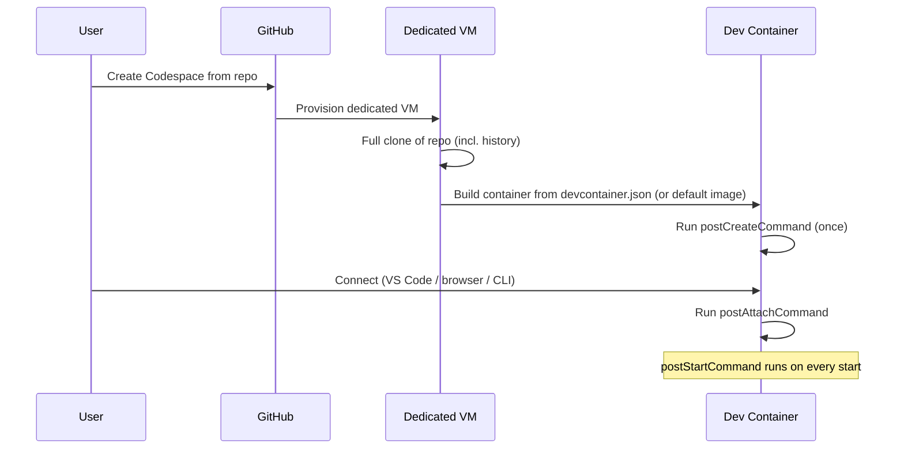

- No `devcontainer.json` → GitHub uses a default image with many languages/runtimes preinstalled.
- Repo is cloned **before** the container is built — git template-dir hooks won't auto-apply; configure hooks via `postCreateCommand`.
- Public dotfiles repo (if enabled) is cloned into the container and its install script runs automatically.

## Config Building Blocks

| Element | Purpose |
|---|---|
| `image` / `build.dockerfile` / `dockerComposeFile` | Base environment definition |
| `features` | Composable add-ons (install CLIs like node, python, gh, terraform without writing Dockerfile RUN lines) |
| `customizations.vscode.extensions` | Auto-install editor extensions |
| `forwardPorts` | Auto-forward container ports to local browser |
| `postCreateCommand` | Runs once after container creation (install deps, seed DB) |
| `postStartCommand` | Runs on every container start |
| `postAttachCommand` | Runs when a client connects/attaches |
| `remoteUser` | User the container runs as |
| `mounts` / storage config | Mount/persist directories from codespace to underlying VM |

## Example Config

```json
{
  "image": "mcr.microsoft.com/devcontainers/python:3.12",
  "features": {
    "ghcr.io/devcontainers/features/node:1": { "version": "20" },
    "ghcr.io/devcontainers/features/github-cli:1": {}
  },
  "postCreateCommand": "pip install -r requirements.txt",
  "forwardPorts": [8000],
  "customizations": {
    "vscode": { "extensions": ["ms-python.python", "charliermarsh.ruff"] }
  }
}
```

## Adding Features

Edit `devcontainer.json` directly, or in VS Code: Command Palette → "Codespaces: Add Dev Container Configuration Files" → browse Features marketplace → commit. New codespaces pick up changes automatically; existing codespaces require pull + rebuild.

## Collaboration & Enterprise Notes

| Capability | Detail |
|---|---|
| **Live collaboration** | Multiple devs can join the same running codespace for simultaneous editing/debugging — useful for pairing, live PR review |
| **Persistent storage** | Configure mounts to persist specific directories on the underlying VM across rebuilds |
| **Data residency** | Enterprise Codespaces infrastructure supports regional data-residency compliance requirements |
| **Prebuilds** | Pre-build the container image on push so new codespaces start in seconds instead of minutes |

## When to Use vs Not

| Use Codespaces / Dev Containers when | Avoid / reconsider when |
|---|---|
| Onboarding speed matters (new hires productive in minutes) | Heavy local-hardware-bound work (GPU training without cloud GPU SKUs) |
| Team suffers "works on my machine" drift | Already-standardized local setups with low drift, cost-sensitive |
| OSS/contractor contributors need disposable environments | Strict offline-development requirements |
| Same config should work locally (VS Code Dev Containers) and in cloud (Codespaces) for full parity | — |

---

*End of Part 11b. Resuming sequence — Next: Part 21 — Identity, Governance & Compliance.*

---

# PART 21 — Identity, Governance & Compliance

| Concept | Description | Enterprise Pattern |
|---|---|---|
| **SAML SSO** | Org authentication delegated to external IdP (Okta, Azure AD, etc.) | Required for most enterprise plans; enforced org-wide |
| **SCIM** | Automated user provisioning/deprovisioning from IdP | New hires auto-get GitHub access; offboarding auto-revokes |
| **Enterprise Managed Users (EMU)** | GitHub accounts fully owned/controlled by the enterprise (no personal account crossover) | High-compliance orgs (finance, gov, healthcare) |
| **RBAC** | Role-based access: org owner, member, team maintainer, repo admin/write/read | Map roles to least-privilege needs per repo/team |
| **Audit Logs** | Record of admin/security-relevant actions org-wide | SIEM integration, compliance evidence (SOC2, ISO27001) |
| **Compliance Reporting** | Exportable evidence of access controls, branch protections, review enforcement | Audits — pair with required-review + CODEOWNERS history |

## Enterprise Identity Architecture

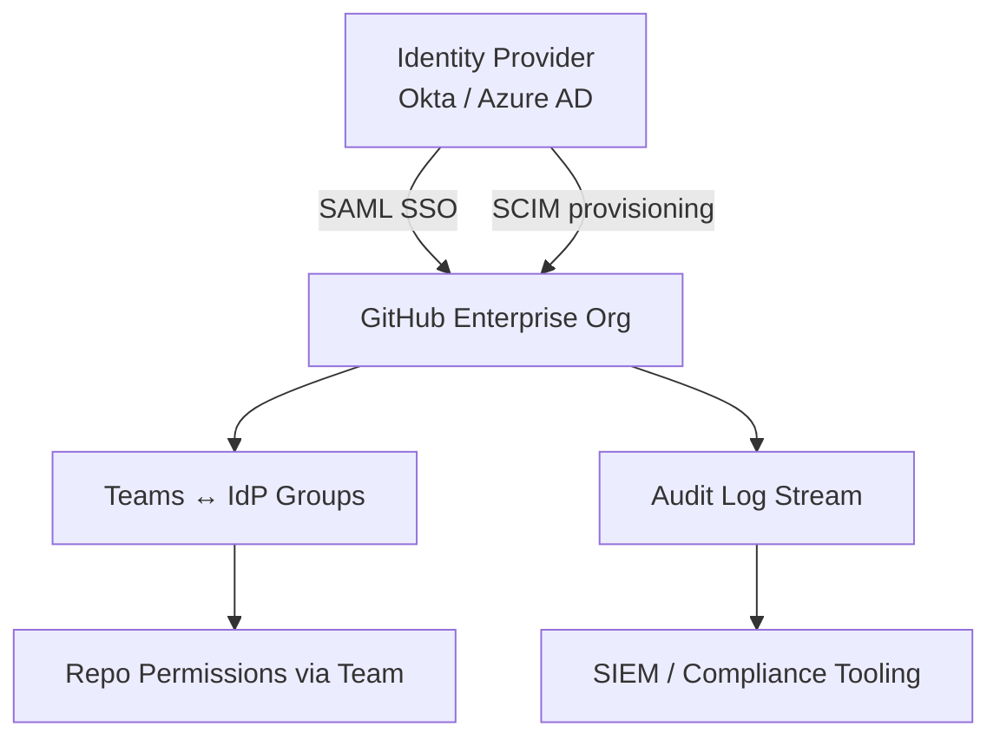

**Best practice**: Map GitHub Teams 1:1 to IdP groups via SCIM so access changes happen at the IdP, not in GitHub directly — single source of truth for joiner/mover/leaver processes.

---

*End of Part 21. Next: Part 22 — OIDC and Secretless Authentication.*

---

# PART 22 — OIDC and Secretless Authentication

## Traditional Secrets vs OIDC

| Aspect | Long-lived Secrets | OIDC (Token Exchange) |
|---|---|---|
| **Storage** | Static keys stored in GitHub Secrets | Nothing stored — short-lived token issued per run |
| **Rotation** | Manual/periodic | Automatic (tokens expire in minutes) |
| **Blast radius if leaked** | High — valid until rotated | Low — expires almost immediately, scoped to one run |
| **Setup complexity** | Low (paste a key) | Moderate (configure trust relationship/IdP federation) |

## How OIDC Works

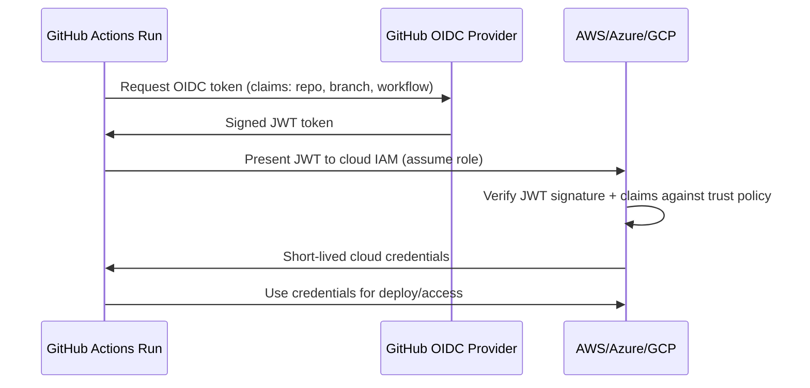

## Provider Setup Patterns

| Cloud | Mechanism | Action |
|---|---|---|
| **AWS** | IAM OIDC Identity Provider + IAM Role trust policy scoped to repo/branch | `aws-actions/configure-aws-credentials` |
| **Azure** | Federated credentials on App Registration | `azure/login` with `client-id`/`tenant-id`/`subscription-id` |
| **GCP** | Workload Identity Federation pool + provider | `google-github-actions/auth` |

```yaml
# AWS OIDC example
permissions:
  id-token: write
  contents: read
steps:
  - uses: aws-actions/configure-aws-credentials@v4
    with:
      role-to-assume: arn:aws:iam::123456789012:role/github-actions-deploy
      aws-region: us-east-1
```

**Best practice**: Scope cloud IAM trust policies to specific repo + branch + environment claims (not just "any token from this GitHub org") to prevent lateral movement via forked-repo PR workflows.

---

*End of Part 22. Next: Part 23 — GitHub Copilot and AI Development.*

---

# PART 23 — GitHub Copilot and AI Development (see also Part 14b)

> Core Agent HQ / Copilot / Spark coverage lives in **Part 14b**. This section covers the remaining comparison/landscape items.

## Copilot CLI & Coding Agent Commands

| Command | Purpose |
|---|---|
| `gh copilot suggest` | Suggest a shell command for a described task |
| `gh copilot explain` | Explain what a given shell command does |

## AI Coding Tool Landscape Comparison

| Tool | Interface | Strength | Best Fit |
|---|---|---|---|
| **GitHub Copilot** | IDE-embedded (broadest IDE support), Agent HQ | Inline completions, agentic PR review, ecosystem breadth | Teams standardized on GitHub + multiple IDEs |
| **Claude Code** | Terminal-based agent | Deep reasoning, multi-file refactors, strong tool-use | Complex refactors, agentic terminal workflows |
| **ChatGPT (Codex)** | Web/IDE, Agent HQ | General-purpose + autonomous coding agent | Broad task range, available via Agent HQ |
| **Gemini CLI** | Terminal-based agent | Google ecosystem integration | GCP-heavy environments |
| **Aider** | Terminal, git-native pair programming | Lightweight, direct git integration, model-agnostic | Devs wanting minimal-overhead AI pairing in git repos |
| **Cline** | VS Code extension, agentic | Autonomous file edits + terminal commands inside editor | VS Code users wanting agent-in-editor without full Agent HQ |
| **OpenCode** | Terminal-based, open source | Model-agnostic, self-hostable | Orgs wanting open-source/self-hosted agent tooling |

**Decision guidance**: Most orgs in 2026 don't pick one tool — Agent HQ explicitly supports running multiple agents side-by-side on the same issue/PR for comparison (see Part 14b). Standardize on *governance* (required approvals, signed commits, audit logging) rather than a single agent.

---

*End of Part 23. Next: Part 24 — AI Security.*

---

# PART 24 — AI Security

## Risk Categories

| Risk | Description | Mitigation |
|---|---|---|
| **Prompt Injection** | Malicious instructions embedded in content the AI processes (issue text, file contents, web pages) override intended behavior | Treat all external content as untrusted data, not instructions; sandbox agent actions; require human approval for sensitive operations |
| **Tool Abuse** | Agent misuses available tools (e.g., excessive API calls, destructive file operations) | Least-privilege tool scoping, dry-run modes, rate limits |
| **Agent Security** | Autonomous agents with repo/cloud access become high-value attack targets/vectors | Signed commits, scoped credentials (OIDC), audit trails (Part 14b) |
| **MCP Security** | Model Context Protocol connects agents to external tools/data — each connector expands attack surface | Vet MCP servers, scope permissions per-connector, monitor usage |
| **RAG Security** | Retrieval-augmented generation can leak sensitive indexed data or be poisoned via injected documents | Access-control retrieval at the same level as source data; sanitize ingested content |
| **Data Leakage** | Sensitive code/secrets sent to external AI providers | Review data-handling/training-opt-out policies, use enterprise tiers with zero-retention guarantees |

## AI Security Testing Tools

| Tool | Purpose |
|---|---|
| **Promptfoo** | Test/eval prompts and LLM app outputs for regressions, security issues |
| **Garak** | LLM vulnerability scanner (probes for prompt injection, jailbreaks, etc.) |
| **Lakera** | Real-time prompt injection / AI guardrail detection |
| **Protect AI** | ML/AI supply chain security (model scanning, MLSecOps) |

## Agent Security Architecture

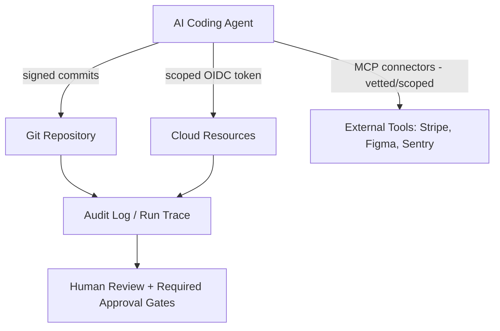

**Best practice**: Apply the same supply-chain rigor to AI agents as to any CI identity — least privilege, short-lived credentials, full audit trail, and mandatory human approval before agent-authored changes touch protected branches or production infrastructure.

---

*End of Part 24. Next: Part 25 — Complete Production GitHub Actions Workflows.*

---

# PART 25 — Complete Production GitHub Actions Workflows

## Python CI (Ruff, Black, MyPy, Pytest, Coverage)

```yaml
name: Python CI
on:
  pull_request:
  push:
    branches: [main]

jobs:
  ci:
    runs-on: ubuntu-latest
    steps:
      - uses: actions/checkout@v4
      - uses: astral-sh/setup-uv@v3
      - run: uv sync
      - run: uv run ruff check .
      - run: uv run black --check .
      - run: uv run mypy .
      - run: uv run pytest --cov --cov-report=xml
      - uses: codecov/codecov-action@v4
        with:
          files: coverage.xml
```

## Python DevSecOps (Bandit, Semgrep, pip-audit, Trivy, Gitleaks, CodeQL, SonarQube)

```yaml
name: Python DevSecOps
on:
  pull_request:

jobs:
  security:
    runs-on: ubuntu-latest
    permissions:
      contents: read
      security-events: write
    steps:
      - uses: actions/checkout@v4
        with: { fetch-depth: 0 }

      - name: Gitleaks (secret scan)
        uses: gitleaks/gitleaks-action@v2

      - name: Bandit (Python SAST)
        run: |
          pip install bandit
          bandit -r src/ -f json -o bandit-report.json

      - name: Semgrep
        uses: returntocorp/semgrep-action@v1

      - name: pip-audit (dependency CVEs)
        run: |
          pip install pip-audit
          pip-audit

      - name: CodeQL Init
        uses: github/codeql-action/init@v3
        with: { languages: python }
      - name: CodeQL Analyze
        uses: github/codeql-action/analyze@v3

      - name: SonarQube Scan
        uses: SonarSource/sonarqube-scan-action@v4
        env:
          SONAR_TOKEN: ${{ secrets.SONAR_TOKEN }}

  container-scan:
    runs-on: ubuntu-latest
    steps:
      - uses: actions/checkout@v4
      - run: docker build -t myapp:${{ github.sha }} .
      - uses: aquasecurity/trivy-action@master
        with:
          image-ref: myapp:${{ github.sha }}
          severity: 'CRITICAL,HIGH'
          exit-code: '1'
```

## Docker Build & Push (GHCR + Cosign)

```yaml
name: Docker Build
on:
  push:
    branches: [main]

permissions:
  contents: read
  packages: write
  id-token: write   # for keyless cosign signing

jobs:
  build:
    runs-on: ubuntu-latest
    steps:
      - uses: actions/checkout@v4
      - uses: docker/login-action@v3
        with:
          registry: ghcr.io
          username: ${{ github.actor }}
          password: ${{ secrets.GITHUB_TOKEN }}
      - uses: docker/build-push-action@v6
        id: build
        with:
          push: true
          tags: ghcr.io/${{ github.repository }}:${{ github.sha }}
      - name: Sign image (keyless)
        run: |
          cosign sign --yes ghcr.io/${{ github.repository }}@${{ steps.build.outputs.digest }}
```

## Kubernetes Deploy (OIDC + Helm)

```yaml
name: Deploy to EKS
on:
  workflow_dispatch:

permissions:
  id-token: write
  contents: read

jobs:
  deploy:
    runs-on: ubuntu-latest
    environment: production
    steps:
      - uses: actions/checkout@v4
      - uses: aws-actions/configure-aws-credentials@v4
        with:
          role-to-assume: arn:aws:iam::123456789012:role/github-actions-eks
          aws-region: us-east-1
      - run: aws eks update-kubeconfig --name prod-cluster
      - run: helm upgrade --install myapp ./chart --set image.tag=${{ github.sha }}
```

## Terraform Plan/Apply

```yaml
name: Terraform
on:
  pull_request:
  push:
    branches: [main]

permissions:
  id-token: write
  contents: read
  pull-requests: write

jobs:
  terraform:
    runs-on: ubuntu-latest
    steps:
      - uses: actions/checkout@v4
      - uses: aws-actions/configure-aws-credentials@v4
        with:
          role-to-assume: arn:aws:iam::123456789012:role/github-actions-terraform
          aws-region: us-east-1
      - uses: hashicorp/setup-terraform@v3
      - run: terraform init
      - run: terraform validate
      - run: tfsec .
      - run: terraform plan -out=tfplan
      - if: github.ref == 'refs/heads/main'
        run: terraform apply -auto-approve tfplan
```

## Release Automation (Conventional Commits → semantic-release)

```yaml
name: Release
on:
  push:
    branches: [main]

permissions:
  contents: write
  issues: write
  pull-requests: write

jobs:
  release:
    runs-on: ubuntu-latest
    steps:
      - uses: actions/checkout@v4
        with: { fetch-depth: 0 }
      - uses: actions/setup-node@v4
        with: { node-version: 20 }
      - run: npx semantic-release
        env:
          GITHUB_TOKEN: ${{ secrets.GITHUB_TOKEN }}
```

## Multi-Environment Promotion (Dev → QA → Stage → Prod)

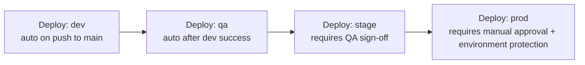

```yaml
name: Promote
on:
  workflow_dispatch:
    inputs:
      target:
        type: choice
        options: [dev, qa, stage, prod]

jobs:
  deploy:
    runs-on: ubuntu-latest
    environment: ${{ inputs.target }}   # environment protection rules enforce approvals for stage/prod
    steps:
      - uses: actions/checkout@v4
      - run: ./deploy.sh ${{ inputs.target }} ${{ github.sha }}
```

**Pattern**: Use GitHub **Environments** with protection rules (required reviewers, wait timers, deployment branch restrictions) to gate `stage`/`prod` — this is the primary mechanism for promotion governance without separate tooling.

---

*End of Part 25. Next: Part 26 — Enterprise GitHub Governance.*
