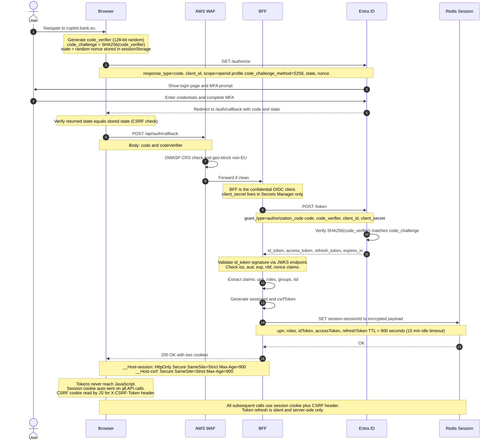
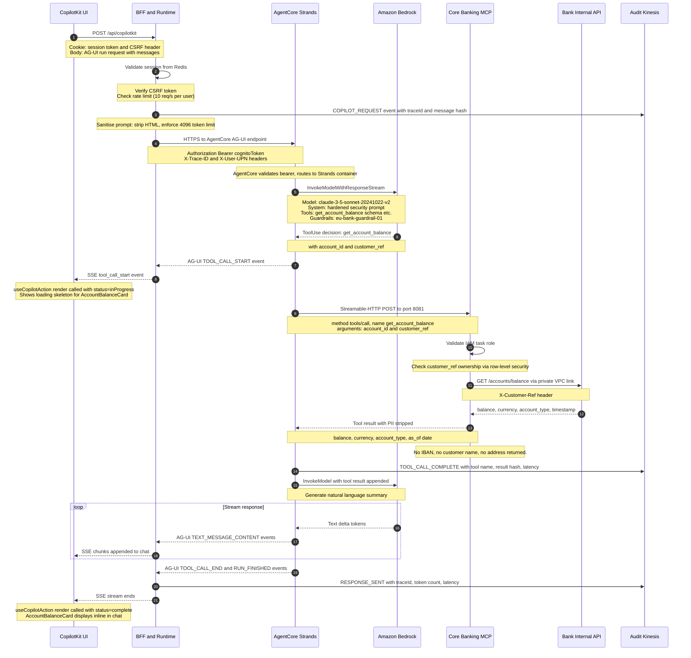
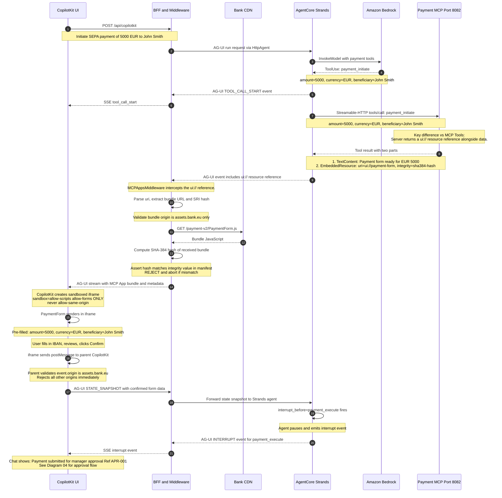
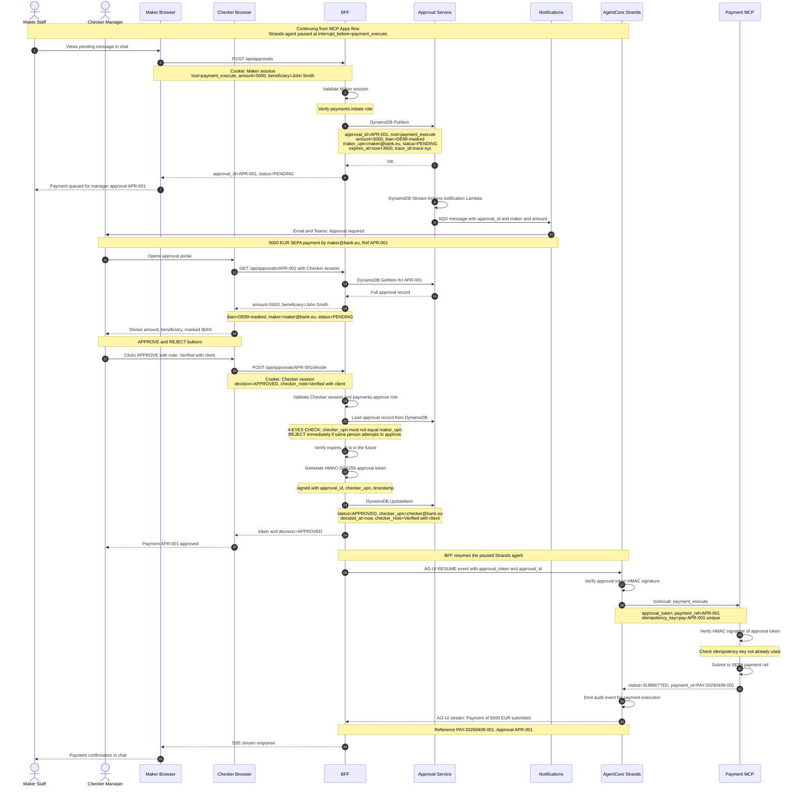
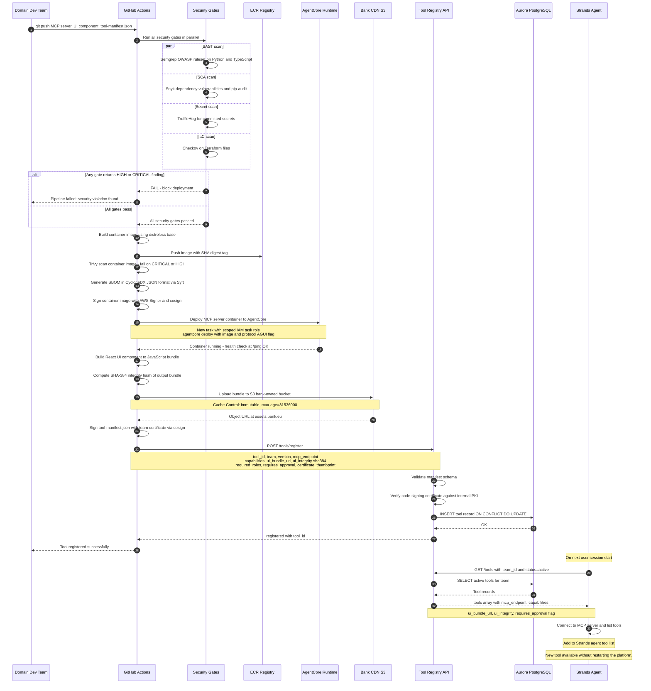
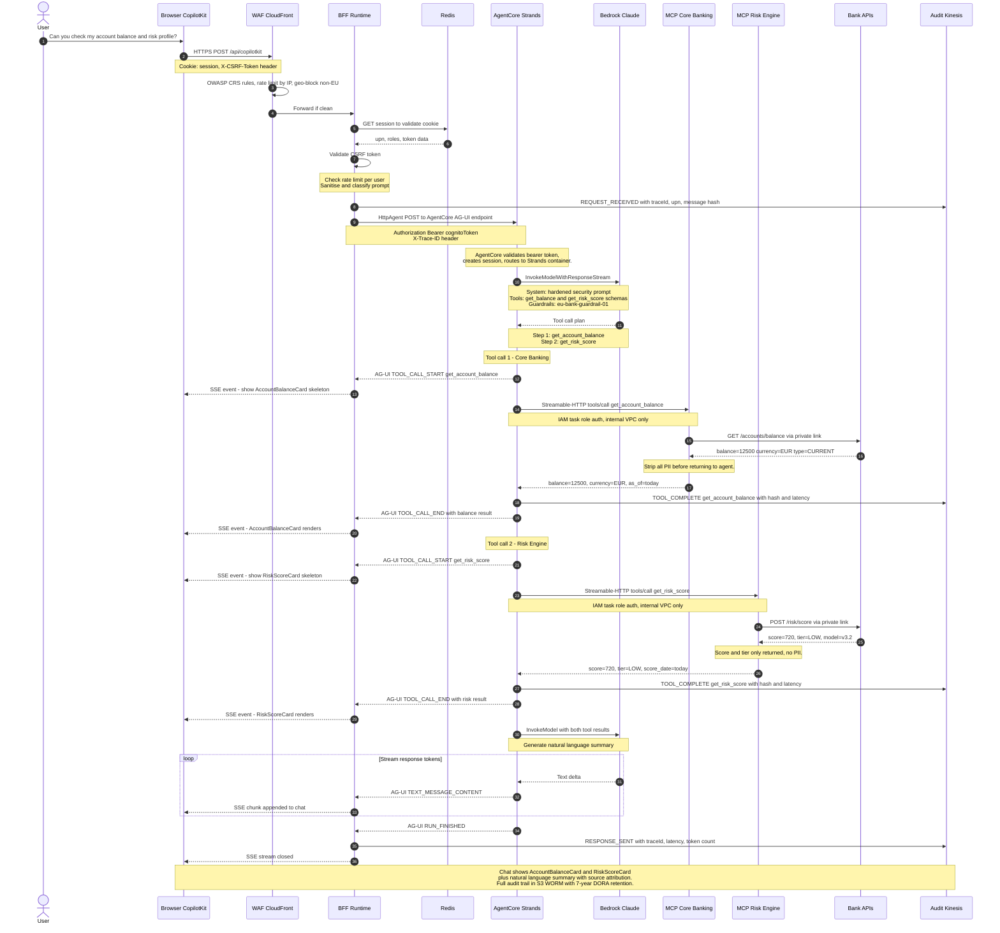

# EU Bank AI Copilot — Sequence Diagrams

Six sequence diagrams covering all major flows of the EU Bank AI Copilot Platform. See also the [architecture overview](eu-bank-ai-copilot-complete.md) and the [architecture & code reference](eu-bank-ai-copilot-architecture.md).

---

## Diagram 01 — Authentication & Session Establishment

Entra ID OIDC with PKCE. The browser acts as public client — the BFF holds `client_secret` and tokens. The browser only receives an HttpOnly session cookie. Tokens never touch JavaScript.

> **Security note:** The BFF is the confidential OIDC client. `client_secret` is stored in AWS Secrets Manager and never sent to the browser. PKCE `code_verifier` is generated fresh per login attempt.

> **Token Refresh:** The BFF silently refreshes the `access_token` using the `refresh_token` when expiry is less than 5 minutes away. The browser never sees this happen — it only ever holds the session cookie.

---

## Diagram 02 — MCP Tools: Data Query Flow

User asks a question. Agent decides to call a data tool (e.g. `get_account_balance` on Core Banking MCP). Result streams back as AG-UI SSE events. CopilotKit renders a React component inline in chat. No iframe involved.

> **Protocol chain:** Browser → BFF: HTTPS POST · BFF → AgentCore: AG-UI SSE (HTTPS) · AgentCore → Bedrock: HTTPS · AgentCore → MCP: Streamable-HTTP · MCP → Bank API: HTTPS private link

---

## Diagram 03 — MCP Apps: Interactive UI Flow

Agent triggers a tool that returns a `ui://` reference. `MCPAppsMiddleware` fetches and verifies the UI bundle (SRI hash). CopilotKit renders the domain team's UI in a sandboxed iframe. AG-UI keeps iframe state in sync with the agent.

> **Security note:** The iframe is sandboxed with `allow-scripts allow-forms` only — never `allow-same-origin`. `postMessage` origin is strictly validated. No PII passes into the iframe — only opaque references.

---

## Diagram 04 — Payment Approval: 4-Eyes Human-in-the-Loop

All payment executions pause at `interrupt_before`. A maker creates the payment. A separate manager (checker) must approve. The maker cannot approve their own request. After approval, a signed token is issued and the agent resumes.

> **4-Eyes enforcement:** The Approval Service validates that `checker_upn != maker_upn` server-side. This check cannot be bypassed via the UI. Approval tokens are HMAC-signed and expire in 1 hour.

---

## Diagram 05 — Dynamic Tool & UI Registration

A domain team ships a new MCP tool + CopilotKit UI component without touching the core platform. CI/CD validates security gates, deploys the container, publishes the UI bundle, and registers the manifest. Strands picks up the new tool on the next agent session.

> **Zero downtime:** Teams deploy new tools without restarting the core platform. Strands discovers tools dynamically at session start via the Tool Registry. Old tool versions are deprecated automatically after 90 days.

---

## Diagram 06 — Full System End-to-End

Complete view of all participants across the stack: from browser through WAF, BFF, AgentCore, Bedrock, multiple MCP servers, internal bank APIs, audit streams, and back. Shows the interaction of multiple tools in a single agent response.

> **Data Residency:** Every hop — Bedrock, AgentCore, MCP servers, Aurora, S3, Kinesis — is in `eu-west-1` or `eu-central-1`. An AWS Service Control Policy (SCP) blocks creation of resources outside EU regions. This satisfies GDPR Art. 25 and DORA Art. 9 data localisation requirements.
