# AI-Assisted Infrastructure as Code Mastery

A comprehensive 16-part guide to AI-assisted Infrastructure as Code: autonomy spectrum, chat-driven generation, agentic IaC workflows, security guardrails, governance, cost optimization, and the future of self-healing infrastructure — plus appendices covering tool selection, production readiness, and organizational adoption.

---

## Contents

| Part | Topic |
| ------ | ------- |
| 1 | The AI-IaC Paradigm |
| 2 | IaC Autonomy Spectrum |
| 3 | Chat-Based Terraform Generation |
| 4 | Code Review & Static Analysis with AI |
| 5 | AI-Assisted Plan Interpretation |
| 6 | Agentic IaC Workflows |
| 7 | Multi-Layer Guardrail Architecture |
| 8 | Security & Compliance Automation |
| 9 | AI-Powered Drift Detection & Remediation |
| 10 | Cost Optimization with AI |
| 11 | AI-Assisted Troubleshooting |
| 12 | Internal AI-IaC Platform Architecture |
| 13 | Governance & Policy Frameworks |
| 14 | Self-Healing Infrastructure Patterns |
| 15 | Multi-Agent IaC Orchestration |
| 16 | The Future: Autonomous Infrastructure |
| A | Tool Selection Matrix |
| B | Prompt Engineering for IaC |
| C | Production Readiness Checklist |

---

## Part 1: The AI-IaC Paradigm

### 1.1 Why AI + Infrastructure as Code?

The marriage of Large Language Models (LLMs) with Infrastructure as Code represents one of the most significant shifts in platform engineering since the introduction of Terraform itself. AI assistants can accelerate Terraform development, reduce cognitive load, and democratize infrastructure work — but they also introduce new failure modes that platform engineers must understand and guard against.

**What AI does well in IaC contexts:**

| Capability | Example | Confidence Level |
| ----------- | --------- | ----------------- |
| Boilerplate generation | "Generate an S3 bucket with versioning and encryption" | High |
| Pattern recognition | "This HCL looks like the VPC module pattern — suggest improvements" | High |
| Plan explanation | "Explain why this plan shows a resource replacement" | High |
| Error diagnosis | "What does this error message mean and how do I fix it?" | High |
| Policy translation | "Convert this compliance requirement to a Sentinel rule" | Medium |
| Novel architecture | "Design optimal networking for this multi-region workload" | Medium |
| Cost estimation | "Will this change increase or decrease our AWS bill?" | Low |
| Provider version conflicts | "Why is this provider version combination invalid?" | Low |

**Critical limitations — these require human verification always:**

- AI can hallucinate provider attributes that don't exist
- AI may generate valid-looking HCL with subtle security misconfigurations
- AI cannot access your actual cloud state or cost data without tools
- AI models have training data cutoffs — new provider versions may be unknown
- AI-generated `terraform plan` interpretations can miss nuanced implications

> **The cardinal rule of AI-assisted IaC:** Always run `terraform plan` and review the output before applying AI-generated code. The plan is ground truth. The AI's explanation is a starting point.

### 1.2 LLM Selection for IaC Tasks

| Model Family | IaC Code Gen | Plan Analysis | Security Review | Best Use Case |
| ------------- | ------------- | -------------- | ---------------- | --------------- |
| Claude Sonnet 4.6 | Excellent | Excellent | Excellent | Primary assistant, complex reasoning |
| Claude Opus 4.8 | Best-in-class | Best-in-class | Best-in-class | Architect-level design, complex governance |
| Claude Haiku 4.5 | Good | Good | Good | High-volume, low-latency generation |
| GPT-4o | Excellent | Good | Good | General-purpose, broad ecosystem |
| GPT-4 mini | Good | Adequate | Adequate | Cost-sensitive pipelines |
| Gemini 1.5 Pro | Good | Good | Good | Google Cloud-native contexts |
| Code-specialized | Good | Limited | Limited | Pure code generation, no reasoning tasks |

> Use the most capable model available (Claude Opus 4.8 or Sonnet 4.6) for security-sensitive IaC generation. The cost difference is negligible compared to the cost of a misconfigured production resource.

---

## Part 2: IaC Autonomy Spectrum

### 2.1 Five Levels of AI Autonomy

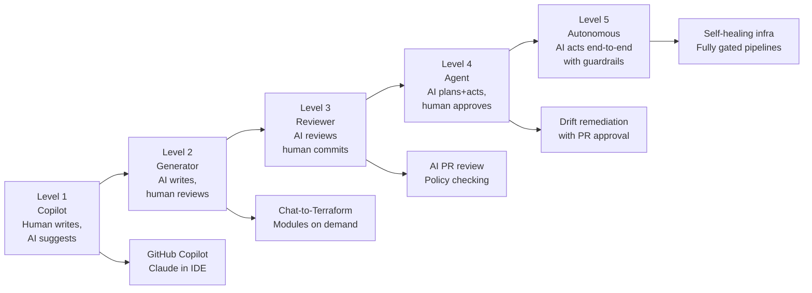

| Level | Human Role | AI Role | When to Use | Risk Level |
| ------- | ----------- | --------- | ------------- | ------------ |
| 1: Copilot | Primary author | Autocomplete, suggestions | Always safe for daily development | Very Low |
| 2: Generator | Reviewer and approver | Generates full resource blocks | Greenfield code, boilerplate heavy tasks | Low |
| 3: Reviewer | Decision maker | Flags issues, suggests improvements | Code reviews, security scanning | Low |
| 4: Agent | Approver | Plans and proposes changes | Scheduled drift remediation, incident response | Medium |
| 5: Autonomous | Auditor | Acts within policy boundaries | Well-defined, low-risk, reversible operations only | High |

### 2.2 Choosing the Right Level

**Start with Level 1–2** for new AI-IaC initiatives. Build trust in the AI's output quality for your specific environment before progressing to higher autonomy levels. The ROI at Level 2 (developer productivity) is already significant without the operational risk of autonomous agents.

**Criteria to advance to Level 4+:**

- [ ] AI-generated code quality validated over 6+ months at lower levels
- [ ] Comprehensive guardrail pipeline in place (see Part 7)
- [ ] Human approval gates defined for all destructive operations
- [ ] Rollback procedure tested and documented
- [ ] Security team has reviewed the agentic workflow design
- [ ] Blast radius analysis completed

---

## Part 3: Chat-Based Terraform Generation

### 3.1 The Chat-to-Terraform Workflow

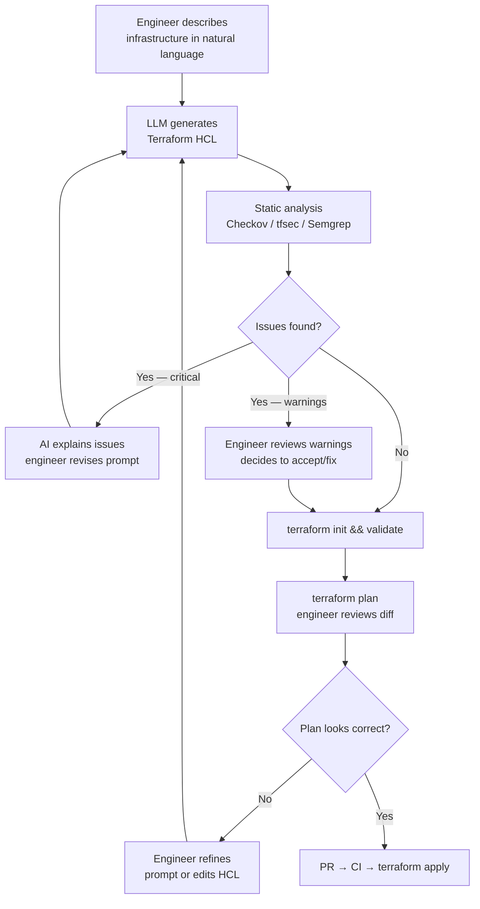

### 3.2 Effective Prompts for IaC Generation

**Anatomy of a good IaC generation prompt:**

```
[CONTEXT]        Who you are, what environment this is for
[REQUIREMENTS]   What resource(s) to create with specifics
[CONSTRAINTS]    Security requirements, naming conventions, tagging
[EXCLUSIONS]     What NOT to include or configure
[FORMAT]         Output format expectations
```

**Example — well-structured prompt:**

```
Context: I'm a platform engineer at a healthcare company. This is for our production AWS environment.
Our account ID is 123456789012, region is us-east-1.

Create a Terraform resource block for an RDS PostgreSQL instance with these requirements:
- Instance class: db.r6g.xlarge
- 200GB storage, GP3, encrypted with our KMS key: alias/prod-rds
- Multi-AZ enabled
- Automated backups: 30 days retention
- Enhanced monitoring: 60-second interval
- Performance Insights: enabled, 7-day retention
- Deletion protection: enabled
- Skip final snapshot: false (final snapshot ID: "prod-postgres-final")
- Username from SSM parameter: /prod/rds/username
- Password from Secrets Manager: prod/rds/master-password

Constraints:
- Tag with: Environment=prod, Team=platform, CostCenter=engineering, HIPAA=true
- Use lifecycle { prevent_destroy = true }
- Ignore changes to password (for rotation support)

Exclude:
- No provisioners
- No null_resource workarounds
- Don't generate the VPC, subnets, or SG — reference by variable

Output: Terraform HCL only, no explanation. Include locals for the SSM/Secrets Manager data sources.
```

**Common mistakes in IaC prompts:**

| Poor Prompt | Problem | Better Approach |
| ------------ | --------- | ---------------- |
| "Make me an S3 bucket" | Too vague — insecure defaults | Specify versioning, encryption, public access block |
| "Create a VPC" | Missing CIDR, subnets, AZs | Specify topology, environment, IP ranges |
| "Generate Terraform for my app" | Impossible — no specifics | Describe exact resources, sizes, connections |
| "Fix this error" (paste error only) | Missing context | Include full Terraform config + state excerpt |

### 3.3 Module Generation with AI

```
Generate a reusable Terraform module for an AWS EKS cluster.

Module inputs (variables.tf):
- cluster_name: string
- kubernetes_version: string (default "1.30")
- vpc_id: string
- subnet_ids: list(string)
- node_groups: map(object with: instance_types, desired_size, min_size, max_size, labels, taints)
- cluster_admins: list(string) — IAM role ARNs for cluster admin access
- tags: map(string)

Module outputs (outputs.tf):
- cluster_name
- cluster_endpoint
- cluster_certificate_authority_data
- oidc_provider_arn (for IRSA)
- node_group_arns

Security requirements:
- Enable secrets envelope encryption with KMS
- Enable control plane logging: api, audit, authenticator, controllerManager, scheduler
- Enable IRSA (IAM Roles for Service Accounts)
- Private API endpoint by default (enable_private_access=true, enable_public_access=false)
- Managed node groups with bottlerocket AMI
- Enable IMDSv2 on all nodes

Structure:
- main.tf: core EKS resources
- node_groups.tf: managed node group resources (use for_each over var.node_groups)
- iam.tf: OIDC provider, IRSA setup
- variables.tf: input variables with validation
- outputs.tf: output values
- versions.tf: required terraform >=1.5, required_providers aws ~>5.0, tls

Output: Complete module code for all 6 files.
```

---

## Part 4: AI Code Review & Static Analysis

### 4.1 AI-Augmented PR Review Workflow

Combining AI natural language review with deterministic static analysis tools provides defense in depth for IaC code quality.

**Static analysis tools — all deterministic:**

| Tool | What It Checks | Integration | Speed |
| ------ | --------------- | ------------- | ------- |
| Checkov | Security misconfigs (500+ rules) | CLI, GitHub Actions | Fast |
| tfsec | Terraform-specific security | CLI, GitHub Actions | Fast |
| Terrascan | Multi-cloud policy enforcement | CLI, GitHub Actions | Medium |
| Trivy | Infra misconfig + CVE scanning | CLI, GitHub Actions | Medium |
| Semgrep | Custom pattern rules | CLI, GitHub Actions | Fast |
| OPA/Conftest | Policy as Code (Rego) | CLI, GitHub Actions | Fast |
| Infracost | Cost estimation | CLI, GitHub Actions, PR comments | Medium |

**AI review complements these by catching:**

- Architectural concerns that rules cannot express
- Intent mismatch between comment and code
- Module design anti-patterns
- Missing resource relationships
- Business logic errors invisible to linters

```yaml
# .github/workflows/terraform-security.yml
name: Terraform Security Review
on:
  pull_request:
    paths: ["**.tf"]
jobs:
  static-analysis:
    runs-on: ubuntu-latest
    steps:
      - uses: actions/checkout@v4

      - name: Run Checkov
        uses: bridgecrewio/checkov-action@v12
        with:
          directory: .
          quiet: true
          framework: terraform

      - name: Run tfsec
        uses: aquasecurity/tfsec-action@v1
        with:
          github_token: ${{ secrets.GITHUB_TOKEN }}

      - name: Run Infracost
        uses: infracost/actions/setup@v3
        with:
          api-key: ${{ secrets.INFRACOST_API_KEY }}

      - name: Comment cost estimate on PR
        run: |
          infracost diff --path . --format json --out-file /tmp/infracost.json
          infracost comment github --path /tmp/infracost.json \
            --repo ${{ github.repository }} \
            --pull-request ${{ github.event.pull_request.number }} \
            --github-token ${{ secrets.GITHUB_TOKEN }}
```

### 4.2 Systematic AI Review Checklist

When using AI to review Terraform PRs, structure the review request:

```
Review this Terraform change for:

SECURITY:
1. Any resources exposed to 0.0.0.0/0 without justification
2. Missing encryption at rest or in transit
3. IAM policies broader than least privilege
4. Secrets or credentials in code or variables
5. Missing audit logging configuration

RELIABILITY:
6. Resources without deletion protection in prod
7. Single points of failure
8. Missing tags for cost allocation and compliance
9. Resources without backup or snapshot configuration
10. Missing lifecycle { prevent_destroy = true } on stateful resources

TERRAFORM PRACTICES:
11. Anti-patterns (hardcoded values, no version constraints)
12. Missing or incorrect depends_on
13. Force replacements that could cause downtime
14. State management concerns (large state, missing remote backend)

[Paste Terraform diff here]
```

---

## Part 5: AI-Assisted Plan Interpretation

### 5.1 Understanding `terraform plan` Output with AI

Terraform plan output is information-dense and can be difficult to parse quickly, especially for junior engineers or for large diffs. AI significantly accelerates plan interpretation.

**Example AI prompt for plan analysis:**

```
Analyze this terraform plan output. Explain:
1. What infrastructure changes will happen (in plain English)
2. Any resources that will be REPLACED (destroyed and recreated)
3. Any potential downtime or service impact
4. Any cost implications
5. Any security concerns in the changes
6. Whether the overall change looks safe to apply in production

[Paste terraform plan output here]
```

### 5.2 Force Replacement Detection

The most critical items in a plan are resources marked `must be replaced` or `-/+`. These cause downtime and data risk.

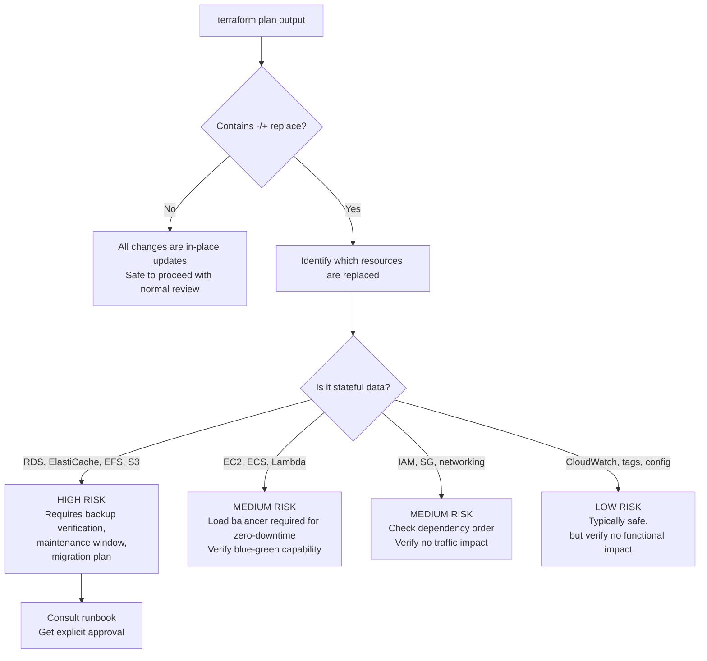

---

## Part 6: Agentic IaC Workflows

### 6.1 What Is an Agentic IaC Workflow?

In an agentic workflow, an AI agent doesn't just generate code — it takes sequential actions: querying cloud APIs, reading state, generating code, running validation, and proposing changes through a pull request.

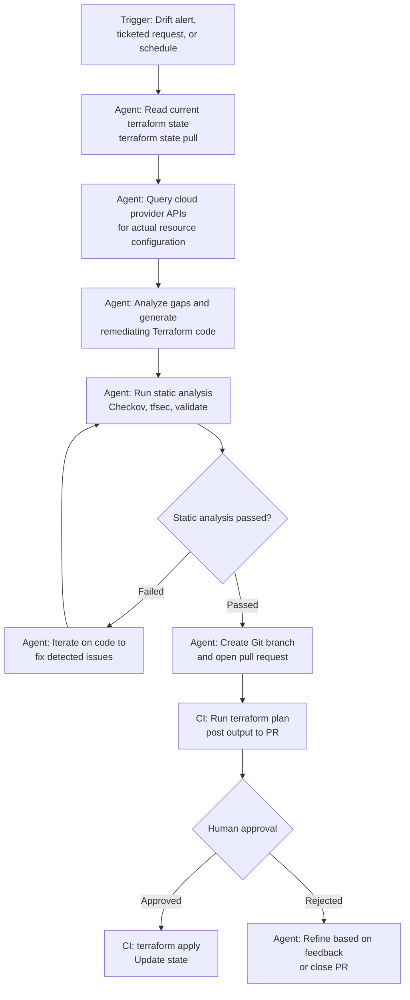

### 6.2 Agentic Tool-Use Loop

Modern AI agents use tool-calling to take actions iteratively, refining their approach based on tool output.

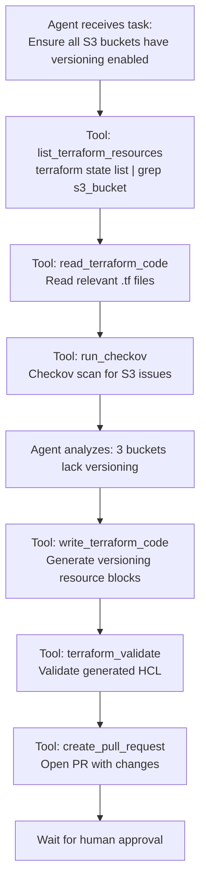

### 6.3 Plan-Review-Apply with AI Gate

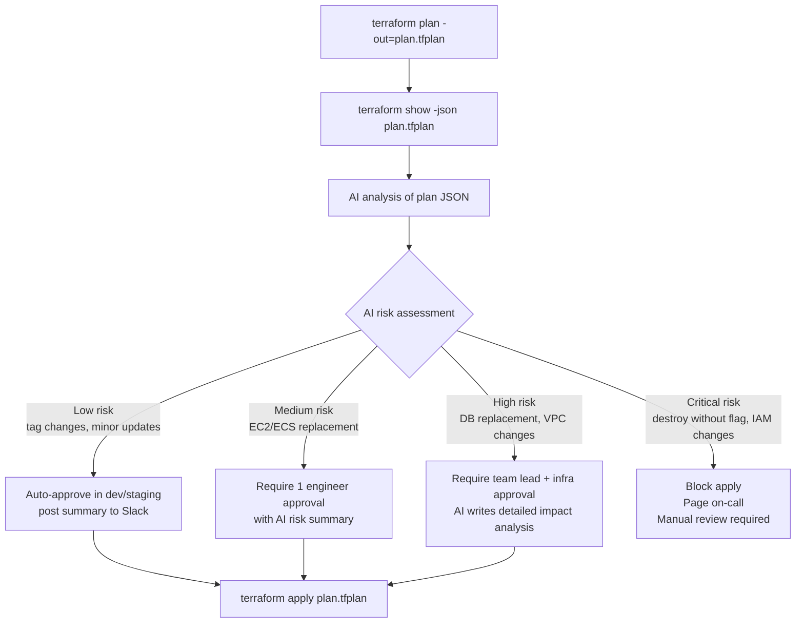

---

## Part 7: Multi-Layer Guardrail Architecture

### 7.1 Defense in Depth for AI-Generated IaC

No single guardrail is sufficient when AI agents can write and potentially apply Terraform code. Defense in depth applies multiple independent layers.

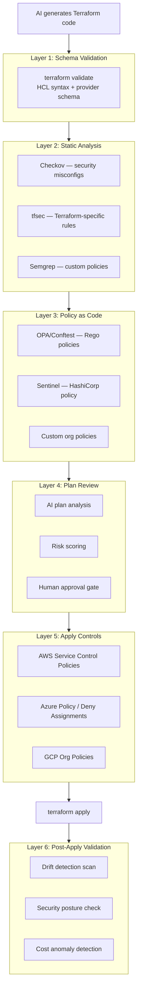

### 7.2 OPA/Conftest Policy Examples

```rego
# policy/no_public_s3.rego
package main

deny[msg] {
  resource := input.resource_changes[_]
  resource.type == "aws_s3_bucket"
  resource.change.after.acl == "public-read"
  msg := sprintf("S3 bucket %s must not have public-read ACL", [resource.address])
}

deny[msg] {
  resource := input.resource_changes[_]
  resource.type == "aws_s3_bucket_public_access_block"
  resource.change.after.block_public_acls == false
  msg := sprintf("Public access block not enabled on %s", [resource.address])
}
```

```rego
# policy/require_encryption.rego
package main

deny[msg] {
  resource := input.resource_changes[_]
  resource.type == "aws_db_instance"
  not resource.change.after.storage_encrypted
  msg := sprintf("RDS instance %s must have storage_encrypted = true", [resource.address])
}

deny[msg] {
  resource := input.resource_changes[_]
  resource.type == "aws_ebs_volume"
  not resource.change.after.encrypted
  msg := sprintf("EBS volume %s must be encrypted", [resource.address])
}
```

```bash
# Run OPA policies against terraform plan
terraform plan -out=plan.tfplan
terraform show -json plan.tfplan > plan.json
conftest test plan.json --policy policy/
```

### 7.3 Cloud-Level Guardrails (Last Line of Defense)

Cloud provider policy engines provide the final safety net — they operate at the API level and cannot be bypassed by Terraform or AI agents.

**AWS Service Control Policies (SCPs):**

```json
{
  "Version": "2012-10-17",
  "Statement": [
    {
      "Sid": "DenyUnencryptedEBS",
      "Effect": "Deny",
      "Action": ["ec2:CreateVolume"],
      "Resource": "*",
      "Condition": {
        "BoolIfExists": {
          "ec2:Encrypted": "false"
        }
      }
    },
    {
      "Sid": "RequireIMDSv2",
      "Effect": "Deny",
      "Action": ["ec2:RunInstances"],
      "Resource": "arn:aws:ec2:*:*:instance/*",
      "Condition": {
        "StringNotEquals": {
          "ec2:MetadataHttpTokens": "required"
        }
      }
    }
  ]
}
```

> SCPs, Azure Policies, and GCP Org Policies are the most important guardrails. Even if all other layers fail, these prevent the actual cloud API calls from succeeding.

---

## Part 8: Security & Compliance Automation

### 8.1 AI-Assisted Security Scanning

AI augments deterministic security tools by providing context-aware analysis:

```
You are a cloud security expert reviewing this Terraform plan for a HIPAA-regulated environment.

For each resource being created or modified, evaluate:
1. Encryption at rest: is PHI data encrypted with customer-managed keys?
2. Encryption in transit: is TLS 1.2+ enforced?
3. Access control: is least privilege applied? No public access?
4. Audit logging: is CloudTrail / CloudWatch Logs configured?
5. Network isolation: is the resource in a private subnet?
6. Backup: does the resource have automated backups configured?

Provide findings as:
- CRITICAL: Must fix before apply
- HIGH: Should fix before apply
- MEDIUM: Fix in next sprint
- LOW/INFO: Best practice recommendation

[Paste terraform plan JSON]
```

### 8.2 Compliance-as-Code Framework

```hcl
# compliance/hipaa_s3.tf — Enforce HIPAA requirements on S3 buckets
resource "aws_s3_bucket_server_side_encryption_configuration" "hipaa_buckets" {
  for_each = var.hipaa_bucket_arns

  bucket = each.value
  rule {
    apply_server_side_encryption_by_default {
      sse_algorithm     = "aws:kms"
      kms_master_key_id = aws_kms_key.hipaa_s3.arn
    }
    bucket_key_enabled = true
  }
}

resource "aws_s3_bucket_public_access_block" "hipaa_buckets" {
  for_each = var.hipaa_bucket_arns
  bucket   = each.value

  block_public_acls       = true
  block_public_policy     = true
  ignore_public_acls      = true
  restrict_public_buckets = true
}

resource "aws_s3_bucket_versioning" "hipaa_buckets" {
  for_each = var.hipaa_bucket_arns
  bucket   = each.value
  versioning_configuration {
    status = "Enabled"
  }
}
```

---

## Part 9: AI-Powered Drift Detection & Remediation

### 9.1 Scheduled Drift Detection Pipeline

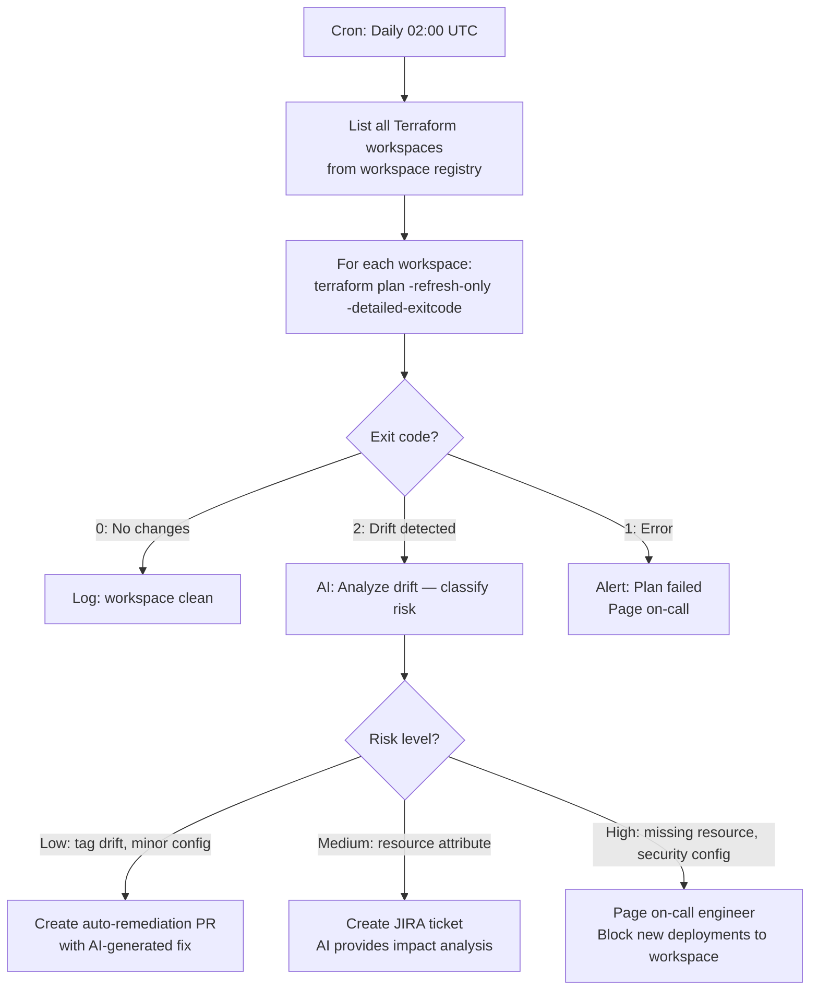

### 9.2 Drift Remediation Pipeline

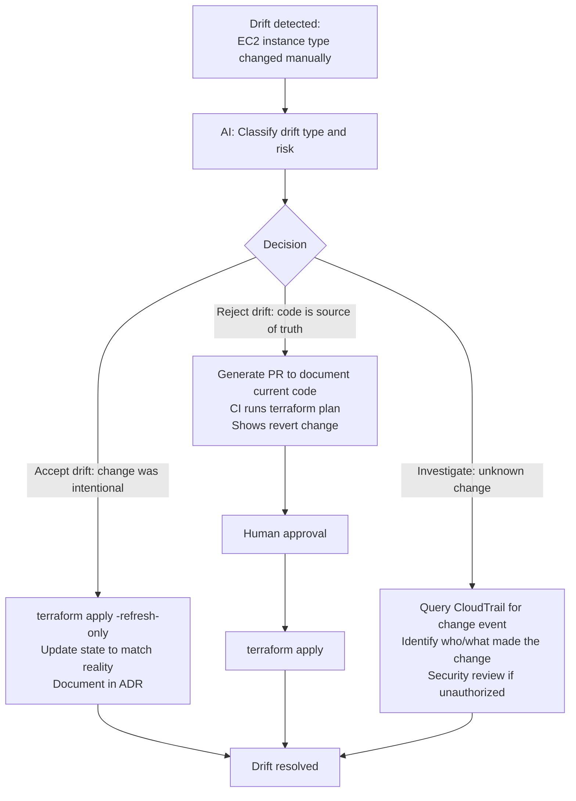

```bash
#!/usr/bin/env bash
# Drift detection script — run on schedule
set -euo pipefail

WORKSPACE_LIST=$(cat workspace-registry.txt)

for workspace in $WORKSPACE_LIST; do
  echo "Checking: $workspace"
  cd "environments/$workspace"

  terraform init -input=false -no-color > /dev/null

  EXIT_CODE=0
  terraform plan -refresh-only -detailed-exitcode -no-color \
    -out="drift-${workspace}.tfplan" 2>&1 | tee drift-output.txt || EXIT_CODE=$?

  case $EXIT_CODE in
    0) echo "CLEAN: $workspace" ;;
    2)
      echo "DRIFT: $workspace"
      cat drift-output.txt | jq -Rs '{"workspace": "'"$workspace"'", "output": .}' \
        | curl -s -X POST "$AI_ANALYSIS_ENDPOINT" -H "Content-Type: application/json" -d @-
      ;;
    1) echo "ERROR: $workspace — plan failed" ;;
  esac

  cd -
done
```

---

## Part 10: Cost Optimization with AI

### 10.1 AI-Driven Cost Analysis Workflow

```
Analyze this terraform state list and the following AWS Cost Explorer data.
Identify:
1. Resources that appear to be unused (zero traffic, zero connections for 30+ days)
2. Resources that are likely over-provisioned for their workload
3. Resources that could use cheaper pricing models (Reserved, Savings Plans, Spot)
4. Redundant resources that could be consolidated
5. Resources in expensive regions that could be relocated

For each recommendation:
- Resource address from state
- Current estimated monthly cost
- Recommended change
- Estimated monthly savings
- Risk level (HIGH/MEDIUM/LOW)
- Suggested Terraform change

[Paste terraform state list]
[Paste AWS Cost Explorer export]
```

### 10.2 Cost-Aware IaC Generation

```
Generate Terraform for the following, optimized for cost:
Environment: development (non-production, used 9am-6pm weekdays only)
Region: us-east-1

Requirements:
- EKS cluster for development workloads
- PostgreSQL database for app testing
- Redis cache
- S3 for artifact storage

Cost optimization requirements:
- Kubernetes: use Spot instances where possible
- Database: smallest instance that can run basic queries
- All resources: can be stopped/started on schedule
- Use scheduled scaling (scale to 0 outside business hours)
- Estimate monthly cost in the generated code comments

Output Terraform with cost comments and scheduling resources included.
```

### 10.3 Infracost Integration

```yaml
# GitHub Actions: post cost estimate on every infrastructure PR
- name: Infracost diff
  uses: infracost/actions/diff@v3
  with:
    path: .
    format: json
    out_file: /tmp/infracost-diff.json

- name: Post cost comment
  uses: infracost/actions/comment@v3
  with:
    path: /tmp/infracost-diff.json
    behavior: update
    github-token: ${{ secrets.GITHUB_TOKEN }}
```

---

## Part 11: AI-Assisted Troubleshooting

### 11.1 Error Resolution with AI

Structure your error queries for maximum AI effectiveness:

```
I'm getting this Terraform error. Please diagnose and provide a fix.

TERRAFORM VERSION: 1.9.0
PROVIDER: hashicorp/aws ~> 5.50
OPERATION: terraform apply

ERROR:
Error: creating EKS Node Group (prod-cluster:web-nodes): InvalidParameterException:
The following supplied instance types do not support the requested launch template
version: [m6i.xlarge]. Check that all instance types support the AMI type, capacity
type, and launch template version that you specified.

RELEVANT TERRAFORM CODE:
[paste resource block]

WHAT I'VE TRIED:
- Checked AMI type is AL2_x86_64
- Verified instance type exists in the region

ENVIRONMENT:
- AWS Region: us-east-1
- Terraform workspace: prod
```

### 11.2 Troubleshooting Decision Tree

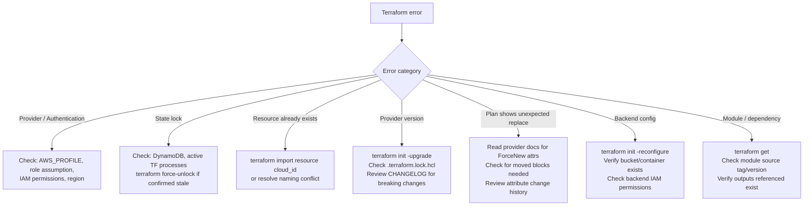

---

## Part 12: Internal AI-IaC Platform Architecture

### 12.1 Reference Architecture

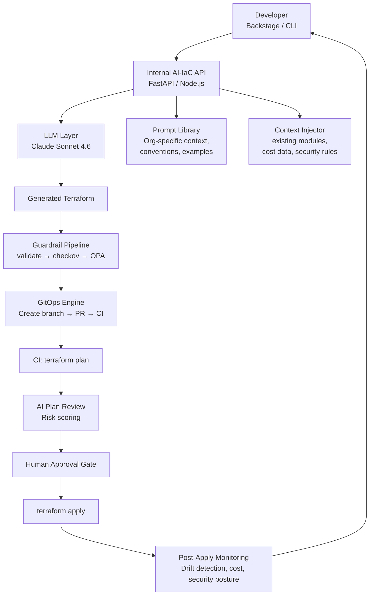

### 12.2 Context Injection for Better Generation

The quality of AI-generated IaC is dramatically improved by providing organization-specific context:

```python
def build_iac_context(org_context: dict) -> str:
    return f"""
You are an Infrastructure as Code assistant for {org_context['company']}.

ORGANIZATION CONTEXT:
- Cloud providers: {', '.join(org_context['cloud_providers'])}
- Primary IaC tool: Terraform {org_context['tf_version']}
- State backend: {org_context['backend']}

NAMING CONVENTIONS:
- Resources: {{environment}}-{{team}}-{{resource-type}}-{{name}}
- Example: prod-platform-eks-main, dev-data-rds-postgres

REQUIRED TAGS ON ALL RESOURCES:
- Environment: dev|staging|prod
- Team: {org_context['team']}
- CostCenter: {org_context['cost_center']}
- ManagedBy: terraform

APPROVED MODULE SOURCES:
{chr(10).join(f'- {m}' for m in org_context['approved_modules'])}

SECURITY REQUIREMENTS:
- All storage must be encrypted at rest (KMS CMK for prod)
- No public internet exposure without explicit approval
- IMDSv2 required on all EC2/EKS nodes
- Minimum TLS 1.2 on all load balancers

FORBIDDEN PATTERNS:
- No hardcoded account IDs (use data.aws_caller_identity)
- No version = ">= 1.0" (use pessimistic ~>)
- No access keys in code (use OIDC/instance profiles)
- No force_destroy = true in prod environments

Generate Terraform code following these conventions exactly.
"""
```

---

## Part 13: Governance & Policy Frameworks

### 13.1 Three-Layer Governance Model

| Layer | Tool | When Enforced | Visibility | Who Owns |
| ------- | ------ | ------------- | ------------ | ---------- |
| Development | IDE lint, pre-commit | Before commit | Developer | Developer |
| CI/CD | Checkov, OPA/Conftest | PR creation, CI | Engineering | Platform team |
| Cloud | SCP, Azure Policy, GCP Org Policy | API call | Ops/Security | Security/Cloud CoE |

### 13.2 AI-Assisted Policy Generation

```
Translate these compliance requirements into Terraform-compatible OPA/Conftest Rego policies:

REQUIREMENTS:
1. All databases must have automated backups with minimum 7-day retention
2. No S3 bucket may be publicly accessible (no public ACL, no bucket policy allowing *)
3. All EC2 instances must use IMDSv2 (http_tokens = "required")
4. All KMS keys must have key rotation enabled
5. All IAM roles must have a description (not empty)
6. No security group may allow ingress from 0.0.0.0/0 on port 22 or 3389
7. All CloudTrail trails must have log file validation enabled
8. All RDS instances must be encrypted

For each rule:
- Write the Rego policy that tests the terraform plan JSON
- Include a test case (should pass and should fail)
- Write a human-readable description of the violation message
```

### 13.3 Terraform Sentinel Policy (HashiCorp Terraform Cloud)

```python
# sentinel/restrict-instance-types.sentinel
import "tfplan/v2" as tfplan

allowed_types = ["t3.small", "t3.medium", "t3.large", "m6i.large", "m6i.xlarge"]

ec2_instances = filter tfplan.resource_changes as _, resource {
  resource.type == "aws_instance" and
  (resource.change.actions contains "create" or resource.change.actions contains "update")
}

violations = filter ec2_instances as _, instance {
  not (instance.change.after.instance_type in allowed_types)
}

main = rule {
  length(violations) == 0
}
```

---

## Part 14: Self-Healing Infrastructure Patterns

### 14.1 What Is Self-Healing Infrastructure?

Self-healing infrastructure automatically detects, diagnoses, and remediates configuration issues and drift without requiring human intervention for low-risk scenarios.

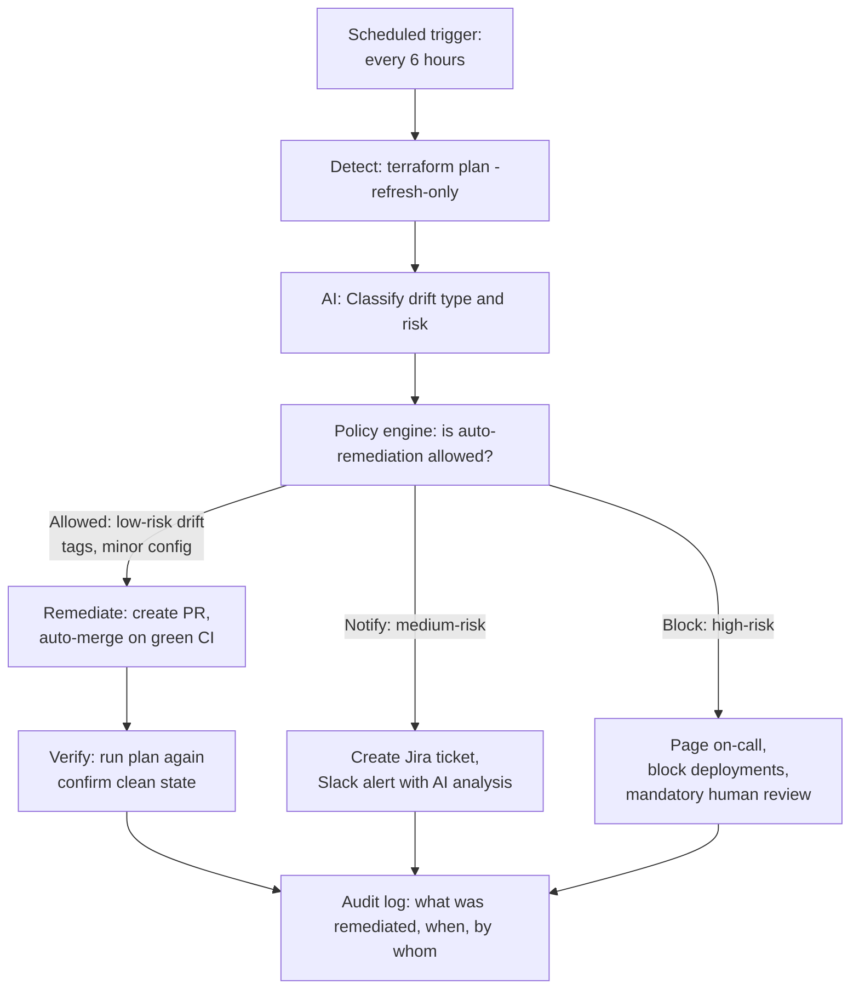

### 14.2 EventBridge-Triggered Drift Response

```hcl
# AWS EventBridge Rule: trigger drift detection on manual change
resource "aws_cloudwatch_event_rule" "manual_resource_change" {
  name        = "detect-manual-infra-change"
  description = "Trigger drift detection when resources change outside Terraform"
  event_pattern = jsonencode({
    source      = ["aws.ec2", "aws.rds", "aws.s3", "aws.iam"]
    detail-type = ["AWS API Call via CloudTrail"]
    detail = {
      userAgent = [{ "anything-but" = ["terraform"] }]
      errorCode = [{ exists = false }]
    }
  })
}

resource "aws_cloudwatch_event_target" "trigger_drift_lambda" {
  rule = aws_cloudwatch_event_rule.manual_resource_change.name
  arn  = aws_lambda_function.drift_detector.arn
}
```

```python
# lambda/drift_detector.py
import boto3, json, os
import anthropic

def handler(event, context):
    detail = event['detail']
    resource_type = detail.get('eventSource', '').replace('.amazonaws.com', '')
    action = detail['eventName']
    user = detail['userIdentity'].get('arn', 'unknown')

    client = anthropic.Anthropic()
    message = client.messages.create(
        model="claude-sonnet-4-6",
        max_tokens=1024,
        messages=[{
            "role": "user",
            "content": f"""
A manual AWS infrastructure change was detected outside of Terraform.

Resource Type: {resource_type}
Action: {action}
Performed by: {user}

Classify the risk level (LOW/MEDIUM/HIGH/CRITICAL) and explain:
1. What likely changed
2. Whether this is a security concern
3. Whether auto-remediation is safe
4. Recommended response

Output as JSON: {{"risk", "explanation", "auto_remediate", "action"}}
"""
        }]
    )

    analysis = json.loads(message.content[0].text)

    sns = boto3.client('sns')
    if analysis['risk'] in ['HIGH', 'CRITICAL']:
        sns.publish(
            TopicArn=os.environ['ONCALL_TOPIC'],
            Subject=f"CRITICAL: Manual infra change - {resource_type}/{action}",
            Message=json.dumps(analysis, indent=2)
        )
    elif analysis['risk'] == 'MEDIUM':
        sns.publish(
            TopicArn=os.environ['ALERT_TOPIC'],
            Subject=f"Drift detected: {resource_type}/{action}",
            Message=json.dumps(analysis, indent=2)
        )

    return analysis
```

---

## Part 15: Multi-Agent IaC Orchestration

### 15.1 Specialized Agent Architecture

For complex IaC tasks, multiple specialized agents collaborate better than a single general-purpose agent.

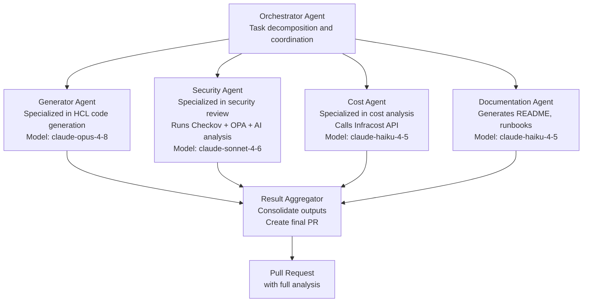

### 15.2 Agent Communication Pattern

```python
# Multi-agent orchestration with Claude SDK
import anthropic
import asyncio

client = anthropic.Anthropic()

async def orchestrate_iac_generation(request: str, context: dict):
    """Orchestrate multiple specialized agents for IaC generation."""

    orchestrator_response = client.messages.create(
        model="claude-sonnet-4-6",
        max_tokens=2048,
        system="You are an IaC orchestrator. Decompose infrastructure requests into subtasks.",
        messages=[{"role": "user", "content": f"Request: {request}\nContext: {context}"}]
    )

    task_plan = orchestrator_response.content[0].text

    results = await asyncio.gather(
        run_generator_agent(request, context),
        run_security_agent(task_plan),
        run_cost_agent(task_plan),
    )

    generated_code, security_review, cost_estimate = results

    synthesis = client.messages.create(
        model="claude-sonnet-4-6",
        max_tokens=4096,
        messages=[{
            "role": "user",
            "content": f"""
Synthesize this multi-agent analysis into a final PR description:
Generated Code: {generated_code}
Security Review: {security_review}
Cost Estimate: {cost_estimate}
"""
        }]
    )

    return {
        "terraform_code": generated_code,
        "security_findings": security_review,
        "cost_estimate": cost_estimate,
        "pr_description": synthesis.content[0].text,
    }
```

---

## Part 16: The Future — Autonomous Infrastructure

### 16.1 Where AI-IaC Is Heading

The trajectory is toward increasingly autonomous infrastructure management, with AI agents handling operational toil while humans focus on architecture, strategy, and compliance.

**5-Year Outlook:**

| Capability | 2024 State | 2026 Projection | 2029 Vision |
| ----------- | ----------- | ---------------- | ------------- |
| Code generation | Chat-based, human-curated | Integrated in IDE, auto-suggests | Natural language to code, no HCL needed |
| Plan interpretation | AI explains in plain English | Risk-scored, auto-routed approvals | Context-aware, cost/risk/compliance in one view |
| Drift remediation | Detected + alerted | Auto-PR for low-risk drift | Auto-apply within policy for known-safe changes |
| Compliance | Static scan + manual review | AI + policy-as-code enforced in CI | Continuous, real-time compliance monitoring |
| Cost optimization | Periodic reports | Continuous suggestions with auto-apply | Autonomous right-sizing within guardrails |
| Incident response | Human investigates | AI diagnoses and proposes fix | AI remediates with human notification |
| Documentation | Generated post-hoc | Generated with code | Living docs auto-updated by agents |
| Architecture design | AI assists | AI designs with human review | AI proposes architecture options, human selects |

### 16.2 Building Toward Autonomy Safely

The key principle: autonomy should expand gradually as trust is established, with each expansion gated by demonstrated reliability and safety.

**Autonomy Roadmap:**

- **Months 1–3:** Level 1–2 — AI generates code, humans review 100% of changes
- **Months 3–6:** Level 2–3 — AI reviews code, flags issues before human review
- **Months 6–12:** Level 3–4 — Auto-remediation PRs for tag/config drift (human merge)
- **Year 1–2:** Level 4 — Auto-merge for pre-approved, low-risk drift patterns
- **Year 2+:** Level 5 — Full autonomy within defined policy guardrails

**The non-negotiables at every level:**

1. Audit trail — every AI action is logged with the AI's reasoning
2. Human override — humans can always pause, roll back, or override AI decisions
3. Blast radius limits — AI cannot exceed defined risk thresholds without escalation
4. Transparency — AI explains every action in human-readable terms
5. Rollback readiness — every AI-applied change must be reversible

### 16.3 Responsible AI-IaC Principles

| Principle | Application in IaC |
| ----------- | ------------------ |
| **Explainability** | AI must explain WHY it generated specific code, not just WHAT |
| **Auditability** | All AI-generated changes logged in immutable audit trail |
| **Human oversight** | Every destructive or high-risk action requires human approval |
| **Least privilege** | AI agents have narrowest possible IAM permissions |
| **Fail safe** | On AI error or uncertainty, stop and alert — never guess on infra |
| **Data minimization** | AI agents don't have access to production data, only configuration |
| **Reversibility** | AI avoids patterns that are hard to undo (data destruction, IAM changes) |

---

## Appendix A — Tool Selection Matrix

### AI Models

| Use Case | Recommended Model | Rationale |
| --------- | ----------------- | ----------- |
| Daily IaC generation | claude-sonnet-4-6 | Best balance of speed, accuracy, and cost |
| Architect-level design | claude-opus-4-8 | Maximum reasoning quality for complex decisions |
| High-volume generation | claude-haiku-4-5 | Low latency, cost-effective for templating |
| Security review | claude-sonnet-4-6 | Strong reasoning about security implications |
| Documentation generation | claude-haiku-4-5 | Fast, adequate for doc generation tasks |

### Static Analysis Tools

| Tool | Primary Purpose | Priority | Integration |
| ------ | --------------- | ---------- | ------------- |
| Checkov | Security misconfig detection | Must have | CLI, GitHub Actions, pre-commit |
| tfsec | Terraform-specific security | Must have | CLI, GitHub Actions |
| Infracost | Cost estimation | Strongly recommended | CLI, GitHub Actions, PR comments |
| OPA/Conftest | Custom org policies | Recommended | CLI, GitHub Actions |
| Trivy | CVE + config scanning | Recommended | CLI, GitHub Actions |
| Terrascan | Multi-cloud policies | Optional | CLI, GitHub Actions |
| Semgrep | Custom pattern rules | Optional | CLI, GitHub Actions |
| Driftctl | Drift detection | Optional | CLI, scheduled CI |

### GitOps / Platform Tools

| Tool | Type | Self-Hosted | Best For |
| ------ | ------ | ------------ | --------- |
| Atlantis | Terraform GitOps | Yes | Teams wanting PR workflow |
| Spacelift | SaaS IaC platform | No | Enterprise governance, drift detection |
| Terraform Cloud | HashiCorp SaaS | No | HashiCorp ecosystem |
| env0 | SaaS IaC platform | No | Cost governance, RBAC |
| Scalr | SaaS IaC platform | No | Multi-tenant IaC |
| GitHub Actions | CI/CD | No | GitHub orgs, custom workflows |
| GitLab CI | CI/CD | Both | GitLab orgs |

---

## Appendix B — Prompt Engineering for IaC

### Prompt Templates

**Resource Generation:**

```
Context: [Cloud provider, region, account purpose, environment]
Task: Generate Terraform HCL for [resource type]
Requirements: [Specific attributes, sizes, configurations]
Security: [Encryption, access control, network requirements]
Tagging: [Required tags and values]
Constraints: [What to exclude, what not to configure]
Output: Terraform HCL only, no explanation
```

**Plan Interpretation:**

```
Analyze this terraform plan output:
1. Summarize all changes in plain English
2. Identify any resource replacements (destroyed + recreated)
3. Assess downtime risk for each replacement
4. Flag any security concerns
5. Estimate cost impact
6. Give an overall recommendation: SAFE/REVIEW/BLOCK

[Plan output]
```

**Error Diagnosis:**

```
Terraform error diagnosis request:
- TF version: [version]
- Provider: [name + version]
- Operation: [plan/apply/init/etc]
- Error: [full error message]
- Code: [relevant resource block]
- Tried: [what you've already tried]
```

**Security Review:**

```
Review for [compliance standard: HIPAA/PCI-DSS/SOC2]:
For each resource, check [specific requirements list].
Output: CRITICAL/HIGH/MEDIUM/LOW findings with remediation code.

[Terraform configuration]
```

### Few-Shot Examples for Better Results

Include 1–2 examples of your organization's coding style in your prompt context:

```
Our coding style:
locals {
  common_tags = {
    Environment = var.environment
    Team        = var.team
    ManagedBy   = "terraform"
  }
}

resource "aws_s3_bucket" "example" {
  bucket = "${var.environment}-${var.team}-${var.name}"
  tags   = local.common_tags
}

Generate all resources following this exact style.
```

---

## Appendix C — Production Readiness Checklist

### AI System

- [ ] LLM API key stored in secrets manager, not code
- [ ] Model version pinned (not using `latest`)
- [ ] Token limits set appropriately for code generation tasks
- [ ] Fallback for API unavailability (graceful degradation to human-only workflow)
- [ ] Rate limiting implemented for LLM API calls
- [ ] Cost monitoring on LLM API usage
- [ ] Prompt injection defenses in place (user input sanitized before insertion)
- [ ] PII/sensitive data stripped before sending to external LLM APIs

### Guardrail Pipeline

- [ ] `terraform validate` enforced in CI
- [ ] Checkov with minimum severity threshold configured
- [ ] OPA/Conftest policies cover: encryption, public access, IMDSv2, tagging
- [ ] Cloud-level policies (SCPs/Azure Policy) align with Terraform policies
- [ ] Plan review step is not bypassable in CI
- [ ] Destructive operations require additional approval
- [ ] Emergency bypass documented and requires two-engineer approval

### Agentic Operations

- [ ] AI agent IAM permissions documented and reviewed
- [ ] Agent actions logged to immutable audit trail (CloudTrail + S3)
- [ ] Circuit breaker: agent auto-pauses if error rate exceeds threshold
- [ ] Blast radius limit: agent cannot affect more than N resources in one operation
- [ ] Human notification within 5 minutes of any autonomous apply
- [ ] Rollback procedure documented and tested for every agentic workflow
- [ ] Agent behavior tested in dev/staging before production enablement

### Governance & Compliance

- [ ] All AI-generated infrastructure changes traceable to request ticket
- [ ] Compliance policy rules version-controlled and peer-reviewed
- [ ] Policy exceptions documented with owner, expiry, and business justification
- [ ] Regular (quarterly) review of AI-generated code patterns for drift from standards
- [ ] Incident response runbook covers "AI agent made unexpected change" scenario
- [ ] Data residency verified: LLM API calls don't send regulated data to external services

---

*Related guides:*

- *[Terraform from Zero to Mastery](terraform-mastery-guide.md) — Core Terraform guide*
- *Terraform Documentation: <https://developer.hashicorp.com/terraform/docs>*
- *OpenTofu Documentation: <https://opentofu.org/docs/>*
- *Claude API Documentation: <https://docs.anthropic.com/en/api/>*
