# Terraform from Zero to Mastery

A comprehensive guide covering 18 parts: IaC fundamentals, architecture, state management, rollback, decommissioning, and the future with OpenTofu and AI-assisted IaC — plus appendices with a CLI cheat sheet, 125 interview questions, production readiness checklist, and Day-0/1/2 operations guide.

---

## Table of Contents

| Part | Topic |
|------|-------|
| 1 | Terraform Fundamentals & IaC Evolution |
| 2 | Terraform Architecture Deep Dive |
| 3 | Resource Matching Internals |
| 4 | State Management Deep Dive |
| 5 | Complete CLI Command Mastery |
| 6 | Rollback Strategy & Failure Recovery |
| 7 | Infrastructure Decommissioning |
| 8 | Force Destroy Deep Dive |
| 9 | State Manipulation Mastery |
| 10 | Data Sources, Variables & Outputs |
| 11 | Advanced Lifecycle Controls |
| 12 | Modules Mastery |
| 13 | Enterprise Terraform Architecture |
| 14 | Security Best Practices |
| 15 | Anti-Pattern Catalog |
| 16 | Troubleshooting Playbook |
| 17 | System Retirement Programs |
| 18 | OpenTofu & Future of Terraform |
| A | CLI Cheat Sheet |
| B | 125 Interview Questions |
| C | Production Readiness Checklist |
| D | Day-0/1/2 Operations Guide |

---

## Part 1: Terraform Fundamentals

*Infrastructure as Code, Evolution & IaC Tool Comparison*

### 1.1 What is Infrastructure as Code (IaC)?

Infrastructure as Code (IaC) is the practice of managing and provisioning computing infrastructure through machine-readable definition files rather than through manual processes or interactive configuration tools. IaC treats infrastructure the same way software engineers treat application code — version-controlled, tested, peer-reviewed, and automatically deployed.

**Core benefits:**

- **Repeatability** — The same configuration produces identical infrastructure every time, eliminating snowflake servers and configuration drift.
- **Version Control** — Infrastructure changes are tracked in Git with full audit history, blame tracking, and the ability to revert.
- **Collaboration** — Teams can review infrastructure changes via pull requests using the same workflows as application code.
- **Speed** — Automated provisioning takes minutes instead of days of manual work.
- **Cost Control** — Infrastructure can be destroyed and recreated on demand, enabling ephemeral environments.
- **Disaster Recovery** — Entire environments can be rebuilt from code in minutes.

**The Evolution of Infrastructure Management:**

| Era | Approach | Tools | Problems Solved | New Problems Introduced |
|-----|----------|-------|-----------------|------------------------|
| Gen 1 ~2000s | Manual Provisioning | SSH, Web Console, CLI | Direct control | No repeatability, snowflakes, tribal knowledge |
| Gen 2 ~2008-2014 | Config Management | Chef, Puppet, Ansible, SaltStack | Repeatable config, idempotent | Mutable infra, drift, ordering issues |
| Gen 3 ~2014-2019 | Orchestration IaC | Terraform, CloudFormation | Immutable infra, declarative | State management complexity |
| Gen 4 ~2019-now | Platform Engineering | Backstage, Crossplane, Pulumi | Developer self-service | Abstraction overhead, learning curve |
| Gen 5 ~2024+ | AI-Assisted IaC | Terraform + AI, OpenTofu | Natural language to infra | Hallucination risks, validation gaps |

**Mutable vs Immutable Infrastructure:**

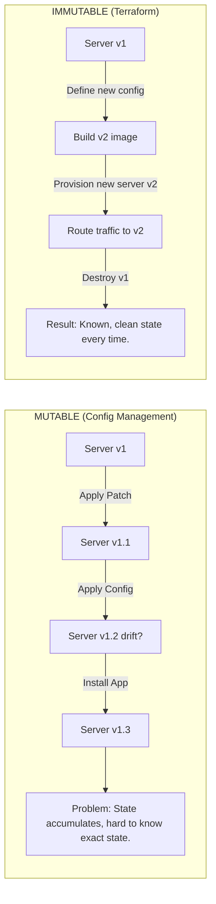

### 1.2 IaC Tool Comparison Matrix

| Tool | Type | Language | State Mgmt | Multi-Cloud | Provider Ecosystem | Best For |
|------|------|----------|------------|-------------|-------------------|----------|
| Terraform | Declarative | HCL | tfstate file | Native | 4,000+ providers | Multi-cloud enterprise |
| OpenTofu | Declarative | HCL | tfstate file | Native | Terraform-compatible | Open-source Terraform |
| CloudFormation | Declarative | YAML/JSON | AWS managed | AWS only | AWS services only | AWS-native teams |
| AWS CDK | Imperative | Python/TS/Java | CloudFormation | AWS only | AWS via constructs | Developer-first AWS |
| Pulumi | Imperative | Python/TS/Go/C# | Pulumi Cloud | Native | 100+ providers | Dev-heavy teams |
| Bicep | Declarative | Bicep DSL | Azure managed | Azure only | Azure services | Azure-native teams |
| Crossplane | Declarative | Kubernetes CRDs | Kubernetes | Native | Growing | K8s-native platform |
| Ansible | Imperative | YAML | None (stateless) | Via modules | Thousands | Config management |

**Choose Terraform when:** infrastructure spans multiple cloud providers, you need to manage non-cloud resources (DNS, GitHub, Datadog, Snowflake), or you need the 4,000+ provider ecosystem.

> **Not the right choice when:** 100% AWS-only and wanting deep CloudFormation integration, or team strongly prefers imperative languages (consider Pulumi or CDK).

### 1.3 Declarative vs Imperative

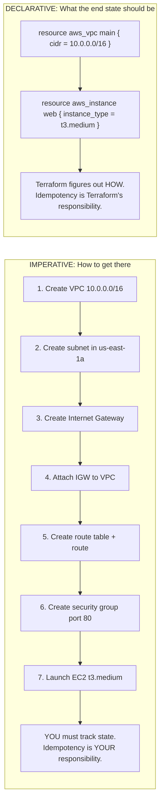

**Terraform Reconciliation Loop** — `terraform apply` performs a three-way diff between Desired State (`.tf` files), Known State (`tfstate`), and Actual State (cloud APIs):

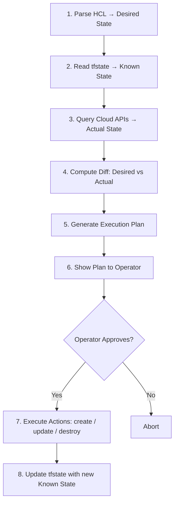

---

## Part 2: Terraform Architecture Deep Dive

*CLI, Providers, DAG, State Engine*

### 2.1 Terraform CLI Architecture

Terraform is a single Go binary that orchestrates everything. Understanding its internal architecture is critical for diagnosing issues, building CI/CD pipelines, and designing enterprise workflows.

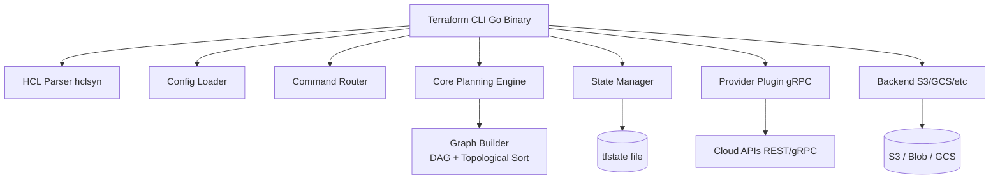

**The Command Lifecycle:**

| Command | Phase | What It Does | Side Effects | Safe? |
|---------|-------|-------------|--------------|-------|
| `terraform init` | Initialization | Downloads providers, configures backend | Creates `.terraform/` dir | Always safe |
| `terraform validate` | Validation | Checks HCL syntax and basic schema | None | Always safe |
| `terraform fmt` | Formatting | Rewrites `.tf` files to canonical style | Modifies `.tf` files | Always safe |
| `terraform plan` | Planning | Computes diff between desired/actual state | Reads state/APIs, brief lock | Read-only |
| `terraform apply` | Execution | Executes the plan | **MODIFIES REAL INFRASTRUCTURE** | Irreversible |
| `terraform destroy` | Teardown | Destroys ALL resources in state | **DESTROYS REAL INFRASTRUCTURE** | Dangerous |
| `terraform import` | Migration | Associates existing resource with state | Writes to state file | State mutation |
| `terraform refresh` | Sync | Updates state to match actual *(deprecated)* | Writes to state file | Avoid — use `plan` |
| `terraform output` | Read | Reads output values from state | None | Always safe |
| `terraform graph` | Visualization | Outputs DOT graph of resource dependencies | None | Always safe |

### 2.2 Provider Plugin System

Providers are separate Go binaries downloaded during `terraform init` and communicating via gRPC over a local socket.

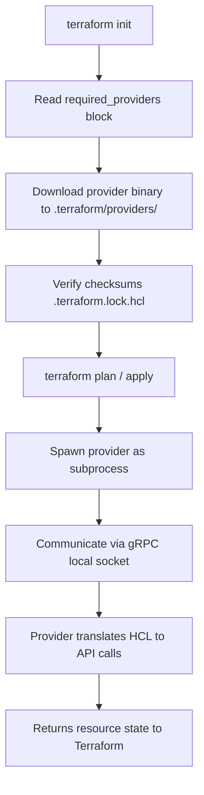

```hcl
terraform {
  required_version = ">= 1.5.0"
  required_providers {
    aws = {
      source  = "hashicorp/aws"
      version = "~> 5.0"
    }
    kubernetes = {
      source  = "hashicorp/kubernetes"
      version = ">= 2.20.0"
    }
    databricks = {
      source  = "databricks/databricks"
      version = "~> 1.40"
    }
  }
}

provider "aws" {
  region  = var.aws_region
  profile = var.aws_profile
  default_tags {
    tags = {
      Environment = var.environment
      ManagedBy   = "terraform"
      Team        = var.team_name
    }
  }
}
```

### 2.3 Resource Dependency Graph (DAG)

Terraform builds a Directed Acyclic Graph (DAG) of all resources before executing any changes, driving parallel execution and dependency ordering.

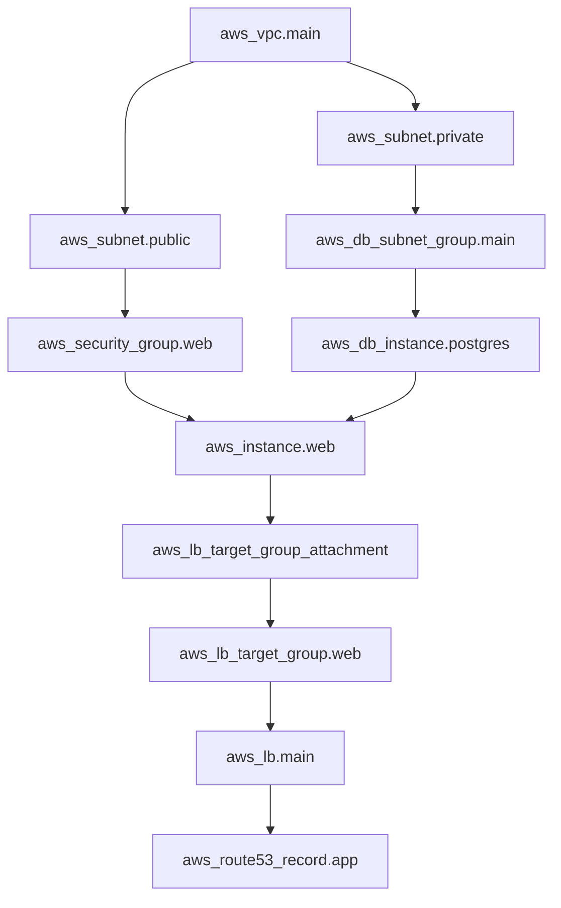

> **PARALLEL EXECUTION:** Resources with no dependency on each other execute simultaneously. Default: up to 10 parallel operations (`-parallelism=N` to change).

```hcl
# Explicit dependency when Terraform cannot infer it automatically
resource "aws_iam_role_policy_attachment" "lambda_vpc" {
  role       = aws_iam_role.lambda.name
  policy_arn = "arn:aws:iam::aws:policy/AWSLambdaVPCAccessExecutionRole"
  depends_on = [aws_iam_role.lambda]
}
```

---

## Part 3: Resource Matching Internals

*State Reconciliation, Addressing, Drift Detection*

### 3.1 Resource Addressing & Identity

**Address formats:**
```
Root-level:       aws_instance.web
Root + count:     aws_instance.web[0]
Root + for_each:  aws_instance.web["frontend"]
Module:           module.vpc.aws_vpc.main
Nested module:    module.infra.module.vpc.aws_vpc.main
Deep for_each:    module.env["prod"].aws_s3_bucket.data
```

The resource address maps to a state entry containing the real cloud ID:

```json
{
  "resources": [{
    "module": "module.network",
    "mode": "managed",
    "type": "aws_vpc",
    "name": "main",
    "instances": [{
      "attributes": {
        "id": "vpc-0a1b2c3d4e5f67890",
        "cidr_block": "10.0.0.0/16",
        "tags": {"Name": "main", "Environment": "prod"}
      }
    }]
  }]
}
```

### 3.2 What Happens When a Resource is Renamed

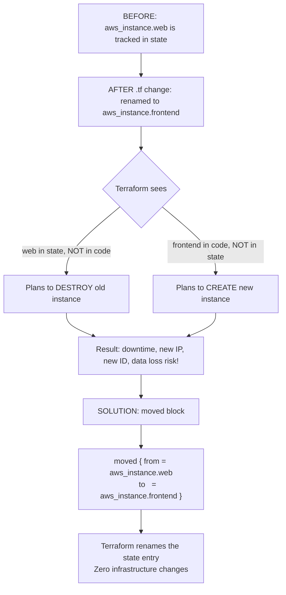

**`moved` Blocks — Complete Guide** (Terraform 1.1+):

```hcl
# Example 1: Simple resource rename
moved {
  from = aws_instance.web
  to   = aws_instance.frontend
}

# Example 2: Moving into a module
moved {
  from = aws_vpc.main
  to   = module.networking.aws_vpc.main
}

# Example 3: Moving when adopting for_each
moved {
  from = aws_s3_bucket.logs
  to   = aws_s3_bucket.logs["access"]
}

# Example 4: Moving between module instances
moved {
  from = module.servers[0]
  to   = module.servers["web"]
}
```

> `moved` blocks are permanent declarations. Keep them in your codebase so anyone who hasn't applied yet gets the safe rename.

### 3.3 State Drift Detection

State drift occurs when actual cloud infrastructure diverges from Terraform's state file.

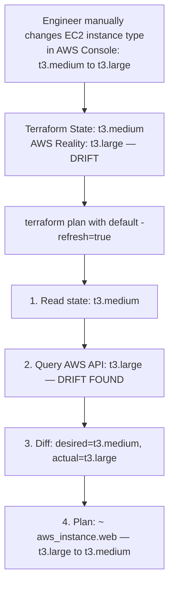

**Three strategies for handling drift:**

| Strategy | When to Use | Command | Risk |
|----------|-------------|---------|------|
| Reconcile to code | Code is the source of truth | `terraform apply` | Changes live infra back to code |
| Accept drift into state | Manual change was intentional | `terraform apply -refresh-only` | Code and state diverge |
| Ignore attribute | External system controls the value | `ignore_changes = [attr]` | Ongoing drift accumulation |
| Import & codify | Manual resource should be Terraform-managed | `terraform import` + update code | Initial complexity |

---

## Part 4: Terraform State Deep Dive

*Local State, Remote Backends, Locking, Corruption Recovery*

### 4.1 Understanding the State File

The Terraform state file (`terraform.tfstate`) is the single most important artifact in a Terraform deployment — a JSON file mapping resource addresses to real cloud IDs and last-known attribute values.

> **Warning:** Losing the state file without a backup means Terraform loses track of all managed resources. They become orphans that continue to run and accrue cost.

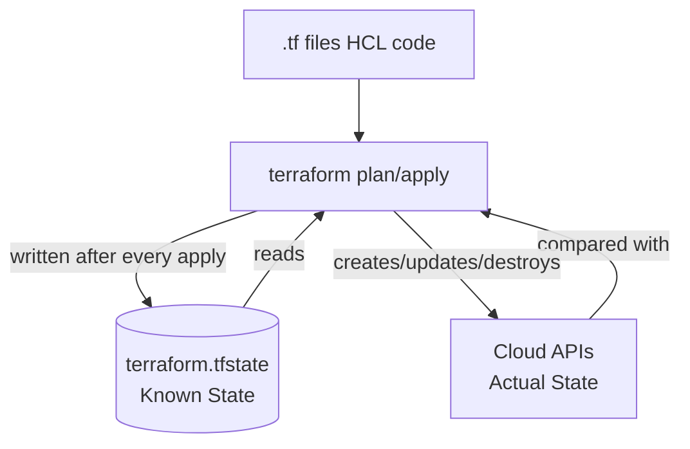

State contains: resource IDs, all attributes, dependencies, provider metadata, terraform version, serial number, lineage UUID.

### 4.2 Remote State Backends

**AWS (S3 + DynamoDB):**

```hcl
terraform {
  backend "s3" {
    bucket         = "my-company-terraform-state"
    key            = "prod/us-east-1/networking/terraform.tfstate"
    region         = "us-east-1"
    encrypt        = true
    kms_key_id     = "arn:aws:kms:us-east-1:..."
    dynamodb_table = "terraform-state-locks"
  }
}
```

**Azure (Blob Storage):**

```hcl
terraform {
  backend "azurerm" {
    resource_group_name  = "terraform-state-rg"
    storage_account_name = "mycompanytfstate"
    container_name       = "tfstate"
    key                  = "prod/eastus/networking.tfstate"
  }
}
```

**GCP (GCS):**

```hcl
terraform {
  backend "gcs" {
    bucket = "my-company-terraform-state"
    prefix = "prod/us-central1/networking"
  }
}
```

### 4.3 State Locking — Deep Dive

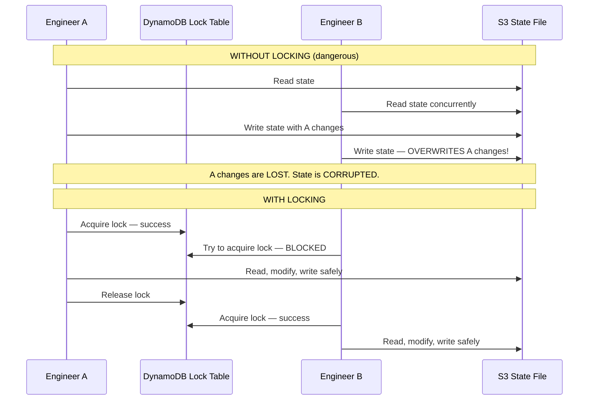

```hcl
# Create DynamoDB lock table (run once)
resource "aws_dynamodb_table" "terraform_locks" {
  name         = "terraform-state-locks"
  billing_mode = "PAY_PER_REQUEST"
  hash_key     = "LockID"
  attribute {
    name = "LockID"
    type = "S"
  }
}
```

### 4.4 State Corruption Recovery

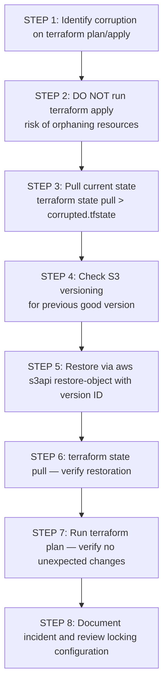

```bash
# List S3 state file versions
aws s3api list-object-versions \
  --bucket my-terraform-state \
  --prefix prod/networking/terraform.tfstate

# Restore a specific version
aws s3api copy-object \
  --copy-source "my-terraform-state/prod/networking/terraform.tfstate?versionId=<VERSION_ID>" \
  --bucket my-terraform-state \
  --key prod/networking/terraform.tfstate

# Force-unlock a stuck state lock (extreme caution!)
terraform force-unlock <LOCK_ID>
```

> **Always enable S3 versioning** on your state bucket and retain at least 90 days of state versions. This is your primary disaster recovery mechanism.

---

## Part 5: Complete CLI Command Mastery

### 5.1 Initialization Commands

```bash
terraform init                              # Standard initialization
terraform init -upgrade                     # Upgrade providers to latest matching
terraform init -reconfigure                 # Force backend reconfiguration
terraform init -migrate-state              # Migrate state to new backend
terraform init -get=false                  # Skip module download (use cached)
terraform init -backend=false             # No backend (offline plan generation)
terraform init -plugin-dir=/opt/tf/plugins # Custom plugin dir (air-gapped)
```

### 5.2 Planning Commands

```bash
terraform plan                              # Standard plan
terraform plan -out=tfplan                  # Save plan to file (CI/CD recommended)
terraform apply tfplan                      # Apply exactly what was planned

terraform plan -refresh-only                # Detect drift without proposing changes
terraform plan -destroy                     # See what destroy would do

terraform plan -target=aws_instance.web    # Limit to specific resource (emergency only)
terraform plan -target=module.networking

terraform plan -var="environment=prod"      # Set variables inline
terraform plan -var-file="prod.tfvars"      # Use variables file
terraform plan -refresh=false              # Skip state refresh (faster)
terraform plan -parallelism=20              # Control parallel operations

terraform show -json tfplan | jq .          # Plan as JSON (for tooling)
```

### 5.3 State Sub-Commands — Complete Reference

```bash
# List resources
terraform state list
terraform state list module.networking      # Filter by module
terraform state list 'aws_instance.*'       # Filter by type

# Inspect resources
terraform state show aws_instance.web
terraform state show module.vpc.aws_vpc.main

# Move resources (rename/reorganize — prefer moved{} blocks in TF 1.1+)
terraform state mv aws_instance.web aws_instance.frontend
terraform state mv aws_vpc.main module.network.aws_vpc.main

# Remove from state WITHOUT deleting in cloud (orphan)
terraform state rm aws_instance.old_server
terraform state rm module.legacy

# Backup and restore
terraform state pull > "backup-$(date +%Y%m%d).tfstate"
terraform state push terraform.tfstate      # EXTREME CAUTION

# Replace provider in state
terraform state replace-provider \
  registry.terraform.io/hashicorp/aws \
  registry.terraform.io/hashicorp/aws
```

### 5.4 Import Commands

```bash
# Legacy CLI import (Terraform < 1.5) — write resource block in .tf first
terraform import aws_instance.web i-0abc123def456789
terraform import aws_s3_bucket.logs my-company-app-logs
terraform import module.networking.aws_vpc.main vpc-0a1b2c3d
```

**Terraform 1.5+ Import Blocks (preferred):**

```hcl
import {
  to = aws_s3_bucket.legacy_data
  id = "my-company-legacy-data-bucket"
}

import {
  to = module.networking.aws_vpc.main
  id = "vpc-0a1b2c3d4e5f67890"
}
```

```bash
# Generate HCL configuration from existing resources
terraform plan -generate-config-out=generated.tf
# Review and clean up generated.tf, then: terraform apply
```

> The `import block + -generate-config-out` workflow is the recommended approach for migrating large existing infrastructures. It generates the HCL code automatically.

---

## Part 6: Rollback Strategy & Failure Recovery

### 6.1 Why Terraform Has No Native Rollback

Terraform deliberately does not have a built-in rollback command:

- **State is additive:** Terraform applies changes incrementally. A partial failure means some resources are new and some are old.
- **Infra is not a transaction:** Infrastructure changes cannot be atomically committed or rolled back.
- **Rollback is a forward operation:** The correct response to a failure is to deploy a known-good version forward.

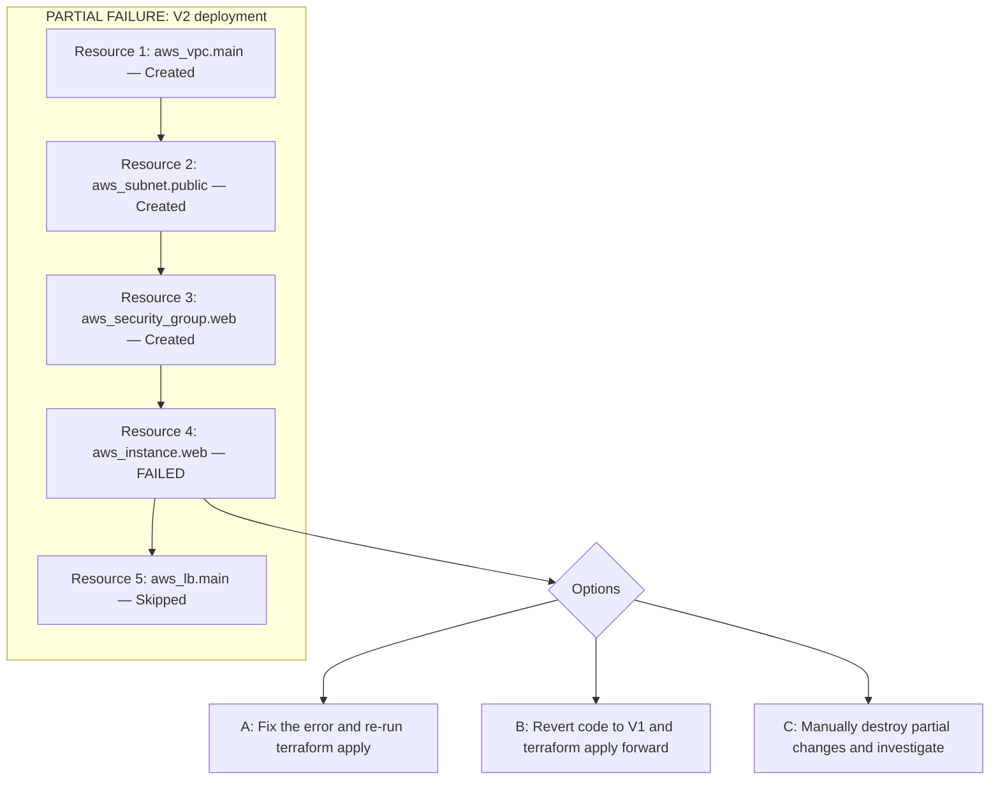

### 6.2 Git-Based Rollback (Primary Method)

```bash
# 1. Find last known-good commit
git log --oneline -10
# abc1234 Add ALB and target groups (V2 - FAILED)
# def5678 Initial EC2 and VPC setup  (V1 - GOOD)

# Option A: Create a revert commit
git revert abc1234
git push origin main
# CI/CD pipeline runs terraform apply to restore V1 config

# Option B: Emergency checkout
git checkout def5678 -- *.tf modules/
git commit -m "Emergency rollback to def5678"
terraform plan && terraform apply

# Option C: Apply saved pre-deployment plan
terraform apply saved_v1_plan.tfplan
# NOTE: Saved plans expire if state has changed
```

### 6.3 Blue-Green Infrastructure Rollback

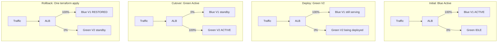

```hcl
resource "aws_lb_listener_rule" "blue_green" {
  listener_arn = aws_lb_listener.https.arn
  action {
    type = "forward"
    forward {
      target_group {
        arn    = aws_lb_target_group.blue.arn
        weight = var.blue_weight
      }
      target_group {
        arn    = aws_lb_target_group.green.arn
        weight = var.green_weight
      }
    }
  }
  condition {
    path_pattern { values = ["/*"] }
  }
}
# Rollback: terraform apply -var="blue_weight=100" -var="green_weight=0"
```

---

## Part 7: Infrastructure Decommissioning

### 7.1 Why Terraform is Ideal for Decommissioning

> Terraform's state file IS your decommission checklist. Every resource listed in state includes its cloud ID, configuration, and dependencies. No manual inventory required.

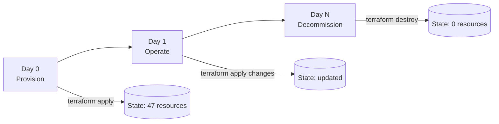

### 7.2 Enterprise Decommission Playbook

**Phase 1: Inventory & Dependencies**
```bash
terraform state list > decommission-inventory.txt
terraform graph | dot -Tpng > dependency-graph.png
```

**Phase 2: Data Archival & Compliance**
- Create final snapshots of all databases (RDS, DynamoDB export)
- Archive S3 data to Glacier or secondary storage
- Document data retention requirements (GDPR, HIPAA, SOX)
- Verify backup restoration works before destroying source

**Phase 3: Traffic Cutover**
- Remove DNS records pointing to retiring infrastructure
- Remove from load balancer target groups
- Verify zero traffic for minimum 24–48 hours

**Phase 4: Remove Destroy Protections**
```bash
grep -r "prevent_destroy" . --include="*.tf"
# Remove lifecycle { prevent_destroy = true } from all resources
terraform plan -destroy   # Review the full destruction plan
```

**Phase 5: Controlled Destruction Order**
1. Stateless resources first: EC2, ECS, Lambda
2. Load balancers and security groups
3. Databases (after final snapshot confirmed)
4. Networking (subnets, VPC, IGW, route tables)
5. IAM roles and policies last

**Phase 6: Validation**
```bash
terraform state list   # Should return empty
terraform plan         # Should show "No changes"
```

**Phase 7: Audit Evidence**
- Archive final state file (even the empty one)
- Archive Git history of decommission changes
- Archive cloud provider billing reports pre/post

### 7.3 `prevent_destroy` — Production Safeguard

```hcl
resource "aws_db_instance" "production" {
  identifier        = "prod-postgres"
  engine            = "postgres"
  instance_class    = "db.r6g.xlarge"
  allocated_storage = 500
  lifecycle {
    prevent_destroy = true
    ignore_changes  = [password]
  }
}
# To decommission: remove prevent_destroy = true, commit, review plan, get approval
```

---

## Part 8: Force Destroy Deep Dive

### 8.1 `force_destroy` for AWS S3

By default, Terraform cannot delete an S3 bucket that contains objects.

> **Warning:** `force_destroy = true` permanently deletes ALL objects and ALL versions. Irreversible.

```hcl
# WITHOUT force_destroy (default, safe)
resource "aws_s3_bucket" "logs" {
  bucket = "my-company-app-logs"
  # ERROR if bucket has objects: BucketNotEmpty
}

# WITH force_destroy (dangerous — deletes all data)
resource "aws_s3_bucket" "ephemeral" {
  bucket        = "my-company-dev-scratch"
  force_destroy = true
}

# Best practice: environment-conditional
resource "aws_s3_bucket" "data" {
  bucket        = "my-company-${var.environment}-data"
  force_destroy = var.environment != "prod"
}
```

### 8.2 `terraform apply -replace`

The `-replace` flag (Terraform 0.15.2+) forces a specific resource to be destroyed and recreated, replacing the deprecated `taint` command.

```bash
terraform apply -replace=aws_instance.web
terraform apply -replace=module.compute.aws_instance.app

# Always plan first to see impact
terraform plan -replace=aws_instance.web

# Use cases: unhealthy EC2, SSH key rotation, AMI upgrade,
#            certificate or secret rotation requiring new resource
```

---

## Part 9: State Manipulation Mastery

### 9.1 `terraform state mv` — When and How

```bash
# Moving resource into a module
terraform state mv aws_vpc.main module.networking.aws_vpc.main

# Renaming resource
terraform state mv aws_s3_bucket.data aws_s3_bucket.raw_data

# Converting count to for_each
terraform state mv 'aws_instance.servers[0]' 'aws_instance.servers["web"]'
terraform state mv 'aws_instance.servers[1]' 'aws_instance.servers["api"]'

# Verify the move worked
terraform state list
terraform plan  # Should show no changes
```

> **`terraform state mv` is the old way.** For Terraform 1.1+, use `moved {}` blocks — they are version-controlled, reviewable in PRs, and self-documenting.

### 9.2 Import Blocks — Terraform 1.5+

```hcl
# Step 1: Add import block(s) to your .tf files
import {
  to = aws_s3_bucket.legacy_data
  id = "my-company-legacy-data-bucket"
}

import {
  to = aws_db_instance.prod
  id = "prod-postgres-identifier"
}
```

```bash
# Step 2: Generate resource configuration
terraform plan -generate-config-out=imported_resources.tf

# Step 3: Review and clean up generated code
# Remove read-only attributes and refactor for production quality

# Step 4: Apply the import
terraform apply

# Step 5: Remove import blocks (they are one-time operations)
```

---

## Part 10: Data Sources, Variables & Outputs

### 10.1 Data Sources vs Resources

```hcl
# RESOURCE: Terraform creates, updates, and destroys this
resource "aws_vpc" "main" {
  cidr_block = "10.0.0.0/16"
}

# DATA SOURCE: Terraform reads but does NOT own or modify this
data "aws_vpc" "existing" {
  id = "vpc-0a1b2c3d4e5f67890"
}

# Common data sources:
data "aws_ami" "ubuntu" {
  most_recent = true
  owners      = ["099720109477"]  # Canonical
  filter {
    name   = "name"
    values = ["ubuntu/images/hvm-ssd/ubuntu-*-22.04-amd64-server-*"]
  }
}

# Cross-state reference
data "terraform_remote_state" "networking" {
  backend = "s3"
  config = {
    bucket = "my-terraform-state"
    key    = "prod/networking/terraform.tfstate"
    region = "us-east-1"
  }
}

resource "aws_instance" "app" {
  subnet_id = data.terraform_remote_state.networking.outputs.private_subnet_id
}
```

### 10.2 Variable Types & Validation

```hcl
variable "environment" {
  type        = string
  description = "Deployment environment"
  default     = "dev"
  validation {
    condition     = contains(["dev", "staging", "prod"], var.environment)
    error_message = "Environment must be one of: dev, staging, prod."
  }
}

variable "instance_count" {
  type    = number
  default = 2
  validation {
    condition     = var.instance_count >= 1 && var.instance_count <= 100
    error_message = "Instance count must be between 1 and 100."
  }
}

# Sensitive variable — never shown in plan/apply output
variable "db_password" {
  type      = string
  sensitive = true
}

variable "tags" {
  type = object({
    team        = string
    cost_center = string
    project     = string
  })
  default = {
    team        = "platform"
    cost_center = "engineering"
    project     = "core-infra"
  }
}
```

---

## Part 11: Advanced Lifecycle Controls

### 11.1 Complete Lifecycle Reference

```hcl
resource "aws_db_instance" "main" {
  identifier        = "prod-db"
  engine            = "postgres"
  instance_class    = "db.r6g.xlarge"
  allocated_storage = 100
  username          = "admin"
  password          = var.db_password

  lifecycle {
    # Zero-downtime replacements: create new first, then destroy old
    create_before_destroy = true

    # Terraform will ERROR on any destroy operation
    prevent_destroy = true

    # Ignore drift in specific attributes managed externally
    ignore_changes = [
      password,             # Managed by Secrets rotation
      snapshot_identifier,  # Set by restore operations
      tags["LastModified"],  # Set by external tagging tool
    ]

    # Force replacement when referenced resource changes
    replace_triggered_by = [
      aws_db_subnet_group.main.id,
    ]
  }
}
```

| Lifecycle Option | Use Case | Risk Level | Example Scenario |
|-----------------|----------|------------|-----------------|
| `create_before_destroy` | Zero-downtime resource replacement | Medium — doubles resources briefly | SSL cert rotation, DB instance class change |
| `prevent_destroy` | Production safeguard for critical resources | Low — just prevents accidents | Production RDS, S3 data buckets |
| `ignore_changes` | External system manages specific attributes | Medium — drift accumulates silently | ASG `desired_count` managed by autoscaling |
| `replace_triggered_by` | Force replacement on dependency change | High — destroys the resource | Restarting instances when `user_data` changes |

---

## Part 12: Modules Mastery

### 12.1 Module Design Principles

```
modules/
├── aws-vpc/
│   ├── main.tf        # Resource definitions
│   ├── variables.tf   # Input variable declarations
│   ├── outputs.tf     # Output value declarations
│   ├── versions.tf    # Provider + Terraform version constraints
│   ├── README.md      # Documentation
│   └── examples/
│       └── basic/
│           └── main.tf
```

```hcl
# Calling a module — ALWAYS pin versions in production!
module "vpc" {
  source  = "terraform-aws-modules/vpc/aws"
  version = "~> 5.0"

  name            = "prod-vpc"
  cidr            = "10.0.0.0/16"
  azs             = ["us-east-1a", "us-east-1b", "us-east-1c"]
  private_subnets = ["10.0.1.0/24", "10.0.2.0/24", "10.0.3.0/24"]
  public_subnets  = ["10.0.101.0/24", "10.0.102.0/24", "10.0.103.0/24"]
  enable_nat_gateway = true
  single_nat_gateway = var.environment != "prod"
  tags               = local.common_tags
}

resource "aws_instance" "app" {
  subnet_id = module.vpc.private_subnets[0]
}
```

### 12.2 Monorepo vs Multi-Repo

| Factor | Monorepo | Multi-Repo |
|--------|----------|------------|
| Atomic changes | Change VPC + app in one PR | Multiple PRs required |
| Blast radius | Anyone can change anything | Isolated per team/service |
| Versioning | Implicit (git SHA) | Explicit semver tags |
| Dependency tracking | Easier (co-located) | Must pin module versions |
| Team autonomy | Shared ownership conflicts | Clear ownership |
| CI/CD complexity | Medium (path-based triggers) | Higher (multiple pipelines) |
| Recommended for | Small-medium teams (<10 engineers) | Large orgs, platform teams |

---

## Part 13: Enterprise Terraform Architecture

### 13.1 Recommended Directory Structure

```
infrastructure/
├── modules/
│   ├── aws-eks-cluster/
│   ├── aws-rds-postgres/
│   └── aws-networking/
├── environments/
│   ├── dev/us-east-1/
│   │   ├── networking/
│   │   └── eks/
│   ├── staging/us-east-1/
│   └── prod/
│       ├── us-east-1/
│       └── eu-west-1/         # Multi-region prod
├── .github/workflows/
│   ├── terraform-plan.yml     # PR: plan + post results
│   └── terraform-apply.yml   # Main: auto-apply on merge
└── scripts/
    ├── bootstrap-backend.sh
    └── validate-all.sh
```

### 13.2 GitOps Integration Patterns

| Tool | Type | Key Feature | Best For |
|------|------|------------|---------|
| GitHub Actions | CI/CD | Native GitHub integration, free tier | GitHub-based orgs |
| GitLab CI | CI/CD | Built-in, no external tools needed | GitLab-based orgs |
| Atlantis | Terraform-specific | PR-based plan/apply comments | Teams wanting PR workflow |
| Spacelift | SaaS IaC platform | Policy, drift detection, audit | Enterprise governance |
| Terraform Cloud | HashiCorp SaaS | Remote state, Sentinel policy | HashiCorp ecosystem |
| Azure DevOps | CI/CD | Deep Azure integration | Microsoft/Azure shops |
| Jenkins | CI/CD | Highly customizable, self-hosted | Existing Jenkins orgs |

```yaml
# .github/workflows/terraform.yml
name: Terraform
on:
  pull_request:
    paths: ["environments/**", "modules/**"]
  push:
    branches: [main]
    paths: ["environments/**", "modules/**"]
jobs:
  terraform:
    runs-on: ubuntu-latest
    steps:
      - uses: actions/checkout@v4
      - uses: hashicorp/setup-terraform@v3
        with:
          terraform_version: "1.9.0"
      - name: Configure AWS credentials
        uses: aws-actions/configure-aws-credentials@v4
        with:
          role-to-assume: arn:aws:iam::123456789:role/TerraformCI
          aws-region: us-east-1
      - name: Terraform Init
        run: terraform init
      - name: Terraform Plan (PR only)
        if: github.event_name == 'pull_request'
        run: terraform plan -out=tfplan -no-color
      - name: Terraform Apply (main branch only)
        if: github.ref == 'refs/heads/main'
        run: terraform apply -auto-approve
```

---

## Part 14: Security Best Practices

### 14.1 Secret Management — Never in Code

> **NEVER hardcode secrets** in `.tf` files or `.tfvars` files. They end up in Git history and in the state file.

```hcl
# WRONG — credential in code
resource "aws_db_instance" "main" {
  password = "SuperSecret123!"  # This will be in Git AND state!
}

# CORRECT — use AWS Secrets Manager
data "aws_secretsmanager_secret_version" "db_password" {
  secret_id = "prod/database/master-password"
}
resource "aws_db_instance" "main" {
  password = jsondecode(data.aws_secretsmanager_secret_version.db_password.secret_string)["password"]
  lifecycle {
    ignore_changes = [password]  # Allow external rotation
  }
}

# CORRECT — use HashiCorp Vault
data "vault_generic_secret" "db_creds" {
  path = "secret/prod/database"
}
resource "aws_db_instance" "main" {
  username = data.vault_generic_secret.db_creds.data["username"]
  password = data.vault_generic_secret.db_creds.data["password"]
}
```

### 14.2 IAM Least Privilege for Terraform

```json
{
  "Version": "2012-10-17",
  "Statement": [
    {
      "Sid": "TerraformStateAccess",
      "Effect": "Allow",
      "Action": ["s3:GetObject", "s3:PutObject", "s3:ListBucket"],
      "Resource": [
        "arn:aws:s3:::my-company-terraform-state",
        "arn:aws:s3:::my-company-terraform-state/*"
      ]
    },
    {
      "Sid": "TerraformLocking",
      "Effect": "Allow",
      "Action": ["dynamodb:GetItem", "dynamodb:PutItem", "dynamodb:DeleteItem"],
      "Resource": "arn:aws:dynamodb:us-east-1:123456:table/terraform-locks"
    }
  ]
}
```

> **Use OIDC authentication** with GitHub Actions / GitLab CI to assume IAM roles without storing long-lived AWS credentials as secrets.

---

## Part 15: Anti-Pattern Catalog

*17 Critical Terraform Anti-Patterns & Remediation*

| # | Anti-Pattern | Problem | Fix |
|---|-------------|---------|-----|
| AP-01 | All environments in one state file | A failed prod apply can corrupt all environments | Split state by environment AND layer (networking/compute/data) |
| AP-02 | Local state on developer's laptop | No locking, no sharing, high risk of overwrites | Always use remote backends (S3+DynamoDB, Terraform Cloud, GCS) |
| AP-03 | Manual console changes bypassing Terraform | State drift accumulates silently | Enforce IaC-only changes via IAM SCPs, Azure Policies, or org policies |
| AP-04 | Hardcoded account IDs in code | Makes module reuse impossible | Use variables, data sources, and `data.aws_caller_identity` |
| AP-05 | Hardcoded passwords in `.tf` files | Shows in plan output AND state file; Git history exposure | Use Secrets Manager, Key Vault, or HashiCorp Vault |
| AP-06 | S3 bucket without versioning for state | One accidental state push can permanently destroy state | Enable S3 versioning + MFA delete |
| AP-07 | Using `-target` routinely | Creates state inconsistencies over time | `-target` is for emergencies only |
| AP-08 | Not committing `.terraform.lock.hcl` | Different engineers use different provider versions | Commit the lock file; run `terraform providers lock` for multi-platform |
| AP-09 | Using `version = ">= 2.0"` | Allows major version upgrades breaking code silently | Use pessimistic constraint: `version = "~> 5.0"` |
| AP-10 | Long-lived IAM access keys in CI | If leaked, attacker has full infra access | Use OIDC role assumption for GitHub Actions / GitLab CI |
| AP-11 | Production databases without `prevent_destroy` | A mistyped `terraform destroy` destroys prod data | Add `lifecycle { prevent_destroy = true }` to all stateful prod resources |
| AP-12 | Using `terraform workspace` for environments | State shares same backend key prefix | Use separate state files per environment in separate directories |
| AP-13 | 500+ line monolithic modules | Impossible to test, reason about, or reuse | Single responsibility: one module per logical component; max ~200 lines |
| AP-14 | No `required_version` constraint | Different engineers run different Terraform versions | Always set `required_version = "~> 1.9"` and enforce with `tfenv` |
| AP-15 | Using `-auto-approve` in production without reviewing plan | Surprises await | Always run plan first; use `-auto-approve` only in CI after plan review |
| AP-16 | Inconsistent formatting | Causes noisy PRs and makes code reviews harder | Add `terraform fmt -check` to CI pipeline |
| AP-17 | Running import without reviewing generated plan | Surprises from what Terraform wants to change | Always run `terraform plan` after import |

---

## Part 16: Troubleshooting Playbook

### 16.1 Error Resolution Quick Reference

**`Error acquiring the state lock`**
```bash
terraform force-unlock <LOCK_ID>   # Find ID in error message
# Verify no other terraform process is running first!
aws dynamodb delete-item --table-name terraform-locks \
  --key '{"LockID":{"S":"<LOCK_ID>"}}'
```

**`Error: Resource already exists`**
- Resource exists in cloud but not in state
- Option A: `terraform import <resource> <cloud_id>`
- Option B: Rename your resource to not conflict
- Option C: Delete the cloud resource if not needed

**`Error: Provider version conflict`**
```bash
terraform init -upgrade
rm .terraform.lock.hcl && terraform init
terraform providers lock -platform=linux_amd64 -platform=darwin_arm64
```

**`Inconsistent dependency lock file`**
```bash
rm .terraform.lock.hcl && terraform init
# Commit the regenerated lock file
```

**`Plan shows unexpected resource replacements`**
- Check for attribute changes marked `ForceNew` in provider docs
- Review `moved {}` blocks for missing migrations
- Run `terraform state show <resource>` to compare with config

**`terraform destroy fails on S3 bucket`**
- Bucket has objects — empty manually or add `force_destroy = true`
- If versioned: `aws s3 rm s3://bucket --recursive` first

**`Import fails with 'no resource with address found'`**
- Ensure the resource block EXISTS in your `.tf` files before running import
- For modules: `terraform import module.name.resource_type.name`
- Use `import {}` blocks (Terraform 1.5+) for reliability

---

## Part 17: System Retirement Programs

### 17.1 Retirement Scenarios

| Scenario | Terraform's Role | Key Features Used |
|---------|-----------------|---------------------------|
| Data Center Exit | Inventory all managed resources, orderly teardown | `state list`, `plan -destroy`, `prevent_destroy` removal |
| End-of-Life Application | Map all resources, controlled sunset | Tags-based filtering, module destroy |
| Cloud Migration Cleanup | Retire old VMs/DBs after workload moved | `import` to get old infra into state, then destroy |
| Post-M&A Integration | Inventory acquired infra, unify under corporate Terraform | Bulk import, `state mv`, module consolidation |
| Cost Optimization | Identify and destroy unused resources | `state list`, cloud cost tagging, targeted destroy |
| Regulatory (GDPR/HIPAA) | Documented, auditable destruction with evidence | `plan -destroy` review, Git history, state backup |
| Kubernetes Cluster Retirement | Drain workloads, delete cluster and node resources | `kubectl drain` then `terraform destroy module.eks` |
| DNS Zone Retirement | Remove DNS records in correct dependency order | `plan -destroy` shows record to zone ordering |

### 17.2 Bulk Resource Retirement Pattern

```bash
# Step 1: Audit everything in state
terraform state list > "full-inventory-$(date +%Y%m%d).txt"
terraform state list | sed "s/\[.*\]//" | cut -d. -f1 | sort | uniq -c | sort -rn

# Step 2: Preview full destruction
terraform plan -destroy -out=destroy-plan.tfplan
terraform show -json destroy-plan.tfplan | jq '.resource_changes[] | {address: .address, action: .change.actions}'

# Step 3: Search for destroy protections to remove
grep -r "prevent_destroy" . --include="*.tf"

# Step 4: Staged destruction
terraform destroy -target=module.compute -auto-approve    # Compute first
terraform destroy -target=module.data -auto-approve       # Data (confirm backups!)
terraform destroy -target=module.networking -auto-approve # Networking last

# Step 5: Validate
terraform state list   # Should be empty
terraform plan         # Should show "No changes"

# Step 6: Archive evidence
terraform state pull > "final-state-$(date +%Y%m%d).tfstate"
git tag "decommission/project-x-complete-$(date +%Y%m%d)"
```

---

## Part 18: OpenTofu & The Future of Terraform

### 18.1 HashiCorp Licensing Change & OpenTofu

In August 2023, HashiCorp changed Terraform's license from MPL-2.0 (open-source) to BUSL-1.1, which restricts competitive commercial use.

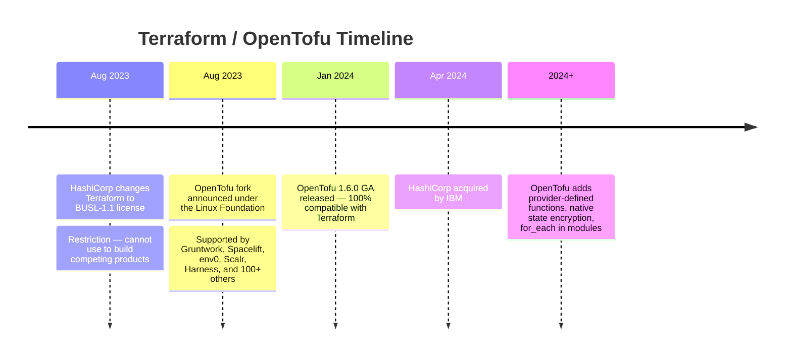

### 18.2 OpenTofu vs Terraform Feature Comparison

| Feature | Terraform | OpenTofu |
|---------|-----------|----------|
| License | BUSL-1.1 (restricted commercial) | MPL-2.0 (open source) |
| State format | tfstate JSON | Compatible tfstate JSON |
| HCL syntax | Terraform HCL | 100% compatible HCL |
| Provider registry | registry.terraform.io | registry.opentofu.org (+ TF compatible) |
| State encryption | Backend-level only | Native built-in encryption |
| `for_each` in modules | Not supported | Supported natively |
| Provider functions | Limited | Provider-defined functions |
| Test framework | `terraform test` | Enhanced testing |
| Migration path | Current users | Drop-in replacement (rename binary) |
| Commercial support | HashiCorp/IBM | Multiple vendors (Spacelift, env0) |
| Governance | HashiCorp/IBM | Linux Foundation (community) |

### 18.3 Migration from Terraform to OpenTofu

```bash
# Migration is a binary swap — no code changes required

# macOS
brew install opentofu

# Linux
curl --proto '=https' --tlsv1.2 -fsSL https://get.opentofu.org/install-opentofu.sh | sh

# Replace terraform with tofu in all commands and CI scripts
tofu init && tofu plan && tofu apply

# GitHub Actions: replace hashicorp/setup-terraform with opentofu/setup-opentofu
# State format is IDENTICAL — no state migration needed
```

### 18.4 Future Trends: AI-Assisted IaC

- **Natural Language to Terraform:** Engineers describe desired infrastructure in English; LLMs generate Terraform code. Human review of plan output remains critical.
- **AI Drift Analysis:** LLMs analyze `terraform plan` output and explain in plain English what will change and why it might be risky.
- **Policy as Code Generation:** AI generates OPA/Sentinel policies from natural language compliance requirements.
- **Self-Healing Infrastructure:** AI agents detect drift via scheduled plans and automatically create PRs to reconcile, with human approval gates.
- **Cost Optimization AI:** AI analyzes state files and suggests right-sizing, deletion of unused resources, and architecture improvements.

> **AI-generated Terraform code requires rigorous human review.** LLMs can generate plausible-looking but incorrect or insecure configurations. Always run `terraform plan` and review thoroughly before applying AI-generated infrastructure code.

---

## Appendix A — CLI Cheat Sheet

| Category | Command | Notes |
|----------|---------|-------|
| Init | `terraform init` | Initialize working directory |
| Init | `terraform init -upgrade` | Upgrade providers to latest matching |
| Init | `terraform init -reconfigure` | Force backend reconfiguration |
| Validate | `terraform validate` | Syntax check only |
| Format | `terraform fmt -recursive` | Format all `.tf` files recursively |
| Plan | `terraform plan` | Show execution plan |
| Plan | `terraform plan -out=tfplan` | Save plan to file |
| Plan | `terraform plan -destroy` | Preview destroy without applying |
| Plan | `terraform plan -refresh-only` | Show drift only, no changes proposed |
| Plan | `terraform plan -target=X` | Limit plan to resource X (emergency only!) |
| Apply | `terraform apply` | Apply with interactive approval |
| Apply | `terraform apply tfplan` | Apply a saved plan exactly |
| Apply | `terraform apply -auto-approve` | Apply without confirmation (CI only) |
| Apply | `terraform apply -replace=X` | Force destroy+recreate resource X |
| Destroy | `terraform destroy` | Destroy all managed resources |
| Destroy | `terraform plan -destroy -out=d.tfplan` | Plan destroy, save, review, then apply |
| State | `terraform state list` | List all resources in state |
| State | `terraform state show X` | Show resource X attributes |
| State | `terraform state mv A B` | Rename/move resource in state |
| State | `terraform state rm X` | Remove from state (orphan resource) |
| State | `terraform state pull > file` | Backup state to local file |
| State | `terraform force-unlock ID` | Force release stuck lock (**DANGEROUS**) |
| Import | `terraform import X cloud_id` | Import existing resource (legacy) |
| Import | `import {} block + -generate-config-out=f.tf` | Modern import (TF 1.5+) |
| Debug | `TF_LOG=DEBUG terraform plan` | Enable verbose logging |
| Debug | `terraform console` | Interactive expression evaluator |
| Debug | `terraform graph \| dot -Tpng > g.png` | Visualize dependency graph |
| Output | `terraform output` | Show all outputs |
| Output | `terraform output -json` | Outputs as JSON |
| Workspace | `terraform workspace list` | List workspaces |
| Workspace | `terraform workspace new dev` | Create new workspace |
| Workspace | `terraform workspace select prod` | Switch workspace |

---

## Appendix B — 125 Interview Questions

### Beginner (B01–B50)

1. What is Terraform and how does it differ from configuration management tools like Ansible?
2. What is Infrastructure as Code and why is it important?
3. Explain the difference between `terraform plan` and `terraform apply`.
4. What is a Terraform provider? Give 5 examples.
5. What is the `terraform.tfstate` file and why is it important?
6. What is the difference between `resource` and `data` blocks in Terraform?
7. What does `terraform init` do? What does it create?
8. How do you declare a variable in Terraform? How do you pass a value to it?
9. What is an output value in Terraform and when would you use it?
10. Explain the purpose of the `.terraform.lock.hcl` file.
11. What is the difference between `count` and `for_each`?
12. What are `locals` in Terraform? Give an example use case.
13. What is `terraform fmt` and why should you run it?
14. How do you reference an attribute of one resource in another resource?
15. What does `terraform destroy` do? When would you use it?
16. What is a Terraform module? What are the benefits of using modules?
17. How do you handle sensitive variables in Terraform?
18. What is the purpose of the `depends_on` meta-argument?
19. How do you use `terraform import` and when is it needed?
20. What does 'idempotent' mean in the context of Terraform?
21. What is a backend in Terraform? Give examples of remote backends.
22. How do Terraform workspaces work? What are their limitations?
23. What is the `lifecycle` meta-argument? Name 4 lifecycle options.
24. How do you pass outputs from one module to another?
25. What is the `terraform console` command used for?
26. What happens if someone makes manual changes to cloud resources managed by Terraform?
27. What is `terraform validate` and what does it check?
28. How do you specify which version of a provider to use?
29. What is the difference between `terraform apply` and `terraform apply tfplan`?
30. What is a Terraform registry?
31. Explain the declarative vs imperative approach with examples.
32. What types are supported for Terraform variables?
33. How do you use a `.tfvars` file?
34. What is the purpose of the `required_version` setting?
35. What happens if you rename a resource block in Terraform?
36. How does `for_each` differ from `count` when managing collections?
37. What is the `terraform graph` command and what does its output represent?
38. What is state locking and why is it important?
39. How do you reference the current AWS account ID in Terraform?
40. What is the `null_resource` / `terraform_data` resource used for?
41. What environment variable enables Terraform debug logging?
42. How do you pass provider configuration from a root module to a child module?
43. What is the difference between a data source and a resource?
44. How do you use string interpolation in Terraform HCL?
45. What are the three main files you'd find in a typical Terraform module?
46. How do you iterate over a map using `for_each`?
47. What is the `dynamic` block used for?
48. What is `provisioner` in Terraform? Why are they discouraged?
49. What is the `terraform output` command used for?
50. How do you validate variable values using validation blocks?

### Advanced (A01–A50)

1. Explain the Terraform DAG and how it enables parallel execution.
2. How does Terraform handle partial failures during `terraform apply`?
3. What is state drift and how do you detect and remediate it?
4. Explain the difference between `terraform state mv` and `moved` blocks.
5. How does the `moved` block work internally in Terraform state?
6. What are the risks of using `-target` in production?
7. How would you migrate a large infrastructure from manually-provisioned to Terraform-managed?
8. Explain how `terraform plan -refresh-only` differs from `terraform plan`.
9. What is the `create_before_destroy` lifecycle option and when would you use it?
10. How do you implement blue-green deployments in Terraform?
11. Explain cross-state references using `terraform_remote_state`.
12. What is state serialization format? What is the 'serial' field in state?
13. How do you structure Terraform code for multi-environment deployments?
14. What is the difference between provider aliasing and multiple provider configurations?
15. How do you implement zero-downtime database migrations with Terraform?
16. Explain import blocks (Terraform 1.5+) vs legacy `terraform import` command.
17. How does Terraform handle resource dependencies with `for_each` collections?
18. What is the `-generate-config-out` flag and how does it work?
19. How would you implement Terraform for a multi-account AWS Organization?
20. Explain the risks of `force_destroy` on an S3 bucket.
21. How do you encrypt Terraform state at rest?
22. What is a provider lock and how do you manage cross-platform locks?
23. How do you test Terraform modules? What tools are available?
24. Explain the difference between `terraform destroy` and using `lifecycle { prevent_destroy = true }`.
25. How does Terraform's gRPC communication with providers work?
26. What is a Terraform Sentinel policy and how does it enforce governance?
27. How do you handle Terraform state in a monorepo with hundreds of modules?
28. What are the tradeoffs between Terraform workspaces and directory-based environments?
29. How do you safely rotate database passwords managed by Terraform?
30. Explain Terraform's resource lifecycle phases: Create, Read, Update, Delete.
31. How do you implement canary deployments with Terraform?
32. What is the `replace_triggered_by` lifecycle meta-argument?
33. How do you handle provider version constraints in a shared module library?
34. Explain how Terraform resolves type mismatches between variable types.
35. What is the difference between `jsonencode()` and `tostring()` in Terraform?
36. How do you use Terraform to manage Kubernetes manifests?
37. What is the purpose of `terraform providers lock` command?
38. How do you implement Infrastructure as Code for AI/ML platforms?
39. How would you decommission a production environment using Terraform?
40. Explain how `terraform apply -replace` works vs the deprecated `taint` command.
41. How do you handle circular dependencies in Terraform?
42. What is the ephemeral resource type introduced in newer Terraform versions?
43. How do you implement GitOps with Terraform and Atlantis?
44. How would you implement cost governance using Terraform policies?
45. Explain OPA (Open Policy Agent) integration with Terraform plans.
46. How do you manage Terraform provider upgrades in a large codebase?
47. What is the purpose of the `precondition` and `postcondition` lifecycle blocks?
48. How do you implement Terraform testing with the `terraform test` framework?
49. How do you handle state migration when splitting a monolithic state file?
50. What strategies exist for recovering from corrupted Terraform state?

### Architect-Level (AR01–AR25)

1. Design a Terraform architecture for a Fortune 500 company with 50+ engineering teams, multiple cloud providers, and strict compliance requirements.
2. How would you architect Terraform for a company migrating from on-premises data centers to AWS, with a 2-year timeline and 500+ servers?
3. What is your strategy for managing Terraform state across 200+ microservices, each with dev/staging/prod environments?
4. Design a Terraform module that implements a complete production-ready EKS cluster with auto-scaling, network policies, and monitoring.
5. How would you implement a Terraform-based Infrastructure as a Service (IaaS) platform for internal teams with self-service capabilities?
6. Describe your approach to Terraform state management for a company going through a merger and acquisition.
7. How would you implement a fully automated compliance framework for Terraform covering SOC 2, HIPAA, and PCI-DSS?
8. Design a cost optimization strategy using Terraform for a company spending $2M/month on AWS.
9. How would you architect Terraform for multi-cloud (AWS + Azure + GCP) with unified governance, consistent tagging, and cross-cloud networking?
10. What is your disaster recovery architecture for Terraform state, considering state corruption, accidental destroy, and regional failures?
11. How do you architect Terraform for a CI/CD platform that runs 1,000+ pipeline jobs per day, each provisioning temporary testing environments?
12. Design a Terraform module registry strategy for an enterprise with 300+ engineers.
13. How would you implement progressive delivery (canary/blue-green) for infrastructure changes in a zero-downtime requirement?
14. Describe a Terraform strategy for managing multi-tenant SaaS infrastructure where each customer gets isolated cloud resources.
15. How do you approach Terraform code review as an architect? What automated checks do you require in CI?
16. Design a drift detection and auto-remediation system using Terraform, AWS Lambda, and EventBridge.
17. How would you migrate an organization from Terraform Cloud to a self-hosted Atlantis + S3 backend setup?
18. Describe your approach to Terraform for AI/ML infrastructure (GPU clusters, Databricks, SageMaker, vector databases).
19. How do you architect Terraform for infrastructure decommissioning programs that span 18+ months and multiple application retirements?
20. What is your strategy for adopting OpenTofu in an organization that currently uses Terraform Cloud?
21. Design a Terraform-based Internal Developer Platform (IDP) using Backstage as the frontend and Terraform as the provisioning backend.
22. How would you implement AI-assisted Terraform code review and security scanning in a GitOps pipeline?
23. Describe how Terraform integrates with a Service Mesh (Istio/Linkerd) deployment architecture.
24. How do you design Terraform for regulated environments (financial services, healthcare) with immutable audit trails?
25. What is your vision for the future of Infrastructure as Code over the next 5 years?

---

## Appendix C — Production Readiness Checklist

### State Management
- [ ] Remote backend configured (S3+DynamoDB / Azure Blob / GCS)
- [ ] State file encryption enabled (at-rest and in-transit)
- [ ] State versioning enabled (S3 bucket versioning / GCS object versioning)
- [ ] DynamoDB locking table configured (AWS) or native locking (Azure/GCP)
- [ ] State backup schedule defined and tested
- [ ] State access controls: least-privilege IAM for state bucket
- [ ] State file never committed to Git (`.gitignore` includes `*.tfstate`)

### Security
- [ ] No secrets/passwords in `.tf` files or `.tfvars`
- [ ] All sensitive variables marked `sensitive = true`
- [ ] Secrets sourced from Secrets Manager / Key Vault / Vault
- [ ] CI/CD uses OIDC role assumption (not long-lived credentials)
- [ ] Terraform CI role follows least-privilege IAM
- [ ] SAST scanning enabled (Checkov, tfsec, or Snyk IaC)
- [ ] Provider version constraints use `~>` (pessimistic)
- [ ] `.terraform.lock.hcl` committed to Git

### Destroy Protection
- [ ] `lifecycle { prevent_destroy = true }` on all production stateful resources
- [ ] Production databases have `deletion_protection = true`
- [ ] S3 buckets with critical data do NOT have `force_destroy = true`
- [ ] `terraform destroy` requires manual approval in CI
- [ ] Final snapshot `before_destroy` configured for databases

### Code Quality
- [ ] `required_version` constraint set in all root modules
- [ ] `required_providers` versions pinned with `~>`
- [ ] `terraform fmt -recursive` passes with no changes
- [ ] `terraform validate` passes with no errors
- [ ] All resources have consistent tagging (environment, team, cost_center)
- [ ] Module `README.md` documents all inputs, outputs, and examples
- [ ] No hardcoded account IDs, region names, or environment values

### CI/CD Pipeline
- [ ] `terraform plan` runs on every PR and posts results as comment
- [ ] `terraform apply` only runs from main/master branch
- [ ] Plan output reviewed before apply is triggered
- [ ] Plan saved with `-out` and same plan applied (not re-planned)
- [ ] No `-auto-approve` in production pipelines without plan review
- [ ] Pipeline uses pinned Terraform/OpenTofu version
- [ ] Drift detection job runs on schedule (daily minimum)

### Operations
- [ ] Runbook exists for common operations (apply, destroy, import)
- [ ] Runbook exists for state corruption recovery
- [ ] On-call engineers can manually unlock state
- [ ] State is accessible to multiple engineers (not one person's laptop)
- [ ] Cost impact reviewed as part of infrastructure changes
- [ ] Resource naming conventions documented and enforced

---

## Appendix D — Day-0, Day-1, Day-2 Operations Guide

### Day-0: Platform Setup

```bash
# 1. Bootstrap remote state backend (run once by platform team)
cd infrastructure/bootstrap
terraform init -backend=false
terraform apply  # Creates S3 bucket + DynamoDB table

# 2. Set up Terraform version manager
brew install tfenv
tfenv install 1.9.0 && tfenv use 1.9.0

# 3. Configure provider credentials
aws configure sso                         # AWS SSO
az login                                  # Azure
gcloud auth application-default login    # GCP

# 4. Initialize first environment
cd environments/dev/us-east-1/networking
terraform init && terraform plan
```

### Day-1: Routine Changes

```bash
git checkout -b feature/add-rds-replica
vim environments/prod/us-east-1/data/main.tf
terraform validate && terraform fmt -recursive
terraform plan
git push origin feature/add-rds-replica
# PR → CI runs plan → post to PR comment
# Merge to main → CI runs terraform apply
terraform state show aws_db_instance.replica
terraform output
```

### Day-2: Maintenance & Incident Response

```bash
# Daily drift detection (CI schedule)
terraform plan -refresh-only -detailed-exitcode
# Exit 0: no changes  Exit 2: drift detected — alert team

# Provider upgrade maintenance
terraform init -upgrade
terraform plan  # Review breaking changes
# Update .terraform.lock.hcl and commit

# Incident: state lock stuck
terraform force-unlock <LOCK_ID>

# Incident: unexpected resource destroyed
aws s3api list-object-versions --bucket tf-state --prefix path/to/state
terraform import aws_rds_cluster.main <cluster-id>

# Quarterly: dependency updates
terraform init -upgrade && terraform plan
# Apply in dev → staging → prod
```

---

*For further reading:*
- *https://developer.hashicorp.com/terraform/docs*
- *https://opentofu.org/docs/*
- *https://registry.terraform.io*
- *https://github.com/opentofu/opentofu*
