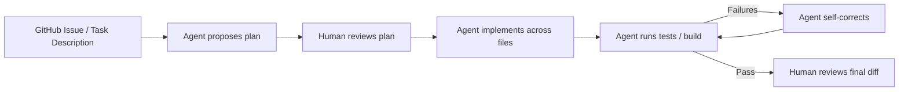
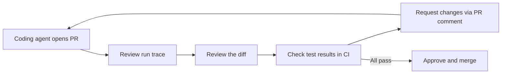
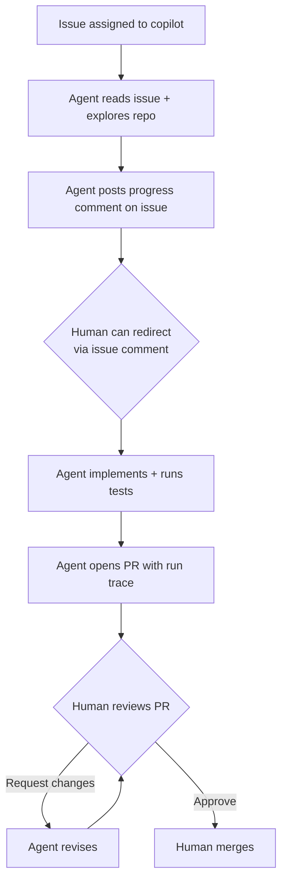

# GitHub Copilot: Zero to Hero

> The complete guide — from first suggestion to enterprise-scale AI-assisted development. Audience: developers new to Copilot through enterprise power users and platform engineers.

---

## Table of Contents

1. [What Is GitHub Copilot?](#1-what-is-github-copilot)
2. [Plans Comparison](#2-plans-comparison)
3. [Setup and Installation](#3-setup-and-installation)
4. [Model Selection](#4-model-selection)
5. [Code Completion](#5-code-completion)
6. [Chat Interface](#6-chat-interface)
7. [Agent Mode](#7-agent-mode)
8. [MCP Integration](#8-mcp-integration)
9. [Copilot Code Review](#9-copilot-code-review)
10. [Copilot Coding Agent](#10-copilot-coding-agent)
11. [AI Credits Billing](#11-ai-credits-billing)
12. [Enterprise Features](#12-enterprise-features)
13. [Parallelism](#13-parallelism)
14. [Token and Cost Optimization](#14-token-and-cost-optimization)
15. [Guardrails](#15-guardrails)
16. [Explainability](#16-explainability)
17. [Human-in-the-Loop (HITL)](#17-human-in-the-loop-hitl)
18. [RAI and Compliance](#18-rai-and-compliance)
19. [Best Practices](#19-best-practices)
20. [Antipatterns](#20-antipatterns)
21. [Keyboard Shortcuts](#21-keyboard-shortcuts)
22. [Troubleshooting](#22-troubleshooting)

---

## 1. What Is GitHub Copilot?

GitHub Copilot is an AI pair programmer embedded directly in your development environment. It started as an inline code-completion tool in 2021 and has evolved into a full agentic development platform — capable of reading your codebase, planning work, implementing changes across multiple files, running terminal commands, reviewing pull requests, and autonomously resolving GitHub issues.

**Core value proposition:**

- **Inline completions**: ghost-text suggestions as you type, from single lines to whole functions.
- **Chat interface**: conversational AI for code explanation, debugging, and generation.
- **Agent mode**: autonomous multi-step task execution — reads files, proposes edits, runs commands, monitors output, self-corrects.
- **Code review**: agentic PR review that traverses cross-file dependencies before commenting.
- **Coding agent**: assign a GitHub issue to `copilot` and receive an implemented PR.

**What Copilot is NOT:**

- A replacement for code review or engineering judgment.
- Guaranteed-correct output — all suggestions require human validation.
- A search engine — it generates, it does not retrieve verified documentation.

---

## 2. Plans Comparison

=== "Overview Table"

    | Plan | Price | Best For | AI Credits | Key Features |
    |---|---|---|---|---|
    | **Free** | $0 | Individuals exploring Copilot | 2,000 completions/month | Inline completions, limited chat, no agent mode |
    | **Pro** | $10/user/month | Individual developers | Unlimited completions, 300 premium requests/month | All completions, chat, agent mode, code review |
    | **Business** | $19/user/month | Teams and organizations | 1,900 credits/user/month pooled | Pro features + admin console, policy controls, audit logs |
    | **Enterprise** | $39/user/month | Large enterprises | 3,900 credits/user/month pooled | Business features + codebase indexing, fine-tuned models, IP indemnification, DPA |

=== "Feature Matrix"

    | Feature | Free | Pro | Business | Enterprise |
    |---|---|---|---|---|
    | Inline code completions | Limited | Unlimited | Unlimited | Unlimited |
    | Multi-model selection (GPT-4o, Claude, Gemini) | No | Yes | Yes | Yes |
    | Chat in IDE | Limited | Yes | Yes | Yes |
    | Agent mode | No | Yes | Yes | Yes |
    | Coding agent (issue → PR) | No | Yes | Yes | Yes |
    | Agentic code review | No | Yes | Yes | Yes |
    | MCP server support | No | Yes | Yes | Yes |
    | GitHub.com Copilot chat | No | Yes | Yes | Yes |
    | Admin console + seat management | No | No | Yes | Yes |
    | Organization policy controls | No | No | Yes | Yes |
    | Audit logs | No | No | Yes | Yes |
    | Codebase indexing (knowledge base) | No | No | No | Yes |
    | Fine-tuned custom models | No | No | No | Yes |
    | IP indemnification | No | No | Yes | Yes |
    | Data processing agreement (DPA) | No | No | Partial | Full |
    | SSO/SCIM provisioning | No | No | Yes | Yes |
    | Enterprise MCP admin (allow-list + audit) | No | No | No | Yes |

:::info AI Credits (from June 1, 2026)
    Business: $19/user/month subscription includes 1,900 credits/user/month (1 credit = $0.01 USD).
    Enterprise: $39/user/month includes 3,900 credits/user/month.
    Credits pool at the enterprise level: 100 Business users = 190,000 shared credits/month.
    Premium features (agent mode, code review, coding agent) consume credits beyond the base completion quota.

---

## 3. Setup and Installation

### VS Code Extension

```bash
# Install via VS Code Extensions marketplace
# Search: "GitHub Copilot" (publisher: GitHub)
# Install both:
#   - GitHub Copilot (completions + chat)
#   - GitHub Copilot Chat (included with the above in recent versions)

# Or via command line:
code --install-extension GitHub.copilot
code --install-extension GitHub.copilot-chat
```

1. After installation: VS Code bottom status bar shows the Copilot icon.
2. Sign in: click the icon → "Sign in to GitHub" → authorize in browser.
3. Verify: open a code file and start typing — ghost text suggestions appear.

### JetBrains Plugin

1. Open any JetBrains IDE (IntelliJ IDEA, PyCharm, GoLand, WebStorm, Rider).
2. File → Settings (Preferences on macOS) → Plugins → Marketplace.
3. Search "GitHub Copilot" → Install → Restart IDE.
4. Tools → GitHub Copilot → Login to GitHub.

### GitHub.com Copilot Chat

No installation required. Navigate to [github.com](https://github.com) → click the Copilot icon in the top navigation bar (available on Pro/Business/Enterprise plans). Supports chat with cross-repository context.

### GitHub Copilot App

The Copilot App is an agent-native desktop experience separate from IDE extensions — designed for managing coding agents, reviewing agent-authored PRs, and interacting with Copilot outside the editor context. Install from [copilot.github.com](https://copilot.github.com).

### Codespaces / Dev Containers

Copilot is pre-configured in GitHub Codespaces for repos with Copilot-enabled organizations. To add to a devcontainer:

```json
// .devcontainer/devcontainer.json
{
  "customizations": {
    "vscode": {
      "extensions": [
        "GitHub.copilot",
        "GitHub.copilot-chat"
      ]
    }
  }
}
```

---

## 4. Model Selection

GitHub Copilot supports multiple AI models. Model selection is available in VS Code, JetBrains, and GitHub.com chat on Pro/Business/Enterprise plans.

| Model | Provider | Strengths | Best Use |
| --- | --- | --- | --- |
| **GPT-4o** | OpenAI | Fast, broad knowledge, excellent for completions | Default for inline completions, quick chat queries |
| **Claude Sonnet 4.6** | Anthropic | Strong reasoning, long-context, code quality | Complex multi-file refactors, architecture questions |
| **Claude Sonnet 5** | Anthropic | Latest Claude, improved code generation | Agent mode tasks, complex problem-solving |
| **Gemini** models | Google | Google ecosystem integration, multimodal | GCP-related tasks, Android development |

### When to Use Which Model

=== "GPT-4o"
    - Inline completions (speed matters most).
    - Quick questions: "What does this function do?"
    - Simple code generation (single-file, well-scoped).
    - Most cost-efficient for high-volume completion tasks.

=== "Claude Sonnet"
    - Agent mode tasks spanning multiple files.
    - Architecture and design discussions.
    - Long-context analysis (large codebases, lengthy documents).
    - Security code review requiring deep reasoning.
    - When you need the model to explain its reasoning clearly.

=== "Gemini"
    - Google Cloud Platform infrastructure tasks.
    - Android/Flutter development.
    - Multimodal tasks (e.g., analyzing screenshots of UI).

**Switching models in VS Code:**

Click the model selector in the Copilot Chat panel (dropdown at the top) → select the model. For agent mode, the model selector appears in the agent mode panel.

**Cost implication:** Premium models (Claude, Gemini) consume more AI Credits per request than GPT-4o. For high-volume environments, use GPT-4o for completions and reserve premium models for complex chat and agent tasks.

---

## 5. Code Completion

### How It Works

Copilot analyzes the code in your open files and the cursor position, sending context to the model, and returns inline ghost text suggestions. You see them as gray text; pressing `Tab` accepts.

### Inline Suggestions

```python
# Type the function signature — Copilot suggests the body:
def calculate_compound_interest(principal: float, rate: float, years: int) -> float:
    # Copilot ghost text appears here:
    # return principal * (1 + rate) ** years
```

### Multi-Line Completions

Copilot can complete entire blocks, classes, or functions. Write a descriptive comment, then let Copilot generate:

```python
# Parse a JWT token, verify the signature with a JWKS endpoint,
# extract the user_id claim, and return it or raise AuthError

def extract_user_id_from_token(token: str, jwks_url: str) -> str:
    # Copilot generates the full implementation
```

### Ghost Text Navigation

| Action | Shortcut (VS Code) |
| --- | --- |
| Accept suggestion | `Tab` |
| Dismiss suggestion | `Escape` |
| See next suggestion | `Alt+]` (Windows/Linux) / `Option+]` (macOS) |
| See previous suggestion | `Alt+[` / `Option+[` |
| Accept word-by-word | `Ctrl+Right` (Windows/Linux) / `Cmd+Right` (macOS) |
| Open completions panel | `Ctrl+Enter` |

### Getting Better Completions

- **Write clear comments** before the code you want — comments are high-signal context.
- **Keep related files open** — Copilot uses open tabs as context (especially in VS Code).
- **Name variables and functions descriptively** — `get_user_by_email` gives far more context than `get_u`.
- **Use a `copilot-instructions.md`** — project-level conventions that guide all suggestions (see Section 12).

---

## 6. Chat Interface

### VS Code Copilot Chat

Open: `Ctrl+Shift+I` (Windows/Linux) / `Cmd+Shift+I` (macOS), or click the chat icon in the sidebar.

**Chat participants (slash commands):**

| Command | Purpose |
| --- | --- |
| `/explain` | Explain selected code |
| `/fix` | Suggest a fix for selected code or error |
| `/tests` | Generate unit tests for selected code |
| `/doc` | Generate documentation/docstrings |
| `/optimize` | Suggest performance improvements |
| `@workspace` | Include workspace context in the query |
| `@vscode` | Query about VS Code settings/commands |
| `@terminal` | Get help with terminal commands |

**Inline chat (in-editor):**

- Select code → `Ctrl+I` / `Cmd+I` → type your instruction.
- Example: select a function → `/fix the off-by-one error in the loop`.

### JetBrains Chat

- Open: right-click in editor → Copilot → Open Copilot Chat, or use the Copilot Chat tool window.
- `Alt+\` opens inline chat for a selected code block.

### GitHub.com Copilot Chat

Accessible at github.com → Copilot icon. Supports:

- Querying across repositories (with codebase indexing on Enterprise).
- Creating issues, PRs, and branches directly from chat.
- Explaining files, commits, and PRs.

**Example prompts:**

```
# Explain a PR
"Explain what this pull request changes and why."

# Cross-repo question (Enterprise)
"How does the authentication flow work in the payments-service repo?"

# Generate from spec
"Create a FastAPI endpoint POST /users that accepts name and email,
validates email format, creates a user in the database using the
User model from src/models/user.py, and returns the created user."
```

---

## 7. Agent Mode

Agent mode transforms Copilot from a suggestion engine into an autonomous implementer. It reads multiple files, proposes cross-file edits, runs terminal commands, monitors output, and self-fixes build failures.

### Agent Mode vs Chat Mode

| Capability | Chat Mode | Agent Mode |
| --- | --- | --- |
| Answer questions | Yes | Yes |
| Suggest code for single file | Yes | Yes |
| Read multiple files automatically | No | Yes |
| Propose cross-file edits | No | Yes |
| Run terminal commands | No | Yes |
| Monitor command output | No | Yes |
| Self-fix build/test failures | No | Yes |
| Autonomous task loop | No | Yes |

### Enabling Agent Mode

=== "VS Code"
    Agent mode is GA in VS Code (since April 2025).

    1. Open Copilot Chat panel.
    2. At the top of the chat panel, switch from "Chat" to "Agent" in the mode dropdown.
    3. Alternatively: use the command palette → "GitHub Copilot: Open Agent Mode".

=== "JetBrains"
    Agent mode reached full parity with VS Code in July 2025, then full feature parity (custom agents, sub-agents, plan mode) in March 2026.

    1. Open Copilot Chat tool window.
    2. Click the "Agent" tab at the top of the chat window.
    3. For custom agents: Copilot Settings → Agents → Configure.

### Giving Agent Mode Tasks

**Anatomy of a good agent task:**

```
[Context] This is a FastAPI application with a PostgreSQL database.
[Task] Add a rate-limiting middleware that:
  - Limits each user to 100 requests per minute
  - Uses Redis for the counter (connection from src/cache.py)
  - Returns HTTP 429 with a Retry-After header when limit is exceeded
  - Includes the limit and remaining count in every response header
[Constraints]
  - Follow the middleware pattern in src/middleware/auth.py
  - Add tests in tests/test_rate_limiting.py
  - Update the README.md usage section
```

**The issue → plan → implement → validate loop:**



### Agent Mode with Terminal Commands

Agent mode can execute terminal commands — running tests, build tools, linters, and package managers:

```
Task: "Add a new dependency `httpx` to this project, install it,
update the requirements file, and verify existing tests still pass."
```

Agent will:

1. Run `pip install httpx` (or `uv add httpx` based on project conventions).
2. Update `requirements.txt` or `pyproject.toml`.
3. Run `pytest` to verify.
4. Report results and fix any failures.

:::warning Terminal Command Guardrails
    Agent mode shows you each terminal command before executing and asks for confirmation on potentially destructive operations (file deletion, network calls, database modifications). You can configure auto-approve for safe commands only — never auto-approve destructive operations.

### Plan Mode

Plan mode lets you review the agent's proposed work before any files are changed or commands are executed.

```
# In VS Code agent mode: click "Plan" instead of "Execute"
# The agent produces a detailed plan:
# 1. Files to create: src/middleware/rate_limit.py, tests/test_rate_limiting.py
# 2. Files to modify: src/main.py (add middleware registration), README.md
# 3. Commands to run: uv add redis, pytest tests/test_rate_limiting.py
# → Review the plan → Click "Execute" to proceed, or edit the plan
```

**When to use plan mode:** Always on unfamiliar codebases, large refactors, or tasks touching more than 5 files. Plan mode costs fewer credits than execution — catch incorrect understanding early.

### Sub-Agents

Sub-agents are specialized agents delegated specific aspects of a larger task. In March 2026, Copilot reached full parity for sub-agent delegation:

```
Main task: "Implement user authentication with GitHub OAuth"

Agent automatically delegates:
  Sub-agent 1: Research — reads OAuth library docs, existing auth code
  Sub-agent 2: Backend — implements OAuth callback handler, session management
  Sub-agent 3: Frontend — adds login button, handles redirect
  Sub-agent 4: Tests — writes integration tests for the full flow
  Sub-agent 5: Docs — updates README with OAuth setup instructions
```

### Custom Agents

Custom agents extend Copilot with domain-specific behavior — your own system prompt, tool access, and expertise:

=== "VS Code Configuration"

    ```json
    // .github/copilot-agents/infrastructure-agent.json
    \{
      "name": "Infrastructure Agent",
      "description": "Specialized for Terraform and Kubernetes work in this repo",
      "systemPrompt": "You are an infrastructure engineer specializing in AWS EKS and Terraform. This repository manages production infrastructure for our e-commerce platform. Always follow our module patterns in /modules, use the variable naming conventions in /modules/README.md, and run `terraform validate` after every change. Never use `latest` tags for container images.",
      "tools": ["file_editor", "terminal", "mcp_terraform_docs"],
      "model": "claude-sonnet-5"
    }
    ```

=== "JetBrains Configuration"

    Access via: Copilot Settings → Agents → New Agent → fill in name, system prompt, and tool access.

---

## 8. MCP Integration

:::important Extensions Deprecated
    GitHub Copilot Extensions were deprecated in November 2025. All extension functionality has been replaced by Model Context Protocol (MCP) servers. If you have existing Extensions configured, migrate to MCP equivalents.

### What MCP Is

Model Context Protocol (MCP) is an open standard for connecting AI models to external tools and data sources. An MCP server exposes tools (callable functions) and resources (data) that Copilot can use during agent mode and chat sessions.

**MCP is GA** in VS Code, JetBrains, Eclipse, and Xcode as of 2026.

### Adding MCP Servers in VS Code

```json
// .vscode/mcp.json (project-level) or User Settings → MCP
\{
  "servers": \{
    "github": \{
      "command": "npx",
      "args": ["-y", "@modelcontextprotocol/server-github"],
      "env": \{
        "GITHUB_PERSONAL_ACCESS_TOKEN": "$\{env:GITHUB_TOKEN}"
      }
    },
    "postgres": \{
      "command": "npx",
      "args": ["-y", "@modelcontextprotocol/server-postgres"],
      "env": \{
        "POSTGRES_URL": "$\{env:DATABASE_URL}"
      }
    },
    "filesystem": \{
      "command": "npx",
      "args": ["-y", "@modelcontextprotocol/server-filesystem", "/workspace/data"]
    }
  }
}
```

After saving, VS Code Copilot Chat shows the connected MCP tools in the "Tools" section of the chat panel.

### Adding MCP Servers in JetBrains

1. File → Settings → Tools → GitHub Copilot → MCP Servers.
2. Click "+" → Add server → specify command, args, and environment variables.
3. Restart the MCP connection (Tools → GitHub Copilot → Restart MCP).

### Enterprise MCP Administration

Enterprise admins manage MCP from a single control plane:

| Control | Location | Purpose |
| --- | --- | --- |
| **Allow-list** | Org Settings → Copilot → MCP → Allowed servers | Prevent unapproved MCP server connections |
| **Audit logs** | Org → Audit log → filter: `copilot.mcp` | Track MCP server usage by user and time |
| **Policy enforcement** | "Allow only approved MCP servers" org policy | Blocked at the client; engineers cannot connect non-approved servers |
| **Per-repo override** | Repo Settings → Copilot → MCP | Permit additional approved servers for specific repos |

```bash
# Query MCP audit logs via gh CLI
gh api /orgs/myorg/audit-log \
  --field phrase='action:copilot.mcp' \
  --field per_page=100 \
  | jq '.[] | {actor: .actor, action: .action, server: .mcp_server, at: .created_at}'
```

### Building a Custom MCP Server

An MCP server exposes tools that Copilot can call. Here is a minimal Python example connecting Copilot to an internal knowledge base:

```python
# internal_kb_mcp_server.py
from mcp.server import Server
from mcp.server.stdio import stdio_server
from mcp import types
import httpx

app = Server("internal-knowledge-base")

@app.list_tools()
async def list_tools() -> list[types.Tool]:
    return [
        types.Tool(
            name="search_runbooks",
            description="Search internal runbooks for operational procedures",
            inputSchema={
                "type": "object",
                "properties": {
                    "query": {"type": "string", "description": "Search query"},
                    "category": {
                        "type": "string",
                        "enum": ["incident", "deployment", "database", "networking"],
                        "description": "Runbook category filter"
                    }
                },
                "required": ["query"]
            }
        )
    ]

@app.call_tool()
async def call_tool(name: str, arguments: dict) -> list[types.TextContent]:
    if name == "search_runbooks":
        async with httpx.AsyncClient() as client:
            response = await client.get(
                "https://internal-kb.example.com/api/search",
                params={"q": arguments["query"], "category": arguments.get("category")},
                headers={"Authorization": f"Bearer {INTERNAL_KB_TOKEN}"}
            )
        results = response.json()
        return [types.TextContent(
            type="text",
            text="\n\n".join(f"# {r['title']}\n{r['content']}" for r in results["results"])
        )]

if __name__ == "__main__":
    import asyncio
    asyncio.run(stdio_server(app))
```

```json
// Register the server in .vscode/mcp.json:
{
  "servers": {
    "internal-kb": {
      "command": "python",
      "args": ["internal_kb_mcp_server.py"],
      "env": { "INTERNAL_KB_TOKEN": "${env:INTERNAL_KB_TOKEN}" }
    }
  }
}
```

### Example: Database Query MCP Server

Connect Copilot to your development database so agent mode can query schema and sample data without leaving the IDE:

```python
# db_query_mcp.py — READ-ONLY access to dev database
import asyncpg
from mcp.server import Server
from mcp import types

app = Server("dev-database")

@app.list_tools()
async def list_tools():
    return [
        types.Tool(
            name="query_schema",
            description="Get the schema for a database table",
            inputSchema={"type": "object", "properties": {"table": {"type": "string"}}, "required": ["table"]}
        ),
        types.Tool(
            name="run_select",
            description="Run a SELECT query on the development database (read-only, LIMIT enforced)",
            inputSchema={"type": "object", "properties": {"sql": {"type": "string"}}, "required": ["sql"]}
        )
    ]

@app.call_tool()
async def call_tool(name: str, arguments: dict):
    conn = await asyncpg.connect(DEV_DATABASE_URL)
    try:
        if name == "query_schema":
            rows = await conn.fetch(
                "SELECT column_name, data_type, is_nullable FROM information_schema.columns WHERE table_name = $1",
                arguments["table"]
            )
            return [types.TextContent(type="text", text=str(rows))]
        elif name == "run_select":
            sql = arguments["sql"].strip()
            # Enforce read-only: reject any statement that is not SELECT
            if not sql.upper().startswith("SELECT"):
                raise ValueError("Only SELECT statements are permitted")
            # Enforce row limit
            if "LIMIT" not in sql.upper():
                sql = sql + " LIMIT 50"
            rows = await conn.fetch(sql)
            return [types.TextContent(type="text", text=str(rows))]
    finally:
        await conn.close()
```

**Security note:** MCP servers that access databases must:

- Use read-only database credentials.
- Enforce query allow-lists or statement type filtering.
- Never connect to production databases.
- Be registered in the Enterprise MCP allow-list.

---

## 9. Copilot Code Review

### Agentic Review (March 5, 2026)

Since March 5, 2026, Copilot's code review has used an agentic architecture. Instead of reviewing only the diff, Copilot now:

1. Explores the repository structure.
2. Reads related files referenced in the diff.
3. Traces cross-file dependencies (imports, calls, type references).
4. Understands the full context of the change before commenting.

This means Copilot will catch issues like:

- Breaking a contract that callers in other files depend on.
- Introducing a pattern inconsistent with the rest of the codebase.
- Missing updates to related tests or documentation.

### Assigning Copilot to PR Review

=== "Manual Assignment"

    On any open PR:
    1. Reviewers panel → Search for "Copilot" → Add as reviewer.
    2. Copilot runs its agentic analysis and posts inline comments.

=== "Automatic Assignment via CODEOWNERS"

    ```gitignore
    # .github/CODEOWNERS
    # Auto-assign Copilot as reviewer for all PRs
    *    @copilot

    # Or scope to specific areas:
    /src/api/    @copilot @myorg/api-team
    /terraform/  @copilot @myorg/infrastructure
    ```

=== "Via Branch Protection"

    Set branch protection to require Copilot review:
    Settings → Branches → `main` → Require pull request → Add `copilot` to required reviewers.

### Configuring Review Scope

```yaml
# .github/copilot-review-config.yml
review:
  focus:
    - security       # security vulnerabilities
    - correctness    # logic errors and bugs
    - performance    # performance anti-patterns
    - style          # code style (if no linter enforces it)
  ignore_paths:
    - "migrations/**"    # auto-generated migration files
    - "*.generated.*"    # generated code
  comment_level: detailed   # minimal | standard | detailed
```

### Review Quality

Copilot review quality is highest when:

- The PR is well-scoped (one concern per PR).
- The PR description explains the intent (Copilot reads it as context).
- A `copilot-instructions.md` exists (see Section 12).
- Related files are in the same repository (cross-repo context requires Enterprise codebase indexing).

:::note Credits Consumed
    Copilot code review consumes GitHub Actions minutes (for the agentic run) plus AI Credits. Monitor via the Copilot Metrics API. For very large PRs (500+ file changes), consider splitting before requesting review — both for Copilot quality and human reviewers.

---

## 10. Copilot Coding Agent

### What the Coding Agent Does

The Copilot coding agent is an autonomous developer. Assign it a GitHub issue and it:

1. Reads the issue description and linked context.
2. Explores the repository to understand the codebase.
3. Creates a new branch.
4. Implements the changes across however many files are needed.
5. Runs tests and fixes failures.
6. Opens a pull request with the implementation and a run trace.

### Assigning the Coding Agent

**Method 1: Issue assignee**

```bash
# Via gh CLI
gh issue create --title "Add rate limiting to API endpoints" \
  --body "Implement Redis-based rate limiting: 100 req/min per user. See src/middleware/ for patterns." \
  --assignee copilot

# Or assign on an existing issue:
gh issue edit 42 --add-assignee copilot
```

**Method 2: GitHub UI**

1. Open any GitHub issue.
2. Assignees panel → type `copilot` → select the Copilot coding agent.
3. The agent starts working immediately.

**Method 3: Issue Templates with Auto-Assign**

```yaml
# .github/ISSUE_TEMPLATE/feature-request.yml
assignees:
  - copilot
```

### Writing Good Issues for the Coding Agent

The quality of the agent's output depends heavily on issue quality:

```markdown
<!-- High-quality issue for the coding agent -->
## Task: Add email validation to the user registration endpoint

**Context**: The `POST /api/v1/users` endpoint in `src/api/users.py` currently
accepts any string for the email field. We need proper validation.

**Requirements**:
1. Validate email format using `email-validator` library (already in pyproject.toml)
2. Check if email domain has valid MX records (use `validate_email` with `check_deliverability=True`)
3. Return HTTP 422 with error detail `\{"field": "email", "error": "Invalid email format"}`
   if validation fails
4. Add tests in `tests/test_api/test_users.py` following existing test patterns
5. Update the API docs in `docs/api/users.md`

**Do not change**: Authentication logic, database schema, or other endpoints.

**Acceptance criteria**: All existing tests pass; 3 new tests cover: valid email, invalid format, invalid domain.
```

### Review Workflow After Agent Implementation



**Reviewing agent-authored PRs:**

- Check the run trace (in the PR description) — see every file read, every command run.
- Verify the diff is scoped to the described task; agent should not have touched unrelated files.
- Run the tests locally if the task is security-sensitive.
- Leave feedback as a PR comment — the agent responds and pushes updates.

### GitHub Actions Integration

The coding agent uses GitHub Actions as its compute backend:

```yaml
# .github/workflows/copilot-agent.yml
# This workflow is automatically created when coding agent is enabled.
# You can customize it:
name: Copilot Coding Agent
on:
  issues:
    types: [assigned]

jobs:
  copilot-agent:
    if: github.event.assignee.login == 'copilot'
    runs-on: ubuntu-latest
    permissions:
      contents: write
      pull-requests: write
      issues: write
    steps:
      - uses: actions/checkout@v4
      - uses: github/copilot-agent@v1
        with:
          github-token: $\{\{ secrets.GITHUB_TOKEN }}
```

:::info CI/CD YAML Patterns
    For comprehensive GitHub Actions YAML patterns including security scanning, container builds, Kubernetes deploys, and multi-environment promotion, see the [Git & GitHub Platform Engineering Handbook](git-github-platform-engineering-handbook.md).

---

## 11. AI Credits Billing

### Credit System Explained

From June 1, 2026, GitHub Copilot uses a credit system for premium feature consumption:

- **1 credit = $0.01 USD**
- Credits are included with your plan subscription at a 1:1 ratio to subscription cost.
- Credits are consumed by premium features beyond the base completion quota.
- Enterprise-level credits pool across all users in the organization.

### Credit Allocation by Plan

| Plan | Monthly cost | Included credits | Credits value |
| --- | --- | --- | --- |
| Business | $19/user/month | 1,900 credits/user | $19 worth |
| Enterprise | $39/user/month | 3,900 credits/user | $39 worth |

**Enterprise pooling example:**

- 100 Business users → 190,000 shared credits/month ($1,900 worth).
- 50 Enterprise users → 195,000 shared credits/month ($1,950 worth).
- Credits are shared across the org; heavy agent-mode users consume from the same pool as light users.

### Per-Feature Credit Costs

| Feature | Credit consumption | Notes |
| --- | --- | --- |
| **Inline completions (standard model)** | Included in base quota | No credit charge for completions within quota |
| **Inline completions (premium model)** | Low per completion | Charged when exceeding base quota |
| **Chat (standard model)** | Low per message | GPT-4o tier |
| **Chat (premium model: Claude/Gemini)** | Moderate per message | Higher reasoning cost |
| **Agent mode session** | Moderate to high | Scales with task complexity and file reads |
| **Coding agent (issue → PR)** | High | Full autonomous implementation run |
| **Agentic code review** | Moderate | Plus GitHub Actions minutes |
| **Codebase indexing queries** | Low | Enterprise only |

### Enterprise Pool Management

```bash
# Check current credit usage via GitHub API
gh api /orgs/myorg/copilot/billing \
  | jq '\{credits_used: .cycle_credits_used, credits_limit: .cycle_credits_limit, utilization_pct: (.cycle_credits_used / .cycle_credits_limit * 100)}'

# Get per-user breakdown
gh api /orgs/myorg/copilot/billing/seats --paginate \
  | jq '.seats[] | \{user: .assignee.login, credits_used: .credits_used_this_cycle}'

# Top consumers this month
gh api /orgs/myorg/copilot/billing/seats --paginate \
  | jq '[.seats[] | \{user: .assignee.login, credits: .credits_used_this_cycle}] | sort_by(-.credits) | .[0:10]'
```

### Budget Alerts and Caps

Configure alerts at the organization level:

1. GitHub org → Settings → Billing → Copilot → Spending limit.
2. Set a hard cap (e.g., $500/month overage cap — stops billing after credits exhausted).
3. Configure alerts via webhook: Settings → Webhooks → add endpoint → filter `billing.*` events.

```python
# Example webhook handler for budget alerts
from fastapi import FastAPI, Request
import httpx

app = FastAPI()

@app.post("/github/billing-webhook")
async def billing_alert(request: Request):
    payload = await request.json()
    if payload.get("action") == "threshold_reached":
        threshold_pct = payload["threshold_percentage"]
        credits_used = payload["credits_used"]
        # Alert to Slack
        await httpx.post(SLACK_WEBHOOK_URL, json={
            "text": f"Copilot Credits Alert: {threshold_pct}% of monthly budget used ({credits_used} credits). Review top consumers."
        })
```

### Cost Optimization Strategies

| Strategy | Estimated Saving | Implementation |
| --- | --- | --- |
| Use GPT-4o for completions; premium models only for complex tasks | 20–40% | Team policy + model selection guide |
| Disable code review for low-risk/auto-generated repos | Per-review savings | CODEOWNERS — exclude from Copilot review |
| Use `.copilotignore` to exclude vendor/generated code | 5–15% | Create `.copilotignore` at repo root |
| Batch coding agent tasks (one well-scoped issue vs. many small ones) | 15–30% | Issue writing standards |
| Set standard model for dev/test environments | 20–35% | Org policy: premium models for prod-grade work only |
| Deprovision unused seats monthly | 10–20% seat cost | Monthly seat utilization review |

---

## 12. Enterprise Features

### Admin Console: Seat Management

GitHub org → Settings → Copilot → Manage seats:

```bash
# Assign seats to a team via API
gh api --method PUT /orgs/myorg/copilot/billing/selected_teams \
  --field selected_teams='["platform-team", "backend-team"]'

# Remove a specific user's seat
gh api --method DELETE /orgs/myorg/copilot/billing/selected_users \
  --field selected_usernames='["former-contractor"]'

# Audit seat assignments
gh api /orgs/myorg/copilot/billing/seats --paginate \
  | jq '.seats[] | {user: .assignee.login, assigned_at: .created_at, last_active: .last_activity_at}'
```

### Policy Controls

| Policy | Location | Options |
| --- | --- | --- |
| Suggestions matching public code | Org → Copilot → Policies | Allow / Block |
| Copilot in GitHub.com | Org → Copilot → Policies | Enabled / Disabled |
| Copilot Chat | Org → Copilot → Policies | Enabled / Disabled |
| Copilot in CLI | Org → Copilot → Policies | Enabled / Disabled |
| Coding agent | Org → Copilot → Policies | Enabled / Disabled |
| MCP servers | Org → Copilot → MCP | Allow-list |

### Codebase Indexing Setup and Optimization

Codebase indexing enables Copilot to give suggestions and chat responses that understand your full repository structure.

**Enabling:**

1. Org → Settings → Copilot → Codebase indexing.
2. Select repositories to index.
3. Initial index builds on next push to default branch.

**Optimizing index quality:**

```markdown
# .github/copilot-instructions.md
<!-- This file is read by Copilot for every suggestion and chat in this repo -->

## Project Overview
FastAPI microservice for the payments domain. Handles payment processing,
refunds, and subscription billing for B2B customers.

## Architecture
- API layer: `src/api/` — FastAPI routers, one file per domain entity
- Service layer: `src/services/` — business logic, no direct DB access
- Repository layer: `src/repositories/` — SQLAlchemy ORM, async sessions
- Database: PostgreSQL 15 via asyncpg; migrations in `alembic/versions/`

## Conventions
- All async: use `async def` for routes, services, and repositories
- Error handling: raise `DomainError` subclasses from `src/exceptions.py`
- Logging: structured logs via `src/logging.py` — never use `print()`
- Testing: pytest with factories in `tests/factories/`

## What to Avoid
- Raw SQL strings — always SQLAlchemy ORM
- Synchronous DB calls — always `await`
- Hardcoded environment variables — use `src/config.py` Settings class
```

**Index freshness:** The index reflects the default branch (usually `main`). Feature branch suggestions may lag until the feature is merged.

### Fine-Tuned Custom Models

Available on Copilot Enterprise for organizations with sufficient code volume.

| Aspect | Detail |
| --- | --- |
| Scope | Code completion suggestions only (not chat, agent, or review) |
| Benefit | Suggestions aligned to your naming conventions, internal APIs, domain patterns |
| Training data | Your chosen repositories; GitHub uses a separate fine-tuning pipeline that never shares data with the shared model |
| Governance | Opt specific repos in/out; legal/compliance review required before enabling |

**Pre-enablement governance checklist:**

- [ ] Legal review: confirm included repos contain no third-party code with ML-training restrictions in license terms.
- [ ] Security review: ensure no secrets or PII exist in training repos (run GHAS secret scanning first).
- [ ] Document: record which repos are included, the model version deployed, and the retraining cadence.
- [ ] Monitor: compare acceptance rates before/after fine-tuning to validate improvement.

### SSO/SCIM Provisioning

```
IdP (Okta/Azure AD/Ping) → SAML SSO → GitHub Enterprise
    ↓
SCIM Provisioner → GitHub teams → Copilot seat groups
    ↓
Result: Copilot access follows HR system lifecycle
  - New hire → onboarding adds to team → Copilot seat auto-assigned
  - Offboarding → team removal → seat auto-deprovisioned
```

**Practical setup (Okta example):**

1. Add GitHub as a SAML application in Okta.
2. Configure SCIM provisioning (Okta → GitHub app → Provisioning → Enable SCIM).
3. Map Okta groups to GitHub teams.
4. Assign GitHub teams to Copilot in org settings.

### Data Privacy

| Guarantee | Condition |
| --- | --- |
| Your code is not used to train shared Copilot models | Requires signed Data Processing Agreement (DPA) |
| Prompts not retained beyond session | Enterprise tier with zero-retention configuration |
| Data residency (region selection) | Available; configured during Enterprise org setup |
| SOC 2 Type II certification | GitHub certified; report available under NDA |
| GDPR compliance | Covered by GitHub's DPA for Enterprise customers |

:::warning DPA is not automatic
    The zero-training guarantee requires a signed DPA. Request it proactively through your GitHub account team before deploying Copilot Enterprise in any environment that processes personal data or operates under HIPAA, PCI-DSS, or similar regulations.

### Audit Logs

Enterprise audit logs capture all Copilot activity:

```bash
# Copilot usage by user (last 30 days)
gh api /orgs/myorg/audit-log \
  --field phrase='action:copilot' \
  --field per_page=100 \
  | jq 'group_by(.actor) | map({user: .[0].actor, events: length}) | sort_by(-.events)'

# Code review events
gh api /orgs/myorg/audit-log \
  --field phrase='action:copilot.code_review' \
  | jq '.[] | {actor: .actor, repo: .repo, pr: .pull_request_id, at: .created_at}'

# MCP server connections
gh api /orgs/myorg/audit-log \
  --field phrase='action:copilot.mcp' \
  | jq '.[] | {actor: .actor, server: .mcp_server, at: .created_at}'
```

---

## 13. Parallelism

### Multiple Copilot Sessions

You can run Copilot in parallel across different contexts:

- **Dual IDE instances**: Run VS Code and JetBrains simultaneously with different files open — Copilot operates independently per IDE instance.
- **Multiple chat panels**: Open multiple Copilot Chat panels in VS Code (command: "GitHub Copilot: New Chat") for parallel conversation threads on different topics.
- **Copilot App + IDE**: Use the Copilot App for managing coding agent tasks while working in your IDE with completions active.

### Concurrent Coding Agent Tasks

The coding agent can handle multiple issues in parallel — each runs in its own branch:

```bash
# Assign multiple issues to Copilot simultaneously
gh issue edit 101 --add-assignee copilot
gh issue edit 102 --add-assignee copilot
gh issue edit 103 --add-assignee copilot
# Each starts a separate agent session with its own branch
```

**Parallel agent best practices:**

- Use independent, non-overlapping issues — agents working on overlapping files will create merge conflicts.
- Monitor progress via the GitHub Copilot dashboard or `gh run list`.
- Review PRs as they come in — don't let multiple agent PRs accumulate unreviewed.

### Parallel Agent Mode Tasks (VS Code)

In VS Code, you can open multiple agent mode sessions for different workspace concerns:

```
Session 1: "Refactor the authentication module to use OIDC"
Session 2: "Add monitoring instrumentation to the payments service"
Session 3: "Generate unit tests for all uncovered functions in src/utils/"
```

Each session has its own context and does not interfere with the others (assuming non-overlapping file scope).

---

## 14. Token and Cost Optimization

### Model Selection Per Task

| Task | Recommended Model | Rationale |
| --- | --- | --- |
| Inline completions (all) | GPT-4o (default) | Speed + cost; sufficient for completions |
| Quick chat questions | GPT-4o | Low-complexity queries don't need deep reasoning |
| Complex architecture discussion | Claude Sonnet | Better reasoning for design questions |
| Agent mode on large codebase | Claude Sonnet | Long-context, multi-file reasoning |
| Security review | Claude Sonnet | Thorough, explains reasoning |
| Automated code review (PR) | GPT-4o or Claude | Balance speed vs. depth per team preference |
| Coding agent (issue resolution) | Claude Sonnet | Complex autonomous task; quality > speed |

### Credit Monitoring Workflow

Set up a weekly credit review cadence:

```bash
#!/bin/bash
# weekly_credits_report.sh — run via cron or GitHub Actions schedule

ORG="myorg"
MONTH_START=$(date -d "$(date +%Y-%m-01)" +%Y-%m-%d)
TODAY=$(date +%Y-%m-%d)

# Fetch current usage
USAGE=$(gh api /orgs/$ORG/copilot/billing \
  | jq '{used: .cycle_credits_used, limit: .cycle_credits_limit, pct: (.cycle_credits_used / .cycle_credits_limit * 100 | floor)}')

# Top 10 consumers
TOP_USERS=$(gh api /orgs/$ORG/copilot/billing/seats --paginate \
  | jq '[.seats[] | {user: .assignee.login, credits: .credits_used_this_cycle}] | sort_by(-.credits) | .[0:10]')

echo "=== Weekly Copilot Credits Report ($TODAY) ==="
echo "Usage: $USAGE"
echo "Top consumers: $TOP_USERS"
```

### Disabling Expensive Features for Teams

For teams that don't benefit from premium features, disable at the repo or team level:

```yaml
# CODEOWNERS — exclude from Copilot auto-review (saves review credits)
# generated/**  (no CODEOWNERS entry = no auto-review)

# Org policy — disable coding agent for test/staging repos
# Org → Settings → Copilot → Policies → Repositories → select repos → disable coding agent
```

### `.copilotignore` File

Exclude files from Copilot context to reduce credit consumption and avoid suggestions in irrelevant files:

```gitignore
# .copilotignore
# Vendor code — no suggestions needed
vendor/
node_modules/
.venv/

# Generated code — don't suggest changes to auto-generated files
migrations/versions/
src/generated/
*.generated.py
*.pb.go

# Test fixtures — don't use as context (may contain sensitive-looking fake data)
tests/fixtures/

# Large data files — not useful context
data/*.csv
data/*.parquet
*.json.gz
```

### Context Window Management in Agent Mode

Agent mode reads files to build context. Long files consume more tokens (credits):

- **Prefer small, focused files** — a 500-line file is better than a 5,000-line monolith for agent context.
- **Use descriptive module structure** — well-named modules help the agent navigate without reading everything.
- **Scope agent tasks narrowly** — "Fix the null pointer in `payments.py` line 142" consumes far fewer tokens than "Fix all bugs in the payments service".
- **Plan mode first** — use plan mode to review what files the agent intends to read before it reads them; cancel if scope is too broad.

---

## 15. Guardrails

### Content Exclusions (`.copilotignore`)

See Section 14 for `.copilotignore` syntax. Use it to exclude:

- Files containing secrets or credentials (defense-in-depth beyond GHAS).
- Files with highly sensitive business logic you don't want sent to the AI provider.
- Third-party licensed code where the license may restrict use as AI training data.

### Sensitive File Exclusions via Org Policy

Organization admins can exclude files from Copilot context at the org level:

```
Org → Settings → Copilot → Content exclusions
Add exclusion patterns:
  - **/.env
  - **/secrets/**
  - **/credentials/**
  - **/private/**
```

These exclusions apply to all repositories in the organization — no local `.copilotignore` needed.

### IP Indemnification

Copilot Business and Enterprise plans include IP indemnification: if a Copilot suggestion matching public code leads to a copyright claim, GitHub defends you and covers damages, provided you had the "matching public code" filter enabled.

**Enable the filter:**
Org → Settings → Copilot → Policies → Suggestions matching public code → Block.

::: warning
    IP indemnification applies only when the "matching public code" filter is set to Block. If the filter is set to Allow, indemnification does not apply.

### Output Validation Workflows

Never deploy Copilot-generated code without validation:


**For agent mode specifically:**

1. Agent mode changes must go through your normal PR + CI pipeline — no bypassing CI because the code was AI-generated.
2. If the agent runs tests and they pass locally but fail in CI, investigate — the agent's environment may differ from CI.
3. Security-sensitive changes (auth, crypto, data access) require human security review regardless of agent confidence.

---

## 16. Explainability

### Requesting Code Explanations

Use Copilot Chat to explain code you (or it) wrote:

```
# Select code → /explain

"Explain this code step by step, including:
1. What each function does
2. What edge cases it handles
3. What edge cases it does NOT handle
4. Any security concerns"
```

### Reasoning Traces in Chat

When using premium models (Claude Sonnet), ask for explicit reasoning:

```
"Before suggesting a solution, explain your understanding of the problem,
what approaches you considered, why you chose this approach over alternatives,
and what assumptions you're making."
```

### Agent Mode Run Traces

All agent mode sessions produce a run trace visible in:

- VS Code: agent mode panel → "View Trace" after task completion.
- Coding agent PRs: the PR description includes a full trace of files read, commands run, and decisions made.

The run trace shows:

- Which files were read (and why).
- Which files were modified (and the proposed edits).
- Which commands were executed and their output.
- How the agent responded to errors.

This trace is your explainability artifact for audit purposes — save it for compliance-sensitive work.

### Explaining Copilot Decisions to Stakeholders

When justifying AI-assisted code in regulated environments:

1. Save the agent run trace as a PR attachment or link from the PR description.
2. Document the human review steps taken (who reviewed, what they checked).
3. Note which validation workflows ran (CI checks, security scans).
4. Record the final approval decision (who approved the PR).

This creates an audit trail: AI proposed → human validated → CI confirmed → human approved.

---

## 17. Human-in-the-Loop (HITL)

### Agent Mode Confirmation Dialogs

Agent mode gates potentially impactful actions behind human confirmation:

| Action Type | Default Behavior |
| --- | --- |
| File creation/modification | Auto-proceed (shows diff) |
| Running `read-only` terminal commands | Auto-proceed |
| Installing packages | Prompt for confirmation |
| Deleting files | Always prompt |
| Running tests | Auto-proceed |
| Network requests from scripts | Prompt for confirmation |
| Database modifications | Always prompt |

**Configure confirmation policy** in VS Code Settings:

```json
{
  "github.copilot.agent.confirmTerminalCommands": "always",  // or "risky" or "never"
  "github.copilot.agent.autoApproveFileChanges": false
}
```

**Recommendation:** Set `confirmTerminalCommands` to `"risky"` (the default) for development workflows. Set to `"always"` for production-adjacent repositories.

### Plan Review Before Execution

Always use Plan Mode for tasks that:

- Touch more than 5 files.
- Involve schema changes.
- Modify authentication, authorization, or security logic.
- Delete or rename files.
- Change external API contracts.

```
# VS Code: Click "Plan" in the agent mode panel
# JetBrains: Click "Generate Plan" before "Execute"

# Review the plan output:
# - Does it correctly identify which files need changing?
# - Is the scope correct (not too broad, not missing files)?
# - Are the proposed commands safe?
# → Only then click "Execute"
```

### PR Review Gates

Agent-authored PRs (from the coding agent or agent mode) must go through the same review process as human-authored PRs:

- Branch protection rules apply — agent cannot bypass required reviews.
- CI must pass — agent's code is not exempt from test failures or security scans.
- CODEOWNERS reviews are required — code owners review agent changes in their domain.
- Merge queue applies — if enabled, agent PRs queue like any other PR.

**Do not**: merge agent PRs without review. Even when the agent reports "all tests pass," a human reviewer must confirm the implementation is correct and secure.

### Coding Agent HITL Checkpoints



---

## 18. RAI and Compliance

### GDPR Compliance

| Requirement | GitHub Copilot Enterprise provision |
| --- | --- |
| Lawful basis for processing | Covered under DPA as legitimate interest / contract performance |
| Data subject rights (access, deletion) | GitHub provides mechanisms; enterprise admin coordinates |
| Data processing agreement | Required — request from GitHub account team |
| Cross-border transfer | Standard Contractual Clauses (SCCs) included in Enterprise DPA |
| Data retention | Prompts/responses: zero-retention with Enterprise configuration |

### Data Residency

Copilot Enterprise supports regional data residency for inference (prompt processing). Configure during Enterprise organization setup:

- Available regions: United States, European Union.
- Customer code and prompts are processed in the configured region.
- Audit logs include region confirmation.

Note: Data residency for inference does not extend to model training — all fine-tuning uses isolated pipelines outside shared training.

### SOC 2 Type II

GitHub holds SOC 2 Type II certification covering:

- Security (CC6–CC9): access controls, monitoring, incident response.
- Availability (A1): uptime commitments.
- Confidentiality (C1–C2): data protection.

Request the report under NDA from your GitHub account team. Include in your vendor security assessment documentation.

### Responsible AI Use Policies

When deploying Copilot Enterprise, establish a responsible AI use policy covering:

```markdown
# Responsible AI Use Policy for GitHub Copilot — Template

## Permitted Uses
- Generating code scaffolding and boilerplate
- Getting explanations of unfamiliar code
- Generating unit tests for existing functions
- Drafting documentation from code
- Debugging with AI assistance

## Required Human Review
- All AI-generated code merged to main must be reviewed by a human
- Security-sensitive code (auth, crypto, data access) requires security team review
- AI-generated IaC changes require platform engineer review
- Agent-authored PRs must not be self-merged by the assignee without peer review

## Prohibited Uses
- Submitting AI-generated code as entirely your own in contexts requiring original authorship
- Using Copilot to generate code for systems where AI assistance is contractually prohibited
- Pasting client confidential data or PII into Copilot prompts
- Relying on Copilot output without validation for safety-critical systems

## Credit and Attribution
- AI-assisted code does not require attribution in commit messages, but significant
  AI-generated sections should be noted in PR descriptions for reviewer awareness

## Compliance Notes
- Copilot Enterprise does not use your code to train shared models (per DPA)
- All Copilot activity is logged in org audit logs for 90 days
- Sensitive file exclusions are configured at the org level (see platform team)
```

### Copilot and Software Supply Chain

AI-generated code has the same supply chain requirements as human-written code:

- Must pass SAST scanning (CodeQL, Semgrep, SonarQube) — see [Git & GitHub Platform Engineering Handbook](git-github-platform-engineering-handbook.md) Part 27.
- Must pass dependency scanning (Dependabot, pip-audit) — AI may suggest vulnerable package versions.
- Agent-authored commits should be signed (configure in branch protection).
- Run `SonarSource/sonarqube-scan-action@v4` in CI on all PRs including agent-authored ones.

---

## 19. Best Practices

1. **Write high-quality issues before assigning to the coding agent.** The agent's output quality is directly proportional to the clarity of the issue. Include context, acceptance criteria, and constraints — not just a vague description.

2. **Use Plan Mode before large agent tasks.** Review the proposed file list and command sequence before execution. Catching a misunderstanding at plan time saves the entire execution cost.

3. **Maintain a `copilot-instructions.md`** at `.github/copilot-instructions.md` for every significant repository. It is the highest-ROI action for improving suggestion quality and reducing convention violations.

4. **Select models appropriate to the task.** Use GPT-4o for completions (speed + cost), Claude Sonnet for complex reasoning and agent mode (quality). Mixing unnecessarily wastes credits.

5. **Treat agent-authored code like any other PR.** Apply the same review standards — no bypassing CI, no skipping CODEOWNERS review, no self-merging.

6. **Enable the "matching public code" filter** on Business/Enterprise to activate IP indemnification. Without it, the indemnification does not apply.

7. **Use `.copilotignore` to exclude vendor, generated, and sensitive files.** Keeps context clean, reduces credit consumption, and prevents accidental context leakage.

8. **Configure Enterprise MCP allow-list before enabling MCP for teams.** An open MCP policy allows any server, which expands the attack surface and creates compliance gaps.

9. **Set budget caps with three alert thresholds** (50%, 75%, 100%) before rollout. Surprised leadership over unexpected spend is avoidable.

10. **Run monthly seat utilization reviews.** Deprovision seats unused for 30+ days — typically recovers 10–20% of seat cost.

11. **Sign the GitHub DPA before going live in regulated environments.** The zero-training guarantee requires it.

12. **Use MCP servers with read-only credentials for database access.** Never connect an MCP server to a production database or use write-capable credentials.

13. **Save agent run traces for compliance-sensitive work.** The trace is your explainability artifact showing AI proposed → human validated → CI confirmed → human approved.

14. **Give agents specific, bounded tasks.** "Fix the null pointer in `payments.py`" produces better results than "fix all bugs in the payments service." Unbounded scope = unpredictable output.

15. **Review Copilot's inline suggestions before accepting, not after.** Accept means you own it — take a second to read each suggestion. Approving blindly is how AI-generated bugs reach production.

16. **For Enterprise: run GHAS secret scanning before enabling fine-tuned models.** Ensure no secrets or PII exist in repos selected for fine-tuning training data.

17. **Collect DORA metrics baseline before rollout.** You cannot demonstrate Copilot's DORA impact without a pre-rollout measurement.

18. **Establish a developer NPS survey cadence.** Quantitative metrics (acceptance rate) alone miss whether developers actually find the tool helpful.

---

## 20. Antipatterns

1. **Merging agent-authored PRs without review.** Even when all tests pass, AI can implement the wrong thing correctly. A human must confirm the approach is sound.

2. **Using Copilot as a documentation source.** Copilot generates plausible-sounding answers. For API specs, library behavior, and framework decisions, always cross-reference official documentation.

3. **Prompting with sensitive data.** Pasting database connection strings, API keys, PII, or client-confidential data into chat prompts is a data governance violation, even in Enterprise tier. Redact before prompting.

4. **Assigning ambiguous issues to the coding agent.** "Improve performance" will produce a well-executed PR that may not address the actual bottleneck. Issues for the coding agent must be specific and measurable.

5. **Auto-merging coding agent PRs without CI.** The agent passes tests in its environment; your CI catches environment-specific failures. Never bypass CI for agent PRs.

6. **Treating high acceptance rate as the only success metric.** A 95% acceptance rate on single-character completions tells you nothing. Pair with PR lead time, developer NPS, and change failure rate.

7. **Enabling all MCP servers without an allow-list.** Each MCP server expands the attack surface. In Enterprise, an open MCP policy means any developer can connect any server — a compliance violation.

8. **Expecting Copilot to know your internal frameworks without `copilot-instructions.md`.** Copilot will suggest patterns from its training data, not your internal conventions. Without instructions, you'll spend more time correcting suggestions than accepting them.

9. **Using coding agent for open-ended architecture work.** The agent produces concrete implementations. "Design our microservices architecture" is a human design task; "implement the user service per this ADR" is an agent task.

10. **Relying on Copilot's security suggestions without SAST.** Copilot may generate insecure code confidently. Always run CodeQL, Semgrep, and `SonarSource/sonarqube-scan-action@v4` in CI — AI-generated code is not exempt.

11. **Using `@master` versions for actions in Copilot-generated YAML.** Agent mode may suggest `@master` action references. Pin all actions to specific major versions (`@v4`, `@v3`) — `@master` is unpinned and a supply-chain risk.

12. **Letting credits pool drain without a cap.** Organizations without a hard spend cap discover overages at end-of-month billing. Set caps proactively.

13. **Running fine-tuning on repos with third-party licensed code.** Some licenses (GPL, AGPL, certain commercial licenses) restrict ML training. Conduct a legal review before selecting repos for fine-tuning.

14. **Disabling the coding agent's confirmation dialogs.** Removing all confirmation dialogs allows the agent to run destructive commands silently. Keep at least `"risky"` level confirmation enabled.

15. **Using Copilot for production incident remediation without HITL gates.** In the heat of an incident, it's tempting to let the agent apply fixes directly. Always keep a human in the approval loop for production changes — the stakes are too high for autonomous execution.

---

## 21. Keyboard Shortcuts

### VS Code (Windows/Linux)

| Action | Shortcut |
| --- | --- |
| Accept suggestion | `Tab` |
| Dismiss suggestion | `Escape` |
| Next suggestion | `Alt+]` |
| Previous suggestion | `Alt+[` |
| Open completions panel | `Ctrl+Enter` |
| Accept word-by-word | `Ctrl+Right` |
| Open Copilot Chat | `Ctrl+Shift+I` |
| Open inline chat | `Ctrl+I` (with selection) |
| New Copilot Chat | command palette: "GitHub Copilot: New Chat" |
| Open agent mode | command palette: "GitHub Copilot: Open Agent Mode" |
| Toggle Copilot on/off | Status bar Copilot icon → Enable/Disable |

### VS Code (macOS)

| Action | Shortcut |
| --- | --- |
| Accept suggestion | `Tab` |
| Dismiss suggestion | `Escape` |
| Next suggestion | `Option+]` |
| Previous suggestion | `Option+[` |
| Open completions panel | `Ctrl+Return` |
| Accept word-by-word | `Cmd+Right` |
| Open Copilot Chat | `Cmd+Shift+I` |
| Open inline chat | `Cmd+I` (with selection) |

### JetBrains (All Platforms)

| Action | Shortcut |
| --- | --- |
| Accept suggestion | `Tab` |
| Dismiss suggestion | `Escape` |
| Next suggestion | `Alt+]` |
| Previous suggestion | `Alt+[` |
| Open inline chat | `Alt+\` (with selection) |
| Open Copilot Chat tool window | View → Tool Windows → GitHub Copilot Chat |
| Enable/disable Copilot | Tools → GitHub Copilot → Enable/Disable |

---

## 22. Troubleshooting

### Common Issues

=== "Suggestions not appearing"

    **Symptoms:** No ghost text; no spinner in status bar.

    **Diagnostics:**
    ```bash
    # VS Code: Open Output panel → select "GitHub Copilot"
    # Look for authentication errors or network issues

    # Check Copilot status
    # Click the Copilot icon in VS Code status bar → Check for error messages
    ```

    **Fixes:**
    1. Sign out and sign back in: command palette → "GitHub Copilot: Sign Out" → "Sign In".
    2. Check your plan has Copilot enabled at your org level.
    3. Check your seat is assigned: your GitHub org admin confirms seat assignment.
    4. Disable conflicting extensions: other AI completion extensions can interfere.
    5. Check network: corporate proxies may block Copilot endpoints (`api.githubcopilot.com`).

=== "Agent mode not available"

    **Symptoms:** No "Agent" tab or mode in Copilot Chat.

    **Fixes:**
    1. Verify plan: agent mode requires Pro, Business, or Enterprise.
    2. Update VS Code and the Copilot extension to latest versions.
    3. Check org policy: org admin may have disabled agent mode (Org → Settings → Copilot → Policies).
    4. JetBrains: ensure plugin version is 1.5.0+ (agent mode reached JetBrains parity July 2025).

=== "MCP servers not connecting"

    **Symptoms:** MCP tools don't appear in chat; "server not found" errors.

    **Diagnostics:**
    ```bash
    # VS Code: Open Output panel → "GitHub Copilot MCP"
    # Look for connection errors or missing executables

    # Test MCP server manually:
    npx @modelcontextprotocol/server-github  # should print server info
    ```

    **Fixes:**
    1. Verify the command in `mcp.json` resolves: run it directly in terminal.
    2. Check environment variables: `$\{env:GITHUB_TOKEN}` requires the variable set in your shell.
    3. Enterprise: verify the server is on the org allow-list.
    4. Restart MCP connection: command palette → "GitHub Copilot: Restart MCP Servers".

=== "Coding agent not starting"

    **Symptoms:** Assigned `copilot` to issue but no activity.

    **Fixes:**
    1. Verify the coding agent is enabled in org settings.
    2. Check GitHub Actions is enabled for the repository.
    3. Check the `.github/workflows/` directory for the copilot agent workflow — it must exist and have correct permissions.
    4. Check the repo's GitHub Actions permissions: Settings → Actions → General → Workflow permissions → "Read and write permissions".
    5. Review the Actions run: the failed run will have diagnostic output.

=== "High credit consumption"

    **Symptoms:** Credits depleting faster than expected.

    **Diagnostics:**
    ```bash
    # Identify top credit consumers
    gh api /orgs/myorg/copilot/billing/seats --paginate \
      | jq '[.seats[] | {user: .assignee.login, credits: .credits_used_this_cycle}] | sort_by(-.credits) | .[0:10]'

    # Break down by feature (requires Copilot Metrics API)
    gh api /orgs/myorg/copilot/metrics | jq '.[] | {date, agent_runs, review_runs, completions}'
    ```

    **Fixes:**
    1. Set up budget cap and alerts (see Section 11).
    2. Identify top consumers; review whether agent mode usage is scoped appropriately.
    3. Add `.copilotignore` to high-consumption repos to reduce context size.
    4. Switch completions model to GPT-4o (cheaper) if team is using premium models for all tasks.

=== "Code review not triggering"

    **Symptoms:** Assigned Copilot as reviewer but no review posted.

    **Fixes:**
    1. Check org policy: Copilot code review must be enabled at org level.
    2. Verify PR size: very large PRs (1000+ files) may exceed review capacity — split the PR.
    3. Check for conflicting branch protection settings.
    4. Manual trigger: on the PR → Reviewers → re-request review from Copilot.

=== "Poor suggestion quality"

    **Symptoms:** Suggestions consistently irrelevant, violating conventions, or for wrong framework.

    **Fixes:**
    1. Add `.github/copilot-instructions.md` with project conventions (highest impact).
    2. Enable codebase indexing (Enterprise) for cross-file context awareness.
    3. Keep relevant files open in editor — completions use open tabs as context.
    4. Switch to a premium model for complex tasks (Claude Sonnet for architecture/reasoning).
    5. Check if `.copilotignore` is accidentally excluding important context files.

### Diagnostic Commands

```bash
# Check Copilot seat status for a user
gh api /orgs/myorg/copilot/billing/seats \
  | jq '.seats[] | select(.assignee.login == "username")'

# Check org Copilot settings
gh api /orgs/myorg/copilot/billing

# List available MCP servers (VS Code CLI)
# No CLI command; check .vscode/mcp.json and user settings

# GitHub Copilot extension diagnostics (VS Code)
# Help → Toggle Developer Tools → Console → filter "copilot"

# Verify GitHub authentication
gh auth status
```

### Getting Help

- **GitHub Copilot documentation**: [docs.github.com/copilot](https://docs.github.com/copilot)
- **GitHub Copilot status**: [githubstatus.com](https://githubstatus.com)
- **Enterprise support**: your GitHub account team or [support.github.com](https://support.github.com)
- **Community forum**: [github.com/orgs/community/discussions](https://github.com/orgs/community/discussions)

---

*This guide reflects the state of GitHub Copilot as of July 2026. GitHub Copilot is evolving rapidly — check [docs.github.com/copilot](https://docs.github.com/copilot) for the latest feature status.*