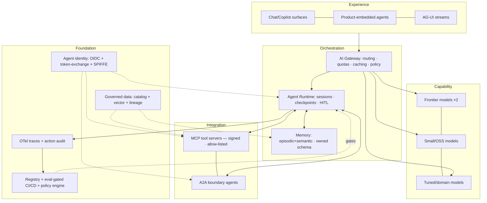

# Enterprise AI Comparative Matrices & Decision Tools 2026

**Audience:** Enterprise architects, CTO/CIO advisors, AI procurement leads, and platform engineering decision-makers.

**Purpose:** Analyst-grade scorecards, decision matrices, technology radar, maturity model, Porter Five Forces, and vendor-neutral reference architecture for positioning enterprise agentic AI platforms and frontier models.

**Score methodology:** 5 = category-defining leadership · 4 = strong, production-proven · 3 = credible, gaps · 2 = emerging/partial · 1 = absent/immature. Scores are analyst judgment (early 2026); verify against current vendor documentation before procurement decisions.

**Related:** [Enterprise Multi-Model AI Strategy](enterprise-multi-model-ai-strategy.md) | [Agent Framework Comparison](../../workflow-orchestration/08-agent-frameworks-comparison.md) | [Commercial Analysis & Token Economics](../../ai-economics/enterprise-ai-commercial-analysis-2026.md) | [Agentic AI Outlook 2026–2030](../../ai-foundations/enterprise-agentic-ai-outlook-2026-2030.md)

---

## Table of Contents

1. [Hyperscaler Agent-Platform Scorecard](#1-hyperscaler-agent-platform-scorecard)
2. [Frontier-Model Provider Decision Matrix](#2-frontier-model-provider-decision-matrix)
3. [Agent-Framework Technology Radar](#3-agent-framework-technology-radar)
4. [Enterprise Agentic-AI Maturity Model](#4-enterprise-agentic-ai-maturity-model)
5. [Porter Five Forces — Enterprise Agent-Platform Market](#5-porter-five-forces)
6. [Consolidated SWOT One-Liners](#6-consolidated-swot-one-liners)
7. [Target-State Reference Architecture](#7-target-state-reference-architecture)
8. [Migration Decision Tree](#8-migration-decision-tree)

---

## 1. Hyperscaler Agent-Platform Scorecard

| Dimension | AWS | Microsoft | Google |
|---|---|---|---|
| Managed agent runtime | 4.5 (AgentCore) | 4 (Foundry Agent Svc) | 4 (Agent Engine) |
| Isolation architecture | **5** (Firecracker microVM/session) | 4 (Hyper-V sandboxes) | 4.5 (gVisor lineage) |
| Session & memory services | 4.5 | 4 | 4.5 (Memory Bank) |
| Agent identity | 4 (AgentCore Identity + Cedar) | **5** (Entra Agent ID) | 4 (WIF patterns) |
| MCP support | **5** | 4.5 | 4.5 |
| A2A support | 4 | 3.5 | **5** (originator) |
| Model breadth / neutrality | **5** | 4.5 | 4.5 |
| First-party frontier model | 3 (Nova) | 3.5 (MAI + OpenAI access) | **5** (Gemini) |
| Data-platform integration | 4 | 4.5 (Fabric/Graph) | **5** (BigQuery) |
| Business-user agent building | 3 | **5** (Copilot Studio) | 4 (Gemini Ent./Agentspace) |
| DevEx (IDE/CLI agents) | 4 (Kiro/Q) | 4.5 (GitHub) | 4 (Gemini Code Assist/CLI) |
| Observability (OTel GenAI) | 4.5 | 4 | 4.5 |
| Guardrails / policy plane | 4.5 (Guardrails + Cedar) | 4.5 (Content Safety + Purview) | 4.5 (Model Armor + VPC-SC) |
| Sovereign / residency | 4 | 4.5 (EU Data Boundary) | 4.5 |
| Cost structure / silicon | 4 (Trainium) | 3.5 | **5** (TPU) |
| Ecosystem / marketplace | 4.5 | 4.5 | 4 |
| **Unweighted mean** | **4.28** | **4.22** | **4.47** |

**Selection heuristic:**
- **Microsoft** when M365/Entra gravity dominates — identity, directory, and business-user adoption are the bottleneck.
- **Google** when data-platform economics and open interop dominate — BigQuery/Vertex co-location and A2A originator advantage.
- **AWS** when runtime primitives, model neutrality, and isolation economics dominate — Firecracker microVM isolation is the clearest differentiation for untrusted-code workloads.

> Differences are **lane differences**, not quality gaps. Multi-cloud deployments often pick the runtime that co-locates with the dominant data gravity and use the other two for model access via API.

---

## 2. Frontier-Model Provider Decision Matrix

Weights apply to the weighted score column.

| Criterion (weight) | OpenAI | Anthropic | Google | Meta / Llama | Mistral | Cohere |
|---|---|---|---|---|---|---|
| Agentic task reliability (20%) | 4.5 | **5** | 4 | 3 | 3 | 3 |
| Reasoning frontier (15%) | **5** | **5** | **5** | 3.5 | 3 | 2.5 |
| Enterprise trust / safety posture (15%) | 3.5 | **5** | 4 | 2.5 | 4 | 4.5 |
| Deployment flexibility — VPC/on-prem (15%) | 3 | 3.5 (Bedrock/Vertex) | 3.5 | **5** | 4.5 | **5** |
| Ecosystem / tooling gravity (10%) | 4.5 | 4.5 (MCP/Claude Code) | 4 | 4 | 3 | 2.5 |
| Cost efficiency at tier (10%) | 3.5 | 3.5 | 4 | **5** | 4 | 3.5 |
| Multi-cloud availability (10%) | 3 | **5** | 2.5 | **5** | 4 | 4 |
| Roadmap durability (5%) | 4.5 | 4.5 | **5** | 4 | 3.5 | 3 |
| **Weighted score** | **4.0** | **4.5** | **4.0** | **3.8** | **3.7** | **3.7** |

**Procurement read:**
- **Anthropic** leads on agentic reliability and enterprise trust; MCP + Claude Code create a cohesive tooling ecosystem.
- **OpenAI** leads on ecosystem breadth and developer mindshare; weakest on deployment flexibility.
- **Google** leads on integrated data + model economics when the data gravity is Vertex/BigQuery.
- **Meta/Llama** is the deployment-flexibility play — sovereign/air-gapped/on-prem requirements and cost floor.
- **Cohere & Mistral** serve regulated-industry on-prem with strong data-residency posture.

Run **two frontier providers** in production (not one). Single-model dependency on agentic task reliability is a strategic liability given the pace of capability change.

---

## 3. Agent-Framework Technology Radar

### Adopt
Production-ready, strong enterprise track record. Low-regret investments in 2026.

| Item | Rationale |
|---|---|
| **LangGraph** | Portable graph-based agent state machine; cross-runtime; owned memory schema pattern |
| **MCP** | Tool-server protocol becoming infrastructure-layer primitive; sign and allow-list servers |
| **Claude Code** | Best-in-class agentic coding; SDLC automation; strong HITL patterns |
| **OTel GenAI conventions** | Observability standard; instrument before agent fleet scales — retrofitting is expensive |
| **DSPy** | Prompt optimisation pipelines; compiles prompts for quality + cost instead of manual tuning |

### Trial
Evaluate with a real workload in 2026; production-grade by 2027 expected.

- Microsoft Agent Framework (MAF) — strong for Entra-anchored enterprises
- Google ADK + Agent Engine — strong for Vertex/BigQuery-anchored shops
- AWS AgentCore — runtime-primitives leader; microVM isolation differentiator
- CrewAI Flows — structured multi-agent coordination; evaluate against LangGraph for your use case
- PydanticAI — type-safe, testable Python agents; strong DevEx
- Mastra — TypeScript shops building agentic workflows
- A2A protocol — cross-vendor agent-to-agent communication; watch for identity + payment extensions
- OpenHands — sandboxed autonomous coding agents; evaluate governance model carefully

### Assess
Directionally important; not yet enterprise-production-ready. Monitor in 2026.

- **AG-UI** — streaming agent-UI protocol; strong concept, spec stabilising
- **Agent-payment protocols** (AP2/ACP-class) — buyer-agent ↔ seller-agent commerce; early but high-impact
- **BeeAI** — multi-agent framework from IBM; watch governance story
- **Cedar for agent authz** — policy-as-code for agent action authorisation; compelling but adoption early
- **Confidential inference** — TEE-based model serving for highest-sensitivity regulated workloads

### Hold
Do not introduce in new greenfield projects; plan migration for existing uses.

- Unpinned community MCP servers in production — supply-chain risk until signing + provenance story matures
- Planner-style legacy Semantic Kernel (SK) planners — superseded by graph-based approaches
- Monolithic single-prompt "god agents" — brittleness, cost, and debuggability failure mode
- Seat-priced agent SKUs without usage terms — misaligned incentives; demand consumption or outcome pricing

---

## 4. Enterprise Agentic-AI Maturity Model

| Level | Name | Markers | Typical Failure Mode |
|---|---|---|---|
| 1 | Assisted | Chat/copilots, no tooling governance | Shadow AI sprawl |
| 2 | Instrumented | Gateway, logging, model registry, eval sets exist | Evals decorative, not gating deployments |
| 3 | Orchestrated | Production agents with tools, HITL tiers, cost tagging | Memory and identity ad hoc |
| 4 | Governed Fleet | Agent registry, identities, policy plane, outcome metrics | Cross-vendor agents ungoverned |
| 5 | Agentic Operations | Agents as managed workforce: budgets, SLAs, A2A across org boundary | Over-autonomy without audit parity |

> Most Global-2000 firms sit at levels 2–3 entering 2026. **Procurement should target level-4 capabilities** in platform selection even when currently operating at level 2 — the cost of retrofitting identity and policy onto a scaled agent fleet is 3–5× the cost of building it in.

**Level transition checkpoints:**

- **L2 → L3:** Does every production agent call pass through a gateway? Are eval sets reviewed and must-pass before deployment merge?
- **L3 → L4:** Does every production agent have a registered identity with a SPIFFE/OIDC token? Are policy decisions logged with agent ID + action + outcome?
- **L4 → L5:** Can agents from different vendor runtimes exchange tasks via A2A? Are agent-budget overruns automatically throttled without human intervention?

---

## 5. Porter Five Forces

### Enterprise Agent-Platform Market

| Force | Intensity | Driver |
|---|---|---|
| Rivalry | **Very High** | Hyperscalers + ISVs + labs converging on same runtime layer simultaneously |
| New entrants | **Medium-low (platforms) / High (agents-as-apps)** | Capital + trust barriers at platform tier; near-zero entry cost at app tier |
| Substitutes | **Medium** | DIY on K8s + OSS is viable for engineering-led organisations with >50 ML engineers |
| Supplier power | **High** | NVIDIA + power + HBM chain; frontier-model oligopoly for top-tier agentic capability |
| Buyer power | **Rising** | Multi-model gateways + open weights = credible switching threat; materialises only with gateway discipline |

**Architect implication:** Supplier power (silicon + frontier models) is the structural risk to hedge with multi-model strategy and open-format data posture. Buyer power is rising but unevenly distributed — enterprises with a working AI gateway have genuine leverage; those with deep single-vendor SDK coupling do not. Build the gateway before scale.

---

## 6. Consolidated SWOT One-Liners

Portfolio-level view across the principal vendors in the enterprise agentic AI market.

| Org | Strengths | Weaknesses | Opportunities | Threats |
|---|---|---|---|---|
| OpenAI | Distribution + frontier model leadership | Burn rate / governance optics | Agent commerce at scale | Commoditisation of base models |
| Anthropic | Agentic reliability + enterprise trust + MCP ecosystem | Limited consumer-scale distribution | Regulated-industry anchor accounts | Hyperscaler self-preference (Bedrock/Vertex) |
| Google | Deep integration + TPU silicon economics | Enterprise GTM execution | A2A protocol standardhood | Antitrust scrutiny |
| Microsoft | Distribution at scale + Entra identity | SKU sprawl / complexity | Enterprise agent directory win | OpenAI partnership evolution |
| AWS | Runtime primitives + microVM isolation | DevEx fragmentation across services | Default agent runtime for neutrality buyers | Up-stack rivals (Salesforce, ServiceNow) |
| NVIDIA | CUDA ecosystem + systems-level position | Customer custom-ASIC programs | Inference OS layer (Dynamo/vLLM) | Accelerating margin compression |
| Salesforce | CRM gravity + consumption-pricing courage | Raw model quality bar | Digital-labor category ownership | Seat cannibalisation by agents |
| ServiceNow | Workflow substrate depth | Price perception | Agent control tower positioning | Platform overreach perception |
| Accenture | Global scale + hyperscaler alliances | Hours-leverage model under pressure | Reinvention IP / outcome models | Insourcing + Fixed-Delivery-Engine pressure |
| Databricks | Data + governance depth | Model tier credibility | Agent-on-lakehouse pattern | Snowflake + Microsoft Fabric convergence |

---

## 7. Target-State Reference Architecture

Vendor-neutral architecture for a governed agentic AI platform at level 4 maturity.



**Layer design notes:**

| Layer | Key Decision | Lock-in Risk |
|---|---|---|
| Experience | Decouple via AG-UI streams; enables runtime swap without UX rewrite | Low if decoupled |
| Orchestration | Own agent logic in portable framework (LangGraph/ADK/MAF); treat managed runtime as deploy target | **High** — session/memory/identity semantics are proprietary |
| Capability | Always run ≥2 frontier providers; small/OSS models for cost routing | Medium — migrates with eval-driven re-tuning |
| Integration | Sign and allow-list all MCP servers; use A2A for cross-org agent calls | Low if using open standards |
| Foundation | Build before scale; identity + eval-gating are the hardest to retrofit | **Very High** — directory and data-platform gravity |

---

## 8. Migration Decision Tree

Condensed workload-placement and migration guide.

```
1. WORKLOAD CLASS?
   ├─ Interactive copilot (latency-sensitive, user-facing)
   │   → gateway + model tier only; skip managed runtime complexity
   └─ Long-running agent (multi-step, tool-calling, persistent state)
       → proceed to step 2

2. IDENTITY GRAVITY?
   ├─ Entra-centric (M365 / Azure dominant)
   │   → Azure Foundry Agent Service as default runtime
   │   → Entra Agent ID for agent identity
   └─ Multi-cloud / vendor-neutral
       → proceed to step 3

3. DATA GRAVITY?
   ├─ BigQuery / Vertex dominant → co-locate agents with Google data plane
   ├─ Snowflake / Databricks dominant → agnostic runtime; partner integration
   └─ AWS / S3-native → AWS AgentCore as default runtime

4. ISOLATION REQUIREMENT?
   ├─ Untrusted code execution / web browsing at scale
   │   → microVM / gVisor-class runtime MANDATORY
   │   → AgentCore (Firecracker) · Agent Sandbox · Hyper-V sessions
   │   → NEVER bare containers for untrusted agent workloads
   └─ Trusted internal tools only
       → standard container runtime acceptable for L3 maturity

5. PORTABILITY PRIORITY HIGH?
   ├─ Yes (multi-cloud roadmap, M&A risk, regulatory portability)
   │   → Author in LangGraph / ADK / MAF
   │   → Own memory schema (export + migrate independently)
   │   → Treat runtime as deploy target, not programming model
   └─ No (single-cloud committed, PoC / prototype scope)
       → vendor-native SDK acceptable; revisit at production scale

6. REGULATED WORKLOAD (EU AI Act / high-risk / financial)?
   → Add before scale-out (not after):
     · Data residency controls (EU Data Boundary / VPC-SC / Bedrock regions)
     · ISO 42001-mapped agent registry + eval gates
     · Deployer-duty tooling from vendor
     · Published DPIA template from vendor
     · Prefer vendors with deployer-model assurance documentation
```

---

*Scores are analyst judgment (early 2026). Verify against current vendor documentation and pricing pages before procurement. Companion reading: [Commercial Analysis](../../ai-economics/enterprise-ai-commercial-analysis-2026.md) · [Future Outlook 2026–2030](../../ai-foundations/enterprise-agentic-ai-outlook-2026-2030.md)*
