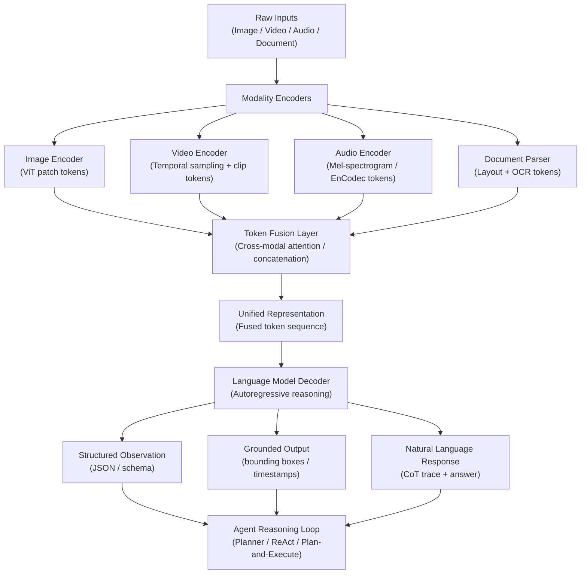

# Part 1 — Foundations of Multimodal AI

A rigorous grounding in the architectural principles, tokenization strategies, and model taxonomy that underpin enterprise-grade multimodal AI systems.

> **Audience:** Principal AI Architects, AI Platform Engineers, ML Engineers
> **Coverage:** VLMs · ALMs · Tokenization · Fusion Strategies · Model Comparison · Agentic Perception

---

## 1. Evolution from Unimodal to Multimodal

The history of deep learning for AI is largely a history of specialization. Convolutional Neural Networks (CNNs) dominated image recognition. Recurrent architectures and later Transformers defined the text domain. Mel-filterbank features and CTC losses governed automatic speech recognition. Each domain evolved its own pre-training objectives, evaluation benchmarks, and deployment toolchains — and cross-modal reasoning required hand-coded orchestration layers that glued together separately trained models.

The inflection point arrived around 2021 with CLIP (Contrastive Language-Image Pre-training) and the emergence of large-scale vision-language datasets. CLIP demonstrated that a shared embedding space learned from 400 million image-text pairs could produce image representations useful for zero-shot classification across hundreds of downstream tasks — without task-specific training. The key insight was not architectural novelty but *scale combined with natural supervision*: the captions accompanying images on the internet are imperfect but extraordinarily diverse, providing signal that narrow supervised datasets never could.

For agentic systems, multimodality matters for a reason that goes beyond benchmark performance: the real world is multimodal. A contract dispute involves a PDF, email threads, and a recorded call. A manufacturing defect is visible in an image but also correlates with sensor time-series data. A healthcare appointment generates typed notes, DICOM scans, and dictated audio. An agent that can perceive only text must rely on upstream preprocessing pipelines that are themselves lossy and brittle — a PDF-to-text converter that drops tables, an ASR model that mishears a drug name. Multimodal models that ingest raw signals directly eliminate these error-compounding preprocessing hops and enable richer joint reasoning.

---

## 2. Taxonomy of Multimodal Models

### Vision-Language Models (VLMs)

VLMs combine an image encoder (typically a Vision Transformer, ViT) with a language model decoder. Images are converted to a sequence of visual tokens that are concatenated or cross-attended with text tokens. The resulting architecture enables tasks like visual question answering (VQA), image captioning, optical character recognition in context, diagram understanding, and visual grounding (localizing an object described in natural language).

Representative models: GPT-4o (vision), Gemini 1.5 Pro, Claude 3.5/3.7 Sonnet, Llama 3.2 Vision, Qwen2-VL, InternVL2, Pixtral Large.

### Audio Language Models (ALMs)

ALMs extend the language model with an audio encoder capable of processing raw waveforms or mel-spectrograms. They handle tasks including automatic speech recognition (ASR), audio question answering, music understanding, environmental sound classification, and audio captioning. Some ALMs (e.g., Gemini 2.0 Flash) process audio natively in a single forward pass alongside text; others rely on an intermediate ASR step.

Representative models: Gemini 2.0 Flash (native audio), GPT-4o audio preview, SeamlessM4T (Meta, multilingual speech translation).

### Speech Language Models (SLMs)

SLMs focus specifically on the speech modality with objectives beyond transcription — capturing prosody, emotion, speaker identity, and linguistic structure directly from the waveform without intermediate text. They differ from ALMs in that the primary output may itself be speech (text-to-speech synthesis or voice conversion) rather than text. Key use cases include voice agents, live translation, and accessibility tools.

Representative models: Whisper (OpenAI, ASR-focused), Parler-TTS, Kokoro, CSM (Sesame).

### Video Foundation Models

Video models extend image understanding with temporal reasoning. Processing video naively at full frame rate is computationally prohibitive; these models employ keyframe sampling, clip-level encoding, or hierarchical temporal attention to handle multi-minute or multi-hour inputs. Tasks include video QA, action recognition, temporal event localization, and surveillance anomaly detection.

Representative models: Video-LLaMA, InternVideo2, TimeChat, Gemini 1.5 Pro (up to 1 hour of video), GPT-4o (short clips).

### World Models and Embodied AI

World models predict the future state of an environment given observations and actions — a capability essential for robot planning and simulation-based reasoning. They bridge computer vision, physics simulation, and language reasoning. While not yet production-ready for most enterprise use cases, they are the precursor to fully autonomous embodied agents.

Representative models: Genie 2 (Google DeepMind), GROOT (NVIDIA Isaac), UniSim.

### Omni-Modal Models

Omni-modal models are designed from the ground up to handle any combination of text, image, audio, and video in a single unified architecture, with no modality-specific preprocessing required at the API level. They represent the current frontier of foundation model development.

Representative models: GPT-4o (text + image + audio, with video preview), Gemini 2.0 Flash (text + image + audio + video in a single call), Project Astra (Google, research preview).

---

## 3. Tokenization Across Modalities

### Image Tokens: Patch-Based ViT

The dominant image tokenization strategy divides an image into fixed-size non-overlapping patches (typically 14×14 or 16×16 pixels), projects each patch into an embedding vector via a linear layer, and prepends a learnable `[CLS]` token. For a 224×224 image with 16×16 patches, this yields 196 patch tokens. In VLMs these patch tokens are fed into a language model alongside text tokens.

Dynamic resolution handling is a key enterprise concern: real-world documents arrive at inconsistent resolutions and aspect ratios. Models like InternVL2 and Qwen2-VL use dynamic patching strategies that adapt the number of tokens to image complexity, capping total tokens while preserving detail for high-information regions (e.g., dense text in a scanned document). Pixel shuffling, used in models like MiniCPM-V, compresses spatial information before projection to reduce token count while retaining fine-grained detail.

### Video Tokens: Temporal Sampling

A 60-second video at 24 fps contains 1,440 frames. Encoding every frame as a full set of image tokens is infeasible within any current context window. Enterprise video models address this through:

- *Uniform keyframe sampling*: extract N frames at regular intervals (e.g., 1 frame/second for 60 frames from a 60-second clip).
- *Scene-change-based sampling*: extract frames only at visual discontinuities detected by a lightweight frame-difference algorithm.
- *Hierarchical clip encoding*: encode short clips (2–4 seconds) as a single feature vector using a video backbone (e.g., VideoMAE), then reason over clip vectors in the language model.
- *Temporal embeddings*: inject a timestamp embedding alongside each frame token so the model learns temporal position.

Gemini 1.5 Pro's 1M-token context window is the current practical ceiling for long-video reasoning, enabling ingestion of approximately 1 hour of video at reasonable sampling rates.

### Audio Tokens: Mel-Spectrogram and Neural Codecs

Audio waveforms are typically converted to mel-spectrograms (a 2D time-frequency representation) before tokenization. Whisper encodes 30-second mel-spectrogram windows through a CNN + Transformer encoder and decodes to text autoregressively. For native audio in language models, neural audio codecs (e.g., EnCodec, SoundStream) discretize the waveform into codebook tokens at multiple bitrates, enabling the language model to process audio tokens directly in its vocabulary.

SeamlessM4T uses a hierarchical approach with a shared speech-text encoder trained on massively multilingual data, enabling cross-lingual speech translation without intermediate ASR.

### Temporal and Spatial Embeddings

Cross-modal temporal alignment is critical for tasks that interleave audio and video (e.g., detecting when a speaker's words match an action in a surveillance feed). Spatial embeddings (absolute position within an image region) enable fine-grained grounding — the ability to point to a specific pixel region corresponding to a concept. Models like Kosmos-2 and Grounding DINO produce explicit bounding box predictions aligned with text, enabling spatial grounding.

---

## 4. Unified Embedding Spaces and Semantic Alignment

### CLIP-Style Contrastive Learning

CLIP trains dual encoders — one for images, one for text — to maximize the cosine similarity between matched image-text pairs and minimize it for unmatched pairs, using a symmetric cross-entropy (InfoNCE) loss over a batch of N pairs (N² total combinations). The result is a shared latent space where semantically similar images and texts cluster together regardless of modality.

This embedding space enables zero-shot image classification by encoding candidate class labels as text and finding the nearest label to a query image embedding. It also underpins multimodal retrieval: given a text query, retrieve the most similar images from a vector store of CLIP image embeddings.

### Cross-Modal Attention Mechanisms

In decoder-only VLMs (e.g., LLaVA architecture family), visual tokens are simply prepended to the text token sequence and processed by the standard causal transformer. Cross-modal attention is implicit — the attention mechanism attends to visual tokens just as it would to any other context token.

In encoder-decoder architectures (e.g., Flamingo, BLIP-2), cross-attention layers are inserted at specific layers of the language model decoder and attend to frozen visual encoder outputs. This allows the visual encoder to remain frozen while only the cross-attention projections are fine-tuned, reducing training cost significantly.

### Fusion Strategies: Early, Late, and Hybrid

- *Early fusion*: raw modality signals are combined before the main model, creating a single unified representation. Used in pixel-level video-audio fusion. Requires re-training from scratch across modalities.
- *Late fusion*: separate modality-specific models produce independent predictions that are combined by a lightweight aggregation layer. Easy to deploy and update independently; weaker at capturing cross-modal dependencies.
- *Hybrid fusion*: modality-specific encoders produce intermediate representations that are fused through cross-attention at multiple depths of the main model. This is the dominant architecture in state-of-the-art VLMs (Gemini, GPT-4o, InternVL2).

### Semantic Alignment Challenges

Semantic alignment fails in several important enterprise scenarios. Training data distribution mismatch is the most common: CLIP embeddings trained on web images perform poorly on medical imaging, satellite imagery, or scanned historical documents because the pretraining corpus underrepresents these domains. Fine-grained discrimination is another failure mode — CLIP can distinguish "cat" from "dog" but struggles to distinguish "benign lesion" from "early-stage melanoma." Compositional reasoning (e.g., "the red car to the left of the blue truck") also degrades relative to text-only models because the contrastive objective does not supervise attribute binding.

---

## 5. Model Comparison

The table below covers the major multimodal models relevant to enterprise deployments as of July 2026.

| Model | Provider | Modalities | Context Window | Key Strengths | Enterprise Readiness | License |
|-------|----------|-----------|---------------|--------------|---------------------|---------|
| GPT-4o | OpenAI | Text, Image, Audio, Video (preview) | 128K tokens | Omni-modal, strong reasoning, widest API ecosystem | High — SOC 2, HIPAA via Azure | Proprietary |
| Gemini 2.0 Flash | Google | Text, Image, Audio, Video | 1M tokens | Long-context video/audio, real-time streaming, cost-efficient | High — HIPAA, FedRAMP (Vertex AI) | Proprietary |
| Gemini 1.5 Pro | Google | Text, Image, Audio, Video | 2M tokens | 2M context, deep video analysis, multilingual | High — Vertex AI enterprise controls | Proprietary |
| Claude 3.7 Sonnet | Anthropic | Text, Image | 200K tokens | Strong document/code reasoning, constitutional safety | High — SOC 2 Type II, HIPAA | Proprietary |
| Claude 3.5 Sonnet | Anthropic | Text, Image | 200K tokens | Document intelligence, instruction following | High | Proprietary |
| Llama 3.2 Vision (11B/90B) | Meta | Text, Image | 128K tokens | Open weights, on-premise deployment, strong OCR | Medium — self-hosted risk management needed | Llama 3.2 Community |
| Qwen2-VL (7B/72B) | Alibaba/Qwen | Text, Image, Video | 128K tokens | Strong multilingual, document understanding, open weights | Medium — self-hosted | Apache 2.0 |
| Pixtral Large (124B) | Mistral | Text, Image | 128K tokens | Strong image reasoning, open weights, EU-origin | Medium — GDPR-friendly origin | Mistral Research |
| InternVL2 (8B/26B/76B) | Shanghai AI Lab | Text, Image | 32K tokens | Strong benchmarks, efficient, OCR-focused | Medium — self-hosted | MIT |
| Florence-2 | Microsoft | Text, Image | — | Specialized computer vision tasks (OCR, grounding, detection) | High — Azure integrated | MIT |
| Phi-3.5 Vision | Microsoft | Text, Image | 128K tokens | Lightweight (4.2B), on-device capable, strong OCR | High — Azure enterprise | MIT |
| Kosmos-2 | Microsoft | Text, Image | — | Explicit spatial grounding with bounding boxes | Medium — research-oriented | MIT |
| Molmo | Allen AI | Text, Image | — | Pointing and grounding, open-source | Low — research preview | Apache 2.0 |
| Janus | DeepSeek | Text, Image | — | Unified understanding + generation | Low — research preview | MIT |
| DeepSeek VL2 | DeepSeek | Text, Image | 4K tokens | Strong Chinese-language doc understanding | Low — geopolitical risk considerations | MIT |
| MiniCPM-V (8B) | Tsinghua/ModelBest | Text, Image | 32K tokens | On-device, efficient pixel shuffling, strong OCR | Low — edge/mobile | Apache 2.0 |
| Whisper (large-v3) | OpenAI | Audio (ASR) | 30s window | Near-human ASR, 99 languages, robust to noise | High — open weights, self-hostable | MIT |
| SeamlessM4T v2 | Meta | Speech+Text (translation) | — | 100+ languages, speech-to-speech, open weights | Medium — self-hosted | CC BY-NC 4.0 |
| Video-LLaMA (v2) | DAMO Academy | Text, Image, Video, Audio | — | Joint video+audio reasoning, open weights | Low — research-grade | Apache 2.0 |
| InternVideo2 | Shanghai AI Lab | Text, Video | — | Strong video QA, temporal localization | Low — research-grade | MIT |

---

## 6. Agentic Perception and Reasoning

### Multimodal Inputs in Agent Reasoning Loops

In an agentic context, multimodal inputs are not endpoints — they are inputs to a perception layer that must produce structured observations the agent's reasoning loop can act upon. A raw image is not directly useful to a ReAct-style planner; a structured observation like `{"detected_objects": ["invoice", "signature", "table"], "ocr_text": "...", "table_data": [...]}` is.

This creates a two-stage perception pipeline: (1) a VLM inference call that converts raw visual input to a rich structured observation, and (2) an observation schema that the reasoning layer expects. The schema acts as a contract between perception and reasoning — changes to it require coordinated updates on both sides.

### Grounding: Spatial, Temporal, and Cross-Modal

*Spatial grounding* links a natural language reference ("the red clause in section 4") to a specific region in an image or document page. This is essential for document agents that must cite the exact location of extracted information. Grounding DINO and Florence-2 provide zero-shot spatial grounding; fine-tuned VLMs can do this with bounding box prediction heads.

*Temporal grounding* links a reference ("the moment the machine arm overextends") to a specific timestamp in a video. This requires the model to align its understanding of the language description with its temporal encoding of the video. Models like TimeChat and Gemini 1.5 Pro support temporal localization queries.

*Cross-modal grounding* links references across modalities — "the item mentioned in the audio at 2:34 that also appears in the accompanying invoice image." This is the hardest grounding problem and remains largely in the research domain as of mid-2026, though Gemini 2.0's unified audio-video-text processing begins to address it.

### Multimodal Chain-of-Thought

Multimodal chain-of-thought (CoT) extends text CoT prompting to include visual reasoning steps: "First, I observe that the image shows [X]. The relevant region in the upper-left quadrant indicates [Y]. Cross-referencing the text description, I conclude [Z]." Eliciting this behavior requires careful prompt engineering — models prompted only for a final answer tend to skip visual reasoning steps. Enterprise agents benefit from requiring explicit visual reasoning traces for audit purposes, as these traces double as explainability artifacts.

### Multimodal Architecture Diagram

---

## Interview Use Cases

### Q1: How would you explain the difference between a native multimodal model and a composed pipeline to a CTO?

A composed pipeline strings together specialist models: a PDF parser extracts text, an OCR model reads printed text from images, an ASR model transcribes audio, and a language model reasons over the combined text output. Each handoff is a lossy transformation — the PDF parser may drop table structure, the OCR model may misread low-resolution text, the ASR model may mishear domain-specific terminology. Errors compound, and the pipeline has no mechanism for the reasoning layer to ask the perception layer for clarification.

A native multimodal model ingests raw signals — the PDF, the image, the audio waveform — and performs joint reasoning over all modalities simultaneously in a single forward pass. There are no intermediate text representations for errors to accumulate in. The model can attend to the image while generating a text response, catching inconsistencies between what the document says and what the image shows. The tradeoff is cost (native multimodal inference is more expensive per call) and latency (larger models, longer context). For a CTO, the key message is: native multimodal is architecturally simpler, more accurate for cross-modal reasoning tasks, and more auditable because the reasoning trace is unified — but it costs more and requires more sophisticated evaluation.

### Q2: What are the grounding challenges when an agent needs to reason about a 2-hour video?

A 2-hour video at 24 fps contains 172,800 frames. Even at aggressive sampling (1 frame per second), that is 7,200 frames × ~196 tokens/frame = approximately 1.4 million visual tokens, exceeding even Gemini 1.5 Pro's 2M context limit when combined with text. The practical challenges are: (1) *Temporal localization*: finding the relevant segments in a 2-hour video requires either uniform sampling (which may miss brief but critical events) or a retrieval step that first identifies relevant time windows using lightweight scene-change or motion detection. (2) *Temporal drift*: models lose coherent reasoning over very long sequences; a reference to "the earlier action" 90 minutes into a video may fail to correctly resolve if the relevant frame was compressed out of context. (3) *Cross-segment reasoning*: a question like "did the machine state at 0:45 cause the failure at 1:52:10?" requires correlating widely separated segments. Current architectural mitigations include hierarchical encoding (encode each 5-minute clip to a summary embedding, then reason over summaries), temporal memory (maintain a structured log of events extracted from each clip), and query-guided retrieval (use the user's question to identify the most relevant clip segments before full-model inference).

### Q3: How does CLIP-style semantic alignment work and when does it fail?

CLIP trains two encoders (one image, one text) jointly with a contrastive objective. Given a batch of N image-text pairs, the loss maximizes cosine similarity for the N matched pairs and minimizes it for the N²-N unmatched pairs. The result is a shared embedding space where images and their descriptions cluster together. At inference, any image can be compared to any text description without task-specific training — enabling zero-shot classification, cross-modal retrieval, and embedding-based reranking.

It fails in three main scenarios: (1) *Distribution shift*: CLIP trained on web images produces poor embeddings for medical imaging, satellite imagery, or historical documents because these domains are underrepresented in its 400M pretraining pairs. The fix is domain-specific fine-tuning or using a domain-adapted CLIP variant. (2) *Fine-grained discrimination*: CLIP distinguishes coarse categories well but struggles with fine-grained differences (e.g., two similar lesion types, two similar material defects) because the pretraining captions don't provide attribute-level supervision for these distinctions. (3) *Compositional and relational reasoning*: CLIP embeddings encode a "bag of concepts" without preserving spatial or relational structure. A text description "red car to the left of a blue truck" may be indistinguishable from "blue car to the left of a red truck" in embedding space because neither the image nor text encoder explicitly models spatial relations.

### Q4: Design a tokenization strategy for processing 100-page PDFs with mixed text, charts, and images

A 100-page PDF with mixed content requires a multi-stage tokenization strategy that respects the token budget of the target model (typically 128K–200K tokens):

Stage 1 — *Layout extraction*: Use a layout parser (e.g., Docling, LayoutLMv3, or Azure Document Intelligence) to segment each page into regions: text blocks, tables, figures, and headers. Extract reading order and spatial coordinates for each region.

Stage 2 — *Region-level tokenization*: For text regions, tokenize directly using the language model tokenizer (approximately 750 tokens per page of dense text). For table regions, render as markdown or structured HTML — do not flatten to plain text, which destroys relational structure. For figures and charts, encode as image tokens using dynamic patching (e.g., 256–512 tokens per chart image depending on complexity).

Stage 3 — *Token budget allocation*: For a 100-page document at ~750 text tokens/page + ~300 image tokens/page for charts, the raw token count is approximately 105,000 tokens — close to the limit. Apply hierarchical summarization for text-heavy sections where full detail is not required, and apply selective image encoding (only encode charts that are referenced or contain quantitative data).

Stage 4 — *Cross-reference preservation*: Inject page number and region position metadata as special tokens or prefix strings so the model can cite specific locations in its output (enabling spatial grounding for downstream citation and audit).

### Q5: When would you choose Qwen2-VL over GPT-4o for an enterprise document processing use case?

Qwen2-VL under an Apache 2.0 license is self-hostable, meaning data never leaves your infrastructure — critical for GDPR Article 46 data residency requirements or classified government environments. Its document understanding benchmarks (DocVQA, ChartQA) are competitive with GPT-4o at the 72B parameter scale. For high-volume batch processing (e.g., 500,000 invoices per month), the per-token cost of a self-hosted Qwen2-VL deployment on A100 GPUs is substantially lower than GPT-4o API pricing. The tradeoffs are operational: you own the inference infrastructure, the model update cadence, the safety tuning, and the hallucination mitigation. GPT-4o remains the better default for organizations without ML platform capability or for use cases requiring real-time streaming, native audio, or the highest quality on novel visual reasoning tasks.

---

## Related

- [Part 2 — Enterprise Architecture](./part-02-enterprise-architecture.md) — how multimodal models slot into four-layer agent architectures
- [Part 5 — Multimodal RAG](./part-05-multimodal-rag.md) — embedding strategies and cross-modal retrieval built on CLIP and VLM encoders
- [Part 7 — Security & Threat Taxonomy](./part-07-security-threats.md) — adversarial attacks specific to each modality covered in this part
- [AI Foundations](../ai-foundations/index.md) — foundational transformer and attention architecture background
