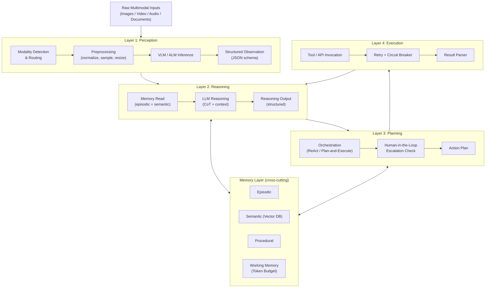
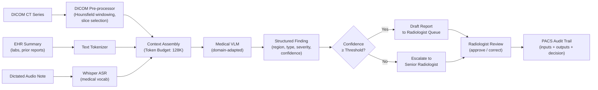

# Part 2 — Enterprise Multimodal Agent Architecture

Reference architectures, agent taxonomies, and design patterns for deploying multimodal AI agents in regulated enterprise environments.

> **Audience:** Enterprise Architects, Principal AI Architects, AI Platform Engineers
> **Coverage:** Four-Layer Model · Agent Taxonomy · Architecture Patterns · Perception Layer Design · Industry Reference Architectures

---

## 1. Reference Architecture Overview

The canonical enterprise multimodal agent architecture is a four-layer model. Each layer has a distinct responsibility boundary and an explicit interface contract with adjacent layers. This separation is essential for regulated industries: each layer can be independently tested, audited, and governed without requiring full end-to-end re-validation when a single component changes.

### The Four-Layer Model

**Layer 1 — Perception**: Ingests raw multimodal signals and converts them to structured observations. Responsibilities include input validation, modality detection, preprocessing (normalization, resizing, sampling), VLM/ALM inference, and output schema enforcement. The perception layer is the only layer that touches raw modality bytes.

**Layer 2 — Reasoning**: Receives structured observations from the perception layer and applies LLM-driven reasoning to interpret them in context. Responsibilities include reading the agent's current memory state, applying contextual knowledge (domain ontologies, retrieved documents), executing chain-of-thought reasoning, and producing a structured reasoning output that drives the planning layer.

**Layer 3 — Planning**: Determines the sequence of actions required to satisfy the agent's goal. This layer implements the orchestration pattern (ReAct, Plan-and-Execute, MCTS-based planning) and manages action selection, tool invocation planning, and human-in-the-loop escalation decisions.

**Layer 4 — Execution**: Invokes tools, APIs, databases, and external services as directed by the planning layer. Responsibilities include tool call formatting, credential injection, retry and circuit-breaker logic, response parsing, and returning results to the reasoning layer for the next iteration.

### Memory Layer

The memory layer is a cross-cutting concern accessed by both reasoning and planning layers:

- *Episodic memory*: a time-stamped log of past observations, reasoning steps, and actions within the current session. Enables the agent to reference "the invoice we saw earlier."
- *Semantic memory*: domain knowledge, ontologies, and factual information stored in a vector database and retrieved by semantic search. Enables the agent to answer "what is the policy for claims over $50,000?" without retraining.
- *Procedural memory*: stored action plans and skill templates that can be retrieved and adapted (e.g., "the KYC verification workflow").
- *Working memory*: the currently active context window, including the assembled prompt, recent observations, and in-flight reasoning. Token budget management is a working memory problem.

### Grounding Layer

The grounding layer translates abstract references in the agent's reasoning output to concrete, verifiable locations in source data. For document agents, this means mapping a claim like "the customer name appears in the header" to a specific bounding box on a specific page. For video agents, it means mapping "the violation occurred" to a specific timestamp. Grounding is the foundation of audit trail generation and explainability.

### Orchestration Layer

The orchestration layer coordinates multiple specialized agents and manages the flow of multimodal data between them. In a multi-agent architecture, the orchestrator routes perception outputs to the appropriate specialist agent (image agent, audio agent, document agent), aggregates their structured outputs, resolves conflicts, and determines whether a human-in-the-loop escalation is required.

---

## Architecture Diagram — Four-Layer Model

---

## 2. Agent Type Taxonomy

### Image Understanding Agents

Image understanding agents process still images — product photos, engineering drawings, satellite imagery, scanned documents — and produce structured outputs. They are the most mature multimodal agent type and exist on a spectrum from general-purpose VLM wrappers to highly specialized models (e.g., a radiology-grade model for chest X-rays). Key design considerations include dynamic resolution handling (high-res product images vs. thumbnail previews), confidence calibration (when to escalate to human review), and output schema stability (the downstream system expects consistent JSON structure regardless of image quality).

### Video Analysis Agents

Video analysis agents handle temporal reasoning tasks: detecting events in surveillance footage, transcribing and summarizing meeting recordings, analyzing manufacturing process videos for anomalies. They face the token budget challenge described in Part 1 and require a temporal sampling strategy selected at design time based on the nature of events to detect (fast events need high sampling rates; slow drifts can tolerate low rates). These agents often combine a lightweight frame-difference detector for event triggering with a full VLM inference only on flagged segments, dramatically reducing cost.

### Audio Intelligence Agents

Audio intelligence agents transcribe, translate, classify, and analyze speech and non-speech audio. In enterprise contexts, the dominant use cases are meeting intelligence (transcription + summarization + action item extraction), call center QA (compliance monitoring, emotion detection, script adherence), and field operations (voice-command interfaces for hands-free environments). They must handle overlapping speakers (diarization), background noise, and domain-specific vocabulary (drug names, financial terms, legal jargon) that generic ASR models mishandle.

### Document Understanding Agents

Document understanding agents process structured and semi-structured documents — contracts, financial statements, regulatory filings, technical manuals. They combine OCR, layout analysis, table extraction, and cross-document reasoning. In regulated industries these agents must produce outputs with source citations (page and region references) to satisfy audit requirements. They are typically the highest-stakes multimodal agent type because errors have direct financial or legal consequences.

### OCR Agents

OCR agents are a specialized subset of document understanding agents focused specifically on optical character recognition — converting printed or handwritten text in images to machine-readable form. Modern OCR agents use neural approaches (LayoutLM, TrOCR) rather than traditional rule-based engines, achieving strong accuracy on low-quality scans and handwritten text. They expose confidence scores per character or word, enabling downstream systems to trigger human review for low-confidence extractions.

### Speech Agents

Speech agents handle real-time speech interaction — voice interfaces, interactive voice response (IVR) systems, live translation, and voice-commanded automation. They differ from audio intelligence agents in their latency requirements (real-time or near-real-time) and their bidirectional nature (they must both understand speech input and generate speech output). Enterprise deployment requires low-latency ASR (Whisper large-v3 or streaming variants), text-to-speech synthesis, and voice activity detection to manage turn-taking in live conversations.

### Surveillance Agents

Surveillance agents monitor video streams from cameras, IoT sensors, and industrial equipment for events requiring action. They operate continuously (24/7) at high throughput, making cost efficiency critical — they cannot afford a full VLM forward pass on every frame. Typical architectures use a lightweight edge model for motion/anomaly detection, triggering a full cloud VLM inference only when an event is detected. Output includes event classification, severity scoring, and alert generation with supporting evidence (the relevant video clip and annotated frame).

### Customer Support Agents (Multimodal)

Customer support agents handle multimodal inputs from customers — photos of damaged products, screenshots of error messages, recorded calls. They integrate with CRM systems, knowledge bases, and ticketing platforms. The multimodal perception layer enables automatic fault classification from a product photo, reducing resolution time compared to text-only description channels. These agents must balance response speed (customer experience) with accuracy (avoiding incorrect diagnosis), making HITL escalation thresholds a critical tuning parameter.

### Manufacturing Inspection Agents

Manufacturing inspection agents perform automated visual quality assurance — detecting surface defects, dimensional deviations, misalignments, and assembly errors on a production line. They operate at high throughput (hundreds of items per minute), require sub-millisecond inference for line-speed inspection, and must achieve near-perfect recall (missed defects have safety and cost implications). These requirements typically necessitate specialized computer vision models (trained on factory-specific defect types) rather than general-purpose VLMs, with VLM inference reserved for ambiguous cases and root-cause analysis.

### Medical Imaging Agents

Medical imaging agents analyze DICOM scans (X-ray, CT, MRI, PET), pathology slides, fundus images, and other clinical imaging modalities. They are the highest-stakes agent type, operating under HIPAA, MDR (EU Medical Device Regulation), and clinical validation requirements. Current VLMs perform at research-grade on general medical imaging questions but require domain-specific fine-tuning and clinical validation before any production deployment. These agents always operate in a human-in-the-loop configuration where the AI output is advisory, not autonomous.

---

## 3. Architecture Patterns

### Centralized Multimodal Agent

A single agent handles all modalities within one inference call. All modality inputs are assembled into a single context and submitted to a large omni-modal model (e.g., Gemini 2.0 Flash).

**Pros**: Simple orchestration; no inter-agent communication overhead; unified reasoning across all modalities; single audit trail.

**Cons**: Token budget exhausted quickly when combining modalities; expensive per call; model must be capable across all required modalities; a failure in one modality pathway blocks the entire request; difficult to update one modality capability independently.

**Best for**: Ad-hoc multimodal reasoning tasks; low-volume, high-value use cases (e.g., executive briefing document analysis); use cases where cross-modal reasoning is the primary value driver.

### Distributed Specialist Agents

Each modality is handled by a dedicated specialist agent. An orchestrator routes incoming inputs to the appropriate specialists and aggregates results.

**Pros**: Each specialist can be optimized independently (best-in-class OCR model, best-in-class ASR model); failures are isolated; specialists can be scaled independently based on workload; easier to validate each specialist independently for compliance.

**Cons**: Inter-agent communication adds latency and complexity; cross-modal reasoning requires explicit fusion logic in the orchestrator; context is fragmented across agent boundaries, making joint reasoning harder.

**Best for**: High-volume production pipelines; regulated environments where each specialist must be independently validated; use cases with well-defined modality boundaries (e.g., an invoice pipeline that always receives a PDF + no audio).

### Multi-Agent Orchestration with Multimodal Routing

A router agent receives the raw multimodal input, classifies modality content, and dynamically selects the appropriate specialist agents. Specialist outputs are returned to a synthesis agent that reasons over the combined structured observations.

**Pros**: Flexible to new modality combinations; enables modality-specific cost optimization (cheap OCR model for text, expensive VLM only for complex charts); synthesis agent produces a unified reasoning trace.

**Cons**: Router adds a classification step (latency + potential misclassification); synthesis agent must handle inconsistent schemas from different specialists; requires sophisticated orchestration framework (LangGraph, Temporal, AWS Step Functions).

**Best for**: Enterprise platforms where the input modality combination varies per request (e.g., a general-purpose document intake platform that receives forms, photos, audio, and PDFs in any combination).

### Event-Driven Multimodal Pipeline

Multimodal inputs arrive asynchronously via an event stream (Kafka, AWS EventBridge, Azure Event Grid). Each event triggers a specialized processor. Results are published back to the event stream for downstream consumption.

**Pros**: Fully decoupled; each processor scales independently; handles high-throughput bursty workloads; naturally supports long-running jobs (e.g., processing a 2-hour meeting recording asynchronously).

**Cons**: No real-time response; cross-modal reasoning requires correlation across multiple events (complex join logic); debugging is harder in distributed asynchronous systems; requires robust dead-letter queue handling.

**Best for**: Batch processing at scale (bulk document ingestion, historical video analysis); surveillance pipelines where events are generated continuously and processed asynchronously; integration with existing enterprise event-driven architectures.

### Pattern Comparison Matrix

| Pattern | Latency | Cost | Cross-Modal Reasoning | Scalability | Ops Complexity | Best Fit |
|---------|---------|------|-----------------------|-------------|---------------|----------|
| Centralized | Low | High | Excellent | Low | Low | Low-volume, high-value |
| Distributed Specialist | Medium | Medium | Poor (requires fusion layer) | High | Medium | High-volume, defined modalities |
| Multi-Agent Orchestration | Medium-High | Medium | Good (synthesis agent) | High | High | Variable modality mix |
| Event-Driven Pipeline | High (async) | Low | Limited (event correlation) | Very High | Very High | Batch, surveillance |

---

## 4. Perception Layer Design

### Input Normalization and Preprocessing

The perception layer is the first point of defense against malformed inputs. Normalization steps include: image resizing to model-expected resolution with aspect-ratio-preserving letterboxing; JPEG/PNG decompression and color space conversion; PDF rendering to page images at controlled DPI (150 DPI for general documents, 300 DPI for fine-print forms); audio resampling to 16 kHz PCM; video frame extraction at configured sampling rate.

Quality gates applied at this stage include: minimum image resolution checks (reject images below 72 DPI); audio duration limits (enforce maximum clip length per inference call); file size limits (prevent OOM from exceptionally large documents); and content-type validation (reject MIME types not in the supported list).

### Modality Detection and Routing

Not all inputs arrive with explicit modality labels. A PDF may contain only text, only scanned images, or a mix. An image attachment to a customer email may be a product photo, a screenshot, or a scanned ID. The perception layer must classify the content of each input and route it to the appropriate processing pipeline.

Routing logic uses a combination of MIME type (fast, unreliable for mislabeled files), file extension (fast, unreliable), embedded metadata (PDF metadata declaring content type), lightweight binary classifiers (is this page text-dominant or image-dominant?), and a modality-detection call to a lightweight model (fast classification without full VLM inference).

### Multi-Modal Context Assembly

Once individual modality inputs have been processed to structured tokens, the perception layer assembles the unified context to be submitted to the reasoning layer. This assembly step determines token ordering (images before or after text?), interleaving strategy (inline images at their natural position in the document vs. appended), and metadata injection (page numbers, timestamps, speaker labels).

The assembled context must fit within the model's context window. When the raw token count exceeds the budget, the perception layer applies a prioritization strategy: full fidelity for explicitly queried regions, summarization or downsampling for background context. This prioritization logic is a critical design decision that directly impacts accuracy — incorrect prioritization is a common source of agent hallucination.

### Token Budget Management

Token budget management is a shared responsibility between the perception layer (which controls image resolution and sampling rate) and the reasoning layer (which controls how much conversational history to include). A useful heuristic for budget allocation:

- Image tokens: 256–512 tokens per chart/diagram; 64–128 tokens per thumbnail; 500–1,500 tokens per high-resolution document page.
- Audio tokens: approximately 1,500 tokens per minute of audio (varies by model).
- Video tokens: 250–500 tokens per sampled frame; budget 5–15 frames per 60-second clip.
- Text tokens: ~750 tokens per page of dense text; ~300 tokens per structured table row.

When the sum exceeds the context window, the perception layer must make a lossy decision. Enterprise implementations log all compression decisions (with the original token counts before compression) as part of the observability trace, enabling post-hoc debugging of reasoning failures caused by context truncation.

---

## 5. Industry Reference Architectures

### Banking: Check Fraud Detection + Document Verification

An incoming check image and the accompanying transaction record trigger a document understanding agent that extracts: routing number, account number, amount (numeric and written), payee name, and signature. A fraud scoring agent cross-references extracted fields against the account's historical transaction patterns and a signature verification model. The orchestrator applies a risk threshold: low-risk checks proceed automatically; high-risk checks are routed to a human reviewer with the agent's reasoning trace and highlighted anomalies.

Key design decisions: the signature verification model is a specialist (not a general VLM) because it requires sub-millimeter fidelity; all extracted fields include confidence scores; the agent never approves a transaction — it scores and routes; audit log includes the VLM inference inputs and outputs for every processed check.

### Healthcare: Medical Imaging Agent with DICOM + EHR + Audio Notes

A radiology agent receives a DICOM chest CT series, the patient's relevant EHR summary (recent labs, prior imaging reports), and a dictated radiology note from the ordering physician. The perception layer converts DICOM slices to normalized image tokens using a medical imaging pre-processor that handles Hounsfield unit windowing. The EHR summary is tokenized as structured text. The audio note is transcribed by Whisper and injected as text.

The reasoning layer applies a medical-domain-adapted VLM to produce a structured radiology finding (anatomical region, finding type, severity, confidence). The agent always outputs with a confidence band and a recommendation for human radiologist review. It never produces a final clinical diagnosis — it produces a draft that the radiologist reviews and either approves or corrects. All inputs and outputs are stored in the PACS (Picture Archiving and Communication System) audit trail.

### Healthcare Medical Imaging Agent Diagram

### Insurance: Claims Processing with Image + Document + Audio

An insurance claims agent processes a multi-channel input bundle: damage photos submitted via mobile app, a scanned claim form (PDF), and a recorded call between the claimant and the call center agent. The perception layer runs in parallel: image agent (damage classification, severity estimation, vehicle make/model identification), document agent (claim form extraction, policy number, coverage details), and audio agent (call transcription, sentiment analysis, key claim facts extraction).

The orchestrator synthesizes the three specialist outputs, detects inconsistencies (e.g., damage photos show front-end collision, but the call transcript describes a rear-end impact), flags them for human review, and generates a structured claims assessment. The average processing time is under 90 seconds for the automated pipeline, versus 4–6 days for pure human processing.

### Manufacturing: Visual QA + Anomaly Detection Pipeline

A production line generates 200 frames per minute from 12 overhead cameras. A lightweight edge inference model (ONNX-optimized CNN) runs on the production floor hardware and classifies each frame as "normal" or "anomaly candidate" within 5 milliseconds. Anomaly candidate frames are batched and uploaded to a cloud VLM agent that provides detailed classification (defect type, severity, likely cause) and produces a structured report for the quality management system. A separate trend analysis agent aggregates hourly defect reports and triggers a process adjustment alert when the defect rate exceeds a statistical control limit.

### Government: Document Processing + Identity Verification

A citizen services agent processes benefit applications that arrive as scanned paper forms, identity documents (passport, driver's license), and optionally a recorded video identity verification session. The perception layer extracts form fields from the application (document agent), performs identity document OCR and authenticity checks (ID verification specialist), and transcribes and timestamps the video verification session (video + audio agent). The reasoning layer cross-validates all three sources — does the name on the form match the name on the ID? Does the face in the video match the ID photo? — and produces an eligibility recommendation with a full evidence package. Rejected applications receive an explanation referencing specific inconsistencies with supporting evidence.

---

## Interview Use Cases

### Q1: How would you architect a multimodal agent for automated insurance claims processing that handles photos, PDFs, and recorded calls?

The architecture uses the distributed specialist pattern with a synthesis orchestrator. Three specialist agents run in parallel after the router classifies the incoming bundle: (1) an image agent using a VLM fine-tuned on vehicle/property damage imagery to classify damage type, estimate repair cost range, and detect fraud signals (staged damage, inconsistent lighting indicating photo manipulation); (2) a document agent using an IDP pipeline (Azure Document Intelligence or Docling + LayoutLM) to extract claim form fields, cross-reference policy terms, and flag coverage gaps; (3) an audio agent using Whisper for transcription + a summarization model to extract key facts from the recorded call (incident date/time, claimant's account of events, prior damage disclosures).

The synthesis orchestrator assembles the three structured outputs and runs a consistency check: do the damage photos match the described incident? Does the incident date match the policy coverage window? Does the repair cost estimate fall within policy limits? Inconsistencies trigger a human-review flag with an explanation. The entire pipeline runs asynchronously and must complete within 90 seconds for the SLA. All VLM inference inputs and outputs are stored immutably in an audit log for regulatory review.

### Q2: What's the difference between orchestration and choreography in multi-agent multimodal systems?

Orchestration uses a central orchestrator that explicitly directs the behavior of specialist agents: "Run the image agent first, then the document agent, then combine results and call the synthesis agent." The orchestrator holds the workflow state and makes routing decisions. This model is easier to debug (all decisions are in one place) and easier to add human-in-the-loop checkpoints, but creates a single point of failure and a bottleneck.

Choreography uses event-driven coordination: each specialist agent subscribes to event topics, processes inputs it is responsible for, and publishes results to output topics. There is no central controller — agents react to events. This model scales more naturally and is more resilient (no single point of failure), but the workflow logic is distributed and emergent, making it harder to audit, harder to enforce ordering guarantees, and harder to implement HITL checkpoints. For regulated industries, orchestration is generally preferred because the workflow is explicit, auditable, and easier to validate against compliance requirements. Choreography is more appropriate for high-throughput surveillance or IoT pipelines where no single coordinator can keep up with event volume.

### Q3: How do you handle token budget when an agent receives a 4K video frame + 50-page PDF + audio simultaneously?

Budget the total context window (assume 128K tokens) and allocate by priority. A 4K video frame at full ViT resolution would consume ~4,000+ tokens — this must be downsampled. For a single representative frame: dynamic patching at 512-token budget is appropriate for general scene understanding. A 50-page PDF at ~750 text tokens/page + ~300 tokens/page for any charts = ~52,500 tokens for the full document — this may require hierarchical summarization for body text, retaining full fidelity only for the first and last pages plus any pages explicitly referenced by the query. Audio at ~1,500 tokens/minute: a 5-minute audio clip costs ~7,500 tokens. With 512 (video) + 52,500 (PDF, before compression) + 7,500 (audio) + 10,000 (system prompt, conversation history, output space) = ~70,512 tokens — within a 128K window without compression.

If the PDF is longer or the audio is longer, apply a retrieval step first: use BM25 or embedding search to identify the most relevant pages of the PDF, reducing the ingested pages to the top 10–15 before full VLM reasoning. Log all compression decisions (original vs. compressed token counts) in the observability trace for debugging.

### Q4: Design a perception layer for a manufacturing QA agent that needs to detect sub-millimeter defects

Sub-millimeter defect detection at production-line speed requires a two-stage perception layer. Stage 1 runs on the production floor on GPU-equipped edge hardware: a lightweight CNN (e.g., EfficientDet or a custom YOLOv9 model trained on factory-specific defect types) processes each camera frame at the line rate (e.g., 200 fps), classifies each frame as "pass", "flag for review", or "definite reject", and buffers all flagged frames. This stage must achieve sub-5ms latency per frame and runs without internet connectivity. Stage 2 runs in the cloud (or on a more powerful on-premise GPU server): a full VLM or specialized defect classification model processes the flagged frames, provides detailed defect classification (crack type, location, dimensions), root-cause probability (tool wear, material inconsistency, process drift), and produces a structured quality report. Stage 2 latency of 1–2 seconds is acceptable because these are flagged items that have already been physically removed from the line. The perception layer also includes a confidence calibration step — the Stage 1 model's raw confidence scores are recalibrated against held-out validation data quarterly to account for lighting changes, camera aging, and new product variants.

---

## Related

- [Part 1 — Foundations](./part-01-foundations.md) — tokenization and model taxonomy that feeds the perception layer
- [Part 3 — Image & Document Intelligence](./part-03-modalities-image-document.md) — deep dive on document understanding agents and IDP pipelines
- [Part 6 — Agentic Workflows](./part-06-agentic-workflows.md) — end-to-end workflow patterns including HITL and tool use
- [Enterprise Architecture — AI Architecture](../enterprise-architecture/ai-architecture/index.md) — broader enterprise AI architecture patterns
