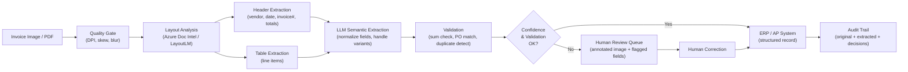

# Part 3 — Image & Document Intelligence

Engineering deep dive on OCR, scene understanding, document parsing, and intelligent document processing pipelines for enterprise agentic systems.

> **Audience:** AI Platform Engineers, Enterprise Architects, Document Automation Architects
> **Coverage:** OCR · Scene Understanding · Object Detection · Document Intelligence · IDP Pipelines · Enterprise Patterns · Quality Assurance

---

## 1. Image Understanding Capabilities

### OCR: Neural vs. Traditional, Confidence Scoring, Layout Understanding

Optical character recognition has been transformed by deep learning. Traditional OCR engines (Tesseract 3.x and earlier) used rule-based segmentation and HMM-based character recognition — fragile to font variation, skew, and image noise. Modern neural OCR combines a CNN-based feature extractor, a sequence model (LSTM or Transformer), and a CTC or attention-based decoder, achieving dramatically higher accuracy on degraded scans, non-standard fonts, and mixed-language documents.

*Confidence scoring* is a production necessity. Every OCR output should carry a per-word or per-field confidence score (typically a softmax probability). Enterprise IDP pipelines use these scores to classify extractions into three tiers: high confidence (auto-process), medium confidence (auto-process with exception flagging), and low confidence (hold for human review). Calibration of these tiers to your specific document population is a deployment task — generic confidence thresholds from the model vendor are not appropriate for domain-specific materials.

*Layout understanding* extends OCR from character recognition to semantic structure recognition: identifying headers, footers, page numbers, section titles, tables, figures, form fields, and their reading order. This is the capability that distinguishes modern document AI from legacy OCR — it is the difference between extracting "John Smith" and "John Smith is the borrower's name on line 14 of section 3."

### Scene Understanding: Semantic Segmentation, Instance Detection

Scene understanding agents go beyond detecting objects to understanding the spatial structure of a scene. *Semantic segmentation* assigns a class label to every pixel (road, building, vegetation, person, vehicle). *Instance segmentation* further distinguishes individual object instances (pedestrian #1, pedestrian #2). Enterprise applications include:

- **Retail analytics**: customer traffic patterns, shelf occupancy, planogram compliance
- **Facility management**: occupancy counting, social distancing monitoring, safety zone violations
- **Agriculture**: crop health mapping, weed detection, yield estimation from drone imagery
- **Insurance property assessment**: roof condition scoring, exterior damage classification from aerial photography

Architectures: Mask R-CNN and its successors for instance segmentation; Segment Anything Model (SAM, Meta) for interactive and zero-shot segmentation; open-vocabulary segmentation models (FC-CLIP, ODISE) for novel class detection.

### Object Detection: YOLO Variants, DETR, Grounding DINO

*YOLO variants* (YOLOv8, YOLOv9, YOLO-NAS) remain the dominant choice for real-time object detection where latency is critical. They achieve excellent throughput on GPU hardware (hundreds of frames per second) and are optimized for edge deployment via ONNX and TensorRT. Their limitation is closed-set: the model can only detect classes it was trained on.

*DETR (Detection Transformer)* and its variants (Deformable DETR, RT-DETR) bring the Transformer attention mechanism to object detection. They handle complex scenes with many overlapping objects more naturally than anchor-based YOLO approaches and are easier to extend with additional prediction heads (e.g., depth estimation, attribute classification).

*Grounding DINO* is the breakthrough model for open-vocabulary object detection: given a natural language description ("the signature at the bottom right"), it detects and localizes the object in zero shot. This capability is essential for document agents that must locate arbitrary referenced elements, and for visual QA agents that receive unpredictable queries.

### Diagram Reasoning: Flowcharts, Architectural Diagrams, Circuit Diagrams

Diagram understanding is a significant capability gap for general-purpose VLMs — they can describe diagram contents in natural language but struggle to extract machine-readable structure (nodes, edges, relationships, data flows). Enterprise use cases include:

- **Software architecture diagram extraction**: converting PowerPoint architecture diagrams to YAML or JSON for automated compliance checking against architecture standards
- **Circuit diagram analysis**: extracting component lists, connection topologies, and specifications for BOM generation and design review
- **Process flowchart extraction**: converting BPMN diagrams to executable workflow definitions

Current best approaches: GPT-4o and Gemini 2.0 Flash for natural language description and Q&A over diagrams; specialized models (e.g., diagram-to-code fine-tunes of VLMs) for structured extraction. This remains a frontier capability where custom fine-tuning on domain-specific diagram types is often necessary for production-grade accuracy.

### Chart Understanding: Bar, Line, Pie, Scatter, Data Extraction

Chart understanding encompasses visual data extraction (recovering the underlying data from a chart image) and semantic chart QA (answering questions about trends, comparisons, and anomalies). *ChartQA* and *ChartBench* benchmarks measure these capabilities; GPT-4o and Gemini 2.0 Flash achieve strong scores, but accuracy degrades significantly on non-standard chart types (waterfall, Gantt, radar) and on charts with overlapping data points or poor axis labeling.

For production document processing where charts contain numerical data that must be extracted accurately, best practice is to supplement VLM-based chart understanding with a dedicated chart data extraction pipeline: (1) classify the chart type using a lightweight classifier; (2) apply a chart-type-specific extraction model (e.g., a fine-tuned model for bar charts that reads bar heights via image segmentation rather than language reasoning); (3) validate the extracted data against reasonable bounds (e.g., percentages must sum to approximately 100%, time series must be monotonically increasing in time).

### Handwriting Recognition: Historical Documents, Medical Notes, Forms

Handwriting recognition (HWR) is substantially harder than printed OCR due to unlimited style variation, ligatures, and context dependence. Modern approaches use a combination of a CNN feature extractor, a Transformer sequence model, and an n-gram language model prior to resolve ambiguous characters. Key considerations for enterprise deployment:

- **Domain-specific vocabulary**: medical and legal handwriting benefits enormously from a domain vocabulary model that knows "metformin" and "defendant" are plausible words while "metfirmin" is not.
- **Degraded media**: historical documents may have foxing, water damage, ink bleed-through, and non-standard scripts. Models trained on modern handwriting perform poorly on 19th-century cursive.
- **Confidence calibration**: HWR confidence scores are less reliable than printed OCR scores; conservative thresholds (flag anything below 0.85 for human review) are appropriate for high-stakes documents.

Representative models: TrOCR (Microsoft, Transformer-based), CTC-based models for form field HWR, specialized models for medical notes.

### GIS and Satellite Imagery: Geospatial Context, Change Detection

Satellite and aerial imagery requires preprocessing steps absent in standard computer vision: coordinate reference system (CRS) normalization, radiometric calibration, cloud masking, and multi-spectral band selection. Models trained on RGB photographs cannot naively process multispectral satellite imagery — NDVI, SAR, and infrared bands require either dedicated models or band-selection preprocessing to synthetic-RGB.

Change detection — identifying what has changed between two images of the same location at different times — is the primary enterprise use case in insurance (post-disaster property assessment), agriculture (crop growth monitoring), and urban planning (illegal construction detection). Siamese network architectures (two image encoders with shared weights, difference computation, and change classification head) are the standard approach.

---

## 2. Document Intelligence Deep Dive

### Document Types Handled by Enterprise IDP Systems

Enterprise IDP systems must handle a diverse document corpus:

- **Financial**: invoices, purchase orders, bank statements, tax forms (W-2, 1099), financial statements (income statement, balance sheet), audit reports
- **Identity and KYC**: passports, driver's licenses, national IDs, utility bills, bank letters
- **Legal**: contracts, NDAs, lease agreements, court orders, regulatory filings
- **Healthcare**: insurance claim forms, EOBs, prescription forms, lab reports, discharge summaries
- **Engineering**: technical drawings, schematics, specification sheets, test reports
- **Logistics**: bills of lading, customs declarations, CMR documents, packing lists

Each document type has a distinct structure, vocabulary, and extraction requirement. A production IDP system either uses a large general-purpose document AI model with few-shot prompting per document type, or maintains a registry of document-type-specific models and routes incoming documents to the appropriate model after a classification step.

### Intelligent Document Processing (IDP) Pipeline Stages

A production IDP pipeline proceeds through these stages:

**Stage 1 — Ingestion and Quality Assessment**: Receive document (PDF, image, Word, HTML). Extract metadata. Assess quality: DPI check, skew angle, contrast, blur detection. Apply quality gates — documents below minimum quality thresholds are returned for rescanning or flagged for degraded-mode processing with lower accuracy SLAs.

**Stage 2 — Preprocessing**: Deskew (correct rotation), deblur (where possible), binarize (convert to black/white for OCR), despeckle (remove noise pixels), and normalize contrast. For PDFs: render to page images at target DPI (150 for general, 300 for fine-print).

**Stage 3 — Layout Analysis**: Segment each page into regions using a layout detection model (LayoutLM, Detectron2 with document-trained weights, Azure Document Intelligence layout API). Classify regions as text block, table, figure, header, footer, page number. Establish reading order (Z-order for multi-column layouts).

**Stage 4 — OCR and Content Extraction**: Apply OCR to text regions. Apply table extraction to table regions (cell segmentation + content OCR + row/column structure reconstruction). Apply visual understanding to figure regions (chart data extraction, diagram classification).

**Stage 5 — Semantic Extraction**: Apply a document-type-aware extraction model to convert raw OCR output to structured fields (invoice number, vendor name, line items, totals). This is where LLM-based extraction (prompt engineering or fine-tuning) is most valuable — it handles format variation and non-standard field placement that rule-based extractors miss.

**Stage 6 — Validation and Quality Scoring**: Cross-validate extracted fields (does the sum of line items equal the invoice total? does the account number match the format for the declared bank?). Generate field-level confidence scores. Apply business rules. Flag fields below confidence threshold for human review.

**Stage 7 — Output and Audit**: Serialize extracted data to target schema (JSON, XML, database record). Generate a structured audit trail including: original document hash, preprocessing steps applied, model versions used, extracted field values with confidence scores, validation results, and human review decisions.

### Layout Understanding: Reading Order, Table Extraction, Multi-Column Text

Layout understanding is the hardest IDP sub-problem. *Reading order* in a multi-column PDF is not a simple top-to-bottom, left-to-right sweep — footnotes, sidebars, figure captions, and callout boxes all interrupt the linear flow. Layout models learn reading order from human-annotated training data; for complex layouts (academic papers, financial prospectuses, government forms), accuracy degrades and human validation is often required.

*Table extraction* involves three sub-tasks: table detection (where on the page is the table?), table structure recognition (what are the rows, columns, and merged cells?), and cell content extraction (what text is in each cell?). Borderless tables (identified only by whitespace alignment) are substantially harder than bordered tables. The TATR (Table Transformer) model is the standard open-source approach; Azure Document Intelligence and Amazon Textract provide production-grade commercial alternatives.

*Multi-column text* in documents like newspapers, academic papers, and financial prospectuses requires accurate column boundary detection before the reading order can be determined. Errors here produce semantically nonsensical output — text from adjacent columns gets interleaved.

---

## 3. Tool and Framework Comparison Matrix

| Tool | Type | OCR Quality | Layout Analysis | Table Extraction | Handwriting | Deployment | Cost | Enterprise Readiness |
|------|------|------------|----------------|-----------------|------------|------------|------|---------------------|
| Azure Document Intelligence | Cloud API | Excellent | Excellent | Excellent | Good | API (Azure) | Per-page (tiered) | Very High — SOC 2, HIPAA, FedRAMP |
| Amazon Textract | Cloud API | Excellent | Good | Good | Limited | API (AWS) | Per-page (tiered) | Very High — HIPAA, SOC 2 |
| Google Document AI | Cloud API | Excellent | Very Good | Good | Good | API (GCP) | Per-page (tiered) | Very High — HIPAA, SOC 2 |
| LayoutLM / LayoutLMv3 | Open model | Good (depends on OCR engine) | Very Good | Good | Limited | Self-hosted | GPU compute | Medium — self-hosted ops required |
| Docling | Open library | Good (uses Tesseract/EasyOCR) | Very Good | Very Good | Limited | Self-hosted | Free (compute only) | Medium — active development by IBM |
| Nougat | Open model | Excellent (scientific docs) | Excellent (academic PDFs) | Excellent | Limited | Self-hosted | GPU compute | Low — specialized (scientific PDFs only) |
| Donut | Open model | Good | Good | Limited | Limited | Self-hosted | GPU compute | Low — no explicit layout output |
| PaddleOCR | Open library | Very Good | Good | Good | Good | Self-hosted | Free (compute only) | Medium — strong multilingual, Chinese |
| Tesseract (v5) | Open engine | Good (clean docs) | Limited | Limited | Limited | Self-hosted | Free | Medium — requires preprocessing pipeline |
| EasyOCR | Open library | Good | Limited | Limited | Limited | Self-hosted | Free | Low — wrapper around CRNN, limited layout |
| Surya | Open model | Very Good | Very Good | Good | Limited | Self-hosted | GPU compute | Medium — fast, multilingual, recent |
| Marker | Open library | Very Good | Very Good | Good | Limited | Self-hosted | GPU compute | Medium — PDF-to-Markdown pipeline |

*Quality ratings are relative to realistic enterprise documents (mixed quality scans, varied fonts, complex layouts). Ratings may differ significantly for ideal-quality inputs.*

---

## 4. Enterprise Document Processing Patterns

### Invoice and Receipt Extraction Pipeline

The invoice extraction pipeline is the highest-volume IDP use case in enterprise. Key design decisions:

- **Template-based vs. template-free**: Template-based approaches (predefined field positions per vendor) are fast and accurate for known vendors but break on new vendors or layout changes. Template-free LLM-based extraction generalizes to novel layouts but is slower and more expensive. Production systems typically use template-based for high-volume known vendors and template-free for the long tail.
- **Line-item extraction**: Extracting individual line items from an invoice table is harder than header field extraction. Multi-row cells, wrapped text, and quantity/unit columns with implied multipliers are common failure modes.
- **Three-way matching**: The extracted invoice data is validated against the corresponding purchase order and goods receipt — "does the invoice quantity match the PO quantity and the delivered quantity?" This business logic lives above the IDP layer.

### Contract Analysis Workflow

Contract analysis agents extract defined terms, key clauses (termination, liability, IP assignment, data processing terms), obligations, and dates. The extraction challenge is semantic: the same concept may be phrased in a hundred different ways across different legal teams' drafting styles. LLM-based extraction with few-shot examples of clause types outperforms rule-based pattern matching significantly.

Key enterprise requirements: citation (each extracted clause must reference the exact page, paragraph, and sentence it was drawn from); completeness (missing a critical clause is worse than extracting a spurious one); cross-document comparison (compare this contract to the company's standard template and flag deviations).

### KYC / Identity Verification Pipeline

A KYC agent processes: (1) a government-issued ID (passport, driver's license, national ID); (2) a selfie or live video frame; (3) optionally, an address verification document (utility bill, bank statement). The pipeline stages are: ID authenticity check (detect photocopies, digital alterations, expired documents using specialized ID verification models); data extraction from the ID (name, date of birth, ID number, expiry, MRZ zone); face match between the ID photo and the selfie (using a face recognition model); liveness check (for live video, ensure the submitted image is of a live person, not a printed photo); address extraction from the supporting document; cross-validation of extracted data across all sources.

Regulatory requirements (FATF, EBA, FinCEN) mandate that the pipeline produces an evidence package — not just a pass/fail decision — that can be presented to regulators on demand.

### Financial Statement Parsing

Financial statement parsing (income statements, balance sheets, cash flow statements) combines table extraction with domain-specific semantic understanding. The same line item may appear as "Revenue", "Net revenue", "Total revenues", or "Gross sales" across different companies' filings. Standardization to a canonical schema (XBRL taxonomy, GAAP line items) is the primary semantic challenge. The extraction pipeline typically uses a combination of table extraction (Azure Textract, TATR), entity resolution (mapping variant phrasings to canonical concepts), and arithmetic validation (does the net income equal revenue minus expenses minus taxes?).

### Multi-Language Document Handling

Enterprise document pipelines in international organizations process documents in 20–50 languages. Key design considerations: use a multilingual OCR engine (Azure Document Intelligence and PaddleOCR have strong multilingual support); apply language detection before routing to language-specific extraction models; handle right-to-left scripts (Arabic, Hebrew) which require layout analysis to be direction-aware; handle ideographic scripts (Chinese, Japanese, Korean) where character-level OCR granularity is different from alphabetic scripts.

---

## 5. Failure Modes and Quality Assurance

### Low-Quality Scans and Skewed Images

The most common production failure mode is input quality below the model's training distribution. A model achieving 99% accuracy on clean scans may drop to 85% on photocopier artifacts, 75% on smartphone photos of paper documents, and 60% on fax-machine output. Quality assessment must happen *before* inference, not only after.

Quality metrics to measure: DPI (target ≥ 150 for general text, ≥ 300 for fine print); skew angle (automatically correctable up to ±5°, beyond that flag for manual deskew); blur (Laplacian variance below threshold indicates significant blur); contrast ratio (documents with low contrast between ink and paper require preprocessing enhancement).

### Confidence Scoring and Human Escalation

Production IDP systems implement a tiered confidence model:

- **Green tier (auto-accept)**: all fields above the high-confidence threshold, all validation checks pass → submit directly to downstream system.
- **Yellow tier (auto-accept with exception flag)**: most fields high-confidence but one or more fields in medium range, or a validation check shows a small discrepancy → submit to downstream but create an exception record for periodic human audit.
- **Red tier (human review required)**: one or more fields below low-confidence threshold, or a validation check fails critically → hold the document in the human review queue with the annotated image.

Threshold calibration is a deployment task. The thresholds should be set such that the human review queue is within the capacity of your human reviewers — typically targeting 2–5% of documents in the red tier for a mature, high-quality document population.

### Cross-Validation Strategies

Single-model extraction is brittle for high-stakes documents. Cross-validation strategies include:

- **Multi-model consensus**: run extraction with two independent models (e.g., Azure Document Intelligence + a local LayoutLM fine-tune) and flag documents where the two models disagree.
- **Arithmetic validation**: for financial documents, verify that extracted numerical values satisfy expected arithmetic relationships (line items sum to total; beginning balance + debits - credits = ending balance).
- **Reference data validation**: cross-check extracted identifiers against reference databases (validate routing numbers against the Federal Reserve routing number database; validate VAT numbers against the VIES database).
- **Temporal consistency**: for a series of related documents (e.g., monthly bank statements), validate that account balances are consistent across documents.

---

## Interview Use Cases

### Q1: How would you build a document intelligence pipeline for processing 10,000 insurance claim forms per day with a 99.5% accuracy SLA?

The architecture has five key components. First, a quality gate that rejects or flags documents below minimum scan quality, reducing the effective problem space to documents the model can actually handle. Second, a template registry: insurance claim forms for a given insurer have consistent structure — maintain a library of document templates keyed by insurer and form version, and route incoming documents to the matching template-specific extraction model for the 80% of volume that comes from known templates. Third, a general-purpose LLM-based extractor for the 20% long-tail of novel or non-standard forms. Fourth, a validation layer with arithmetic checks, reference data lookups, and business rule enforcement. Fifth, a human review queue targeted at 1–2% of volume (100–200 documents per day at 10,000/day throughput), sized appropriately for the human reviewer workforce.

Achieving 99.5% accuracy requires measuring accuracy at the field level (not the document level), defining exactly what "accuracy" means (is a correctly extracted value that fails a downstream validation rule "accurate"?), and establishing a ground-truth test set of human-verified extractions for continuous regression testing. The SLA also requires defining the accuracy denominator: are documents rejected by the quality gate counted as failures?

### Q2: What are the architectural differences between LayoutLM and a VLM-based approach for document understanding?

LayoutLM is a specialized Transformer pre-trained jointly on text tokens, 2D bounding box coordinates (position on the page), and image patches from the corresponding page region. It is discriminative — it produces embeddings used for classification tasks (field classification, token labeling). It requires an upstream OCR engine to provide the text tokens and bounding boxes; it does not perform OCR itself. LayoutLM is best used when the document structure is known (you know what fields to extract and can formulate the problem as a token classification task), the document population is large enough to fine-tune on, and low latency is required (LayoutLM inference is faster than a full VLM call).

A VLM-based approach (GPT-4o, Gemini, Claude) takes the full document image as input and generates free-form text output (the extracted fields, often in JSON format via prompt engineering). It is generative — it can extract any field you describe in the prompt without task-specific fine-tuning. It is better for novel document types, complex semantic extraction (interpreting clause meaning, not just locating a field), and cross-document reasoning. Its weaknesses are: higher cost and latency per call; less reliable structured output (JSON schema enforcement via tool use is required); and lower recall on fine-grained numerical extraction compared to a fine-tuned LayoutLM.

### Q3: How do you handle handwritten medical notes mixed with printed text in a healthcare document processing system?

The critical first step is *region classification*: use a layout model (e.g., a fine-tuned LayoutLMv3 or a CNN-based region classifier) to segment each page into printed regions and handwritten regions. This classification step itself requires training data specific to medical notes — generic document layout models may not distinguish printed form fields from handwritten fill-ins.

Printed regions are processed with standard neural OCR (TrOCR, Azure Document Intelligence). Handwritten regions are processed with an HWR model fine-tuned on medical handwriting — a generic HWR model trained on general cursive will perform poorly on medical shorthand, drug names, and dosage notation. The medical HWR model should incorporate a medical vocabulary prior to resolve ambiguous characters (the difference between "1 mg" and "I mg" may be a single pixel).

Confidence scores from both OCR paths are propagated to a human review queue. Medical handwriting extraction should be configured conservatively (lower confidence thresholds trigger human review) because errors in drug names or dosages have patient safety implications. All human corrections are fed back into a continuous learning pipeline to improve the HWR model on the specific handwriting styles encountered in the production document population.

### Q4: Design a KYC verification agent that processes passports, selfies, and bank statements

The KYC agent comprises three specialist models operating in parallel, coordinated by an orchestrator that handles sequencing and conflict resolution.

**ID Specialist**: Accepts the passport image. Classifies country of issue and document type. Applies an ID authenticity model (detecting photocopies, tampered holograms, font substitutions). Extracts MRZ (Machine-Readable Zone) — highly reliable because MRZ has a defined character set and checksum validation — and the visual inspection zone (name, photo, date of birth, expiry). Verifies MRZ checksum. Outputs structured identity record with per-field confidence and authenticity score.

**Face Match Specialist**: Accepts the passport photo (cropped from the ID) and the selfie. Applies a face recognition model (ArcFace or a commercial API) to compute a face similarity score. Applies a liveness detection model to the selfie (2D liveness for photos, 3D liveness for video). Outputs match confidence and liveness confidence.

**Address Verification Specialist**: Accepts the bank statement. Applies IDP extraction to extract account holder name, address, statement date, and issuing bank. Validates: does the name match the passport name (within fuzzy string tolerance)? Is the statement within the required recency window (typically last 3 months)? Is the bank a recognized institution (validate SWIFT/BIC code against the global bank register)?

The orchestrator assembles the three structured outputs and applies decision logic: all three specialists must return confidence above threshold for an auto-pass. Any specialist below threshold, or any detected inconsistency between the specialists' outputs, triggers a human review with the full evidence package. The audit log records the passport image hash, selfie image hash, bank statement hash, model versions, all extracted values, all confidence scores, the orchestrator's decision logic output, and the human reviewer's final decision.

---

## Related

- [Part 1 — Foundations](./part-01-foundations.md) — tokenization strategies for document image encoding
- [Part 2 — Enterprise Architecture](./part-02-enterprise-architecture.md) — document understanding agents in the four-layer architecture
- [Part 5 — Multimodal RAG](./part-05-multimodal-rag.md) — retrieving relevant document sections using multimodal embeddings
- [Part 8 — Guardrails & Sanitization](./part-08-guardrails-sanitization.md) — PII detection and redaction in extracted document content
- [Knowledge & RAG](../knowledge-engineering/knowledge/index.md) — knowledge architecture patterns that consume IDP pipeline outputs
