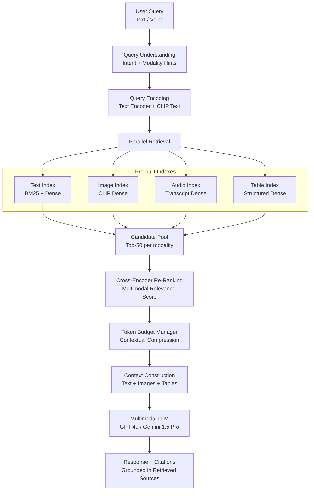
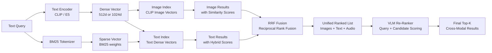

# Part 05 — Multimodal RAG

A comprehensive technical deep dive into multimodal retrieval-augmented generation systems — covering embedding strategies, indexing patterns, vector database selection, retrieval architectures, and enterprise implementation patterns for legal, medical, financial, and media workloads.

> **Audience:** Principal AI Architects, ML Engineers, Enterprise Search Architects
> **Coverage:** Multimodal Embeddings · Indexing Strategies · Vector Databases · Cross-Modal Retrieval · Enterprise RAG Patterns
> **As of:** July 2026

---

## Multimodal RAG Overview

### Why Unimodal RAG Is Insufficient

Standard RAG pipelines embed and retrieve text. Enterprise knowledge bases, however, are inherently multimodal:

- A legal case file contains PDF briefs, scanned exhibits, court video recordings, and audio depositions
- A medical record contains DICOM images, radiology reports, physician audio notes, and structured EHR data
- A financial report contains prose narrative, structured tables, and embedded charts

Unimodal RAG on the text-extracted portion of these documents discards the majority of the semantic signal. A question about a courtroom exhibit cannot be answered from OCR text alone if the exhibit is a hand-drawn diagram. A radiology question requires correlating pixel-level image findings with textual clinical history.

### The Multimodal RAG Stack

```text
Ingestion → Modality Detection → Per-Modality Processing → Embedding → Indexing
         → Query Understanding → Retrieval → Fusion → Generation → Citation
```

Each stage introduces modality-specific complexity:

- *Ingestion*: format detection, container parsing, metadata extraction
- *Embedding*: different models per modality vs. unified joint embedding space
- *Indexing*: granularity decisions (page-level vs. chunk-level vs. region-level)
- *Retrieval*: cross-modal relevance scoring, modality balancing
- *Fusion*: token budget management, modality weighting, context construction
- *Generation*: citation grounding across modalities

### Key Challenges

- *Cross-modal relevance*: a text query must retrieve relevant images — there is no shared token space by default
- *Token budget during retrieval*: images consume 500–2000 tokens each; 5 retrieved images can fill the context window before adding any text
- *Modality mismatch*: the answer may be in a chart, but the query is phrased in text; naive vector search misses this

---

## Embedding Strategies

### Unimodal Embeddings Per Modality

Embed each modality independently using the best available model for that modality:

- *Vision*: CLIP ViT-L/14, SigLIP, DINOv2 — 768–1024 dimensional vectors per image
- *Audio*: Whisper encoder representations, CLAP (Contrastive Language-Audio Pretraining) — 512d vectors per audio chunk
- *Text*: text-embedding-3-large (3072d), E5-Mistral-7B (4096d), BGE-M3 (1024d)

Store each modality in a separate vector collection with a shared document ID for cross-modal joining.

### Joint Multimodal Embeddings

Joint models map all modalities into a single shared embedding space:

- *ImageBind* (Meta): binds image, text, audio, video, depth, and IMU into one 1024d space — a text query can retrieve audio clips or images directly
- *Jina CLIP v2*: text-image joint embedding; multilingual; strong retrieval benchmarks
- *E5-Mistral multimodal*: extended to handle interleaved image-text sequences

Joint embeddings enable truly unified retrieval — one query against one index returns results from all modalities ranked by a common relevance score.

### Late Fusion

Embed modalities independently; retrieve separately; merge ranked lists at the LLM context stage:

- Run text query against text index → top-K text chunks
- Run text query against image index (via CLIP text encoder) → top-K images
- Run text query against audio transcript index → top-K transcript segments
- Merge results with Reciprocal Rank Fusion (RRF) or a learned re-ranker
- *Advantage*: simple to implement; modality indexes can evolve independently
- *Disadvantage*: cross-modal correlations are not captured during retrieval; relies on re-ranking for fusion quality

### Early Fusion

Map all content into a unified joint embedding space before indexing:

- Single index; single query vector resolves across all modalities
- *Advantage*: true cross-modal retrieval; text query can directly surface an audio segment that is semantically related even if the transcript is not an exact text match
- *Disadvantage*: joint embedding models are larger; updating one modality requires re-embedding pipeline changes; quality ceiling depends on the joint model's training coverage

### Hybrid: Text-First with Image Re-Ranking

1. Retrieve top-50 text chunks via BM25 + dense vector hybrid search
2. For each retrieved chunk, look up associated images (page-level or paragraph-level join)
3. Re-rank the combined text + image set using a cross-encoder that scores relevance to the query
4. *Use when*: text is the primary carrier of semantics and images are supplementary evidence

### Cross-Modal Embedding Summary

| Source Modality | Target Modality | Model | Notes |
|-----------------|-----------------|-------|-------|
| Text | Image | CLIP, SigLIP | Standard text-to-image retrieval |
| Text | Audio | CLAP, ImageBind | Retrieve audio by text description |
| Text | Video | CLIP (frame-level), InternVideo | Query video archive by text |
| Image | Text | CLIP image encoder | Find captions/reports for an image |
| Audio | Text | Whisper → text embedding | Transcribe then embed |
| Video | Text | Frame sample → CLIP → pool | Embed clip, retrieve text |

---

## Indexing Strategies

### Image Indexing

- *Full image*: embed entire image as one vector — fast, loses fine-grained spatial detail
- *Region-based*: detect objects/regions with a detector (DETR, GroundingDINO); embed each region separately with bounding box metadata; enables "find me the signature block" queries
- *Caption-based*: generate a detailed caption per image using a VLM (GPT-4o, LLaVA); embed the caption as text; query in text space
- *OCR-text-based*: extract text from image via OCR; store as text chunk linked to image ID; hybrid caption + OCR for document images

### Video Indexing

- *Clip-level*: segment video into 30–60 second clips; embed clip using S3D or VideoMAE; store clip-level metadata (start/end timestamp, scene ID, speaker if applicable)
- *Scene-level*: detect scene boundaries; embed one representative frame per scene; associate scene-level transcript segment
- *Frame-level*: sample at 1 fps; embed each frame individually; enables precise temporal retrieval but creates massive index for long content

### Audio Indexing

- *Chunk transcription*: chunk audio into 30-second segments with 5-second overlap; transcribe; embed transcript as text; link back to audio timestamp
- *Speaker segments*: index by diarization segment (speaker turn); enables "find all statements by Speaker A about topic X"
- *Emotion tags*: store emotion scores as metadata filters — retrieve segments where emotion = "frustrated" and topic = "billing"
- *Keywords*: store a keyword vector (TF-IDF or BM25-style) per segment for hybrid retrieval

### Document Indexing

- *Page-level*: embed one vector per page; coarse but fast; suitable for long documents where page is the natural retrieval unit
- *Paragraph-level*: chunk by semantic paragraph using a sentence splitter; 200–400 token chunks with 50-token overlap
- *OCR chunks*: for scanned documents, chunk OCR output by text block; preserve reading order metadata
- *Table cells*: convert tables to row-level text snippets ("Column A: X, Column B: Y"); embed as text; store table ID and row index as metadata
- *Chart captions*: generate textual descriptions of charts using VLM; embed as text; link to chart image for generation context

### Metadata Indexing

Store alongside every vector:

- Timestamps (creation, modification, recording time)
- Geolocation (for surveillance, field reports)
- Document type (contract, invoice, report, email)
- Modality (text, image, audio, video, table, chart)
- Confidence scores (OCR confidence, ASR word confidence)
- Speaker ID (for audio/video)
- Chunk position (page number, paragraph index)

---

## Vector Database Comparison Matrix

| Database | Multimodal Support | Vector Types | Filtering | Scale | Managed Cloud | Cost Model | Maturity |
|----------|--------------------|--------------|-----------|-------|---------------|------------|----------|
| Pinecone | Via metadata join | Dense | Rich metadata | 1B+ vectors | Yes (serverless) | Pay-per-use | High |
| Weaviate | Native multimodal modules | Dense + sparse | GraphQL filters | 100M+ | Yes (WCS) | Open-source + cloud | High |
| Milvus | Via separate collections | Dense + sparse + binary | Scalar filters | 1B+ | Yes (Zilliz) | Open-source + cloud | High |
| pgvector | Via PostgreSQL joins | Dense | Full SQL | 10M practical | No (self-host) | Postgres licensing | Medium |
| OpenSearch k-NN | Via document fields | Dense + sparse | Full query DSL | 100M+ | Yes (AWS) | AWS pricing | High |
| Azure AI Search | Native vector + semantic | Dense + sparse | OData filters | 100M+ | Yes (Azure) | Per-unit pricing | High |
| Qdrant | Via payload filtering | Dense + sparse | JSON payload | 100M+ | Yes (Qdrant Cloud) | Open-source + cloud | High |
| ChromaDB | Via metadata | Dense | Metadata dict | 10M practical | No | Open-source | Medium |
| Redis VSS | Via hash/JSON fields | Dense | RediSearch filters | 10M practical | Yes (Redis Cloud) | Redis licensing | Medium |

*Recommendation*: Weaviate or Azure AI Search for enterprise multimodal RAG requiring managed infrastructure and native cross-modal module support. Milvus or Qdrant for open-source deployments at scale.

---

## Chunking Strategies

### OCR Chunking

- *Semantic paragraph*: split on paragraph markers detected by layout analysis; preserves semantic coherence but produces variable-size chunks
- *Fixed-size with overlap*: 512 tokens with 64-token overlap; simple and consistent; may break mid-sentence
- *Table-aware*: detect tables (TableTransformer, Camelot); extract as structured JSON; do not chunk mid-table

### Frame Extraction

- *Scene detection*: PySceneDetect content-aware; produces variable number of keyframes per unit time
- *Uniform sampling*: 1 fps for general content; 5 fps for fast-moving content
- *Semantic similarity*: compute CLIP embeddings per frame; drop frames that are cosine-similar to their predecessor (>0.95); retains visually distinct frames only

### Transcript Chunking

- *Speaker turns*: split at speaker change boundaries from diarization; natural for Q&A and dialogue
- *Sentence-level*: split on sentence boundaries using spaCy; 1–3 sentences per chunk for high precision
- *Topic segments*: use BERTopic or TextTiling to detect topic shifts; chunk aligns with semantic units

### Document Chunking

- *Page-level*: one chunk per page; simple; appropriate for dense reference documents
- *Section-level*: split on heading hierarchy (H1 → H2 → H3); each section is one chunk with heading prepended as context
- *Hybrid*: section-level first; if section >1000 tokens, apply fixed-size sub-chunking with overlap

---

## Retrieval Patterns

### Pure Vector Search vs Hybrid

- *Pure vector*: ANN search (HNSW, IVF-PQ); captures semantic similarity; misses exact keyword matches
- *Hybrid (BM25 + vector)*: combine BM25 lexical score with dense vector score using RRF or linear interpolation; outperforms either alone on most benchmarks — particularly important for technical queries with specific product names or IDs that may not appear in training data

### Cross-Modal Retrieval

Text query → image result pipeline:

1. Encode query text with CLIP text encoder → 512d vector
2. ANN search over image embedding index (CLIP image encoder vectors)
3. Return top-K images with similarity scores and metadata

This enables queries such as "find me all diagrams showing network topology" against an image archive indexed with CLIP.

### Multi-Hop Multimodal Retrieval

For complex queries requiring reasoning across multiple sources:

1. *Hop 1*: retrieve relevant text passages from query
2. *Hop 2*: extract entity mentions from retrieved passages; use entities to query image index for associated visuals
3. *Hop 3*: if retrieved images contain charts, query table index for underlying data

Each hop narrows the search space and builds a richer context for the final generation step.

### Re-Ranking with Cross-Encoders

After retrieving top-50 candidates via vector search, re-rank with a cross-encoder:

- Cross-encoder scores query + candidate jointly (full attention) — higher quality than bi-encoder dot product
- Models: BGE-Reranker-v2, Cohere Rerank v3, Jina Reranker
- For multimodal: use a VLM as re-ranker — pass query + image/text candidate as a prompt; return a 0–10 relevance score

### Contextual Compression for Token Budget Management

After re-ranking, compress retrieved chunks before adding to LLM context:

- *Extractive compression*: sentence-level extraction — keep only sentences most relevant to the query (LLMlingua, Selective Context)
- *Abstractive compression*: summarize each retrieved chunk relative to the query; reduces token count at cost of some fidelity
- *Image compression*: downscale images to minimum resolution that preserves the answer; for text-in-image, use OCR text instead of the image token representation

---

## Full Multimodal RAG Pipeline



---

## Cross-Modal Retrieval Diagram



---

## Enterprise Implementation Patterns

### Legal Document RAG with Image Exhibits

A law firm's case files include PDFs with embedded images (photographs, diagrams, maps) and separate video recordings of depositions.

Architecture decisions:

- *Document processing*: use Azure Form Recognizer for layout-aware OCR; extract images by page; generate VLM captions for each image
- *Embedding*: text chunks → text-embedding-3-large; images → CLIP + VLM caption embedding (dual representation)
- *Index*: Azure AI Search with text + vector fields; document ID + page number + exhibit number as metadata filters
- *Retrieval*: hybrid BM25 + dense; filter by case ID at query time; cross-encoder rerank with legal domain model

Key consideration: verbatim accuracy is legally significant — preserve exact OCR text; do not paraphrase during chunking.

### Medical Imaging RAG (DICOM + Radiology Reports)

Correlating radiology images with clinical text requires careful handling of DICOM metadata and PHI:

- *DICOM processing*: convert to PNG using pydicom; extract DICOM metadata (modality, body part, acquisition date) as structured filters
- *Image embedding*: use a medical VLM (BioViL-T, Med-Flamingo) for radiology-domain embeddings rather than general CLIP
- *Text embedding*: fine-tune embedding model on MIMIC-CXR report text for domain adaptation
- *Privacy*: de-identify DICOM headers; apply differential privacy to embeddings if training on patient data

### Financial Report RAG (PDF + Charts + Tables)

Financial analysts query across 10-K filings, earnings call transcripts, and investor presentations:

- *Table extraction*: use Camelot or pdfplumber for lattice-based table detection; convert to row-level text snippets
- *Chart description*: extract chart images; prompt GPT-4o Vision to generate a structured description including chart type, axes, and key data points
- *Transcript chunking*: split by speaker turn (CEO, CFO, analyst); tag each turn with speaker role as metadata
- *Retrieval*: user queries like "What drove Q3 revenue growth?" should retrieve: earnings call CFO commentary, revenue table rows, and revenue growth chart description — all contributing to the grounded answer

### Video Archive RAG for News/Media Organizations

A broadcaster needs to search decades of footage by natural language query:

- *Ingestion*: transcode to H.264; extract 1fps frames; transcribe audio with Whisper; diarize with pyannote
- *Indexing*: frame-level CLIP embeddings + transcript dense embeddings in Milvus; scene-level metadata (program, date, segment title) as filters
- *Query interface*: text query → parallel retrieval from frame index and transcript index → RRF fusion → clip-level results with timestamps
- *Output*: return preview thumbnails, clip timestamps, and transcript excerpts; allow export of clip to editing software

---

## Interview Use Cases

**Q: How would you build a multimodal RAG system for a law firm that needs to retrieve information from 200TB of case files including PDFs, court video recordings, and audio depositions?**

A: At 200TB, the ingestion pipeline is the first challenge — this is a petabyte-scale document processing job. Use a distributed ingestion pipeline (Apache Spark + Azure Form Recognizer / AWS Textract) to process PDFs in parallel across a cluster; estimate 100–200GB/day throughput per processing node. For PDFs: extract text with layout-aware OCR; detect and extract embedded images; generate VLM captions for images; chunk text at paragraph level (300 tokens with 50-token overlap); embed text chunks with text-embedding-3-large and images with CLIP + caption dual representation. For video recordings: transcode to H.264; extract audio track; transcribe with Whisper large-v3; diarize with pyannote; index by speaker turn. For audio depositions: same transcription + diarization pipeline; index at sentence level for high recall on specific statements. Store all vectors in Azure AI Search (managed, scalable, integrated with Azure OpenAI). Metadata filters by case ID, document type, date range, and speaker enable scoped retrieval. Retrieval pattern: hybrid BM25 + dense vector; cross-encoder rerank using a legal-domain fine-tuned model (legal-roberta-large). Token budget management: legal exhibits can be very large images — use extractive OCR text representation when the query is text-oriented; only include the image itself in context when the query is about visual content (diagram, photograph, map). Expected cost at 200TB: ~$50K one-time ingestion compute + ~$5K/month for index hosting and query serving at typical law firm query volumes.

**Q: What are the trade-offs between late fusion and early fusion in multimodal RAG, and when would you choose each?**

A: Late fusion embeds each modality independently using the best specialized model for that modality, runs separate retrieval queries against separate indexes, then merges results using Reciprocal Rank Fusion or a learned re-ranker at query time. Early fusion uses a joint embedding model (ImageBind, Jina CLIP v2) that maps all modalities into a single shared vector space, enabling a single query against a single unified index. *Choose late fusion when*: (1) you need the best-in-class embedding quality for each modality — CLIP for images, Whisper encoder for audio, E5-Mistral for text; (2) your modality indexes update at different frequencies (new text daily, new images weekly); (3) you need to explain retrieval results by modality; (4) you are building incrementally and can start with text RAG then add modalities without re-indexing. *Choose early fusion when*: (1) cross-modal retrieval is the primary use case — text query must retrieve audio clips that are semantically similar without having a verbatim transcript; (2) you can afford to re-embed all content when the joint model is updated; (3) latency is critical — single-index query is faster than parallel multi-index queries with RRF merge. In practice, most enterprise implementations start with late fusion and introduce joint embeddings for specific cross-modal retrieval use cases as they are identified, resulting in a hybrid architecture.

**Q: How do you handle the token budget problem when your RAG retrieves 5 images + 3 text chunks + 2 audio transcripts for a single query?**

A: Each image in GPT-4o costs 85–1700 tokens depending on resolution (low-detail vs. high-detail). Five high-resolution images alone consume 5,000–8,500 tokens before any text. The budget management strategy operates at three levels. *Pre-retrieval*: set a modality budget — e.g., maximum 3 images, 5 text chunks, 2 transcript segments — and tune these limits based on empirical answer quality vs. token cost trade-off for your domain. *Post-retrieval, pre-generation*: apply contextual compression. For text chunks: use LLMlingua or Selective Context to extract the 2–3 most query-relevant sentences per chunk, reducing each chunk from 300 tokens to 80–100 tokens. For images: if the query is text-oriented (asking about numbers, names, facts), substitute the image with its OCR text or VLM caption (50 tokens) rather than the image itself. Only include the raw image when the query requires visual reasoning. For audio transcripts: extract the 3 most relevant speaker turns rather than full transcript segments. *At generation*: use a structured context template that positions the most relevant content first (LLMs have recency and primacy bias — place high-confidence evidence in the first and last positions). Instruct the model to cite its sources by modality and chunk ID. The result is a reliable budget of ~4,000–6,000 tokens for retrieval context within a 128K context window, leaving headroom for multi-turn conversation history and a long-form generated answer.

**Q: Design a multimodal RAG pipeline for a medical imaging platform that correlates radiology images with EHR text and physician audio notes.**

A: The system must meet HIPAA requirements end-to-end — all PHI must be encrypted in transit and at rest; audit logs must record every retrieval and generation event. Architecture: *Ingestion* — DICOM images de-identified with deid-dicom-cli (strip patient identifiers from headers); converted to PNG at 512×512 for chest X-ray, 1024×1024 for CT/MRI slices where resolution matters for diagnosis. EHR text exported from the EHR system with patient identifiers replaced by a pseudonymous case ID. Physician audio notes transcribed with a HIPAA-eligible ASR service (AWS Transcribe Medical). *Embedding* — DICOM images embedded with BioViL-T (a radiology-specific VLM pre-trained on MIMIC-CXR); this significantly outperforms general CLIP for chest X-ray retrieval tasks. EHR text and radiology reports embedded with text-embedding-3-large fine-tuned on clinical notes. Audio transcripts chunked by sentence and embedded as text. *Index* — Weaviate deployed in a private VPC; no data leaves the healthcare environment. DICOM metadata (modality, body part examined, view position, acquisition date) stored as filterable properties. *Retrieval* — Radiologist query ("find prior chest X-rays for this patient showing pleural effusion") triggers: (1) DICOM metadata filter (patient case ID + modality = "CR"); (2) BioViL-T image embedding similarity search for "pleural effusion" visual pattern; (3) text search of radiology reports for "pleural effusion" terminology. Results fused with RRF; ranked list returned with DICOM thumbnails, report excerpts, and audio note timestamps. *Generation* — Medical LLM (Med-PaLM 2 or GPT-4o with medical system prompt) generates a structured comparison report citing retrieved prior studies.

**Q: How would you evaluate retrieval quality in a multimodal RAG system where ground truth is difficult to define?**

A: Evaluation is the hardest part of multimodal RAG because cross-modal relevance has no single ground truth. A three-layer evaluation strategy: (1) *Offline retrieval metrics* — create a domain-specific evaluation set of 200–500 query + gold answer + gold source chunk triples. Measure Recall@K (is the gold chunk in the top K results?), MRR (Mean Reciprocal Rank), and NDCG@10. For cross-modal retrieval, create image-to-text and text-to-image evaluation pairs from existing annotated datasets (MSCOCO for images, CLOTHO for audio). (2) *Answer faithfulness* — use an LLM judge to evaluate whether the generated answer is grounded in the retrieved context (faithfulness score) and whether it correctly answers the query (relevance score). Ragas framework automates this. (3) *Human evaluation* — for 10–15% of live queries, route to domain expert reviewers who score: source relevance (are retrieved chunks actually relevant?), answer correctness (is the answer factually accurate?), and hallucination rate (does the answer contain claims not in the retrieved context?). Track these metrics over time; use them to drive retrieval parameter tuning (number of retrieved chunks, re-ranking model, compression aggressiveness).

---

## Related

- [Part 02 — Enterprise Architecture](./part-02-enterprise-architecture.md) — VLM generation from retrieved context
- [Part 04 — Video & Audio Intelligence](./part-04-modalities-video-audio.md) — audio and video indexing for RAG
- [Part 06 — Agentic Workflows](./part-06-agentic-workflows.md) — RAG as a tool within multimodal agents
- [Part 07 — Security & Threat Taxonomy](./part-07-security-threats.md) — RAG poisoning and embedding attacks
