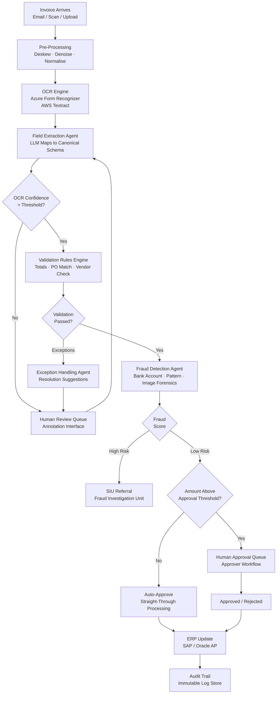
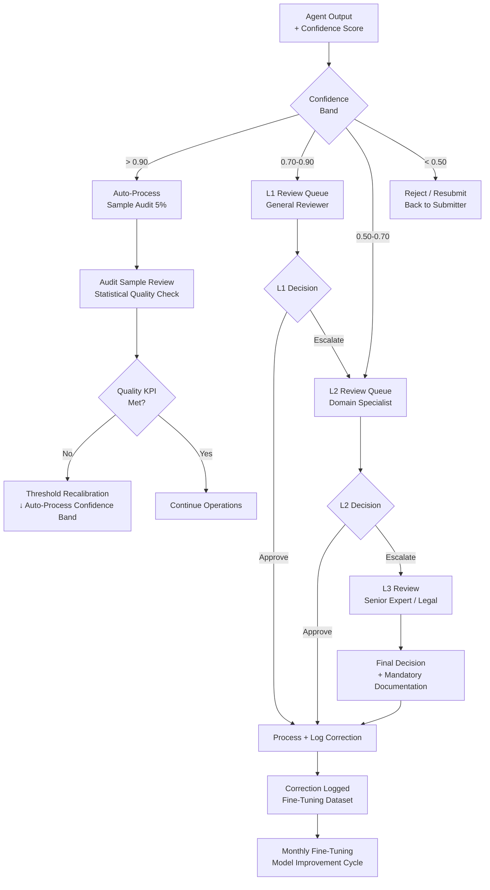

# Part 06 — Multimodal Agentic Workflows

A comprehensive technical deep dive into multimodal agentic systems — covering ReAct extensions for vision, end-to-end workflow designs, human-in-the-loop patterns, tool ecosystems, and orchestration framework selection for enterprise deployments.

> **Audience:** Principal AI Architects, AI Engineering Leads, Enterprise Architects
> **Coverage:** Agentic ReAct · Workflow Patterns · HITL Escalation · Tool Ecosystem · Orchestration Frameworks
> **As of:** July 2026

---

## Agentic Workflow Fundamentals

### ReAct Loop Extended to Multimodal Inputs

The classical ReAct loop (Reason → Act → Observe → Repeat) maps naturally to multimodal inputs when the *observation* step can return images, audio transcriptions, or structured data extracted from documents:

```text
Observe: [Image: invoice_scan.jpg] + [Text: "Extract vendor, amount, and line items"]
Reason:  "The image shows a scanned invoice. I will call the OCR tool to extract structured fields."
Act:     tool_call("ocr_extract", image_ref="invoice_scan.jpg")
Observe: {"vendor": "ACME Corp", "amount": 12500.00, "line_items": [...]}
Reason:  "Extraction successful. I will now validate against the purchase order."
Act:     tool_call("po_lookup", po_number="PO-2026-4412")
...
```

The key extension is that the agent's *observation space* now includes visual tokens, audio transcripts, and structured document payloads in addition to text. The LLM backbone (GPT-4o, Gemini 1.5 Pro) must be a native multimodal model capable of reasoning over images inline with text.

### Planning with Visual Context

VLM-powered task decomposition allows the agent to look at a document image and generate a structured plan before taking any actions:

- Given a photograph of a damaged car, the agent plans: (1) identify vehicle make/model, (2) classify damage regions, (3) estimate repair categories, (4) look up parts pricing
- Given a factory floor image, the agent plans: (1) identify all visible equipment, (2) check each against maintenance schedule, (3) flag items due for inspection

Planning with visual context improves task completion rates because the agent can detect missing inputs early — noticing that a required document is illegible before attempting extraction — rather than failing mid-workflow.

### Tool Use with Multimodal Triggers

Multimodal triggers connect sensory events to agent actions:

- *Image → Tool call*: a new invoice image arrives → trigger OCR extraction tool
- *Video event → Planning*: motion detected in restricted zone → trigger perimeter alert planning workflow
- *Audio anomaly → Escalation*: bearing frequency spike detected → trigger maintenance ticket creation
- *Confidence drop → Human review*: OCR confidence <0.7 on a field → route document to human annotator queue

### Memory Integration

Multimodal agents require richer memory than text-only agents:

- *Visual memory*: store embeddings of processed images; retrieve visually similar past cases for few-shot reasoning ("this damage pattern is similar to claim #4421 which was classified as Category B")
- *Temporal memory*: track event sequences with timestamps; correlate audio anomaly at T=10:23 with vibration spike at T=10:25
- *Procedural memory*: store successful action sequences for recurring document types as reusable sub-plans; invoke by document type classification

---

## End-to-End Workflow Examples

### Invoice Processing Workflow

The canonical multimodal document automation use case:

**Inputs**: scanned invoice image (JPEG/TIFF/PDF), purchase order from ERP, vendor master data

**Full Flow**:

1. *Image capture*: invoice arrives via email attachment, web upload, or scanner integration
2. *Pre-processing*: deskew, denoise, normalise resolution to 300 DPI using OpenCV
3. *OCR*: Azure Form Recognizer or AWS Textract; extract structured fields with confidence scores
4. *Field extraction*: LLM maps OCR output to canonical schema (vendor name, invoice date, line items, total, tax, payment terms)
5. *Validation rules*: check totals arithmetic; verify vendor exists in master data; check line items against PO
6. *Fraud detection*: compare vendor bank account against known fraudulent accounts; check for round-number amounts; compare against historical invoices from same vendor
7. *ERP update*: push validated invoice to SAP/Oracle AP module via API
8. *Human approval*: invoices above approval threshold or with validation warnings routed to approver queue
9. *Audit trail*: log all agent decisions, confidence scores, and tool call results with timestamps

### Medical Imaging Diagnosis Workflow

**Inputs**: DICOM image, patient clinical history (EHR), physician referral note

**Full Flow**:

1. *DICOM upload*: receive DICOM via PACS integration; de-identify headers
2. *Pre-processing*: window/level normalisation for viewing modality; resize to model input resolution
3. *VLM analysis*: primary diagnostic VLM (BioViL-T, Med-Flamingo) generates structured finding report
4. *Structured report generation*: LLM converts VLM findings into structured FHIR DiagnosticReport resource
5. *EHR integration*: write structured report to patient EHR via HL7 FHIR API
6. *Physician review*: report presented in radiologist workstation with VLM annotations overlaid on image
7. *Second opinion routing*: if VLM confidence <0.75 or finding is high-severity, route to senior radiologist
8. *Documentation*: final signed report archived; feedback (radiologist corrections) logged for model fine-tuning

### Insurance Claims Workflow

**Inputs**: claim submission form (PDF), damage photographs (JPEG), phone recording of claimant statement

**Full Flow**:

1. *Claim submission*: multi-channel intake (mobile app photo upload + PDF + audio)
2. *Damage assessment agent*: analyse damage photographs with a fine-tuned vision model; output damage category and severity score
3. *Policy lookup*: retrieve active policy from claims management system; extract coverage limits and deductibles
4. *Coverage calculation*: apply coverage rules to damage assessment; compute estimated payout range
5. *Fraud scoring*: cross-reference claim against fraud signals (CLUE database, claimant history, image forensics for manipulation detection)
6. *Adjuster routing*: high-confidence low-complexity claims → straight-through processing; medium-confidence → junior adjuster; high-fraud-score or high-value → senior adjuster + SIU referral
7. *Settlement*: approved claims trigger payment via payment processor API

### Manufacturing QA Workflow

**Inputs**: camera feed from production line, product specification database, defect taxonomy

**Full Flow**:

1. *Camera feed*: line-scan or area-scan camera captures each product unit at inspection station
2. *Defect detection agent*: YOLOv8 or RT-DETR detects defect regions; VLM classifies defect type
3. *Classification*: categorise as cosmetic (acceptable), functional (reject), or critical (halt line)
4. *Root cause analysis*: if defect rate exceeds threshold, VLM analyses production parameters from SCADA data to identify likely root cause (tool wear, temperature deviation, raw material batch)
5. *Production stop/continue decision*: critical defects trigger automatic line stop and operator alert
6. *Maintenance ticket*: auto-generated work order with defect images attached
7. *Quality report*: end-of-shift report aggregates defect counts, categories, and root cause hypotheses

### Compliance Monitoring Workflow

**Inputs**: call recordings from call center telephony system, compliance rule library, regulatory watchlist

**Full Flow**:

1. *Call recording*: recordings ingested from telephony platform (Genesys, NICE, Verint) via API
2. *Transcription*: ASR (Deepgram Nova-2 or AWS Transcribe Call Analytics) with speaker diarization
3. *Compliance check agent*: LLM scans transcript against rule library; semantic search for prohibited behaviours (misrepresentation, pressure tactics, omitted disclosures)
4. *Violation detection*: classify detected issues by severity (informational, warning, violation, critical)
5. *Alert generation*: violations trigger alert to compliance manager with timestamp, transcript excerpt, and rule reference
6. *Case management*: violations logged in compliance case management system (Actimize, Fiserv)
7. *Regulatory reporting*: monthly violation reports generated automatically for submission to regulator

---

## Human-in-the-Loop (HITL) Patterns

### Confidence-Based Routing

The primary HITL decision mechanism routes work based on the agent's confidence in its output:

| Confidence Band | Routing Decision | Review Type |
|-----------------|-----------------|-------------|
| >0.90 | Straight-through processing | Audit sample only |
| 0.70–0.90 | Human review queue | Standard review |
| 0.50–0.70 | Specialist review queue | Domain expert review |
| <0.50 | Reject / Re-submit | Claimant/submitter action required |

Confidence thresholds must be calibrated per field and document type, not globally — OCR confidence of 0.75 on a vendor name is acceptable; 0.75 on a total amount for a $1M invoice is not.

### Escalation Patterns

- *Tiered review*: Level 1 (general reviewer) → Level 2 (domain specialist) → Level 3 (senior expert or legal/compliance officer), triggered by escalation rules
- *Specialist routing*: detect content requiring specific expertise (medical coding, legal interpretation, structural damage assessment) and route to a credentialed specialist queue
- *Time-based escalation*: items in review queue beyond SLA threshold are auto-escalated to the next tier

### Annotation and Correction Feedback Loops

Human corrections are the highest-quality training signal for improving the agent:

- Log every human correction with: original agent output, corrected output, reviewer ID, timestamp, document ID
- Run monthly fine-tuning cycles using corrections as supervised training data
- Track correction rate per document type and field as a quality KPI — declining correction rate indicates model improvement

### Audit Trail Requirements for Regulated Industries

- Log every agent decision with: input hash, model version, tool call sequence, output, confidence score, timestamp, reviewer action (if applicable)
- Store logs in immutable append-only storage (AWS S3 with Object Lock, Azure Immutable Blob)
- Retain logs for the duration required by applicable regulation (7 years for financial records, 10 years for medical records under some state laws)
- Provide export capability for regulatory examination — logs must be human-readable and machine-parseable

---

## Invoice Processing Workflow — Mermaid Diagram



---

## HITL Escalation Pattern



---

## Tool Ecosystem for Multimodal Agents

### Vision Tools

- *Object detection APIs*: AWS Rekognition, Azure Computer Vision, Google Vision AI — managed, scalable, no GPU required
- *OCR services*: Azure Form Recognizer (layout-aware, table-aware), AWS Textract (forms + tables), Google Document AI
- *Face detection*: AWS Rekognition Faces, Azure Face API — for identity verification workflows (note: regulatory restrictions in some jurisdictions)
- *Specialised vision*: Roboflow for custom object detection model deployment; Scale AI for annotation pipeline

### Audio Tools

- *ASR services*: Deepgram Nova-2 (lowest latency), Azure Speech (best enterprise SLA), AWS Transcribe Medical (healthcare)
- *Speaker ID*: Azure Speaker Recognition, pyannote.audio (self-hosted), AWS Transcribe (built-in diarization)
- *Sentiment analysis*: Symbl.ai, AssemblyAI Sentiment, AWS Comprehend for call analytics

### Document Tools

- *IDP (Intelligent Document Processing) services*: Hyperscience, ABBYY Vantage, Kofax — end-to-end document automation platforms
- *Table extraction*: Camelot (lattice), Tabula (stream), pdfplumber — for programmatic PDF table extraction
- *Signature detection*: Azure Form Recognizer custom model; AWS Textract signature field

### Integration Tools

- *ERP connectors*: SAP BTP Integration Suite, MuleSoft — for AP module integration in invoice workflows
- *CRM APIs*: Salesforce REST API, Dynamics 365 API — for customer data enrichment in claims workflows
- *Workflow engines*: Apache Airflow (orchestration), Temporal.io (durable execution), AWS Step Functions

---

## Orchestration Frameworks Comparison

| Framework | Multimodal Support | State Management | HITL Support | Observability | Best For |
|-----------|-------------------|-----------------|--------------|---------------|----------|
| LangGraph | Native (image + text nodes) | Persistent graph state | Built-in interrupt points | LangSmith | Complex stateful multimodal workflows |
| AutoGen | Multi-agent conversations with images | In-memory or custom | Custom escalation patterns | Custom logging | Multi-agent debate / collaborative review |
| AWS Strands | Tool use with image inputs | Lambda state machine | Step Functions human tasks | CloudWatch | AWS-native serverless workflows |
| Azure AI Agent Service | VLM + tool use | Thread-based | Integrated human review | Azure Monitor | Azure-native enterprise deployments |
| CrewAI | Vision agent roles | Task state | Custom | Custom | Domain-specialist multi-agent teams |
| Temporal.io | Language-agnostic + custom activities | Durable execution | Workflow signals | Temporal UI + custom | High-durability, long-running workflows |

*Recommendation*: LangGraph for complex multimodal workflows requiring fine-grained state control; AWS Strands for serverless cloud-native deployments; Temporal.io for workflows requiring durable execution guarantees (financial, legal, medical) where partial completion must survive process failures.

---

## Interview Use Cases

**Q: Walk me through how you would design a fully automated insurance claims processing system that handles 50,000 claims per day across photos, PDFs, and phone recordings, with a target straight-through processing rate of 70%.**

A: At 50,000 claims/day, throughput and reliability are the primary design constraints alongside accuracy. The system architecture is event-driven: claims arrive via multiple intake channels (mobile app, web portal, agent upload, email) and are normalised to a canonical claim object containing references to all attached assets. The orchestration layer uses Temporal.io for durable workflow execution — if a worker process fails mid-claim, Temporal replays the workflow from the last checkpoint rather than losing work.

The claim processing workflow runs three parallel assessment tracks: (1) *Document track*: PDF claim form processed by Azure Form Recognizer; fields extracted and validated against policy database; coverage determination made by rules engine + LLM. (2) *Image track*: damage photographs classified by a fine-tuned EfficientNet (trained on 500K labelled claims images); damage category + severity score produced; repair cost estimate retrieved from a parts/labour pricing API. (3) *Audio track*: phone recording transcribed with Deepgram; claimant statement summarised; inconsistencies between statement and damage photos flagged by LLM comparison agent.

Confidence-based routing: claims where all three tracks produce confidence >0.85, fraud score <0.15, and amount <$10K are straight-through processed (target: 70% of volume). Claims with confidence 0.60–0.85 go to L1 adjuster review (target: 25%). Claims with fraud score >0.15 or amount >$50K go to specialist review (target: 5%). The confidence thresholds are re-calibrated monthly using correction data — if STP accuracy falls below 97.5%, thresholds are tightened.

Infrastructure: 50,000 claims/day = ~35 claims/minute at steady state, with spikes to 200/minute after major weather events. Use auto-scaling worker pools behind a Kafka queue; each worker type (OCR, vision, audio, LLM) scales independently. Target P95 processing latency: 3 minutes for STP claims; 4 hours total including human review for escalated claims.

**Q: How would you implement confidence-based HITL routing in a multimodal agent, and what metrics would you track to continuously improve the confidence thresholds?**

A: Confidence-based HITL routing requires three components: a confidence estimator, a routing policy, and a continuous improvement feedback loop. *Confidence estimator*: for OCR fields, use the native confidence scores from the OCR engine plus a cross-validation step (compare OCR output to a second-pass LLM extraction from the raw image to catch OCR errors). For VLM classifications, use the softmax probability of the top class as a proxy — but note this is often overconfident; calibrate using Platt scaling on a validation set. For LLM extraction, use self-consistency sampling: run the extraction 3–5 times with temperature 0.3 and measure agreement rate across runs as a confidence proxy. *Routing policy*: set tiered thresholds per field and document type (different thresholds for invoice total vs. vendor name). Implement as a simple rule table initially; evolve to a learned router trained on human review outcomes.

*Metrics to track*: (1) *STP accuracy*: of claims that bypassed human review, what fraction were later found to be incorrect (sampled audit)? Target >99.5%. (2) *Human review correction rate*: of items reviewed, what fraction did reviewers correct? If correction rate <5%, thresholds are too conservative; if >15%, thresholds are too aggressive. (3) *Review queue SLA adherence*: what fraction of routed items are reviewed within the promised SLA (e.g., 4 hours)? Used to right-size the review team. (4) *Per-field confidence calibration*: plot expected confidence vs. actual accuracy (calibration curve) monthly; well-calibrated model produces a straight diagonal line. (5) *False negative rate on fraud*: of items that passed fraud scoring, what fraction were later identified as fraudulent? This drives the fraud score threshold. Review all five metrics in a monthly calibration session; adjust thresholds using a grid search over the calibration data.

**Q: What are the architectural challenges of maintaining audit trails for multimodal agent decisions in a HIPAA-compliant healthcare system?**

A: HIPAA imposes specific requirements that create genuine architectural challenges for multimodal AI audit trails. *Challenge 1 — PHI in audit logs*: agent inputs include DICOM images and EHR text containing PHI. Audit logs must be comprehensive enough to reproduce the agent's decision but cannot expose PHI without access controls. Solution: store the audit log as a reference to the asset (document ID + hash), not the asset itself; the PHI remains in the primary PHI store (encrypted at rest, access-controlled); audit log reviewers with PHI access can dereference the ID to retrieve content. *Challenge 2 — Immutability*: HIPAA requires that audit logs not be altered or deleted. Solution: use AWS S3 with Object Lock in Compliance mode (cannot be overridden even by the root account); retention period matches the longer of the HIPAA minimum (6 years) or applicable state law. *Challenge 3 — Completeness*: every disclosure of PHI — including to the AI model — must be logged. When a DICOM image is passed to a VLM inference endpoint, that constitutes a PHI disclosure; the audit log must record: model endpoint called, model version, timestamp, asset hash, user/agent identity. Solution: instrument every tool call that touches PHI with a PHI-aware audit middleware layer. *Challenge 4 — Human correction logging*: when a radiologist corrects an AI finding, the correction is itself a clinical record that must be retained. Solution: store corrections in the primary EHR system (not only in the AI audit log) so they are subject to standard EHR retention and access controls. *Challenge 5 — Model version traceability*: audit logs must record which model version produced a decision so that if a model bug is discovered, affected records can be identified for review. Solution: use a model registry (MLflow) that assigns a unique version ID to every deployed model; log this ID in every audit record.

**Q: How would you build a multimodal compliance monitoring system for a bank's 5,000-agent call center that must detect MiFID II violations in real time?**

A: MiFID II requires that investment firms record and retain all communications relating to client orders, detect potential market manipulation, and demonstrate that investment advice is suitable for the client. Real-time detection at 5,000 concurrent agents requires a streaming architecture, not a batch pipeline. *Ingest*: capture RTP streams per agent from the telephony platform (Genesys/NICE); route each stream to a Kafka partition. *Transcription*: deploy Deepgram Nova-2 streaming ASR (100ms latency) on a GPU cluster; 5,000 concurrent streams require ~50 A100-equivalent GPUs at 100 streams/GPU. Transcription output published to a Kafka topic per call. *Compliance detection* (three parallel agents per call): (1) *Keyword agent*: streaming keyword matcher (Aho-Corasick algorithm) against a MiFID II rule library (prohibited phrases, required disclosures); P99 latency <50ms. (2) *Semantic agent*: LLM classifier (GPT-4o-mini for cost efficiency) operating on 30-second transcript windows; detects semantic violations that keyword matching misses (implicit price manipulation, omitted suitability assessment). (3) *Emotion agent*: detects customer distress combined with advisor persistence — a regulatory red flag pattern in investment sales. *Violation pipeline*: detected violations published to a compliance alert topic; routed to the compliance officer dashboard; critical violations (price-fixing language, explicit front-running discussion) trigger immediate call termination capability via telephony API. *Record retention*: all call recordings + transcripts + violation decisions stored in immutable storage (Azure Immutable Blob); retained 7 years per MiFID II Article 76 requirement; accessible for FCA examination within 72 hours.

---

## Applying A.R.T. to Multimodal Agentic Workflows

The [A.R.T. Framework (Agility · Risk · Tenacity)](../enterprise-architecture/ai-architecture/ART-Framework-Agentic-AI-Execution.md) provides the execution backbone for delivering multimodal agentic systems. Its three pillars map directly onto the workflow lifecycle.

### Agility in Multimodal Workflow Delivery

Multimodal workflows evolve rapidly — new document layouts break IDP models, updated call center scripts invalidate intent classifiers, camera hardware upgrades change image resolution profiles. Agility practices prevent these from becoming production incidents:

| A.R.T. Agility Practice | Multimodal Application |
|-------------------------|------------------------|
| *Experiment velocity* ≥ 4 experiments/sprint | Run A/B tests on OCR engines, VLM prompts, and ASR models in parallel; deploy winners to canary |
| *Deployment frequency* — weekly or more | Treat prompt updates and tool configuration changes as deployable artifacts with CI/CD gates |
| *Continuous Discovery* | Weekly review of human reviewer corrections to identify the highest-impact failure modes |
| *Platform thinking* | Build internal tools that let domain experts (claims managers, radiologists) test new modality pipelines without engineering involvement |

**Target KPI:** time to deploy a prompt improvement (including evaluation gates) < 1 business day.

### Risk in Multimodal Agent Governance

Multimodal inputs expand the attack surface dramatically — adversarial images, malicious PDFs, voice-cloned audio, and deepfaked video all require specific Risk controls:

| A.R.T. Risk Dimension | Multimodal Implementation |
|-----------------------|--------------------------|
| *Model risk* | Hallucination rate evaluation per modality; visual grounding regression tests on every deployment |
| *Agent runtime risk* | Guardrail middleware (Azure AI Content Safety / NeMo) at every modality ingestion point; ASI01-ASI10 coverage check |
| *Compliance risk* | EU AI Act classification for biometric modalities; GDPR consent gating before facial/voice processing |
| *Data governance risk* | PII masking pipeline before any cross-border inference for DICOM, call recordings, ID documents |
| *Operational risk* | Circuit breakers on VLM endpoints; fallback to lower-capability models when primary is unavailable |

**Target KPI:** multimodal policy violation rate < 0.5% of tool calls; mean time to contain a multimodal security incident < 30 minutes.

### Tenacity in Sustained Multimodal Operations

The operational discipline to keep multimodal systems performant and improving is more demanding than text-only AI — model drift happens faster across modalities, GPU costs escalate without discipline, and human reviewers burn out faster on repetitive visual tasks:

| A.R.T. Tenacity Dimension | Multimodal Implementation |
|---------------------------|--------------------------|
| *AgentOps maturity* | Per-modality latency, accuracy, and cost dashboards; alert on WER regression, OCR accuracy drop, VLM confidence distribution shift |
| *Continuous evaluation* | Nightly regression suite across all modalities; monthly adversarial red-team evaluation |
| *SRE practices* | SLOs per workflow (e.g., invoice STP accuracy > 97.5%, P95 processing < 3 min); error budgets drive when to pause feature work |
| *Cost discipline* | Token budget per modality per session; adaptive frame sampling reduces video inference cost by 40–60% without accuracy loss |
| *Kaizen culture* | Monthly calibration session reviewing HITL correction data; top-5 failure patterns assigned to improvement sprints |

**Target KPI:** multimodal agent task success rate > 90%; cost per processed claim trending down quarter-on-quarter.

---

## Related

- [A.R.T. Framework](../enterprise-architecture/ai-architecture/ART-Framework-Agentic-AI-Execution.md) — execution methodology underpinning multimodal workflow delivery
- [Part 04 — Video & Audio Intelligence](./part-04-modalities-video-audio.md) — audio pipelines for compliance monitoring
- [Part 05 — Multimodal RAG](./part-05-multimodal-rag.md) — RAG as a tool within agentic workflows
- [Part 07 — Security & Threat Taxonomy](./part-07-security-threats.md) — securing agentic multimodal systems
- [Part 03 — Image & Document Intelligence](./part-03-modalities-image-document.md) — document tools used in invoice and claims workflows
