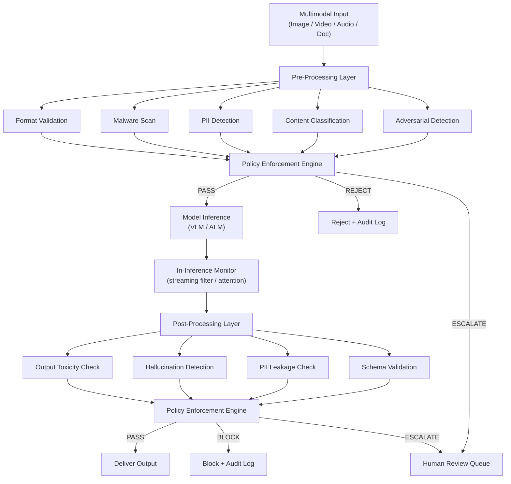

# Part 8 — Guardrails & Sanitization for Multimodal AI

A production-grade technical reference for designing, implementing, and operating guardrail and sanitization systems across image, video, audio, and document modalities in enterprise AI deployments.

> **Audience:** Principal AI Architects, AI Platform Engineers, AI Security Architects, Trust & Safety Engineers
> **Coverage:** Guardrail Architecture · Content Moderation · PII Detection · Deepfake Detection · Sanitization Pipelines · Framework Comparison
> **As of:** July 2026

---

## Guardrail Architecture Overview

Guardrails in multimodal AI systems operate at three distinct phases: before model inference, during inference, and after the model produces output. Each phase addresses different threat vectors and imposes different latency budgets. A mature enterprise system operates all three layers simultaneously, with the pre-processing layer bearing the heaviest workload.

### Pre-Processing Guardrails

Pre-processing guardrails intercept raw inputs before they reach the model. For multimodal systems this means format validation, malware scanning, PII detection across all modalities, content policy classification (violence, NSFW, hate), and adversarial perturbation detection. These checks run in parallel where possible. Budget: typically 50–150 ms for a standard image or 1–2 seconds for a 60-second audio clip.

The pre-processing layer is the cheapest place to enforce policy. A reject decision here avoids model inference cost entirely — critical for high-volume enterprise workloads where inference may cost $0.01–$0.10 per call.

### In-Inference Guardrails

In-inference guardrails monitor model behavior in real time, typically implemented as:

- Token-level streaming filters that interrupt generation when policy-violating content appears
- Attention pattern monitors that detect the model attending to known adversarial triggers in the input
- Confidence threshold monitors that flag low-confidence multimodal grounding as requiring human review
- Tool-call interceptors for agentic multimodal systems that validate tool arguments before execution

In-inference guardrails add 2–10 ms per token depending on implementation. For vision-language model (VLM) outputs this phase is less granular than for text generation — typically it involves monitoring the first tokens of the response for policy signals.

### Post-Processing Guardrails

Post-processing guardrails validate model outputs before they reach the user or downstream system. For VLMs this includes:

- Output toxicity classification
- Factual consistency checks against the input image/document
- Hallucination detection (output claims that contradict visual evidence)
- PII leakage detection in generated text
- Structured output schema validation (critical for document extraction agents)

Post-processing adds 30–100 ms depending on secondary model complexity.

### Policy Enforcement Engine

The policy enforcement engine is the orchestration layer that coordinates all three phases, maintains per-tenant policy configurations, logs decisions, and routes borderline cases to human review queues. Enterprise implementations typically use a policy-as-code approach (OPA or Cedar) that allows policy updates without redeployment. The engine must support:

- Per-customer policy overrides (a medical platform has different NSFW thresholds than a consumer chatbot)
- Severity-based routing (high-severity violations → immediate reject; medium → human escalation; low → log only)
- Policy versioning and rollback
- Audit-grade decision logging with input hashes, policy version, and outcome

---

## Content Moderation by Modality

### Image Guardrails

**Violence, weapons, blood, self-harm detection** uses multi-class classifiers trained on datasets such as LAION-Aesthetics filtered subsets, internal moderation datasets, and government-provided illegal content hashes (PhotoDNA). Production systems maintain separate classifiers for: weapons-only (firearms, bladed weapons), blood/gore, depictions of violence in progress, and self-harm imagery. Thresholds are tuned independently per context — a hunting equipment retailer needs different weapon thresholds than a children's education platform.

**Adult/NSFW content detection** typically involves a cascade: a fast binary classifier (NSFW/SFW) at the front, followed by a multi-label fine-grained classifier for regulatory compliance (toplessness, explicit content, partial nudity). Enterprise systems must handle artistic nudity exceptions for healthcare and art platforms.

**Face detection and privacy protection** uses a face detector (MTCNN, RetinaFace, or YOLOv8-face) followed by a decision: blur, pixelate, or redact faces based on policy. In enterprise document processing, face detection on ID documents is critical for GDPR compliance.

**Age estimation and minor protection** runs after face detection. Models such as MiVolo or DEX estimate apparent age from detected faces. Any detected face with estimated age below 18 triggers elevated scrutiny or outright rejection for NSFW contexts. False positive rates on age estimation are high — calibrate thresholds conservatively and rely on human review for borderline cases.

**Brand logo detection and copyright protection** uses object detection models fine-tuned on logo datasets (Logo-2K+) to identify brand marks in user-submitted images. This enables enforcement of brand usage policies and flags potential trademark violations in generated content.

**Deepfake and synthetic media detection** is covered in depth in the interview use cases section below. Detection models include FaceForensics++-trained classifiers (e.g., EfficientNet-B4), frequency-domain analysis (FFT artifact detection), and biological signal analysis (rPPG — remote photoplethysmography — detects absence of natural skin color variation in synthetic faces). Accuracy degrades significantly for compressed video (post-social-media-upload), which is the realistic enterprise attack scenario.

**Political content detection** uses multi-label classifiers trained on news imagery datasets. Enterprise platforms processing user-generated content in regulated sectors (banking, healthcare) often adopt zero-tolerance policies for political imagery in AI-generated content.

**Government ID detection** (passports, driver's licenses, SSN cards) uses a combination of document type classifiers and template matching. Detection triggers automatic PII masking or rejection depending on policy. ID document ingestion in KYC workflows requires explicit exemption policies.

**Medical record detection** uses document classification models (LayoutLM, DocFormer) to identify HIPAA-covered medical record formats: clinical notes, lab results, DICOM viewer screenshots, prescription images.

### Video Guardrails

**Frame-level content moderation** applies the same image classifiers described above to sampled frames. Production systems use adaptive sampling: fast scene change detection (optical flow or histogram difference) determines where to sample, ensuring key transitions are not missed. A fixed 1 fps sample rate misses flash violence or momentary NSFW frames — use at minimum 2 fps and 100% sampling at detected scene changes.

**Temporal context (brief vs sustained content)** matters for policy enforcement. A single frame of a weapon in a historical documentary is different from 30 seconds of weapon handling. Enterprise guardrail systems implement temporal context windows: if a policy-violating class exceeds threshold in more than N% of frames over a T-second window, it triggers an escalation versus a single frame that may be a false positive.

**Audio track moderation** processes the audio channel independently using the audio guardrails described below, then correlates audio and video classification results. Audio-visual correlation catches cases where each modality alone is borderline but combined clearly violates policy (e.g., audio with explicit lyrics synchronized to suggestive imagery).

**Synthetic video (deepfake) detection** for streaming video introduces latency constraints. Production systems use lightweight temporal consistency detectors that analyze facial landmark trajectories across frames — synthetic faces exhibit unnatural landmark jitter and blending artifacts at frame boundaries that are detectable at video-frame rate without full per-frame deepfake inference.

### Audio Guardrails

**Profanity and hate speech detection** in audio operates in two ways: (1) ASR-first pipeline (transcribe then classify text) using Whisper or a streaming ASR model, followed by a text hate-speech classifier; (2) direct audio classification using models such as Audio Spectrogram Transformer (AST) fine-tuned on audio hate speech datasets. The ASR-first approach achieves higher accuracy for language-specific content but adds 200–500 ms latency. Direct audio classification is faster but less accurate, especially for multilingual or accented speech.

**Voice cloning / synthetic audio detection** uses a combination of: spectral artifact detection (GAN-generated speech has characteristic spectral inconsistencies), speaker verification against claimed identity (if the user claims to be a specific individual, verify against an enrolled voiceprint), and anti-spoofing models (ASVspoof competition models, SpeechBrain). Detection accuracy against high-quality voice clones (ElevenLabs, VALL-E) is currently 70–85% in ideal conditions and drops further on compressed audio.

**Call recording consent compliance** for healthcare and financial services requires detecting jurisdiction-specific consent language at the start of calls, or injecting consent announcements. Systems must log consent status per call for regulatory audit.

**PII in speech** (credit card numbers, SSN, account numbers) uses ASR transcription followed by a regex/NER pipeline similar to text PII detection, with specialized patterns for spoken number formats ("four one one two" spoken as separate digits vs "four thousand, one hundred twelve"). Redaction replaces detected spans with silence or a beep tone in the audio output.

### Document Guardrails

**Financial document PII masking** targets account numbers, routing numbers, Social Security Numbers, Tax Identification Numbers, and credit card numbers in scanned PDFs, images, and extracted text using NER models fine-tuned on financial documents.

**Medical record protection** in document processing uses LayoutLM-based classifiers to identify HIPAA-covered PHI zones — patient name header regions, date of birth fields, MRN fields — and applies masking before any third-party processing.

**Identity document protection** detects government ID templates and triggers either rejection or controlled-workflow routing with enhanced access logging.

**Watermark detection and copyright** uses both visible watermark detection (image segmentation identifying watermark overlays) and invisible watermark reading (C2PA-compliant watermark extraction, Stable Diffusion watermark detection via Stable Signature).

---

## PII Detection & Masking Pipeline

PII in multimodal systems exists in three distinct forms that require different detection technologies:

**Text PII** (in extracted text, OCR output, transcriptions): names, emails, phone numbers, SSNs, credit card numbers, dates of birth, addresses. Detection uses transformer-based NER (GLiNER, spaCy with custom components, AWS Comprehend, Azure AI Language) plus regex patterns for structured PII formats. Confidence threshold: 0.85 minimum before masking to avoid false positives in business text.

**Visual PII** (in images and video frames): faces (biometric identity), license plates (location inference), vehicle identification numbers, handwritten signatures, passport photos, fingerprints. Detection uses purpose-built computer vision models for each subtype — face detectors, OCR-based license plate readers (OpenALPR, Plate Recognizer), signature detectors, fingerprint detectors.

**Audio PII** (in recordings and transcriptions): voice biometrics (speaker identity from voiceprint), spoken PII (account numbers, names), background audio clues (location, other speakers). Detection combines speaker diarization with identity verification against enrolled voiceprints, plus ASR-to-text PII pipelines.

### Masking Strategies by Context

- *Redaction*: replace with black box (documents), silence (audio), black rectangle (images). Irreversible. Use for external sharing.
- *Pixelation*: coarsen pixel resolution over PII zone. Cosmetically less intrusive than black boxes. Reversibility risk if pixelation level too low — use minimum 16x16 block size.
- *Blurring*: Gaussian blur over detected face/plate region. Preferred for video as it introduces less visual discontinuity than pixelation. Same reversibility caveat — use radius ≥ 20px.
- *Tokenization*: replace PII value with a stable pseudonymous token (HMAC of original value + system salt). Enables referential integrity across documents while protecting identity. Preferred for data analytics pipelines.
- *Synthetic replacement*: replace detected PII with plausible synthetic data (Faker library for text; GAN-synthesized face swaps for images). Highest utility preservation for ML training data generation.

---

## Guardrail Framework Comparison Matrix

| Framework | Image | Video | Audio | PII | Deepfake | Latency Overhead | Extensibility | Enterprise Support | Cost Model |
|-----------|-------|-------|-------|-----|----------|-----------------|---------------|-------------------|------------|
| Azure AI Content Safety | Strong | Frames only | No | Via Azure PII | Limited | 80–200 ms | Moderate (custom categories) | Enterprise SLA | Per-call |
| AWS Bedrock Guardrails | Moderate | No | No | Strong (text) | No | 100–300 ms | Moderate | Enterprise SLA | Per-call |
| NeMo Guardrails | Text-focused | No | No | Plugin | No | 50–150 ms | High (programmable) | Community + NVIDIA | OSS |
| OpenAI Moderation API | Moderate | No | No | No | No | 50–100 ms | Low | Enterprise SLA | Per-call |
| Lakera Guard | Text-focused | No | No | Via LLM | No | 30–80 ms | Moderate | Enterprise SLA | Per-call |
| Protect AI | Moderate | No | No | Moderate | No | 100–200 ms | High | Enterprise SLA | License |
| NVIDIA NIM Safety | Strong | Via frames | No | Plugin | Limited | 50–120 ms | High (NIM plugin) | Enterprise | License |
| Google Safe Messaging API | Moderate | Limited | No | No | No | 80–150 ms | Low | Enterprise SLA | Per-call |
| Microsoft Presidio | Text + Image | No | Limited | Strong | No | 20–80 ms | Very High (OSS) | Community | OSS |
| Guardrails AI | Text-focused | No | No | Via validators | No | 30–100 ms | Very High (validators) | Community + Commercial | OSS/License |

*Latency overhead = incremental latency added to standard inference path. "Frames only" = video support via frame extraction, not native video stream processing.*

---

## Sanitization Pipeline Design

### Image Sanitization Pipeline

```mermaid
flowchart LR
    RAW["Raw Image Input"] --> FV["Format Validation\n(magic bytes check)"]
    FV --> EXIF["EXIF Stripping\n(GPS, device ID, timestamps)"]
    EXIF --> MAL["Malware Scan\n(TIFF/SVG scripts)"]
    MAL --> PII["PII Masking\n(faces, plates, docs)"]
    PII --> WM["Watermark Detection"]
    WM --> ADV["Adversarial Perturbation\nDetection"]
    ADV --> NORM["Resolution & Size\nNormalization"]
    NORM --> CS["Color Space\nNormalization"]
    CS --> CLEAN["Sanitized Image"]
```

**Format validation** reads the first 16 bytes (magic bytes) of the file to verify the actual format matches the claimed extension. A JPEG disguised as a PNG, or a malicious TIFF with embedded scripts claiming to be a JPG, is detected here. Use libmagic or equivalent — never trust the file extension alone.

**EXIF stripping** removes all EXIF metadata using a library such as piexif (Python), ExifTool, or libexif. EXIF can contain GPS coordinates (revealing user location), device serial number (linking anonymous uploads to specific devices), and software version (fingerprinting user environment). Strip before any processing that persists the image.

**Malware scanning** is non-trivial for images. TIFF and SVG formats can embed JavaScript (SVG is XML, can contain `<script>` tags). Modern malware also hides payloads in high-bit-depth PNG metadata sections. Scan with ClamAV plus custom rules for image-specific vectors. For DICOM medical images, remove private DICOM tags which can embed executable code.

**PII masking** runs face detection, license plate detection, and document detection in parallel. Each detected region is masked using the policy-specified strategy (blur, pixelate, redact). Confidence thresholds: face detection >0.7, license plate >0.85, document >0.8.

**Adversarial perturbation detection** identifies images with crafted pixel noise designed to fool downstream classifiers or VLMs. Detection approaches include: JPEG compression artifact analysis (adversarial perturbations survive JPEG decompression poorly), high-frequency component analysis (adversarial patches have distinctive spectral signatures), and consistency checks between multiple detection models.

**Resolution and size normalization** enforces enterprise limits: maximum input dimensions (e.g., 4096×4096), minimum dimensions for quality assurance, and file size caps. Downsampling uses Lanczos resampling for quality preservation.

**Color space normalization** converts all inputs to sRGB (or the model's expected color space). Medical DICOM images use MONOCHROME2 grayscale — VLMs not trained on grayscale input need appropriate pre-processing.

### Video Sanitization

Container validation verifies the video container format (MP4, MKV, WebM) matches its declared type. Codec normalization transcodes all input video to a standardized codec (H.264 baseline profile) to eliminate codec-level vulnerabilities. Metadata stripping removes all container-level metadata (creation date, encoder software, GPS tags in MP4). Frame extraction with per-frame malware checks runs the image sanitization pipeline on sampled keyframes. Audio track isolation separates the audio channel for independent audio sanitization before reassembly. Keyframe selection for model input uses scene change detection to select maximally informative frames within the model's context window.

### Audio Sanitization

Format normalization standardizes all audio to 16 kHz, mono channel, 16-bit PCM WAV — the format expected by Whisper and most production ASR systems. Silence removal using Voice Activity Detection (VAD, e.g., Silero VAD) strips non-speech segments. Noise reduction (RNNoise, DeepFilterNet) improves ASR accuracy and removes background audio that might contain unintended PII. Malware scanning for audio containers (MP4, OGG Vorbis) checks for embedded metadata scripts. Profanity masking replaces detected profanity spans with 200 Hz sine wave tone (the "bleep"). Speaker anonymization uses voice conversion (CycleGAN-VC or similar) to change speaker characteristics while preserving linguistic content — used when audio must be shared externally without identifying the original speaker.

### Document Sanitization

OCR cleanup and whitespace normalization removes OCR artifacts (broken words, spurious characters, inconsistent spacing) using a post-OCR correction model. Macro and embedded script detection scans DOCX, XLSX, and PDF files for macros (python-docx, openpyxl) and embedded scripts before any content extraction. PDF JavaScript stripping removes all JavaScript from PDF files using PyMuPDF's `set_js()` method with empty string, or pikepdf's `open()` and `save()` with `linearize=True` to strip non-essential streams. Hidden text extraction reviews and classifies text with white-on-white color, font size 0, or rendering mode "invisible" — a common exfiltration vector in adversarially crafted documents. Metadata stripping removes author name, revision history, tracked changes, and custom properties that may reveal internal system information.

---

## Enterprise Guardrail Architecture Pattern

The **gateway pattern** places a dedicated guardrail middleware service between the API gateway and the model inference service. All requests pass through the guardrail middleware, which fans out to modality-specific checkers (image, audio, document) in parallel, collects results, applies the policy engine decision, and either forwards the sanitized request to inference or returns a policy violation response.

**Async vs synchronous guardrail execution**: synchronous execution is required for inputs that are too risky to process speculatively (high-volume consumer platforms, regulatory environments). Async execution (submit for guardrail check, receive callback when cleared) is appropriate for batch document processing workflows where sub-second latency is not required and throughput is paramount.

**Caching guardrail results**: identical inputs (same content hash) need not be re-evaluated. A Redis or Memcached layer with a TTL of 24 hours caches (content_hash, policy_version) → (decision, confidence). Cache invalidation is triggered by policy version updates. This reduces guardrail infrastructure cost by 30–60% in workloads with repeated inputs (e.g., a customer service bot processing the same product image multiple times per day).

**Confidence-based human escalation**: guardrail decisions below a confidence threshold (typically 0.7–0.8) route to human reviewers rather than making an automated decision. Enterprise systems implement a review queue with SLA-based routing: high-risk content (probable policy violation) to a 15-minute SLA queue, low-risk borderline content to a 4-hour SLA queue.

**Audit logging** captures for every guardrail decision: input content hash (SHA-256), timestamp, policy version applied, each checker's result and confidence, final decision, and reviewer outcome if escalated. Logs are written to an append-only audit store (AWS S3 with Object Lock, Azure Immutable Blob Storage) for regulatory compliance. Retention minimum: 7 years for financial services, 6 years for healthcare.

---

## Interview Use Cases

### Q1: How would you design a guardrail system for a consumer-facing multimodal chatbot that must comply with both GDPR and COPPA while maintaining sub-500 ms latency?

The architecture layers three concerns: GDPR (data minimization, consent, right to erasure), COPPA (minor protection, parental consent), and the 500 ms latency budget.

For COPPA, the first guardrail is age gate enforcement at account creation (verified by parental consent flow), but the system cannot rely on this alone — users can lie. Therefore every image input runs a real-time minor detection check: face detection followed by age estimation. For any face with estimated age below 18, the input routes through an enhanced review pipeline and NSFW classifiers are forced to maximum sensitivity. This adds ~80 ms for face detection + age estimation (MiVolo model on GPU).

For GDPR, EXIF stripping runs on every image before any model inference — this is non-negotiable data minimization. Face blurring is applied to any faces in the sanitized image stored in session logs. Content analysis results are stored but the original images are not persisted beyond the session (right to erasure is trivial — only session metadata needs deletion).

For the 500 ms budget: run format validation (5 ms), EXIF stripping (10 ms), malware scan (20 ms), and content classification (80 ms GPU) in series; run PII detection (60 ms), minor detection (80 ms), and NSFW classification (70 ms) in parallel with content classification on separate GPU threads. The critical path is approximately 115 ms for pre-processing, leaving 385 ms for model inference — achievable with a quantized VLM (GPT-4o mini, Claude Haiku, or Gemini Flash). Post-processing (toxicity check, PII leakage) runs in 40 ms. Total: ~155 ms guardrails + ~300 ms inference + ~40 ms post-processing = ~495 ms.

### Q2: What are the technical challenges of deepfake detection in real-time video streams, and how would you build a production-grade detection system?

The core technical challenge is that deepfake detection accuracy degrades severely under real-world conditions: social media compression (H.264 at low bitrates destroys the spectral artifacts that detection models rely on), lighting variation (models trained on studio-quality deepfakes fail on low-light video), and continuous model advancement (new generation models like Sora and Veo produce content that defeats detectors trained on previous generation content).

A production-grade system uses a multi-signal ensemble: (1) Frequency domain analysis — compute the DCT frequency spectrum of each frame; GAN-generated content has characteristic high-frequency artifacts that survive moderate compression. Compute cost: <5 ms per frame on CPU. (2) Biological signal analysis — rPPG detects natural skin color oscillation at 0.75–3 Hz (heartbeat rate); synthetic faces lack this signal. Requires a 10-second clip for reliable detection. Compute cost: 50 ms per 10-second window. (3) Facial landmark trajectory analysis — track 68 facial landmarks across frames; synthetic faces exhibit unnatural jitter patterns (too smooth or unnaturally erratic). Compute cost: 10 ms per frame. (4) Scene consistency analysis — detect blending boundaries at the face boundary using edge-aware filtering. Compute cost: 15 ms per frame.

For real-time streams (30 fps), implement the lightweight signal (frequency domain + landmark trajectory) at full frame rate and the expensive signals (rPPG) at 10-second windows. Ensemble the signals with a calibrated logistic regression meta-classifier. Key operational requirement: log a detection confidence history, not a single binary decision — trend analysis over 30+ seconds is far more reliable than per-frame binary classification. Threshold for automated action (blocking): >0.9 confidence sustained over 10+ seconds. Between 0.7 and 0.9: flag for human review. Below 0.7: pass with warning flag in audit log.

### Q3: How do you implement PII sanitization for audio recordings in a healthcare call center that processes 50,000 calls per day?

A 50,000 call/day workload at an average call length of 8 minutes is approximately 6,600 hours of audio per day. This is a batch processing problem — real-time sanitization is not required, but throughput and HIPAA compliance are paramount.

Architecture: a Kafka queue receives completed call recordings from the telephony system. A fleet of Kubernetes pods runs the sanitization pipeline: (1) Silero VAD segments audio into speech/silence; (2) Whisper large-v3 transcribes each segment (running on A10G GPUs, ~7× real-time throughput = one GPU processes ~168 minutes of audio per hour; for 6,600 hours/day you need ~40 GPU-hours, so ~2 GPUs running 24/7 with buffer); (3) a PII NER model (GLiNER fine-tuned on healthcare vocabulary) detects PHI spans in transcripts — patient names, dates, MRNs, phone numbers, medication names combined with patient identifiers; (4) detected spans are aligned back to audio timestamps using Whisper's word-level timestamps; (5) the audio is rewritten with silence replacing each PHI span; (6) the sanitized audio and redacted transcript are written to a HIPAA BAA-covered S3 bucket with SSE-KMS encryption; (7) the original audio is retained in a separate restricted-access vault for legal hold.

For the HIPAA Safe Harbor de-identification standard, 18 PHI identifiers must be removed including names, dates (other than year), geographic data below state level, and phone numbers. The Expert Determination standard requires a statistician to certify that re-identification risk is acceptably low — appropriate when some date precision must be preserved for clinical quality metrics.

### Q4: Design a document sanitization pipeline for a bank that receives 1 million PDFs per day from customers and must prevent all macro/script attacks.

One million PDFs per day is ~11.6 PDFs per second peak (assuming uniform distribution) or ~30–50 PDFs/second at peak business hours. The pipeline must be horizontally scalable and stateless.

Stage 1 — Triage (5 ms per document): compute file hash (SHA-256), check against known-malicious hash blocklist (ClamAV virus signature database + FS-ISAC threat intelligence), and route PDF to quarantine on match. No content parsing needed for known-bad files.

Stage 2 — Static analysis (20–50 ms per document): use pikepdf to open the PDF in strict mode. Check for: JavaScript presence (`/JS` or `/JavaScript` dictionary entries), launch actions (`/Launch`), form submission actions (`/SubmitForm`), embedded files (`/EmbeddedFile`), hidden annotation actions. Strip all detected active content using pikepdf's save with `object_stream_mode=pikepdf.ObjectStreamMode.generate` and no JavaScript. Log all stripped elements to the security event stream.

Stage 3 — Structural analysis (50–100 ms): extract page count, font list, image count, embedded objects. Flag structural anomalies: >200 pages from a customer submission (potential zip bomb analogue), >50 MB uncompressed, embedded PDF-within-PDF (common exploit vector). Route flagged documents to a sandboxed rendering environment.

Stage 4 — Sandboxed rendering (200–500 ms): render each page in a gVisor-isolated container using a hardened Ghostscript or MuPDF build with all network access disabled and filesystem access limited to a tmpfs mount. If the renderer crashes, classify the PDF as malicious. Extract rendered page images and text from the safe rendering output.

Scale: Stage 1–3 runs on CPU-based containers at ~200 documents/second per pod. Stage 4 (sandboxed rendering) requires ~5 containers per 10 PDFs/second throughput target. At 50 PDFs/second peak: ~25 rendering containers, horizontally autoscaled via KEDA based on queue depth.

---

## Related

- [Part 7 — Security & Threat Taxonomy](./part-07-security-threats) — adversarial attacks and threat modeling for multimodal systems
- [Part 9 — Compliance & Responsible AI](./part-09-compliance-responsible-ai) — regulatory requirements for multimodal guardrail systems
- [AI Security Governance](../ai-security-governance/index.md) — enterprise security controls and governance frameworks
- [Enterprise AI Architecture Patterns](../enterprise-architecture/ai-architecture/enterprise-ai-architecture-patterns.md) — architectural patterns including guardrail middleware
