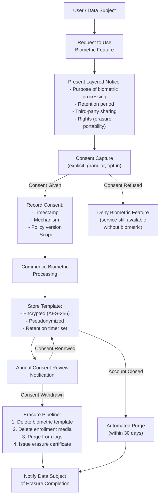

# Part 9 — Compliance & Responsible AI for Multimodal Systems

A comprehensive reference for regulatory compliance, biometric data governance, fairness, explainability, and content provenance in enterprise multimodal AI deployments across regulated industries.

> **Audience:** AI Risk & Compliance Officers, Enterprise Architects, Principal AI Architects, Legal & Privacy Counsel
> **Coverage:** EU AI Act · GDPR · HIPAA · PCI DSS · Biometric Governance · Responsible AI · C2PA · Content Provenance
> **As of:** July 2026

---

## Regulatory Landscape Overview

### Why Multimodal AI is Uniquely Regulated

Text-only AI systems handle a limited class of personal data — primarily names, opinions, and behavioral patterns inferred from language. Multimodal systems process biometric data (faces, voices, fingerprints), health data (medical images, symptom descriptions combined with visual assessment), location data (GPS from EXIF metadata, background identification), and behavioral data (gait, emotional expression, eye movement) simultaneously and in combination.

This combination creates regulatory obligations that have no equivalent in text AI. A VLM that reads a scanned prescription and identifies the patient's face in the document header processes both health data (the medication) and biometric data (the face) in a single inference step. Under GDPR, this activates Article 9 special categories protections. Under HIPAA, it activates PHI processing obligations. Under the EU AI Act, depending on the use case, it may qualify the system as high-risk. No single regulatory framework anticipated this convergence — architects must navigate across multiple frameworks simultaneously.

### Biometric Data Special Category

Biometric data receives the highest level of regulatory protection across virtually every major framework. Under GDPR Article 4(14), biometric data means personal data resulting from specific technical processing relating to the physical, physiological, or behavioural characteristics of a natural person that allows or confirms the unique identification — facial images, voice recordings (voiceprints), iris patterns, fingerprints, gait.

The critical compliance trap: a facial image alone is not biometric data under GDPR unless it is processed for the purpose of uniquely identifying a person. A VLM that describes the contents of an image (including that a face appears) without performing identity matching does not necessarily process biometric data. However, a VLM that is asked "who is this person?" and matches against a database performs biometric categorization and is subject to Article 9 restrictions.

### Cross-Border Data Transfer Implications

Multimodal data frequently moves across borders during inference: a user in Germany uploads an image that is processed on US-based GPU infrastructure. Under GDPR Chapter V, this transfer requires an adequacy decision, Standard Contractual Clauses (SCCs), or Binding Corporate Rules. For biometric data specifically, the transfer is additionally restricted under Article 9 — the lawful basis for the transfer must encompass the biometric special category, not just ordinary personal data.

Cloud providers address this through regional inference endpoints (EU-West model deployments on Azure, AWS eu-central-1 Bedrock) and in-region data residency guarantees. For highest-compliance environments (German banking, French public sector), air-gapped on-premises or sovereign cloud deployment may be required.

---

## Regulation Deep Dive

### EU AI Act

The EU AI Act (effective August 2024, full enforcement August 2026) classifies AI systems into four tiers: unacceptable risk (prohibited), high-risk, limited risk (transparency obligations), and minimal risk. Multimodal systems are primarily affected at the high-risk and unacceptable-risk tiers.

**High-risk AI system classification criteria:** A multimodal agent qualifies as high-risk if it is used in one of the Annex III categories: biometric identification and categorization, critical infrastructure (energy, water, transport), education (assessing students), employment (screening candidates), essential private and public services (credit scoring, benefits assessment), law enforcement, migration and asylum, and administration of justice. An agentic VLM that analyzes resumes including photographs (common in non-EU markets) is a high-risk employment screening system if deployed in the EU.

**Biometric categorization systems:** Any AI system that categorizes people based on biometric data is prohibited (Article 5) unless specific exceptions apply. *Categorization* means inferring sensitive attributes — race, ethnicity, political opinions, religious beliefs, sexual orientation — from biometric data such as facial features or voice characteristics. Emotion recognition in workplaces and educational institutions is separately prohibited under Article 5(1)(f).

**Real-time remote biometric identification (RTRBI):** The use of AI systems for real-time remote biometric identification of natural persons in publicly accessible spaces for law enforcement is prohibited except for specific, narrowly defined purposes (preventing terrorist attacks, finding victims of trafficking or missing children, prosecuting serious crimes). For non-law-enforcement commercial use (retail analytics identifying shoppers, stadium surveillance matching ticket holders to faces), RTRBI is prohibited in public spaces.

**Technical documentation requirements for multimodal high-risk systems** (Article 11, Annex IV): must include a general description of the AI system and its intended purpose; description of the training, validation, and testing data including data governance practices; description of the monitoring, functioning, and control of the system; description of the risk management system; and for biometric systems specifically, the demographic scope of training data and accuracy metrics disaggregated by demographic group.

**Conformity assessment for biometric systems:** High-risk systems in Annex III categories 1 (biometric) and 6 (law enforcement) require third-party conformity assessment by a notified body before deployment. This means an accredited external auditor must review the system design, training data, accuracy metrics, and risk management documentation.

**Post-market monitoring:** High-risk system providers must implement post-market monitoring systems that collect and analyze data on system performance throughout its lifetime, including notifying the market surveillance authority of serious incidents within defined timeframes.

### GDPR

**Special categories of personal data (Article 9):** Processing biometric data for the purpose of uniquely identifying a natural person, as well as health data and data revealing racial or ethnic origin, is prohibited unless one of ten specific conditions is met. The most relevant for enterprise multimodal AI are: explicit consent of the data subject; processing necessary for employment law obligations; processing necessary for reasons of substantial public interest (with suitable safeguards); processing for medical diagnosis or healthcare (under professional secrecy obligations).

**Lawful basis for multimodal processing:** Ordinary GDPR processing (Article 6) requires one of six lawful bases: consent, contract, legal obligation, vital interests, public task, or legitimate interests. For multimodal systems processing biometric or health data, Article 6 lawful basis is required *and* an Article 9 exception must separately apply. Both must be established before processing begins.

**Data subject rights for biometric data:** The right to erasure (Article 17) requires that biometric templates derived from personal data be deleted when the data subject requests erasure. This is technically challenging for systems that embed biometric identity into model weights during fine-tuning — the model may need retraining or the use of machine unlearning techniques. The right to data portability (Article 20) applies when processing is based on consent or contract — biometric templates must be exportable in a machine-readable format.

**Privacy by design (Article 25):** Controllers must implement appropriate technical measures (data minimization, pseudonymization) both at the time of design and by default. For multimodal AI: face blurring before storage, limiting biometric template retention to the minimum necessary duration, pseudonymizing voice recordings before analysis.

**Data minimization for multimodal data:** Frame extraction from video should use the minimum number of frames necessary for the intended purpose. Audio sampling should not retain the full recording if only the transcription is needed. For a fraud detection system that needs to verify document authenticity, the document image should not be retained after verification is complete.

**DPA notification for biometric processing:** Many EU member state data protection authorities (DPAs) require notification or prior consultation before commencing large-scale biometric processing. Germany's Datenschutzkonferenz, France's CNIL, and Italy's Garante have all issued specific guidance on facial recognition requiring prior DPA consultation.

### HIPAA

**PHI in medical imaging:** DICOM files contain 18 classes of PHI in metadata tags: patient name (0010,0010), patient ID (0010,0020), patient birth date (0010,0030), institution name (0008,0080), and 14 others. Any cloud-based VLM processing DICOM files must strip these tags before transmission or must operate under a Business Associate Agreement (BAA) with appropriate data handling controls. The pixel data itself — the actual medical image — is PHI if it can identify the patient (e.g., a photograph of the patient's face from a dermatology visit is PHI; an X-ray of an anonymous bone fracture may not be).

**Audio PHI:** Voice recordings in healthcare settings are PHI when they contain patient health information. This includes clinical consultation recordings, telehealth visit recordings, and call center recordings about patient conditions. Transcriptions derived from PHI audio are themselves PHI.

**De-identification standards — Safe Harbor:** The Safe Harbor method requires removing all 18 PHI identifiers and having no actual knowledge that the remaining information could identify an individual. For images: remove DICOM metadata, blur or remove patient faces and photographs, remove visible tattoo identifiers (common in dermatology). For audio: remove name mentions, remove dates more specific than year, remove geographic identifiers smaller than state.

**De-identification — Expert Determination:** A qualified statistician applies generally accepted principles to certify that the risk of identifying an individual is very small. Allows retention of some identifiers (truncated dates, three-digit ZIP codes) that Safe Harbor prohibits. Required for clinical research datasets where date precision matters.

**BAA requirements for cloud multimodal services:** Azure (Azure AI Services, Azure OpenAI), AWS (Bedrock, SageMaker), and Google Cloud (Vertex AI) all offer BAAs. The BAA must explicitly cover the specific services used for PHI processing — a BAA for general cloud storage does not automatically extend to AI inference services. Check the BAA service scope carefully.

**Minimum necessary standard:** Only the PHI that is the minimum necessary to accomplish the intended purpose should be accessed or disclosed. For a clinical documentation assistant that transcribes patient encounters: the transcription service should receive the audio recording, but downstream services (NLP analysis, billing code extraction) should receive only the transcription — not the audio — unless the audio is specifically needed.

### PCI DSS

**Card data in images:** Customers frequently photograph physical credit cards and send them to customer service agents. The card image contains PAN (Primary Account Number), cardholder name, expiration date, and CVV. A multimodal AI that receives such an image enters PCI DSS scope for that interaction. Controls required: the image must not be stored after the card data is extracted; the raw image must be purged from logs; access to the system is subject to PCI DSS access control requirements (MFA, need-to-know access).

**Audio PCI:** Call center recordings where customers speak card numbers are in PCI DSS scope. Card Data Environment (CDE) extends to the audio storage and processing infrastructure. Required controls include: pause-resume recording during card number dictation (most telephony platforms support this natively), or post-call redaction of PAN and CVV spans identified by ASR + PII detection.

**OCR controls for card data:** Systems that OCR card images must implement controls equivalent to those for any PAN-containing system: encryption at rest (AES-256), encryption in transit (TLS 1.2+), access logging, quarterly vulnerability scanning.

**Scope reduction strategies:** The most effective strategy for multimodal payment processing is to route payment image/audio processing through a PCI-compliant vault service that extracts the card data, returns only a token, and purges the original media. The multimodal AI system then operates on the token rather than the raw card data, reducing its PCI DSS scope.

### Additional Regulations

**SOX (Sarbanes-Oxley):** Financial document integrity requires that document processing AI systems for financial reporting maintain audit trails of all transformations applied to source documents. VLMs processing financial statements must log input document hashes, extracted values, and model version for each processing run.

**ISO 42001 (AI Management System):** The international standard for AI management systems (published 2023) requires organizations to establish, implement, maintain, and continually improve an AI management system. For multimodal AI: this includes maintaining an AI system inventory with risk classification, impact assessment procedures for new multimodal capabilities, and controls for data quality and model performance monitoring.

**ISO 27001:** Information security management system standard. Multimodal data (images, audio, video) typically requires higher storage and transmission security classifications than text, given the biometric and sensitive content risk. ISO 27001 Annex A controls A.8.10 (information deletion) and A.8.11 (data masking) are directly applicable to multimodal PII.

**NIST AI RMF:** The NIST AI Risk Management Framework's four functions (Govern, Map, Measure, Manage) apply directly to multimodal AI. The Measure function requires fairness and bias metrics disaggregated by demographic group — for face recognition this means accuracy metrics by race/gender/age cohort. The Govern function requires documentation of organizational roles and accountability for AI system decisions.

**NIST AI 100-1 (Trustworthy AI):** Defines six characteristics of trustworthy AI: accurate, explainable and interpretable, privacy-enhanced, reliable and robust, safe, and fair with harmful bias managed. Multimodal systems are most challenged on explainability (VLM attention visualization) and bias (demographic disparities in face recognition, accent disparities in ASR).

**DORA (Digital Operational Resilience Act):** EU regulation for financial services ICT risk management. For multimodal AI in financial sector: incident reporting requirements (major incidents involving AI decision failures must be reported to regulators within 4 hours), third-party ICT provider oversight (cloud VLM providers are third-party ICT providers subject to DORA oversight), and ICT operational resilience testing (multimodal AI systems must be included in penetration testing scope).

**MAS TRM / RBI / APRA:** Monetary Authority of Singapore (MAS) Technology Risk Management guidelines, Reserve Bank of India (RBI) technology risk framework, and Australian Prudential Regulation Authority (APRA) CPS 234 all impose technology risk management requirements on financial sector multimodal AI. Common requirements include: board-level AI risk governance, model risk management frameworks that cover VLMs and multimodal systems, and data residency controls.

**SOC 2 Type II / FedRAMP:** Cloud-hosted multimodal AI services require SOC 2 Type II for commercial enterprise and FedRAMP Moderate or High for US government use. FedRAMP High authorization covers systems processing Controlled Unclassified Information (CUI) — federal medical records, law enforcement biometrics. Check that the specific AI service (not just the underlying cloud) holds the relevant authorization.

**CCPA / CPRA:** California's privacy law treats biometric data (facial recognition data, voiceprint data, fingerprint data) as "sensitive personal information" subject to the right to limit use. Businesses must not use biometric data for purposes beyond the disclosed purpose without separate consent. CPRA's expanded enforcement (California Privacy Protection Agency) has issued enforcement guidance specifically addressing biometric data in AI systems.

---

## Biometric Data Governance

**Consent management for facial recognition** requires a granular consent architecture: separate consent for initial capture, for identity template creation, for ongoing matching, and for sharing with third parties. Consent must be withdrawable at any time, triggering deletion of the biometric template (not just the source image). Implement consent as structured metadata linked to the biometric record, with automated enforcement: if consent record shows withdrawn status, API calls using that biometric template return a policy rejection.

**Voice biometric enrollment and deletion:** Voice biometric systems require an explicit enrollment step where the user provides voice samples for template creation. The enrollment flow must: state clearly that a voice template is being created, obtain explicit consent, inform the user of their rights to delete the template. Deletion must remove both the template and the enrollment audio. Deletion verification requires a confirmation mechanism (re-authentication, email confirmation) to prevent accidental deletion.

**Retention schedules for biometric templates:** Industry guidance and regulatory expectations converge on: biometric templates should be retained only for the duration of the active relationship (e.g., while the user has an active account) plus a short legal hold period. Many data protection authorities expect templates to be purged within 30 days of relationship termination. Build automated purge jobs triggered by account closure events.

**Cross-border transfer of biometric data:** Under GDPR, biometric data transfer to non-EEA countries requires either SCCs with a Transfer Impact Assessment (TIA) confirming adequate protection at destination, or consent from each affected data subject specifically for the cross-border transfer. For cloud VLM inference: use EU-region model endpoints to keep biometric data within the EEA.

**Children's biometric data — COPPA implications:** US COPPA (Children's Online Privacy Protection Act) prohibits collecting persistent identifiers from children under 13 without verifiable parental consent. Biometric identifiers — facial recognition templates, voiceprints — are persistent identifiers under COPPA. Systems that may be accessed by minors must implement age verification before any biometric template creation, and must provide mechanisms for parents to request deletion of their child's biometric data.

---

## Compliance Matrix

| Regulation | Facial Recognition | Voice ID | Document OCR | Video Surveillance | Medical Imaging | Financial Documents |
|-----------|------------------|----------|-------------|-------------------|----------------|-------------------|
| **EU AI Act** | High-risk (Art 6) or prohibited RTRBI (Art 5) | High-risk if for law enforcement ID | Low-risk unless Annex III use case | Prohibited if real-time public space | High-risk if clinical decision support | Low-risk unless credit scoring |
| **GDPR** | Art 9 special category; explicit consent or public interest basis required | Art 9 biometric; DPIA required for large-scale | Art 6 lawful basis; minimize retention | Art 9 biometric; DPIA; data minimization | Art 9 health data; healthcare exemption | Art 6 lawful basis; contractual necessity |
| **HIPAA** | PHI if patient identity inferable | PHI if healthcare-related recording | PHI if patient-identifiable | PHI if healthcare setting | PHI — full DICOM controls + BAA | Not covered unless combined with PHI |
| **PCI DSS** | N/A unless combined with card | N/A unless card spoken | Card data in scope if PAN visible | N/A unless card visible | N/A | In scope if financial statements contain PAN |
| **CCPA/CPRA** | Sensitive PI; right to limit use | Sensitive PI; right to limit | Personal info if identifiable | Sensitive PI if persistent ID | Sensitive PI; health category | Personal info if individual identifiable |
| **ISO 42001** | Risk assessment required; human oversight for high-stakes | Risk assessment; accuracy monitoring | Impact assessment | Risk assessment; bias monitoring | High-risk classification; clinical validation | Impact assessment; accuracy metrics |
| **NIST AI RMF** | Bias metrics by demographic; explainability | WER by accent group; fairness | Accuracy by document type | Temporal bias; demographic fairness | Clinical concordance metrics | Accuracy by document complexity |

---

## Responsible AI for Multimodal Systems

### Bias and Fairness

**Demographic bias in face recognition** is well-documented: systems achieve lowest accuracy for dark-skinned women and highest accuracy for light-skinned men (Buolamwini & Gebru, 2018; NIST FRVT 2019). Enterprise deployments must measure accuracy disaggregated by at minimum: skin tone (Fitzpatrick scale), gender presentation, and age cohort. Minimum acceptable performance gap between best and worst demographic group: typically 5 percentage points for enterprise use; 2 percentage points for law enforcement use.

**Accent bias in ASR** causes Word Error Rate (WER) to be significantly higher for non-native English accents, African American Vernacular English (AAVE), and regional dialects. A call center ASR system with average WER 8% may show WER 25% for AAVE speakers. Mitigations: fine-tune on demographically diverse training data, implement per-speaker adaptive decoding, measure and report WER by accent group in the AI system card.

**Document bias:** OCR systems perform worse on handwritten documents, degraded scans, non-Latin scripts, and low-contrast ink. Enterprise document processing must characterize accuracy by document quality tier (pristine/scan/photocopy/damaged) and report accuracy separately.

### Fairness Metrics

**Equalized odds** for face recognition: the true positive rate (correctly identifying a person) and false positive rate (falsely matching to wrong person) should be equal across demographic groups. Equalized odds failure means the system makes different errors for different groups — the most dangerous failure mode for law enforcement or access control applications.

**WER disparity** across accent groups: measured as the absolute WER difference between the highest-WER and lowest-WER demographic groups. A target of <5 percentage points absolute WER gap is a reasonable enterprise fairness threshold for call center ASR.

### Explainability

**Saliency maps** highlight which pixels in an image most influenced the model's output. For VLMs: GradCAM, LIME, and attention rollout provide visual explanations of which image regions the model attended to when generating a response. Critical for high-stakes decisions: a medical imaging VLM that flags a lesion should produce a saliency map showing which region was anomalous.

**Attention visualization** for transformer-based VLMs shows cross-attention weights between image patches and output tokens, revealing which visual tokens the model "read" when generating specific output words.

**LIME/SHAP for multimodal:** LIME (Local Interpretable Model-agnostic Explanations) perturbs image segments and measures output change. SHAP (SHapley Additive exPlanations) computes Shapley values for image patches. Both are computationally expensive for high-resolution inputs — use on sampled explanations or asynchronously for regulatory audit purposes rather than in real-time inference.

### Hallucination in Multimodal

**Visual hallucination:** VLMs generate descriptions of objects, people, or text that are not present in the image. Common types: object hallucination (describing a dog not in the image), attribute hallucination (wrong color attribution), relationship hallucination (incorrect spatial relationships). Detection: use HallusionBench or POPE benchmark patterns; implement double-check prompting where the model is asked to verify each claim against the image.

**Temporal hallucination in video:** Video VLMs assert events occurred at specific timestamps when they did not. Often caused by the model reasoning from single frames rather than temporal context. Detection: sample-based verification where specific claimed events are re-verified against the relevant timestamp.

**Confidence calibration:** Expected Calibration Error (ECE) measures the discrepancy between a model's stated confidence and its actual accuracy. A VLM with ECE > 0.1 is poorly calibrated — its confidence scores cannot be used to gate human review escalation. Calibration is performed post-training using temperature scaling or Platt scaling on a held-out calibration set.

### Human Oversight for High-Stakes Decisions

Medical imaging diagnosis, fraud detection, and eligibility determination based on multimodal evidence require human review of AI outputs before consequential action. The oversight model should specify: which decision types require mandatory human review; what information the reviewer sees (AI recommendation, confidence, saliency map, source evidence); what the reviewer's authority is (approve, reject, request more information); and how reviewer decisions are logged. EU AI Act Article 14 mandates human oversight for all high-risk AI systems.

### Accessibility

**Alt-text generation** for images using VLMs provides screen reader accessible descriptions for visually impaired users. Systems must be evaluated for alt-text quality and appropriateness — avoid alt-text that infers race, ethnicity, or other sensitive attributes not relevant to the image content.

**Audio description generation** for video content using VLMs + TTS enables access for visually impaired users. Quality metric: British Audio Description Association quality standards or WCAG 2.1 Success Criterion 1.2.5.

---

## Content Provenance & Synthetic Media

### C2PA (Coalition for Content Provenance and Authenticity)

C2PA is an open technical standard (v2.1 as of 2025) for attaching cryptographically signed provenance metadata to media files. A C2PA manifest embedded in an image or video records: who created it (content binding), when it was created (timestamp from a trusted time-stamping authority), what hardware/software captured it (claim generator), and what edits have been applied (ingredient and action history).

For enterprise multimodal AI: C2PA enables verification that AI-generated content is labeled as such, that source documents have not been tampered with, and that chain-of-custody is maintained for evidence-grade document processing. Adobe Content Credentials, Microsoft Azure Media Provenance, and Truepic all implement C2PA.

**JPEG Trust / IPTC standards:** IPTC Photo Metadata Standard and JPEG Trust (successor to JPEG standard for trust metadata) provide complementary provenance frameworks for still images, particularly for news media and photography.

### Watermarking

**Visible watermarks** are overlaid marks (text, logo, pattern) visible to the human eye. Easily removed but provide clear attribution notice. Used for draft documents and preview images.

**Invisible watermarks** embed imperceptible signals in image pixel values or audio frequency components. Survives JPEG compression at quality >70. Allows downstream detection of AI-generated content without altering perceptual quality. Google SynthID (for Gemini-generated images), Meta's Stable Signature, and Imatag are leading implementations.

**Fragile watermarks** break when the media is altered — used for integrity verification (any edit destroys the watermark). **Robust watermarks** survive common transformations (JPEG compression, resizing, color adjustment) — used for content provenance tracking.

**Digital signatures for media authenticity:** C2PA uses RSA or ECDSA signatures over a hash of the content claim. The certificate chain links back to a trusted Certificate Authority recognized by the C2PA trust list. Verifiers check both signature validity and CA trust chain.

### Synthetic Content Disclosure Obligations

The EU AI Act requires that content generated by AI systems that could be mistaken for authentic human content must be labeled as AI-generated. The FTC (US) has issued guidance that AI-generated content in advertising must be disclosed. Several US states (California AB 2655) require disclosure of AI-generated political media. Enterprise systems that generate synthetic images, audio, or video must implement disclosure mechanisms at the point of creation (C2PA manifest, visible watermark, metadata tag) and at the point of distribution (on-screen label, audio announcement).

---

## GDPR Consent Workflow for Biometric Data

---

## Interview Use Cases

### Q1: A bank wants to deploy a real-time voice biometric authentication system for their call center. Walk through all regulatory requirements across GDPR, PCI DSS, and the EU AI Act

**GDPR:** Voice biometric authentication processes biometric data for the purpose of uniquely identifying a person — squarely within Article 9 special categories. The lawful basis must be explicit consent (Article 9(2)(a)) because the banking relationship is not the type of vital interest or employment obligation that provides an alternative basis. The bank must: obtain explicit, granular, opt-in consent before any voice enrollment; provide a non-biometric authentication alternative for customers who decline consent (failure to provide an alternative makes consent involuntary and therefore invalid); maintain a consent audit trail; implement the GDPR consent workflow described above including erasure capabilities; conduct a DPIA (Data Protection Impact Assessment) before deployment of any large-scale biometric system (Article 35(3)(b) mandates DPIA for biometric processing at scale); notify the relevant DPA if the DPIA shows high residual risk.

**PCI DSS:** Voice biometric authentication for call center transactions where card data is discussed places the authentication system within the Cardholder Data Environment (CDE) scope. Requirements: the voice authentication system must be included in the quarterly vulnerability scan scope; access to voice biometric templates must be on a need-to-know basis with MFA; voice biometric logs must be retained per PCI DSS log retention requirements (12 months, 3 months immediately available); the vendor providing the biometric solution must be assessed as a PCI DSS compliant service provider (SAQ D or equivalent).

**EU AI Act:** A voice biometric system used for remote identification of customers qualifies as a biometric identification system under Annex III Category 1 — high-risk. High-risk requirements: complete technical documentation per Annex IV; risk management system with identification and analysis of known/foreseeable risks; data governance covering training data demographic representation (voice enrollment data must cover age, gender, accent diversity); human oversight mechanism (a human must be able to intervene in or override biometric authentication decisions); conformity assessment if the system falls under direct customer-facing high-risk categories (bank must engage a notified body for third-party conformity assessment); registration in the EU AI Act database before deployment.

**Architectural implications:** Deploy voice enrollment on EU-region infrastructure (GDPR cross-border transfer compliance). Implement a consent microservice as a prerequisite gate — no enrollment API call succeeds without a valid consent record. Implement template deletion as a first-class API endpoint (not a support ticket process). Separate the biometric matching service from the call recording service (minimize biometric data surface area).

### Q2: How do you implement HIPAA-compliant processing of medical imaging data in a multi-cloud multimodal AI pipeline?

HIPAA compliance for medical imaging in a multi-cloud pipeline requires addressing three areas: data residency and transfer, access controls, and audit trail.

**Data residency:** PHI (including DICOM images) must remain on infrastructure covered by a BAA. Establish BAAs with each cloud provider (AWS, Azure, GCP) for the specific services used — Bedrock, Azure OpenAI, Vertex AI each require separate BAA coverage. Do not use cross-cloud data replication that moves images outside BAA-covered infrastructure. For multi-cloud, implement a federated inference pattern where each cloud region processes only images originating from that region's healthcare facilities.

**De-identification before cross-system transmission:** Apply de-identification at the point of ingest (hospital PACS system → preprocessing service). Use the HIPAA Safe Harbor method: strip all 18 DICOM metadata PHI tags using a library like pydicom with a tag whitelist allowlist. The de-identified image set (pixel data only, anonymized) can be processed by a broader range of downstream services. Retain the original PHI-bearing images in the HIPAA-covered vault with access logs.

**Access controls:** Implement role-based access control (RBAC) with least privilege: radiologists can access full PHI images; AI model inference services receive de-identified images; clinical decision support outputs are linked to the PHI record by a pseudonymous token. All access to PHI images generates HIPAA-required audit log entries: who accessed, when, what was accessed, from what system.

**Audit trail:** Each image processing event must log: image identifier (not the patient name — use MRN or pseudonymous token), timestamp, AI model version, clinical staff who reviewed AI output, and final disposition. Audit logs must be retained for 6 years (HIPAA minimum). Store in an immutable audit store (AWS S3 with Object Lock COMPLIANCE mode, which cannot be overridden even by the bucket owner).

**Business continuity:** HIPAA requires that PHI remains accessible during disasters. Implement cross-region replication of audit logs (not PHI images, unless the receiving region is also BAA-covered). Test failover procedures quarterly.

### Q3: What does privacy by design mean in the context of a facial recognition system, and how would you implement it architecturally?

Privacy by design (Article 25, GDPR) requires that privacy protections are built into the system architecture from the start, not added as an afterthought. For facial recognition specifically, this means seven principles: proactive not reactive; privacy as the default; privacy embedded into design; full functionality (not privacy vs. security trade-off); end-to-end security; visibility and transparency; respect for user privacy.

**Architecturally, privacy by design for facial recognition means:**

*Data minimization:* The system captures the minimum biometric data necessary. For access control (door unlocking), a face embedding (128-dimensional vector) is sufficient — store the embedding, not the raw image. Never store the raw face image unless there is a specific, documented business need. Implement a "capture, embed, discard" pipeline: face image → embedding → immediate image deletion.

*Template separation:* Store biometric templates in a dedicated biometric vault service with its own access controls, encryption keys, and audit logs, separate from the application database. The application only sends an embedding comparison request and receives a match/no-match result — it never directly accesses biometric templates.

*Pseudonymization:* Link biometric templates to pseudonymous identifiers, not directly to names or account numbers. The mapping table (pseudonym → real identity) is held in a separate, highly restricted system. Compromise of the biometric vault exposes templates linked to pseudonyms, not directly to identities.

*Consent-first architecture:* Implement consent as a hard dependency on template creation. The biometric service API rejects enrollment requests that do not include a valid, current consent token issued by the consent management service. Consent withdrawal triggers immediate template deletion via an event-driven pipeline (consent-withdrawn event → biometric vault deletion job → audit log → notification to data subject).

*Accuracy by design:* Run demographic accuracy testing before deployment. Document the system card with accuracy metrics by demographic group. Set escalation thresholds so that low-confidence matches (below 0.95) require human confirmation rather than automated access grant/deny.

### Q4: How would you build an audit trail system for multimodal AI decisions that satisfies both GDPR data minimization and DORA's ICT incident documentation requirements?

GDPR data minimization requires that audit logs contain only what is necessary for the stated purpose. DORA requires that logs for financial sector ICT incidents be complete, tamper-evident, and available for regulatory review. These requirements appear to conflict: DORA wants everything, GDPR wants the minimum.

The resolution is a tiered audit architecture with purpose-specific retention:

*Tier 1 — Operational Logs (30-day retention):* Every AI decision event logged with: pseudonymous session ID (not user name), input content hash (not the input itself), model version, decision outcome, confidence score, timestamp, and latency metrics. These logs support operational monitoring, performance trending, and incident response. They contain no personal data (pseudonymous ID is not personal data if the mapping is held separately).

*Tier 2 — Compliance Logs (7-year retention for financial services, 6-year for healthcare):* For decisions with a regulatory footprint (credit decisions, insurance claims, clinical recommendations), log: decision rationale summary (minimum necessary — the AI's top 3 contributing factors), human reviewer identity (pseudonymized), and final outcome. Cross-reference to Tier 1 operational logs via the pseudonymous session ID. Access restricted to compliance and audit roles.

*Tier 3 — Incident Logs (DORA ICT incident documentation):* When a Tier 1 log pattern triggers an incident threshold (error rate spike, latency P99 breach, safety classifier triggered), promote the relevant log range to immutable incident storage with full event context. For DORA major incidents, promote to a tamper-evident store with cryptographic chaining (each log entry hash includes the previous entry hash — a blockchain-lite structure). Report to competent authority within DORA's 4-hour initial notification window.

*GDPR reconciliation:* Pseudonymous session IDs satisfy data minimization because they are not personal data. Re-identification of a session to a specific individual requires joining with a separately held, access-controlled mapping table. GDPR Article 11 provides that GDPR rights (access, erasure) apply only to the extent that the controller can identify the data subject — if the mapping table is held separately under strict controls, the audit logs themselves are outside GDPR scope for most purposes. Erasure requests are handled by deleting the mapping table entry, which effectively anonymizes all associated audit log entries.

---

## Related

- [Part 8 — Guardrails & Sanitization](./part-08-guardrails-sanitization) — technical implementation of the guardrail systems this chapter governs
- [Part 10 — Evaluation & Benchmarks](./part-10-evaluation-benchmarks) — fairness metrics and evaluation frameworks for responsible AI
- [AI Security Governance](../ai-security-governance/index.md) — enterprise security controls and AI governance frameworks
- [Sovereign & Constitutional AI](../sovereign-constitutional-ai/index.md) — constitutional AI, responsible AI operating models
- [NIST AI Standards & CAISI](../nist-ai-standards/index.md) — NIST AI RMF, AI 100-1, and CAISI implementation guidance
