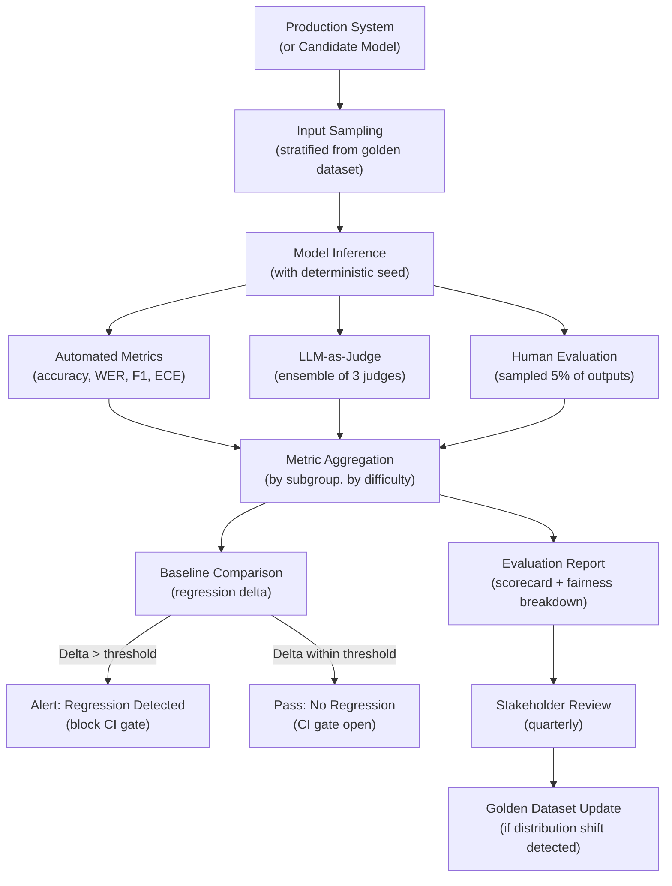

# Part 10 — Evaluation & Benchmarks for Multimodal AI

A comprehensive technical reference for benchmarks, evaluation methodologies, golden dataset construction, and LLM-as-judge approaches for enterprise multimodal AI systems across vision, video, audio, and document modalities.

> **Audience:** AI Platform Engineers, ML Engineers, Evaluation Specialists, Principal AI Architects
> **Coverage:** Benchmark Taxonomy · VLM Benchmarks · Video & Audio Benchmarks · OCR & Document Benchmarks · Agent Benchmarks · LLM-as-Judge · Golden Datasets
> **As of:** July 2026

---

## Evaluation Philosophy for Multimodal AI

### Why Multimodal Evaluation is Harder

Text evaluation is comparatively tractable: reference answers exist, string overlap metrics (BLEU, ROUGE) provide a baseline, and human evaluation scales reasonably well because annotators need only language competence. Multimodal evaluation adds fundamental complexity along four axes:

*Perceptual grounding:* The evaluator must verify that model outputs are grounded in the visual, audio, or document input — not just plausible text. A model that produces fluent, accurate-sounding descriptions of an image it hallucinated has passed text evaluation but failed multimodal evaluation. Evaluating grounding requires either human annotators with domain expertise or a multimodal judge that can perceive the input.

*Cross-modal consistency:* Does the model's audio transcription agree with its image description when both refer to the same event? Does the model's answer to a document visual question match what the document actually shows? These consistency checks require cross-modal reasoning by the evaluator.

*Modality-specific quality:* Image quality metrics (perceptual sharpness, color fidelity), audio quality metrics (MOS — Mean Opinion Score), and OCR quality metrics (character error rate, field extraction accuracy) require domain-specific evaluation tooling and expertise.

*Adversarial sensitivity:* Multimodal models are uniquely vulnerable to adversarial inputs — pixel-level perturbations, audio noise injection, font changes in documents — that do not affect human perception but dramatically change model behavior. Evaluation must include robustness testing across adversarially perturbed inputs.

### Evaluation Dimensions

- *Capability:* What tasks can the model perform and at what accuracy?
- *Robustness:* Does performance degrade gracefully under input quality degradation, distribution shift, or adversarial perturbation?
- *Safety:* Does the model comply with content policies, avoid hallucination, and refuse appropriately?
- *Fairness:* Are capability and robustness metrics consistent across demographic groups, languages, and input variations?
- *Efficiency:* What is the latency, throughput, and cost per inference unit?

### Automated vs Human Evaluation

Automated evaluation (benchmark datasets with ground truth, metric computation) scales, is reproducible, and is cheap. Human evaluation captures nuance, cross-modal grounding verification, and subjective quality that automated metrics miss. The gap between automated and human evaluation is largest for: open-ended visual question answering, image caption quality, and audio description naturalness.

Enterprise evaluation strategy: automated benchmarks for regression tracking (daily CI gate), human evaluation for model selection decisions and quarterly capability assessment, adversarial red teaming quarterly.

### Regression vs Comparative vs Adversarial Evaluation

*Regression evaluation* compares a new model/prompt version against a baseline, detecting performance degradation. Run daily or on every PR. Metrics: delta from baseline, not absolute score.

*Comparative evaluation* pits two candidate models against each other to select the superior option for a specific use case. Run at model selection decision points. Requires statistical significance testing (N ≥ 500 examples per comparison for 80% power at 5% significance).

*Adversarial evaluation* systematically constructs inputs designed to expose model failure modes. Run quarterly or before deployment to high-stakes applications. Output: ranked list of failure modes with reproduction rate.

---

## Benchmark Taxonomy & Deep Dive

### Vision & VLM Benchmarks

**COCO (Common Objects in Context):** The foundational benchmark for object detection (2D bounding boxes) and instance segmentation. 118,000 training images, 5,000 validation images with 80 object categories and 5 captions per image. Primary metrics: mAP@0.5 for detection, mAP@0.5:0.95 for segmentation. Still the gold standard for object detection evaluation. Limitation: object categories are everyday consumer objects — no medical, satellite, or document-specific categories.

**ImageNet / ImageNet-A / ImageNet-R / ObjectNet:** ImageNet-1K (1,000 classes, 1.2M training images) is the reference for image classification. Production evaluation should use robustness variants: ImageNet-A (naturally adversarial images that fool standard classifiers), ImageNet-R (artistic renditions — cartoons, paintings, origami — that test shape vs texture bias), ObjectNet (controlled test set with object pose and background variation removed to eliminate dataset bias). Enterprise note: ImageNet accuracy has near-zero correlation with domain-specific performance (medical, satellite, document).

**DocVQA:** Document Visual Question Answering. 50,000 question-answer pairs over 12,767 document images including handwritten, printed, and typed text. The primary benchmark for enterprise document intelligence VLMs. Metric: Average Normalized Levenshtein Similarity (ANLS) which is more lenient than exact match. Limitation: documents are primarily English; significant performance gap exists for multilingual documents.

**ChartQA:** 9,608 charts with 20,882 question-answer pairs. Covers bar charts, line charts, pie charts, and scatter plots. Tests both data extraction (read exact value from y-axis) and reasoning (which year had the highest growth?). Critical benchmark for business intelligence applications. Metric: relaxed accuracy allowing 5% numerical tolerance.

**TextVQA:** Visual question answering over images containing text in natural scenes (store signs, product labels, street signs). 28,408 images, 45,336 questions. Tests OCR capability in uncontrolled conditions — rotated text, varied fonts, partial occlusion. Metric: VQA accuracy (answer matches any of 10 reference annotations).

**MMMU (Massive Multi-discipline Multimodal Understanding):** 11,500 questions across 30 subjects and 6 image types (diagrams, tables, charts, chemical structures, photographs, music sheets). Subjects span science, technology, engineering, mathematics, humanities, and arts. The most comprehensive single benchmark for evaluating VLMs on university-level multi-discipline reasoning. Metric: accuracy. Why it matters for enterprise: the 30-subject scope correlates better with real enterprise task diversity than any single-domain benchmark.

**MMMU-Pro:** A harder version of MMMU with 3,460 questions featuring process-level evaluation — the model must show step-by-step reasoning, not just produce a final answer. Measures reasoning quality, not just outcome accuracy. Enterprise use: evaluating chain-of-thought reliability for complex document analysis tasks.

**MMBench:** Comprehensive VLM benchmark decomposed into 20 sub-skills including attribute recognition, object localization, relation reasoning, future prediction, and commonsense reasoning. 2,974 multiple-choice questions. Enables fine-grained capability profiling — useful for identifying specific weaknesses before enterprise deployment.

**AI2D (Allen AI Diagrams):** 4,903 diagrams from science textbooks with 15,000 multiple-choice questions about diagram understanding. Covers biology, physics, chemistry, and earth science. Enterprise relevance: tests the model's ability to read and interpret technical diagrams — relevant for manufacturing, engineering, and scientific document processing.

**MathVista:** 6,141 examples testing mathematical reasoning in visual contexts — geometry proofs, statistical chart analysis, physics diagrams. Metric: accuracy. Critical for evaluating VLMs intended for financial data extraction (reading tables, interpreting graphs) or educational platforms.

**OCRBench:** 1,000 instances specifically testing OCR-related understanding: text recognition, text localization, handwriting recognition, and document understanding. More fine-grained than DocVQA for diagnosing OCR-specific failures vs reasoning failures.

**HallusionBench:** 1,129 visual questions specifically designed to probe hallucination. Questions are paired: a real question and a trick question about an object not present in the image. Measures object hallucination rate and counterfactual hallucination. Critical for enterprise deployment where hallucinated content in AI outputs creates legal or reputational risk.

**POPE (Polling-based Object Probing Evaluation):** 9,000 binary questions ("Is there a {object} in the image?") across three sampling strategies — random, popular (commonly co-occurring objects), and adversarial. Measures object existence hallucination specifically. Metric: F1 score. High POPE score is a prerequisite for enterprise document processing VLMs.

### Video Benchmarks

**VideoMME:** Comprehensive video question answering benchmark with short (< 2 min), medium (4–15 min), and long (30–60 min) video clips. Tests temporal reasoning, event localization, and content understanding across 30 domains. Metric: accuracy. The reference benchmark for evaluating video VLM temporal reasoning at different timescales.

**MVBench:** Multi-task video understanding benchmark with 20 challenging temporal reasoning tasks including action sequence understanding, scene transition reasoning, and counterfactual reasoning. 4,000 multiple-choice questions. Enterprise relevance: tests whether the model understands what happened *over time*, not just what appears in a single frame.

**EgoSchema:** 5,031 multiple-choice questions over egocentric video clips (first-person perspective). 3-minute clips requiring temporal context spanning the full clip. Critical for evaluating wearable AI, industrial inspection agents, and healthcare monitoring systems.

**ActivityNet QA:** Question-answering over the ActivityNet activity recognition dataset covering 200 activity classes. Tests action recognition combined with temporal reasoning.

**Charades:** 9,848 videos of people performing activities in home environments. Multi-label activity recognition with compositional queries ("putting down a book while sitting"). Tests compositionality and multi-label prediction.

**Perception Test:** DeepMind benchmark covering four skills: memory, abstraction, physics, and semantics across video and audio. Tests temporal reasoning with a focus on causal understanding (why did X happen?). Enterprise relevance: robustness testing for agentic video analysis systems.

### Audio & Speech Benchmarks

**LibriSpeech:** 960 hours of English audiobook speech. Clean subset (test-clean) and noisy subset (test-other). WER on test-clean is the most commonly reported ASR benchmark metric. Limitation: audiobook speech has distinctly different acoustic characteristics from conversational call center speech — do not use LibriSpeech WER as the sole quality metric for call center ASR.

**Common Voice:** Mozilla's community-contributed multilingual speech dataset. 100+ languages, crowdsourced from volunteers. Tests multilingual ASR and accent diversity. Critical for enterprise systems deployed in multilingual markets (EU financial services, Asian telco).

**VoxCeleb 1 & 2:** 1,251 and 6,112 celebrity speakers respectively. Used for speaker verification (same/different speaker?) and speaker identification. The standard benchmark for enterprise voice biometric systems.

**SUPERB (Speech Processing Universal PERformance Benchmark):** Evaluation framework covering 10 speech processing tasks: speech recognition, speaker identification, speaker verification, emotion recognition, keyword spotting, intent classification, slot filling, semantic parsing, speech enhancement, and speech separation. Uses a shared pretrained representation model evaluated on each task with minimal task-specific fine-tuning. Enables holistic evaluation of speech foundation models.

**FLEURS (Few-shot Learning Evaluation of Universal Representations of Speech):** 102-language speech benchmark built from the multilingual FLoRes text benchmark. Tests both ASR and language identification. Critical for evaluating multilingual speech AI systems intended for global enterprise deployment.

**AIR-Bench (Audio Instruction-following):** Tests audio LLMs on instruction-following tasks over environmental sounds, music, and speech. Questions like "what is the dominant instrument in this clip?" or "describe the soundscape." Enterprise relevance: evaluating audio agents that must understand context beyond pure speech.

**AudioBench:** Comprehensive benchmark for audio LLMs covering speech understanding, environmental sound understanding, and music understanding. More recent than AIR-Bench, with broader coverage of real-world audio diversity.

**GigaSpeech:** 10,000-hour multi-domain English ASR corpus covering audiobooks, podcasts, YouTube. Tests ASR in real-world noisy conditions. Better proxy for enterprise call center ASR than LibriSpeech.

### OCR & Document Benchmarks

**FUNSD (Form Understanding in Noisy Scanned Documents):** 199 noisy scanned forms with semantic entity labeling (header, question, answer, other) and entity linking. Tests form field understanding in low-quality scans — representative of real enterprise document intake. Metric: F1 for entity recognition and relation prediction.

**SROIE (Scanned Receipts OCR and Information Extraction):** 1,000 scanned receipt images. Tasks: text localization, OCR, and key information extraction (company name, date, address, total). Metric: entity-level F1. Directly applicable to expense processing and accounts payable automation.

**RVL-CDIP (Ryerson Vision Lab Complex Document Information Processing):** 400,000 grayscale document images across 16 document type classes (letter, memo, email, form, handwritten, invoice, advertisement, budget, news, note, report, resume, scientific publication, scientific report, specification, and file folder). Document classification benchmark — the foundation for document routing systems.

**CORD (Consolidated Receipt Dataset):** 11,000 Indonesian receipt images with parsed key-value information. Tests multi-lingual document extraction. More structured than SROIE.

**DocILE (Document Information Localization and Extraction):** 12,000 business documents (invoices, purchase orders, delivery notes) with field localization (bounding box) and value extraction. Emphasizes both finding where information is (localization) and reading it correctly (extraction). Enterprise relevance: directly models the invoice processing use case.

**VRDU (Visually Rich Document Understanding):** Google's benchmark for understanding complex document layouts with interleaved text, tables, and figures. Two datasets: Registration Form (1,544 documents) and Ad-Buy Form (2,000 documents). Tests layout-aware information extraction.

### Agent & Reasoning Benchmarks

**GAIA (General AI Assistants):** 466 questions requiring real-world task completion with multi-step reasoning, tool use (web search, code execution, file handling), and multimodal understanding. Three difficulty levels. GAIA questions test whether AI agents can reliably accomplish the kind of research and analysis tasks a human assistant performs. Currently, frontier models score 50–70% on Level 1 questions and <30% on Level 3.

**AgentBench:** Multi-environment evaluation for LLM agents: web browsing, database operations, lateral-thinking puzzles, house-holding tasks (Alfworld), coding, and operating systems. Tests agent generalization across diverse task types.

**τ-bench (Tau-bench):** Evaluates agents on realistic customer service tasks (airline booking, e-commerce returns) with stochastic user simulation. Tests instruction-following, policy compliance, and multi-turn task completion under real-world conditions.

**WebArena / VisualWebArena:** WebArena provides realistic web environments (shopping, social forum, GitLab, CMS) for web navigation agents. VisualWebArena extends this with visually grounded tasks that require understanding page screenshots, not just HTML. The primary benchmark for evaluating web-browsing multimodal agents.

**OSWorld:** Evaluates computer use agents on real desktop applications (LibreOffice, Chrome, GIMP, VLC) in real OS environments. 369 tasks across 9 categories. The reference benchmark for computer use agents (Claude Computer Use, Operator).

**AppAgent:** Evaluates mobile app interaction agents on Android apps. Tests swipe, tap, and text entry in app interfaces — applicable to mobile automation use cases.

---

## Benchmark Comparison Matrix

| Benchmark | Modality | Task Type | Size | License | Enterprise Relevance | Limitations |
|-----------|---------|-----------|------|---------|---------------------|-------------|
| COCO | Image | Detection/Segmentation | 118K images | CC BY 4.0 | Medium | Consumer objects only |
| ImageNet | Image | Classification | 1.2M images | Research | Low | Distribution shift from real data |
| DocVQA | Document | VQA | 50K QA pairs | CC BY 4.0 | Very High | English-only |
| ChartQA | Chart | QA + Reasoning | 20K QA pairs | CC BY 4.0 | High | Mostly Western-style charts |
| TextVQA | Scene text | VQA | 45K QA pairs | CC BY 4.0 | High | Uncontrolled scene conditions |
| MMMU | Multi-discipline | Reasoning | 11.5K questions | CC BY 4.0 | Very High | Academic-domain focus |
| MMMU-Pro | Multi-discipline | Process eval | 3.4K questions | CC BY 4.0 | High | Smaller size |
| MMBench | Vision | Multi-skill | 2.9K questions | CC BY 4.0 | High | Multiple-choice only |
| AI2D | Science diagram | VQA | 15K questions | CC BY 4.0 | Medium | Science domain |
| MathVista | Math+Vision | Reasoning | 6.1K questions | CC BY 4.0 | Medium-High | Math focus |
| OCRBench | Document | OCR | 1K instances | Unspecified | High | Small dataset |
| HallusionBench | Image | Hallucination | 1.1K questions | CC BY 4.0 | Very High | Binary probing |
| POPE | Image | Hallucination | 9K questions | CC BY 4.0 | Very High | Object existence only |
| VideoMME | Video | Multi-task QA | Multi-duration | CC BY 4.0 | Very High | English-focused |
| MVBench | Video | Temporal reasoning | 4K questions | CC BY 4.0 | High | Indoor-biased |
| EgoSchema | Egocentric video | QA | 5K questions | CC BY 4.0 | High | First-person POV |
| LibriSpeech | Speech | ASR | 960 hrs | CC BY 4.0 | Medium | Audiobook domain |
| Common Voice | Speech | ASR multilingual | 100+ languages | CC0/CC BY 4.0 | High | Quality varies by language |
| VoxCeleb | Speaker | Verification | 6K speakers | CC BY 4.0 | Very High | Celebrity domain bias |
| SUPERB | Speech | Multi-task | 10 tasks | Various | Very High | Shared encoder constraint |
| FLEURS | Speech | 102 languages | 102 languages | CC BY 4.0 | High | Few-shot setting |
| FUNSD | Document | Form understanding | 199 forms | CC BY 4.0 | High | Small dataset |
| SROIE | Document | Receipt OCR | 1K receipts | Unspecified | Very High | Receipt format |
| RVL-CDIP | Document | Classification | 400K images | Unspecified | Very High | Classification only |
| DocILE | Document | Extraction | 12K documents | CC BY 4.0 | Very High | Business documents |
| VRDU | Document | Layout understanding | 3.5K documents | Research | High | Form-focused |
| GAIA | Agent | Real-world tasks | 466 tasks | CC BY 4.0 | Very High | Frontier model ceiling |
| WebArena | Agent | Web navigation | Multi-env | MIT | Very High | Web-specific |
| OSWorld | Agent | Computer use | 369 tasks | Apache 2.0 | High | Desktop app scope |

---

## LLM-as-Judge for Multimodal

### When LLM-as-Judge Works

LLM-as-Judge (using a powerful model to evaluate another model's output) works well for: evaluating open-ended VQA responses where multiple correct phrasings exist; assessing output coherence and relevance; evaluating answer completeness; and comparing two candidate responses for preference. GPT-4o and Gemini 1.5 Pro are the most commonly used multimodal judges as of July 2026.

### When LLM-as-Judge Fails for Visual Evaluation

LLM-as-Judge fails or produces unreliable results for: verifying visual grounding (whether a claim is actually supported by the image — the judge VLM may itself hallucinate); evaluating spatial precision (is the bounding box accurate?); low-level perceptual quality assessment (is this OCR output correct character by character?); and domain-specific correctness that requires expert knowledge (is this medical diagnosis appropriate?).

### Rubric Design for Visual Quality Evaluation

Effective judge prompts for multimodal evaluation specify: (1) the specific aspect being evaluated, not "overall quality"; (2) a concrete 1–5 scale with behavioral anchors at each level; (3) explicit instructions to verify claims against the provided image before scoring; (4) chain-of-thought elicitation before the score to improve calibration. Example rubric for OCR accuracy evaluation:

- 5: All text extracted with no errors, correct spatial ordering maintained
- 4: Minor formatting differences but all information correctly captured
- 3: Some text missing or incorrect, but key information present
- 2: Significant text loss or errors that affect comprehension
- 1: Output does not represent the document content

### Bias Patterns in Multimodal Judges

*Position bias:* When presented with two responses (A vs B), the judge prefers the first response 55–65% of the time independent of content quality. Mitigation: always evaluate both orderings and average the scores.

*Sycophancy / verbosity preference:* Longer, more detailed responses are preferred even when less accurate. Mitigation: include explicit rubric instructions that penalize unnecessary verbosity; evaluate a random sample with human judges to calibrate.

*Self-preference:* GPT-4o as judge tends to prefer GPT-4o outputs; Gemini prefers Gemini outputs. Mitigation: use a different model family as judge than the models being evaluated, or use an ensemble of judges from different families.

*Overconfidence for visual claims:* LLM judges sometimes confidently evaluate visual grounding claims they cannot actually verify because the image is not in the judge's context, or because the judge itself hallucinates from the image. Mitigation: always include the source image in the judge context; add explicit verification instructions.

### Calibration: Correlation with Human Judgments

A multimodal judge is well-calibrated if its scores correlate with human judgments at Spearman ρ ≥ 0.8. Calibrate judges by: (1) collecting 200–500 human-judged examples on the specific task; (2) computing Spearman correlation between judge scores and human scores; (3) adjusting judge temperature and rubric until correlation meets threshold; (4) re-calibrating quarterly as model behavior evolves.

### Ensemble Judging for Multimodal

A single LLM judge has variance that makes it unreliable for individual evaluations. An ensemble of 3–5 judges (from different model families) with majority voting or score averaging reduces variance by √N. For high-stakes model selection decisions, use a 3-judge ensemble with tie-breaking by human evaluation.

---

## Golden Dataset Construction

### Principles for Multimodal Golden Datasets

A golden dataset is the definitive ground-truth evaluation set for a specific enterprise task. Principles:

*Task-representative sampling:* Sample from the actual production input distribution, not a convenience sample. For a document processing system, sample from the actual document intake queue with stratification by document type, quality level, and originating source.

*Adversarial coverage:* Include deliberately challenging cases — low-quality images, accented speech, damaged documents, atypical layouts. A golden dataset that tests only easy inputs gives overoptimistic accuracy estimates.

*Demographic diversity:* For systems processing faces or voices, include balanced representation across demographic groups. Demographic imbalance in the golden dataset conceals disparate performance.

*Ground truth quality:* Each golden example should have ground truth verified by at least two independent annotators. Examples with annotator disagreement should either be resolved by a domain expert or held in a separate "ambiguous" subset that is tracked but not used for binary pass/fail gates.

*Size:* Minimum 500 examples for statistical reliability of 5 percentage point accuracy differences at 95% confidence. Minimum 200 examples per demographic subgroup for subgroup fairness evaluation.

### Annotation Tooling

- *Images/Video:* CVAT (Computer Vision Annotation Tool), Labelbox, Scale AI, Roboflow for bounding box, segmentation, and classification annotation
- *Documents:* Label Studio (multi-modal, supports PDF annotation), UBIAI (document IE annotation), Prodigy (programmatic annotation with active learning)
- *Audio:* Audacity + Praat for speech annotation; EasyTranscript for transcription; Scale AI for speaker diarization annotation
- *Multimodal cross-reference:* CVAT supports linked annotations across video frames, audio segments, and transcription spans

### Inter-Annotator Agreement

Measure agreement before finalizing ground truth. For classification tasks: Cohen's Kappa ≥ 0.7 is acceptable; ≥ 0.8 is good; < 0.6 indicates annotation guideline ambiguity that must be resolved before the dataset is used.

For bounding box tasks: Intersection over Union (IoU) ≥ 0.7 between annotators indicates acceptable spatial precision. For transcription: character-level agreement ≥ 95% indicates acceptable ASR ground truth quality.

### Dataset Versioning and Drift Detection

Tag every golden dataset with a semantic version (MAJOR.MINOR.PATCH). MAJOR version increment when ground truth labels are revised (breaking change for historical comparisons). MINOR increment when new examples are added. PATCH increment for metadata corrections.

Drift detection: track the distribution of input characteristics (image resolution, audio SNR, document quality score) in the production input stream. When Kullback-Leibler divergence between the production distribution and the golden dataset distribution exceeds a threshold (typically KL > 0.1), trigger a golden dataset refresh to add examples representative of the new distribution.

### Adversarial Test Set Construction

Construct adversarial test sets for each modality:

- *Image adversarial:* FGSM (Fast Gradient Sign Method) perturbations at ε = 8/255 and ε = 16/255; PGD (Projected Gradient Descent) attacks; common corruptions from ImageNet-C (noise, blur, JPEG compression, weather)
- *Audio adversarial:* Additive white noise at SNR 10 dB and 0 dB; room impulse response convolution (reverb); codec compression artifacts (MP3 64 kbps); speed perturbation ±10%
- *Document adversarial:* Scan quality degradation (Gaussian blur, salt-and-pepper noise, binary thresholding); font size reduction to 6pt; column layout variations; mixed language documents

---

## Evaluation for Specific Enterprise Domains

### Medical Imaging Evaluation

For clinical AI systems, benchmark metrics must reflect clinical utility, not just technical accuracy. Key metrics:

*Sensitivity (recall):* The fraction of actual positive cases (disease present) correctly identified. For cancer screening, sensitivity targets are typically ≥ 0.95 — missing a cancer is a higher-cost error than a false alarm.

*Specificity:* The fraction of negative cases (disease absent) correctly identified as negative. High specificity reduces unnecessary follow-up procedures.

*AUC-ROC:* Area under the receiver operating characteristic curve — measures discrimination performance across all classification thresholds. AUC ≥ 0.90 is the typical target for AI-assist tools.

*Radiologist concordance rate:* The fraction of AI assessments that agree with the consensus of two or more board-certified radiologists on the same case. For regulatory submission (FDA 510(k)), concordance is typically required ≥ 85% on a locked validation set.

*Subgroup performance:* Report sensitivity/specificity separately by patient age cohort, biological sex, imaging protocol, and scanner manufacturer — these all affect AI performance in clinical deployment.

### Document Processing Evaluation

*Field-level accuracy:* For each extracted field (invoice number, vendor name, total amount, line item), measure exact match rate and near-match rate (allowing minor formatting differences). Report per-field — an overall accuracy of 95% concealing 70% accuracy on line items is a deployment risk.

*End-to-end accuracy:* The fraction of complete documents where all fields are correctly extracted. A document is only correctly processed if every field is correct — this is typically 15–25 percentage points lower than average field-level accuracy.

*Error type analysis:* Categorize extraction errors: OCR errors (incorrect character recognition), segmentation errors (wrong region attributed to wrong field), reasoning errors (correct text read but wrong interpretation), and missing fields (field not detected). Error type distribution guides where to invest improvement effort.

### Call Center Evaluation

*Intent accuracy:* Does the AI correctly classify the customer's intent (billing dispute, technical support, account change)? Measure per-intent and overall. Intents with low accuracy require additional training data or specialist handling.

*Sentiment accuracy:* Does the AI's sentiment assessment (positive/neutral/negative/distressed) agree with human reviewers? Sentiment accuracy by demographic group is critical — sentiment models frequently perform worse on non-native English speech.

*Compliance violation detection rate:* For regulated industries, measure the fraction of actual compliance violations (script deviations, incorrect disclosures) that are correctly detected. False negative rate (violations missed) is the primary risk metric.

---

## Evaluation Pipeline Architecture

---

## Interview Use Cases

### Q1: How would you set up a continuous evaluation system for a multimodal AI system that processes insurance claim documents? What metrics, benchmarks, and evaluation cadence would you use?

An insurance claim document processing system needs to handle three modalities: scanned document images (damage photos, medical reports, police reports), structured documents (claim forms, invoices), and potentially audio (recorded claimant statements).

**Metrics by modality:**

For document image processing: field extraction F1 per field type (claim amount, date of loss, policy number), end-to-end accuracy (all fields correct), confidence calibration ECE for downstream escalation decisions, and document type classification accuracy (medical report vs invoice vs police report). Target: field-level F1 ≥ 0.95 for structured fields, ≥ 0.88 for free-text fields.

For damage photo assessment: agreement rate with human adjusters on damage severity classification (minor/moderate/major/total loss), localization accuracy for damage region identification. Target: adjuster agreement ≥ 80% within one severity class.

For audio (claimant statements): WER ≤ 10% on test set representative of claimant demographics, intent classification accuracy ≥ 90%, sentiment accuracy ≥ 85%.

**Benchmarks:** Use DocVQA and SROIE as pre-deployment baseline checks for document extraction capability. Build a domain-specific golden dataset of 1,000 real claims (anonymized, de-identified) with ground truth labeled by senior adjusters — this is the primary evaluation dataset.

**Cadence:** Daily CI gate — run 200-example smoke test from golden dataset, alert if any metric drops >2 percentage points from baseline. Weekly regression test — full 1,000-example golden dataset, report trend analysis. Monthly fairness audit — analyze metrics by claimant demographic group (age, geographic region), document quality quartile. Quarterly adversarial testing — deliberately degrade document quality (scan at lower resolution, add noise), test robustness. Annual golden dataset refresh — add 200 new examples to capture distribution shift.

### Q2: Why is MMMU a better benchmark than ImageNet for evaluating enterprise VLMs, and what are its blind spots?

ImageNet tests single-label image classification from a fixed 1,000-class vocabulary. Enterprise VLMs are not image classifiers — they are multi-turn, multi-task systems that need to read documents, understand charts, interpret diagrams, answer complex questions, and combine visual and textual reasoning. ImageNet accuracy tells you almost nothing about these capabilities: GPT-4o achieves ~90% ImageNet accuracy (when evaluated as a classifier), but so does a ResNet-50 trained specifically for classification — the comparison is meaningless for enterprise use.

MMMU is better for enterprise VLMs because: (1) It tests 30 subject domains including business (accounting, finance, law, management, marketing) that directly overlap with enterprise use cases; (2) It uses 6 image types (diagrams, tables, charts, chemical structures, photographs, music sheets) that reflect the diversity of enterprise documents; (3) Questions require multi-step reasoning, not pattern matching; (4) It includes text within images (charts, tables, diagrams) where the model must perform OCR as part of answering.

**Blind spots of MMMU:** Questions are multiple-choice — enterprise tasks are typically open-ended extraction or generation, not choosing from 4 options; the benchmark has no evaluation of grounding (whether the answer is actually supported by the image); it has no multilingual content; it does not test low-quality or degraded inputs; and its academic subject focus means business-domain documents (invoices, contracts, regulatory filings) are underrepresented.

For a complete enterprise VLM evaluation, use MMMU alongside DocVQA (document extraction), ChartQA (business charts), and a domain-specific golden dataset.

### Q3: How do you detect when a VLM is hallucinating about visual content, and what evaluation strategy would you build to measure hallucination rates in production?

Hallucination detection in VLMs operates at two levels: offline evaluation using benchmark datasets and online detection in production inference.

**Offline evaluation:** Use POPE for object existence hallucination (binary: is object X present? with adversarial sampling) and HallusionBench for counterfactual hallucination (the model claims things that contradict the image). Run these benchmarks on every model version. Report per-category hallucination rates — a model may hallucinate differently for people vs objects vs text.

**Online production detection:** Three complementary approaches:

*Consistency checking:* For claims about specific visual elements (numbers in a chart, text in a document), extract the claimed value and verify it against the source using an independent OCR or specialized extraction model. Flag inconsistencies. Implementation: for every invoice extraction, compare the VLM-extracted total against a regex-extracted total from the raw OCR output. If they disagree, flag as potential hallucination.

*Confidence thresholding:* Calibrate the VLM's output probabilities against ground truth on a held-out set. A well-calibrated model's stated confidence should reflect its actual accuracy. In production, route responses below a calibrated confidence threshold to human review — these are the high-hallucination-risk outputs.

*Sampling consistency:* For important claims, sample the VLM 3–5 times at temperature 0.3–0.7. If the model gives inconsistent answers across samples (claims the invoice total is $1,250 in one sample and $1,240 in another), the uncertainty indicates potential hallucination. Log consistency scores as a production metric.

Track hallucination rate as a first-class KPI: target <2% hallucination rate for enterprise document processing. Alert when hallucination rate trends above 3% — this often indicates distribution shift (new document types the model was not trained on).

### Q4: Design a golden dataset for evaluating a medical imaging AI system that must achieve radiologist-level concordance

**Scope definition:** Specify the exact clinical task: for example, detecting pulmonary nodules ≥ 6mm in chest CT scans from a specific scanner manufacturer using a specific protocol. Scope matters because accuracy varies dramatically by task, anatomy, scanner, and protocol.

**Collection:** Retrospectively collect 2,000 chest CT scans from the target clinical environment over a 12-month period to capture seasonal variation and patient population diversity. Stratify by nodule size (6–10mm, 10–20mm, >20mm), morphology (solid, part-solid, ground-glass), patient age quartile, and scanner model.

**Annotation:** Recruit 3 board-certified thoracic radiologists. Each radiologist independently reads each case without knowledge of the others' readings. Use a standardized reading protocol (Lung-RADS 1.1 or equivalent). Reconcile disagreements: cases where all 3 radiologists agree constitute the "consensus ground truth" subset (use for primary evaluation). Cases with 2/3 agreement are included with the majority label. Cases with no agreement are reviewed in a consensus session — the reconciled reading becomes ground truth.

**De-identification:** Apply HIPAA Safe Harbor de-identification: remove all 18 DICOM PHI tags, black out any patient-identifying text visible in the scan (name labels burned into the image), replace dates with relative days-since-scan-start.

**Ground truth quality metrics:** Report inter-radiologist agreement (Cohen's Kappa for nodule presence/absence; IoU ≥ 0.5 for nodule localization). Target Kappa ≥ 0.75 for the primary classification task before accepting the dataset as evaluation-ready.

**Evaluation protocol:** Evaluate the AI system against the consensus ground truth subset (cases where all 3 radiologists agreed). Report sensitivity/specificity/AUC with 95% confidence intervals. For concordance comparison: compare AI sensitivity and specificity against individual radiologist performance on the same cases — the AI should fall within the confidence interval of radiologist performance.

---

## Related

- [Part 11 — Evaluation Harnesses & CI/CD](./part-11-evaluation-harnesses-cicd) — implementing evaluation pipelines in production CI/CD systems
- [Part 9 — Compliance & Responsible AI](./part-09-compliance-responsible-ai) — fairness requirements and regulatory evaluation obligations
- [Part 8 — Guardrails & Sanitization](./part-08-guardrails-sanitization) — guardrail evaluation as part of the overall evaluation strategy
- [AI Development — Testing & Evaluation](../ai-development/testing/index.md) — complementary evaluation frameworks for agentic systems
