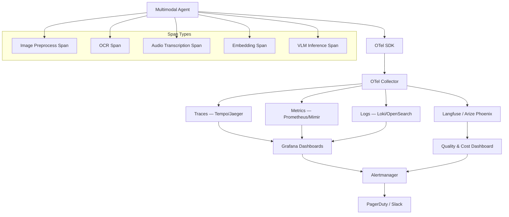
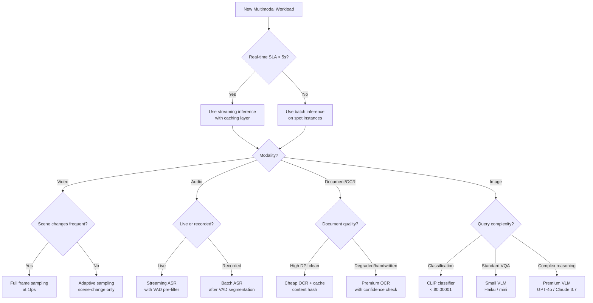

# Part 12 — Observability & FinOps for Multimodal AI

Deep technical reference for instrumenting, monitoring, and cost-managing multimodal AI systems at enterprise scale — covering distributed tracing, platform integrations, GPU cost optimization, and FinOps governance.

> **Audience:** AI Platform Engineers, MLOps Engineers, FinOps Architects, Principal AI Architects
> **Coverage:** OpenTelemetry · Langfuse · Arize Phoenix · GPU FinOps · Cost-Aware Routing · Multimodal Traces
> **As of:** July 2026

---

## Why Standard Observability Is Insufficient for Multimodal AI

Traditional application observability tools — APM platforms, log aggregators, infrastructure dashboards — were designed for request/response workloads where inputs and outputs are structured text and numerical payloads. Multimodal AI systems break every assumption underlying these tools.

A VLM inference call does not behave like an HTTP endpoint. The latency envelope depends on image resolution (a 4K frame takes 40× the preprocessing time of a 480p frame), not just network round-trip time. A single video analysis agent call may internally decompose into dozens of span types: frame extraction, scene change detection, multiple VLM inference calls, OCR on embedded text, embedding generation, and vector retrieval — none of which map cleanly to standard HTTP spans. When something goes wrong, "the inference was slow" tells you nothing; you need to know *which modality* was slow, *at what resolution*, *on which model version*, with *what confidence distribution*.

Standard observability also fails to connect quality signals to infrastructure signals. A degraded OCR confidence score on a corrupted document scan should be visible alongside the CPU time spent on that page — not buried in a separate quality dashboard. Multimodal observability must fuse operational telemetry (latency, errors, throughput) with quality telemetry (accuracy, confidence, hallucination indicators) in a single coherent trace.

The cost dimension adds a third layer. A single video inference pipeline can consume $0.003 per frame at full resolution. At 30 frames per second over a 60-minute video, that is 108,000 frames and $324 per video — before factoring in embedding generation, storage I/O, and post-processing. Without per-call cost attribution wired directly into the trace, engineering teams routinely discover overspend only at the monthly cloud bill, by which time hundreds of thousands of dollars have been consumed.

---

## The Four Pillars for Multimodal

### Traces

Distributed traces capture the causal chain of operations across a multimodal pipeline. Every VLM call, OCR pass, audio segment, embedding generation, and retrieval step must be captured as a child span under a root trace. The trace provides the single source of truth for latency attribution, error propagation, and cost roll-up.

### Metrics

Time-series metrics provide aggregated views that traces alone cannot support at scale. Key metric families for multimodal: inference latency histograms by modality and model, throughput counters (images/sec, audio-hours/hour, pages/sec), error rate by modality type, GPU utilization, and cost accumulator gauges.

### Logs

Structured logs capture per-inference detail at a verbosity level not appropriate for traces: full OCR output, bounding box coordinates, detected language, safety classifier scores. Logs feed downstream quality analysis and compliance audit requirements.

### Events

Events capture discrete semantic occurrences: model version change, safety guardrail triggered, human review escalation, circuit breaker opened, cache hit/miss. Events are attached to the trace and also emitted to an event bus for real-time alerting.

---

## Span Types for Multimodal Pipelines

Each span type carries modality-specific attributes alongside standard OpenTelemetry attributes.

**Image Processing Span**

Covers resize, format conversion, color space normalization, and metadata extraction before VLM inference.

```
span.name: "image.preprocess"
image.width: 3840
image.height: 2160
image.format: "jpeg"
image.size_bytes: 4218880
image.resize_target: "1024x1024"
image.resize_duration_ms: 18
```

**OCR Span**

Covers page segmentation, text detection, and character recognition.

```
span.name: "ocr.extract"
ocr.engine: "azure-document-intelligence"
ocr.page_count: 12
ocr.confidence_mean: 0.94
ocr.confidence_min: 0.71
ocr.language_detected: "en"
ocr.duration_ms: 340
```

**Audio Transcription Span**

Covers VAD, chunk segmentation, ASR inference, and post-processing.

```
span.name: "audio.transcribe"
audio.duration_seconds: 183.4
audio.sample_rate: 16000
audio.language: "en-US"
audio.model: "whisper-large-v3"
audio.wer_estimated: 0.04
audio.speaker_count: 3
audio.transcription_duration_ms: 8200
```

**Embedding Span**

Covers image/audio/document embedding generation.

```
span.name: "embedding.generate"
embedding.model: "text-embedding-3-large"
embedding.modality: "image"
embedding.dimensions: 1536
embedding.input_count: 24
embedding.cache_hit: false
embedding.duration_ms: 210
```

**VLM Inference Span**

Covers prompt construction, tokenization, model inference, and output parsing.

```
span.name: "vlm.infer"
gen_ai.system: "openai"
gen_ai.request.model: "gpt-4o"
gen_ai.usage.input_tokens: 1284
gen_ai.usage.output_tokens: 387
gen_ai.usage.image_tokens: 765
gen_ai.response.finish_reason: "stop"
vlm.image_count: 3
vlm.confidence: 0.89
vlm.duration_ms: 2340
vlm.cost_usd: 0.0087
```

---

## Distributed Tracing for Multimodal Agents

### OpenTelemetry Semantic Conventions for AI

The OpenTelemetry semantic conventions for Generative AI (`gen_ai.*`) provide a vendor-neutral schema for AI observability. Key attributes relevant to multimodal workloads:

| Attribute | Type | Description |
|-----------|------|-------------|
| `gen_ai.system` | string | Provider: `openai`, `anthropic`, `google`, `aws.bedrock` |
| `gen_ai.request.model` | string | Model identifier |
| `gen_ai.usage.input_tokens` | int | Total input tokens including image tokens |
| `gen_ai.usage.output_tokens` | int | Output tokens |
| `gen_ai.response.finish_reason` | string | `stop`, `length`, `content_filter` |
| `gen_ai.operation.name` | string | `chat`, `embeddings`, `image.generate` |

Multimodal-specific extensions (not yet in the official spec — use `extra_attributes` until standardized):

| Attribute | Description |
|-----------|-------------|
| `multimodal.modality_type` | `image`, `video`, `audio`, `document`, `mixed` |
| `multimodal.image_count` | Number of images in prompt |
| `multimodal.image_dimensions` | Comma-separated `WxH` per image |
| `multimodal.video_frame_count` | Frames extracted from video |
| `multimodal.audio_duration_seconds` | Audio segment length |
| `multimodal.ocr_confidence_mean` | Mean OCR confidence across pages |

### Trace Propagation Across Tool Chains

In a multimodal agent, a single user request spawns a tree of downstream calls across tools, models, and services. W3C TraceContext headers (`traceparent`, `tracestate`) must be propagated through every hop:

- From the orchestrator to each tool invocation
- From the tool to any downstream API call (OCR service, ASR service, VLM API)
- From async job dispatchers (Celery, Ray) through to worker processes
- From streaming gRPC calls (Triton) back to the calling agent

For async pipelines where HTTP header propagation is not available, embed the `trace_id` and `span_id` in the job payload as a baggage field and reconstruct the span context on the worker side using `opentelemetry.propagate.extract`.

### Sampling Strategies for High-Volume Multimodal Workloads

Sampling 100% of multimodal traces is prohibitively expensive at scale. A tiered strategy:

**Head-based sampling:** Sample 10% of low-value routine processing (document batches with high confidence, cache hits). Apply via OpenTelemetry SDK sampler configuration.

**Tail-based sampling:** Always retain traces where: total latency > p99 threshold, any span has `error=true`, OCR confidence < 0.8, VLM confidence < 0.7, or cost_usd > $0.05 per request. Implement with OpenTelemetry Collector's tail sampling processor.

**Modality-specific sampling rates:** Video inference (high cost, high value) at 50%, audio transcription at 25%, image classification at 5%.

---

## Observability Platform Integration

### Langfuse

Langfuse provides native support for multimodal traces with image attachment in trace UI, structured cost tracking across model calls, and dataset management for evaluation. The Python SDK supports attaching base64-encoded images directly to span observations, enabling visual inspection of what the model actually saw during each inference step. Cost tracking auto-populates from `gen_ai.usage.*` attributes if the model is in Langfuse's pricing catalog; for custom or self-hosted models, set `unit_price` manually per span.

### Arize Phoenix

Phoenix provides multimodal dataset management, visual embedding exploration (UMAP/t-SNE of image embeddings colored by label or confidence), and drift detection for multimodal features. The `phoenix.trace` decorator integrates with LangChain, LlamaIndex, and custom pipelines. Phoenix's embedding visualization is particularly valuable for detecting distribution shift — when production image embeddings drift from the training distribution, Phoenix surfaces this as a cluster anomaly before quality metrics degrade.

### MLflow

MLflow tracks multimodal experiment runs with artifact logging for images, audio clips, and video samples. Use `mlflow.log_image()` for visual QA examples, `mlflow.log_artifact()` for full inference outputs, and custom metrics for OCR accuracy, ASR WER, and VLM task accuracy. MLflow's model registry provides version control for VLMs including approval workflows for production promotion.

### OpenTelemetry + Grafana

Export spans to Tempo, metrics to Prometheus/Mimir, and logs to Loki. Build Grafana dashboards with:

- Latency heatmaps by span type and modality
- Cost accumulation time series by model and use case
- Error rate panels with drill-through to Tempo traces
- Confidence distribution histograms updated in real time

### Datadog LLM Observability

Datadog's LLM Observability extension (GA 2025) supports multimodal traces via the `ddtrace` LLMObs integration. Image inputs are captured as hashed references (not stored in full) with dimension metadata. Cost tracking uses Datadog's AI model cost catalog. Anomaly detection triggers on sudden cost spikes, latency degradation, or error rate increases.

### Prometheus: Custom Multimodal Metrics

```python
from prometheus_client import Histogram, Counter, Gauge

vlm_inference_duration = Histogram(
    'vlm_inference_duration_seconds',
    'VLM inference latency',
    ['model', 'modality', 'use_case'],
    buckets=[0.1, 0.5, 1.0, 2.0, 5.0, 10.0, 30.0]
)

multimodal_cost_total = Counter(
    'multimodal_cost_usd_total',
    'Cumulative inference cost',
    ['model', 'modality', 'department']
)

ocr_confidence = Histogram(
    'ocr_confidence_score',
    'OCR confidence distribution',
    ['engine', 'document_type'],
    buckets=[0.5, 0.6, 0.7, 0.8, 0.9, 0.95, 0.99]
)
```

### Cloud-Native Multimodal Observability

**AWS CloudWatch:** Use EMF (Embedded Metrics Format) to emit multimodal metrics from Lambda and ECS. CloudWatch Insights queries over structured JSON logs enable per-modality error analysis. X-Ray traces propagate through Bedrock and Textract calls natively.

**Azure Monitor:** Application Insights SDK supports custom dimensions for multimodal attributes. Azure Monitor Workbooks enable combined log/metric dashboards. Azure AI Foundry emits native telemetry to Application Insights when instrumented.

**GCP Cloud Monitoring:** Cloud Trace integrates with Vertex AI inference endpoints. Custom metrics via the Monitoring API support multimodal gauge and histogram types. BigQuery export enables long-term cost analysis and anomaly detection at scale.

---

## Key Metrics for Multimodal Systems

### Performance Metrics

| Metric | Target | Measurement |
|--------|--------|-------------|
| OCR accuracy (character level) | > 98% on clean docs | Character Error Rate on golden set |
| VLM task accuracy (visual QA) | > 85% on domain benchmark | Exact match / ROUGE on eval set |
| ASR Word Error Rate | < 5% on clean audio | WER on labeled audio corpus |
| Object detection mAP | > 0.75 for production | COCO mAP on held-out set |

### Latency Metrics

| Metric | Description |
|--------|-------------|
| TTFF (Time to First Frame Processed) | Latency from video ingestion to first frame analysis complete |
| p50/p95/p99 VLM inference latency | Per-model, per-image-resolution breakdown |
| OCR latency per page | Segmented by document quality tier |
| End-to-end pipeline latency | Root span duration from user request to final output |

### Throughput Metrics

- Images processed per second (by resolution tier)
- Video frames analyzed per second (by model and resolution)
- Audio hours transcribed per wall-clock hour
- Document pages OCR'd per minute

### Quality Metrics

- Confidence score distributions (histogram, not just mean)
- Hallucination rate: percentage of outputs with factual grounding failures detected by LLM-as-judge
- Grounding accuracy: percentage of citations that map to actual document regions

### Reliability Metrics

- Error rate by modality type (image errors vs audio errors vs OCR errors)
- Timeout rates by model and resolution
- Retry rates and retry success rates
- Circuit breaker open percentage over rolling 1-hour window

---

## FinOps for Multimodal AI

### Cost Structure

Multimodal AI costs aggregate across four categories that rarely appear together in standard cloud cost reports:

| Cost Category | Driver | Typical Share |
|---------------|--------|--------------|
| GPU compute | VLM inference, embedding generation | 55–70% |
| Storage | Video archives, audio files, embeddings | 15–25% |
| API costs | Cloud VLM APIs (GPT-4o, Claude, Gemini) | 10–30% |
| Egress/bandwidth | Video streaming, large file transfers | 5–10% |

### GPU Cost Optimization

**Batch vs Real-Time Inference**

Real-time inference carries 3–5× cost premium over batch due to idle GPU time. For workloads without latency SLA below 60 seconds (document processing, video archive analysis, bulk OCR), always use batch inference. GPU utilization in real-time deployments typically runs at 15–40%; batch inference achieves 80–95%.

**Model Quantization for Vision Models**

| Precision | VRAM Reduction | Accuracy Impact | Recommended For |
|-----------|---------------|-----------------|-----------------|
| FP32 (baseline) | — | — | Training only |
| FP16 | 50% | Negligible | Production default |
| INT8 | 75% | < 1% on most tasks | High-throughput batch |
| GPTQ 4-bit | 87% | 2–5% degradation | Edge, budget-constrained |

Apply FP16 by default; apply INT8 for batch-only document processing workloads where accuracy trade-off is validated.

**GPU Utilization Tracking and Right-Sizing**

Track `nvidia_gpu_utilization`, `nvidia_gpu_memory_used_bytes`, and `nvidia_gpu_power_draw_watts` via the DCGM (Data Center GPU Manager) Prometheus exporter. Target 70–85% sustained GPU memory utilization for cost efficiency. Under 50% = right-size down; over 90% = risk of OOM errors under burst.

**Spot/Preemptible Instances**

Batch video and document processing jobs tolerate interruption with checkpointing. Use AWS EC2 Spot (g5/p4d family), GCP Preemptible (a2 family), or Azure Spot VMs for 60–70% cost reduction vs on-demand. Implement job resumability via checkpoint files written to object storage at each processing milestone.

### Video Inference Cost Optimization

**Adaptive Frame Sampling**

The most impactful single optimization. Naive approaches send every frame to the VLM. Scene change detection (using histogram difference or SSIM) identifies frames where content has not changed. For surveillance video with 95% static scenes, this reduces VLM calls by 90% with negligible quality impact.

```python
def adaptive_frame_sample(video_path, scene_threshold=0.15):
    frames = extract_frames(video_path)
    selected = [frames[0]]
    for i in range(1, len(frames)):
        diff = compute_histogram_diff(frames[i-1], frames[i])
        if diff > scene_threshold:
            selected.append(frames[i])
    return selected
```

**Resolution Downscaling**

VLMs do not require 4K input for most tasks. Downscale to 1024×1024 before inference. For object detection tasks where fine detail matters, use 1024×1024 for initial screening and only upscale to full resolution when a region of interest is detected.

**Keyframe-Only Processing**

For summarization and QA tasks (not temporal reasoning), extract I-frames (keyframes) from the video codec directly using `ffmpeg -skip_frame noref`. This extracts ~1 frame per second from H.264 video without decoding P and B frames, reducing decode CPU cost by 60%.

**Caching Inference Results for Duplicate Frames**

In broadcast media, security feeds, and screen recordings, significant content is repeated (logos, UI chrome, static backgrounds). Content-hash the frame and cache inference results with a 24-hour TTL. Cache hit rates of 20–40% are typical in enterprise content libraries.

### Audio Inference Cost Optimization

**Voice Activity Detection (VAD) Before ASR**

Silence in meetings, hold music, and background noise can account for 30–60% of audio duration in enterprise recordings. Run Silero VAD (CPU-only, < 1ms per second of audio) to extract speech segments before sending to Whisper or cloud ASR. This reduces ASR API costs proportionally to silence percentage.

**Batch vs Streaming Transcription**

Streaming ASR (real-time) costs 2–4× more than batch transcription for equivalent audio volume due to connection overhead and real-time infrastructure costs. For recorded meeting transcription, always use batch APIs. Reserve streaming for live customer service and real-time accessibility use cases with genuine sub-second latency requirements.

**Speaker Diarization Caching**

Speaker embedding extraction is computationally expensive. For recurring meetings with known participants, cache speaker embeddings per participant ID. Subsequent meetings skip the embedding extraction phase and use cached embeddings directly for diarization assignment.

### OCR Cost Optimization

**Page Caching with Content Hash**

For document workflows that re-process templates (invoices, contracts, forms with repeated layouts), SHA-256 hash the page image and cache OCR results. For a bank processing 10,000 invoices per day from 50 vendors, cache hit rates of 30–50% are realistic, driven by repeated template pages.

**Quality-Based Routing**

Not all documents need premium OCR. Route based on estimated document quality:

- High-quality scans (DPI > 300, SSIM against clean template > 0.9) → fast, cheap OCR (Tesseract, AWS Textract Standard)
- Degraded scans (low DPI, handwriting, mixed languages) → premium OCR (Azure Document Intelligence, Google Document AI)

**Parallel vs Sequential Extraction**

For multi-page documents, parallelize OCR across pages using thread pools. A 50-page document processed sequentially takes 50× the per-page latency; processed in parallel with 8 workers reduces wall-clock time by 80% with the same total API cost.

### Embedding Cost Optimization

**Embedding Cache (Content-Addressed Storage)**

Store embeddings keyed by SHA-256 of the input content. For an enterprise document library where 70% of documents are stable references (policies, procedures, regulations), pre-compute and cache embeddings permanently. Incremental updates only recompute embeddings for changed or new documents.

**Matryoshka Embeddings and Dimensionality Reduction**

Models trained with Matryoshka Representation Learning (MRL) — including OpenAI's `text-embedding-3-*` family — support truncating the embedding dimension without re-inference. Reducing from 1536 to 512 dimensions cuts vector storage costs by 67% and retrieval latency by 50%, with < 3% accuracy loss on most retrieval benchmarks.

**Batch Embedding Requests**

Embedding APIs charge per token, not per request. Batch 100–512 items per API call to maximize throughput and reduce per-item cost. For image embeddings (CLIP), batch processing enables GPU tensor reuse across items in the batch, reducing per-image compute cost by 40–60%.

---

## Cost-Aware Agent Routing

### Dynamic Model Routing Based on Query Complexity

Not every query needs GPT-4o. A three-tier routing strategy:

- **Simple classification** (is this image a receipt?): Use lightweight CLIP-based classifier. Cost: $0.00001 per image.
- **Standard VQA** (extract line items from receipt): Use GPT-4o-mini or Claude 3 Haiku. Cost: $0.001 per image.
- **Complex reasoning** (reconcile receipt against PO and flag discrepancies): Use GPT-4o or Claude 3.7 Sonnet. Cost: $0.01 per image.

Route based on a complexity classifier trained on historical queries — this classifier itself should be a cheap embedding-similarity or regex heuristic, not a VLM.

### Visual Complexity Scoring for Model Selection

Compute a visual complexity score from image features: number of text regions detected, object count, scene entropy (Shannon entropy of pixel values), and layout complexity (number of distinct bounding boxes). High-complexity images routed to premium models; low-complexity images to smaller models. Validate routing accuracy with A/B testing against a human-labeled ground truth.

### Budget-Aware Planning

Implement a session-level cost budget. Each inference call deducts from the session budget. When remaining budget falls below a threshold, the agent switches to cheaper models or terminates gracefully with a partial result and a cost-exceeded explanation to the caller.

```python
class BudgetTracker:
    def __init__(self, budget_usd: float):
        self.budget = budget_usd
        self.spent = 0.0

    def can_afford(self, estimated_cost: float) -> bool:
        return (self.spent + estimated_cost) <= self.budget

    def record_spend(self, actual_cost: float):
        self.spent += actual_cost
        if self.spent > self.budget * 0.8:
            emit_alert("Budget 80% consumed", self.spent, self.budget)
```

### Cost Attribution by Department/Use Case/Customer

Tag every inference call with `department`, `use_case`, and `customer_id` dimensions. Aggregate costs in a FinOps data warehouse (BigQuery, Snowflake, Redshift) joining inference logs with cloud billing export. Generate weekly chargeback reports per cost center. For multi-tenant SaaS, correlate customer API usage with revenue to identify unprofitable customers.

---

## Multimodal Observability Stack Architecture



---

## Cost Optimization Decision Tree



---

## FinOps Governance

### Budget Alerts and Hard Limits

Set three-tier budget controls:

- **Soft alert** at 70% of monthly budget: notify FinOps lead and engineering manager
- **Hard alert** at 90%: auto-throttle batch jobs, disable non-critical use cases
- **Hard limit** at 100%: reject new inference requests, escalate to executive

Implement via cloud provider budget APIs (AWS Budgets, Azure Cost Management, GCP Budgets) supplemented by application-level BudgetTracker instances.

### Showback and Chargeback Models

**Showback:** Allocate costs to cost centers by tagging. Publish monthly reports showing each team's AI spending share. No financial transfer — purely informational to drive behavior.

**Chargeback:** Actual internal billing. Each team is charged for their GPU hours and API calls via internal transfer pricing. Requires a cost allocation model that handles shared infrastructure (embedding caches, base models) fairly.

### Cost Anomaly Detection

Monitor for: sudden frame count spikes (adversarial users submitting very long videos), runaway agent loops (agent calling VLM repeatedly without termination), and model routing failures (all traffic falling through to the premium tier). Implement threshold-based alerting on `rate(multimodal_cost_usd_total[5m])` in Prometheus with a 3× normal rate as the anomaly threshold.

### Cloud Cost Comparison for Multimodal Inference

| Workload | AWS Cost Estimate | Azure Cost Estimate | GCP Cost Estimate |
|----------|------------------|--------------------|--------------------|
| GPT-4o image inference (1M images, 1K tokens each) | $5,000 (via Bedrock) | $5,000 (via AOAI) | N/A — use Gemini |
| Whisper transcription (1M audio minutes) | $360 (Transcribe) | $400 (Speech) | $300 (Speech-to-Text) |
| Document OCR (1M pages) | $150 (Textract) | $100 (Doc Intelligence) | $65 (Document AI) |
| Self-hosted VLM on GPU (p4d.24xlarge equiv, 720 hrs) | $7,200 (on-demand) | $6,800 (NDv4) | $6,400 (a2-ultragpu) |

*Estimates as of July 2026. Verify against current pricing pages before budget planning.*

---

## Interview Use Cases

**Q: A startup's multimodal AI costs are 3× over budget. You discover they are running every video frame through a GPT-4o vision call. How would you redesign the architecture to cut costs by 80% while maintaining quality?**

A: The core problem is uniform, un-sampled frame processing. My redesign has four layers. First, implement scene-change detection using SSIM or histogram difference — for typical surveillance or meeting video, this eliminates 85–90% of frames immediately since most frames are near-identical to the previous one. Second, add a lightweight CLIP-based visual classifier as a pre-filter: only frames that pass a relevance threshold (containing the document, face, object of interest) proceed to GPT-4o. This might eliminate another 50% of remaining frames. Third, downscale all frames to 1024×1024 before VLM inference — GPT-4o's image tokenizer charges proportionally to resolution, and most tasks do not benefit from 4K input. Fourth, implement an inference cache keyed on the perceptual hash of each frame: in any video with repeated content (screen recordings, broadcast media, training videos), cache hit rates of 20–40% are realistic. Combined, these four layers reduce GPT-4o calls by 90–95% with negligible quality impact on tasks like content understanding, object detection, and scene description. The remaining 5% cost reduction can come from switching from real-time to batch inference using the Batch API, which provides a 50% cost discount. End result: 80–95% cost reduction, quality maintained at > 95% of the original.

**Q: How would you implement cost attribution for a multi-tenant multimodal AI platform where 50 enterprise customers share the same GPU infrastructure?**

A: I would implement a four-layer attribution model. Layer 1: tag every inference request at the application level with `customer_id`, `use_case`, `modality`, and `model_tier` before it enters the GPU queue. Layer 2: instrument the inference service to emit cost metrics per request, calculating cost from token counts and model pricing catalogs — stored in a time-series database. Layer 3: shared infrastructure costs (GPU idle time, embedding cache storage, base model loading) are allocated to customers proportionally by their share of total GPU-seconds consumed in the billing period. Layer 4: export the attribution data to a FinOps data warehouse (BigQuery or Snowflake), where SQL models join inference logs with cloud billing export for reconciliation. Monthly reports show each customer their direct inference costs plus their allocated share of shared overhead. For unprofitable customers (whose costs exceed their contract value), trigger a commercial review. The key nuance for multimodal is that image and video inference costs are highly variable — a customer submitting 4K video costs 16× more than a customer submitting 480p — so per-frame cost attribution must account for resolution as a cost driver, not just frame count.

**Q: What OpenTelemetry instrumentation would you add to a multimodal RAG pipeline to enable root cause analysis of latency outliers?**

A: I would instrument six span types. First, a root span wrapping the entire RAG pipeline tagged with `user_id`, `query_type`, and `modality`. Second, an `image.preprocess` span recording input dimensions, resize target, and preprocessing latency. Third, an `embedding.generate` span with `cache_hit` flag — cache misses are a frequent latency outlier cause. Fourth, a `vector.retrieve` span capturing collection name, top-k, similarity threshold, and retrieval latency. Fifth, a `context.assemble` span covering how retrieved chunks are assembled into the prompt context — this often hides hidden serialization costs. Sixth, a `vlm.infer` span with full `gen_ai.*` attributes including image token count, which is the dominant cost and latency driver. I would configure tail-based sampling to retain 100% of traces where total latency exceeds the p95 threshold, and tag each span with `correlation_id` so I can join OTel traces with application logs in Grafana. For root cause analysis, I would build a Grafana panel showing span duration breakdowns for p99 traces — this immediately surfaces whether the outlier is in preprocessing, embedding (cache miss), retrieval (cold index), or VLM inference (large image batch).

**Q: Design a FinOps governance framework for a bank's multimodal AI platform with a $2M monthly GPU budget.**

A: The framework has five components. Governance structure: a monthly AI FinOps Review Board with representatives from each business line, the platform team, and Finance — reviews actual vs budget, approves budget reallocations, and approves new use cases that will consume > 5% of monthly budget. Budget architecture: allocate the $2M across business lines based on value delivered (not historical spend) — e.g., Fraud Detection 30%, Document Processing 25%, Customer Service AI 20%, Trading Analytics 15%, Reserve 10%. Cost tagging: all GPU workloads tagged with `business_line`, `use_case`, `model_tier`, and `environment` (prod/dev/test). Dev and test environments capped at 10% of each business line's allocation. Anomaly controls: automated alerts at 70%/90%/100% of monthly allocation per business line; hard stops at 100% with manual override requiring VP approval. Optimization mandate: each business line must maintain GPU utilization > 70% or justify idle capacity. Quarterly optimization reviews where the platform team presents cost reduction opportunities — frame sampling improvements, quantization candidates, batch migration candidates. Reporting: weekly FinOps dashboard published to all stakeholders showing spend-to-date vs budget, cost per transaction by use case, and GPU utilization heat map.

**Q: How would you detect and respond to a cost anomaly caused by an adversarial user submitting very long videos to a multimodal AI platform?**

A: Detection: Prometheus alerting rule on `rate(multimodal_cost_usd_total{customer_id=~".+"}[10m])` compared to the customer's 7-day rolling average. A 5× spike triggers an alert. Additionally, emit a per-request metric for `video_frame_count` — any single request exceeding the 99th percentile frame count (e.g., > 10,000 frames) triggers an immediate alert regardless of cost rate. Response: first, enforce pre-submission validation — reject video inputs exceeding a configurable max duration (e.g., 4 hours) or max file size (e.g., 10GB) at the API gateway before any GPU resources are consumed. Second, implement per-session rate limits on frame processing using a token bucket algorithm. Third, for the anomalous request, quarantine it to an isolated processing queue with throttled throughput while the security team investigates. Fourth, add the customer's usage pattern to the anomaly watchlist for 30 days. The key architectural lesson is that input validation must happen at the API boundary, not inside the inference pipeline — by the time an adversarial 8-hour video reaches the GPU queue, the cost has already been committed.

---

## Related

- [Part 11 — Evaluation Harnesses & CI/CD](./part-11-evaluation-harnesses-cicd.md) — continuous quality measurement that feeds observability dashboards
- [Part 13 — Governance & Production Engineering](./part-13-governance-production.md) — audit logging, policy enforcement, and production hardening
- [Part 14 — Cloud Platform Comparison](./part-14-cloud-platform-comparison.md) — platform-specific cost models and FinOps tooling
- [AI Economics & Cost Management](../ai-economics/index.md) — broader FinOps patterns beyond multimodal workloads
