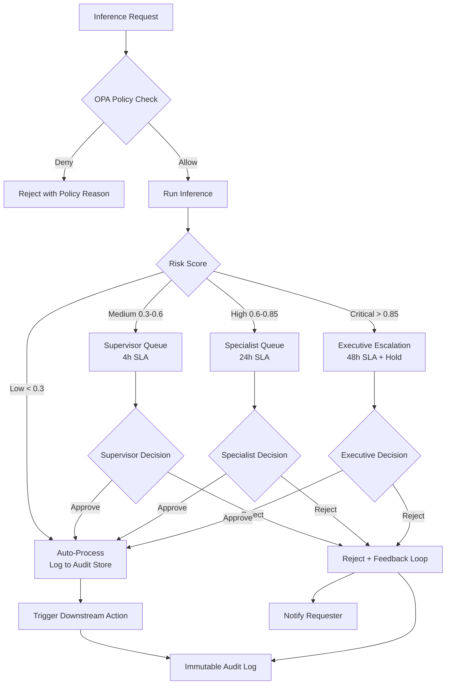
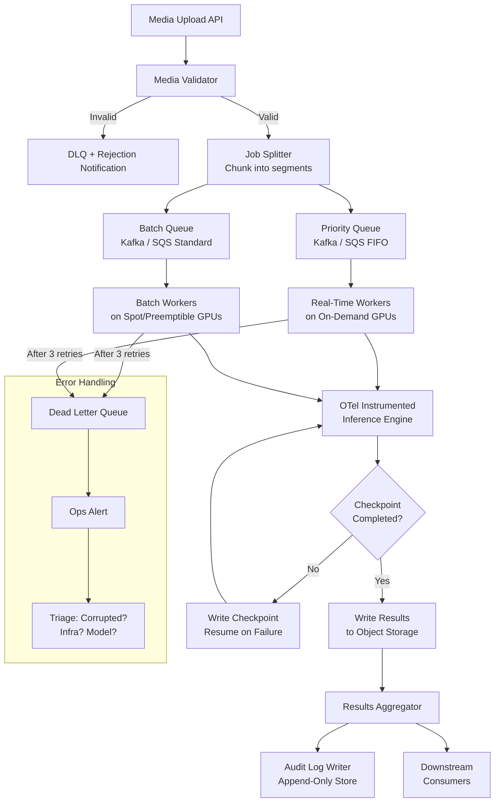

# Part 13 — Enterprise Governance & Production Engineering for Multimodal AI

Technical reference for governing, hardening, and operating multimodal AI systems in regulated enterprise environments — covering policy-as-code, approval workflows, audit logging, GPU infrastructure, and large-scale media processing architecture.

> **Audience:** AI Risk & Governance Architects, MLOps Engineers, AI Platform Engineers, Enterprise Architects
> **Coverage:** OPA Policy-as-Code · Approval Workflows · Audit Logging · Kill Switches · GPU Scheduling · Distributed Inference
> **As of:** July 2026

---

## Enterprise AI Governance Framework

### Governance Pillars

Enterprise AI governance for multimodal systems rests on four foundational pillars that must be implemented in concert — no single pillar is sufficient alone.

**Accountability** defines who owns each decision in the multimodal AI lifecycle: who approved a model for production, who authorized a specific inference on sensitive data, who is responsible when a VLM output triggers a downstream action with real-world consequences. Without clear accountability chains, regulated industries face immediate compliance failures under GDPR Article 22, HIPAA, and the EU AI Act's accountability requirements for high-risk AI systems.

**Transparency** ensures that every inference decision is explainable to authorized reviewers. For multimodal systems, this extends beyond standard explainability to include: what input modalities were present, which regions of an image or which audio segments influenced the output, and what confidence scores underpinned the decision. Transparency requires that this information be logged and retrievable, not merely available in theory.

**Control** provides the mechanisms to constrain, limit, override, and stop multimodal AI systems at any point. Controls span from input filtering (blocking disallowed modalities or data classifications) through inference constraints (allowed models, maximum confidence thresholds required before automated action) to output controls (redaction, suppression, human review gates). Controls must be enforceable programmatically — not dependent on human vigilance.

**Audit** ensures that a complete, tamper-evident record exists for every consequential inference. Audit requirements differ by regulation: HIPAA requires 6-year retention; GDPR requires records of automated decisions; financial regulators require audit trails linking AI outputs to downstream trades or credit decisions.

### Governance Operating Model

A sustainable governance operating model for multimodal AI requires four defined roles:

| Role | Responsibilities | Example Title |
|------|-----------------|---------------|
| **AI Council** | Policy approval, risk appetite, budget authority | Chief AI Officer, CRO, CTO |
| **Risk Owner** | Approves high-risk use cases, reviews incidents | AI Risk Director |
| **Model Owner** | Manages model registry, approves promotions | Principal AI Architect |
| **Data Owner** | Classifies input data, approves data access | Chief Data Officer, Data Steward |

The council sets policy; risk and model owners implement it; data owners enforce data classification constraints that flow into Policy-as-Code.

### Policy-as-Code for Multimodal AI

Policy-as-Code (PaC) moves governance rules from documentation into executable, version-controlled code that runs at every inference request. For multimodal AI, PaC is essential because modality-specific rules (e.g., "no biometric processing in the EU without explicit consent") are too complex and too numerous to enforce through manual review.

---

## Approval Workflows and Human-in-the-Loop Governance

### Change Approval for Multimodal Model Updates

Every model version change — whether a new VLM base model, updated prompt templates, modified safety classifiers, or changed routing thresholds — must pass through a structured change approval process before reaching production.

**Standard model update (4-eyes minimum):**

- Model Owner proposes change in model registry with performance comparison
- Peer review by a second Senior AI Engineer
- Automated regression suite must pass (see Part 11)
- Deployment via CI/CD with canary rollout (5% → 20% → 100% traffic)

**High-risk model update (requires Risk Owner sign-off):**

- Any change to models processing PII, biometric, or financial data
- Any change affecting a use case classified as High-Risk under the EU AI Act
- Model size increase > 2× (materially different cost profile)
- New modality enabled (e.g., adding audio processing to an image-only pipeline)

### Inference Approval Workflows for High-Stakes Decisions

For decisions with direct real-world consequences (credit approval, medical triage recommendation, fraud flagging triggering account freeze), the inference output must pass through a human review gate before action is taken.

**Tiered Approval Model:**

```
Tier 1 — Automated: Confidence > 0.95, low-risk classification
         → Action taken automatically, logged

Tier 2 — Supervisor Review: Confidence 0.80–0.95, medium-risk
         → Route to queue, 4-hour SLA, supervisor approves/rejects

Tier 3 — Specialist Review: Confidence < 0.80, high-risk, edge case
         → Route to specialist queue, 24-hour SLA, specialist reviews
           with full audit trail

Tier 4 — Executive Escalation: Novel scenario, regulatory sensitivity,
         systemic risk signal → escalate to Risk Owner, 48-hour SLA
```

### SLA and Turnaround Time Management

Human review queues for multimodal AI are fundamentally different from standard exception queues because reviewers must engage with rich media: they may need to view a video clip, listen to an audio segment, or examine a high-resolution document image. Underestimating review time leads to SLA breaches.

Design review interfaces to: pre-render the relevant media clips, highlight the regions or segments that drove the AI decision (using attention maps or confidence highlights), present the confidence distribution (not just the top-1 score), and show similar historical cases with their human review outcomes.

Monitor queue depth, average review time, SLA compliance rate, and reviewer agreement rate (inter-rater reliability). Agreement rate below 80% signals that the task definition or instructions need refinement.

### Evidence Retention

For regulatory defensibility, retain the following artifacts for every tiered-review inference:

- Input fingerprint (SHA-256 of each input modality)
- Model version and inference parameters at time of request
- Full model output and confidence scores
- Reviewer identity, review timestamp, decision, and justification notes
- Any supplemental evidence consulted by the reviewer
- Final action taken and timestamp

Retention periods by regulation: HIPAA (6 years from creation or last use), GDPR (no standard — retain as long as the processing decision is in effect), MiFID II financial decisions (5 years), FDA medical device decisions (device lifetime).

---

## Policy-as-Code Implementation

### OPA for Multimodal AI

Open Policy Agent (OPA) with Rego policies is the most widely adopted Policy-as-Code solution for enterprise AI platforms. For multimodal AI, OPA evaluates policies at the API gateway before any GPU resources are consumed.

**Policy: Allowed Modalities Per Use Case**

```rego
package multimodal.access

default allow = false

# Check modality is permitted for this use case
allow {
    input.use_case == "document_processing"
    allowed_modalities_document[input.modality]
}

allow {
    input.use_case == "customer_service"
    allowed_modalities_cs[input.modality]
}

allowed_modalities_document = {
    "image",
    "document",
    "text"
}

allowed_modalities_cs = {
    "audio",
    "text"
}

# Biometric processing requires explicit consent flag
deny[msg] {
    input.modality == "image"
    input.contains_biometric == true
    not input.biometric_consent == true
    msg := "Biometric processing requires explicit consent"
}
```

**Policy: Data Classification Enforcement**

```rego
package multimodal.data_classification

import future.keywords.in

deny[msg] {
    input.data_classification in {"PII", "PHI", "PCI"}
    not input.region in allowed_processing_regions[input.data_classification]
    msg := sprintf(
        "Data class %v cannot be processed in region %v",
        [input.data_classification, input.region]
    )
}

allowed_processing_regions = {
    "PHI": {"us-east-1", "us-west-2"},
    "PII": {"eu-west-1", "eu-central-1", "us-east-1"},
    "PCI": {"us-east-1"}
}

deny[msg] {
    input.data_classification == "GDPR_SPECIAL"
    input.has_explicit_consent != true
    msg := "GDPR special category data requires explicit consent"
}
```

**Policy: Time-Based Access**

```rego
package multimodal.time_policy

import future.keywords.in

deny[msg] {
    input.use_case == "trading_analytics"
    not trading_hours_active
    msg := "Trading analytics inference restricted to trading hours (06:00-22:00 ET)"
}

trading_hours_active {
    hour := time.clock(time.now_ns())[0]
    hour >= 6
    hour < 22
}
```

### Cedar for Fine-Grained Authorization

Cedar (AWS's policy language) is an alternative to OPA with stronger formal verification properties. Use Cedar when the authorization model is primarily entity-relationship based (who can do what to which resource) rather than complex rule evaluation. Cedar is particularly well suited for multi-tenant platforms where permission grants vary per customer.

### ABAC vs RBAC for Multimodal AI Resources

RBAC (Role-Based Access Control) is insufficient for multimodal AI because access decisions depend on attributes not captured by role: the data classification of the input, the processing region, the output use, and the consent status. ABAC (Attribute-Based Access Control) is the appropriate model — implement it via OPA policies that evaluate both subject attributes (user role, department, clearance) and resource attributes (modality, data classification, use case, region).

### Policy Testing and Validation

Test OPA policies with `opa test` against a suite of allow and deny cases. Include edge cases: mixed modalities, missing consent flags, unusual data classifications, time boundary conditions. Integrate policy tests into CI/CD — policy changes that break existing test cases block the pipeline.

---

## Audit Logging and Chain of Custody

### What to Log for Multimodal Decisions

Every inference that results in a consequential output must produce a structured audit log entry containing:

| Field | Description |
|-------|-------------|
| `event_id` | UUID, unique per inference event |
| `trace_id` | OTel trace ID linking to full span tree |
| `timestamp` | ISO 8601 with millisecond precision |
| `user_id` / `service_id` | Authenticated caller identity |
| `use_case` | Business use case identifier |
| `input_fingerprint` | SHA-256 per modality input |
| `modality_type` | `image`, `video`, `audio`, `document`, `mixed` |
| `input_dimensions` | Width×Height for image, duration for audio |
| `model_version` | Full model identifier + version hash |
| `inference_parameters` | Temperature, max_tokens, system prompt hash |
| `output_summary` | Truncated output or hash for large outputs |
| `confidence_scores` | Full confidence distribution, not just top-1 |
| `policy_evaluation_result` | OPA decision: allow/deny + which rules fired |
| `human_review_outcome` | Reviewer ID, decision, timestamp (if applicable) |
| `action_taken` | Downstream action triggered by the inference |

### Immutable Audit Logs

Audit logs for regulated use cases must be append-only and tamper-evident. Implementation options:

**WORM Storage:** AWS S3 Object Lock (Compliance mode), Azure Blob immutability policy, or GCP Object Lock. Set the retention period to the regulatory minimum at write time — objects cannot be deleted or modified during the retention window.

**Blockchain Anchoring:** For high-assurance scenarios (legal evidence, financial audit trails), anchor daily audit log Merkle roots to a public blockchain. Services like OpenTimestamps or enterprise blockchain platforms provide cryptographic proof of existence at a specific time without storing sensitive data on-chain.

**Cryptographic Signing:** Sign each log entry with a hardware-backed key (AWS KMS, Azure Key Vault HSM). Provide signed entries to auditors as evidence of integrity.

### Chain of Custody for Multimodal Evidence

In legal, healthcare, and financial contexts, multimodal inputs are evidence. Chain of custody requires:

- Capturing the original input (or its cryptographic hash) at ingestion
- Recording every transformation applied (resize, format conversion, preprocessing)
- Documenting every system that accessed the input and when
- Preserving the output in its original form alongside the audit log

For video and audio evidence (court recordings, regulated call recordings, insurance incident videos), maintain the original file alongside a chain-of-custody log. Never modify the original — all preprocessing must create new copies.

### Log Retention Requirements by Regulation

| Regulation | Minimum Retention | Applies To |
|------------|------------------|-----------|
| HIPAA | 6 years | PHI processing decisions |
| GDPR | Duration of processing + dispute period | PII automated decisions |
| MiFID II | 5 years | Financial instrument decisions |
| SEC 17a-4 | 3–6 years | Securities trading decisions |
| FDA 21 CFR Part 11 | Device lifetime | Medical device AI outputs |
| EU AI Act (High-Risk) | 10 years | High-risk AI system logs |

### SIEM Integration

Forward multimodal AI audit logs to SIEM platforms (Splunk, Microsoft Sentinel, Google Chronicle) using structured JSON over syslog or Kafka. Define SIEM correlation rules to detect: unusual inference volume spikes per user, access to high-risk data classifications outside business hours, repeated policy denials from a single identity (potential adversarial probing), and model version changes without corresponding change approval records.

---

## Risk Scoring and Kill Switches

### Risk Scoring for Multimodal Agent Decisions

Assign a risk score to each inference output before triggering downstream actions. Risk score components for multimodal:

- **Confidence gap:** Top-1 confidence minus top-2 confidence. Small gap = high uncertainty = higher risk.
- **Modality mismatch:** If the query expected an image but received a low-quality scan below confidence threshold, flag as elevated risk.
- **Novel input distribution:** Compare input embeddings to training distribution. High embedding distance from training centroid = elevated risk.
- **Output sensitivity:** Classification into sensitive categories (medical diagnosis, fraud determination, identity assertion) multiplies base risk score.

Route outputs exceeding a risk threshold to the appropriate tier in the approval workflow.

### Automated Risk Thresholds and Escalation

Define risk thresholds with hysteresis to prevent threshold flapping:

```python
def classify_risk(score: float) -> str:
    if score < 0.3:
        return "LOW"     # auto-process
    elif score < 0.6:
        return "MEDIUM"  # supervisor review
    elif score < 0.85:
        return "HIGH"    # specialist review
    else:
        return "CRITICAL" # executive escalation + immediate hold
```

### Kill Switch Architecture

Kill switches provide the ability to immediately stop a multimodal AI system or component without waiting for a standard deployment cycle.

**Graceful Shutdown:** Drain in-flight requests, reject new requests, preserve state for resumability. Triggered by the operations team via a feature flag (LaunchDarkly, Unleash, or AWS AppConfig). Takes 30–60 seconds to complete.

**Emergency Stop:** Immediately reject all new requests; in-flight requests receive a 503 response with retry-after header. Triggered by an automated circuit breaker or by security incident response. Takes < 1 second. Does not wait for in-flight completion.

**Component-Level Kill Switches:** Independent switches per modality component allow surgical disablement: disable only video inference while image and document processing continue. Implemented via feature flags scoped to the specific component.

### Circuit Breakers for Multimodal Components

Implement circuit breakers on each external dependency: VLM API, OCR service, ASR service, vector database. Use a half-open state to probe recovery before restoring full traffic. Configure failure thresholds per component:

```python
# Example: VLM circuit breaker config
circuit_breaker:
  vlm_api:
    failure_threshold: 5        # trips after 5 consecutive failures
    success_threshold: 2        # recovers after 2 successes in half-open
    timeout_seconds: 60         # half-open probe interval
    monitored_exceptions:
      - TimeoutError
      - APIError
      - RateLimitError
```

### Fallback Modes: Degraded Operation

When a VLM component is unavailable, fall back gracefully rather than failing entirely:

- VLM unavailable → serve cached inference results for identical inputs; if no cache hit, return a structured "inference unavailable" response with a retry timestamp
- OCR service unavailable → accept document uploads, queue for later processing, notify user of delay
- ASR unavailable → accept audio, queue for transcription when service recovers, proceed with text-only processing

Document fallback behavior in runbooks and surface degraded mode status on the platform status page.

---

## Production Engineering

### Streaming Inference

**Video Frame Streaming:** Process frames as they arrive from a live feed rather than buffering the full video. Use a sliding window buffer to maintain temporal context across chunks. Emit partial results as each chunk completes — critical for real-time surveillance, live meeting intelligence, and streaming QA.

**Audio Chunk Streaming:** Process audio in 1–5 second chunks using streaming ASR APIs. Maintain a context buffer of the last N seconds to handle words split across chunk boundaries. Merge partial transcriptions using overlap-and-merge with confidence weighting.

### Batch Inference

Large-scale document processing and video archive analysis run as batch jobs:

- Partition the work into independent shards (one shard = one document or one video segment)
- Dispatch shards to a job queue (Kafka, SQS, or Redis Streams)
- Workers pull from the queue, process their shard, write results to object storage
- A coordinator tracks completion, handles retries, and aggregates results

### Edge Inference

Privacy-preserving on-device processing reduces data exfiltration risk and eliminates latency for local decisions. Deploy quantized VLMs (GPTQ 4-bit, AWQ) on edge hardware using ONNX Runtime or llama.cpp. Use a split-inference pattern where the edge device runs the vision encoder (fast, deterministic) and the cloud runs the language decoder (where contextual knowledge matters). This pattern provides 200ms local latency for the perception component while offloading the expensive reasoning to the cloud.

### Offline Processing: Air-Gapped Environments

For defense and government deployments without internet access, all model artifacts must be shipped as container images or model bundles that include weights, tokenizers, and inference code. Use NVIDIA NIM containers or Hugging Face model exports. Establish an air-gap transfer process: digitally sign model bundles on the internet side, verify signatures on the air-gapped side before deployment. MLflow running on-premises tracks all model versions and experiment metadata.

---

## GPU Infrastructure and Scheduling

### GPU Selection for Multimodal Workloads

| GPU | Best For | Key Specs | Cost Tier |
|-----|---------|-----------|-----------|
| H100 SXM5 80GB | Large VLMs (> 30B params), multi-GPU tensor parallel | 3.35 TB/s memory bandwidth | Highest |
| A100 80GB | Medium VLMs (7B–30B), high-throughput batch | 2.0 TB/s memory bandwidth | High |
| L40S 48GB | Vision-only workloads, INT8 inference | 864 GB/s, Ada architecture | Medium |
| T4 16GB | Small models, CPU-offloaded inference, OCR | 320 GB/s | Low |
| A10G 24GB | Balanced VLM inference, AWS g5 instances | 600 GB/s | Medium |

### CUDA Memory Management for Large Image Batches

Each high-resolution image in a batch consumes GPU memory for: the raw tensor (H×W×3×4 bytes for FP32), the ViT patch embeddings, and the KV cache. For a 7B VLM processing 16× 1024×1024 images simultaneously, expect ~40GB peak VRAM usage. Manage with:

- **Gradient checkpointing** (if fine-tuning): trade compute for memory
- **Activation offloading**: move activations to CPU RAM between forward pass stages
- **Dynamic batch sizing**: reduce batch size automatically when OOM is detected, using try/except around the forward pass

### Multi-GPU Inference

**Tensor Parallelism:** Partition the model's weight matrices across multiple GPUs. Each GPU computes a portion of each matrix multiplication and results are all-reduced. Requires fast interconnect (NVLink on H100/A100; avoid tensor parallelism across nodes without InfiniBand). Use for single large requests that exceed one GPU's memory.

**Pipeline Parallelism:** Assign different layers of the model to different GPUs. Process micro-batches in sequence through the pipeline. Lower interconnect requirements than tensor parallelism but introduces bubble overhead. Use for high-throughput batch scenarios.

**Data Parallelism:** Run identical model replicas on multiple GPUs, each handling different requests. Simplest to implement; scales throughput linearly. Use for serving at scale where each request fits on a single GPU.

### Autoscaling for Multimodal Workloads

**HPA (Horizontal Pod Autoscaler):** Scale inference pods based on custom metrics — GPU utilization (via DCGM Prometheus metrics), queue depth (Kafka consumer lag), or requests per second. Set a target GPU utilization of 70% to maintain headroom for burst.

**KEDA (Kubernetes Event-Driven Autoscaling):** Scale from zero based on queue depth. Essential for batch workloads with variable arrival — KEDA scales workers to zero during off-hours and scales out in seconds when jobs arrive.

```yaml
apiVersion: keda.sh/v1alpha1
kind: ScaledObject
metadata:
  name: vlm-batch-worker
spec:
  scaleTargetRef:
    name: vlm-batch-deployment
  minReplicaCount: 0
  maxReplicaCount: 50
  triggers:
    - type: kafka
      metadata:
        topic: video-inference-jobs
        bootstrapServers: kafka:9092
        consumerGroup: vlm-workers
        lagThreshold: "10"
```

### GPU Scheduling: Fractional GPU and MIG

**Fractional GPU (NVIDIA Time-Slicing):** Share a single GPU across multiple pods using time-slicing. Each pod believes it has dedicated GPU access. Appropriate for small models and development environments. No memory isolation — a misbehaving pod can still OOM the shared GPU.

**MIG (Multi-Instance GPU):** H100 and A100 support MIG, which partitions the GPU into isolated instances with dedicated memory and compute. Each instance behaves as an independent GPU. A single H100 SXM5 can be partitioned into up to 7 MIG instances (1g.10gb profile each). Use MIG for production multi-tenant inference where memory isolation is required.

---

## Large Media Processing Architecture

### Processing 100-Hour Video Archives

A 100-hour video archive at 1080p H.264 compression is approximately 200–400GB. Processing with a VLM requires decomposing this into manageable work units.

**Chunking Strategy:** Split video into 5-minute segments with 30-second overlap at boundaries (to avoid losing context at cuts). Each 5-minute segment becomes an independent job unit. A 100-hour archive generates 1,200 job units.

**Checkpointing:** Write a checkpoint record after each successfully processed segment: segment ID, timestamp, output file path, and processing status. If the job fails or is preempted (spot instance), the coordinator resumes from the last successful checkpoint rather than restarting from the beginning.

**Resumability:** Design job workers to be idempotent — processing the same segment twice produces the same output. This ensures that spot instance preemptions or transient failures result in at-most-one retry with no data corruption.

### State Recovery: Exactly-Once Processing Guarantees

True exactly-once processing is expensive; at-least-once with idempotent workers is the practical standard. Achieve it via:

- Deterministic output file naming (keyed on input segment hash)
- Idempotent write operations (put-if-not-exists semantics in object storage)
- Deduplication in the results aggregator keyed on segment ID

### Distributed Inference Frameworks

| Framework | Best For | Multimodal Support |
|-----------|---------|-------------------|
| **Ray Serve** | Python-native, flexible routing, dynamic batching | Strong — integrates with HuggingFace, custom models |
| **Triton Inference Server** | High-throughput production, multi-framework | Strong — supports ONNX, TensorRT, PyTorch backends |
| **vLLM** | LLM serving with PagedAttention, vision extensions | Growing — vLLM VisionLanguageConfig for VLMs |
| **TorchServe** | PyTorch models, AWS SageMaker integration | Moderate — custom handlers for multimodal |

### Queue Architecture for Video/Audio Jobs

Use a two-tier queue architecture:

**Priority Queue (high-urgency):** Real-time or near-real-time requests from production systems. Processed by a dedicated worker pool with SLA commitments. Maximum queue depth enforced.

**Batch Queue (background processing):** Archive processing, bulk document ingestion, model evaluation runs. Processed by autoscaling workers on spot instances. No SLA — best effort with progress reporting.

Kafka is the preferred message broker for high-throughput scenarios (> 10,000 jobs/hour) with its ordered partition model enabling per-customer throughput isolation. SQS FIFO is appropriate for < 1,000 jobs/hour with simpler operations requirements.

### Dead Letter Queues and Error Handling for Corrupted Media

Every job queue must have a configured DLQ. Messages that fail processing after 3 retries are moved to the DLQ with the full error context attached. An alert fires when DLQ depth exceeds 0. Operations triage DLQ entries to distinguish: corrupted media (quarantine and notify submitter), transient infrastructure failures (requeue), and model errors (escalate to ML team).

For corrupted media, implement a media validation step before the main processing queue: validate codec, container format, minimum resolution, and file integrity (checksum). Reject invalid media at validation time with a structured error response rather than consuming compute resources before failure.

---

## Caching Architecture

### Embedding Cache

Content-addressed embedding storage: key = SHA-256 of the raw input content (image bytes, audio PCM, document text), value = embedding vector. Store in Redis (for sub-millisecond retrieval) with TTL policies:

- Stable reference documents (policies, regulations): 90-day TTL
- Customer-submitted documents: 7-day TTL
- Video frames: 24-hour TTL (scene changes make longer TTL wasteful)

### Inference Cache

For workflows where identical inputs arrive repeatedly (document templates, standardized forms, recurring report pages), cache the full inference output keyed on the input content hash and model version. Cache invalidation on model version change must be automatic — never serve stale outputs from an old model version.

### KV Cache for Multimodal Context

VLM inference frameworks (vLLM, TGI) maintain a KV (key-value) cache for the prefix context shared across a batch of requests. For applications where the same system prompt or document context is shared across many queries (e.g., many questions about the same annual report), prefix caching reduces per-query compute by 60–80%. Configure `prefix_caching=True` in vLLM and ensure that the shared prefix is structured to maximize cache reuse (place stable content early in the context, variable content late).

### CDN-Level Caching for Processed Media Outputs

For generated media outputs (AI-annotated images, transcribed audio with speaker labels, summarized video) that are served to end users, cache at the CDN layer with cache keys incorporating the content hash and model version. This avoids re-serving the same processed output from the inference cluster for every user request.

---

## Governance Approval Workflow



---

## Production Batch Processing Architecture



---

## Interview Use Cases

**Q: How would you design a kill switch mechanism for a multimodal AI system deployed in a financial trading environment where a malfunctioning vision agent could trigger erroneous trades?**

A: I would design a three-layer kill switch system. The outermost layer is a feature flag at the API gateway — a single flag change immediately stops all new inference requests from reaching the vision agent, without touching the model deployment. This is operational control, exercisable by the on-call engineer in under 30 seconds. The middle layer is a circuit breaker at the trade execution integration point — the bridge between the AI agent's output and the trade execution API. This circuit breaker monitors the AI agent's output characteristics in real time: if it starts producing recommendations that deviate by more than 3 standard deviations from historical patterns, or if confidence scores collapse below threshold, the circuit breaker opens automatically and routes to a fallback conservative policy (no new positions). The innermost layer is a hard-coded compliance check on the trade execution side — even if both outer layers fail, the compliance gate rejects any AI-originated order above a maximum notional value (e.g., $1M) unless confirmed by a human trader. For the kill switch mechanics: I would use a distributed feature flag system (LaunchDarkly or an internal equivalent backed by Redis) with sub-100ms propagation latency across all service instances. The flag change triggers a graceful drain — in-flight inference requests complete, but no new ones are accepted. All kill switch invocations are logged to the immutable audit store with caller identity, timestamp, and reason code. Post-incident, the kill switch is released only after the model team certifies root cause and remediation — not automatically.

**Q: Walk me through implementing Policy-as-Code for a healthcare multimodal AI platform that must enforce different data handling rules across HIPAA, state regulations, and hospital-specific policies.**

A: I would implement a layered OPA policy architecture with three policy bundles. The federal layer enforces HIPAA: PHI can only be processed in HIPAA-compliant regions, access requires authentication with an authorized entity, and any automated decision on PHI requires an audit log entry with 6-year retention. This bundle ships with the platform and is not modifiable by customers. The state layer adds jurisdiction-specific rules: California CMIA (Confidentiality of Medical Information Act) adds consent requirements beyond HIPAA; Texas Health & Safety Code adds specific breach notification rules. This bundle is loaded per state based on the location of the patient data. The hospital-specific layer is customer-managed within guardrails: hospitals can restrict which departments can access which modalities, set stricter retention periods, add additional consent requirements, or restrict certain AI use cases entirely. The policy evaluation order is additive deny — any deny at any layer blocks the request. I would version all three bundles in Git, with change control on the federal and state bundles requiring approval from the legal and compliance teams. Policy unit tests run in CI against a synthetic PHI test corpus. At runtime, OPA evaluates all three bundles in < 5ms at the API gateway before any data is sent to the inference pipeline. Policy decisions are logged in the audit trail with a record of which bundle version fired which rule — this is essential for regulatory defensibility.

**Q: How would you architect a system to process 10 years of archived court video recordings (approximately 5PB) using AI agents, ensuring fault tolerance, resumability, and audit compliance?**

A: 5PB at typical court recording quality (standard definition, 8 hours/day) represents roughly 30 million video hours. My architecture has five layers. Storage and ingestion: chunk the archive into manageable work units (one court session = one job), write metadata (case ID, date, court, duration) to a job database (PostgreSQL or DynamoDB). For 30M sessions, this is a 30M row table with processing status per row. Job dispatch: a coordinator service queries the job database for unprocessed sessions, publishes batches to a Kafka topic partitioned by court (this ensures related sessions process on the same workers, improving KV cache reuse for docket context). Workers: GPU workers on spot instances pull from Kafka, process one session at a time — transcription, speaker diarization, key event detection. Checkpointing happens every 15 minutes of video processed, writing the checkpoint to S3 and updating the job database row atomically (using conditional writes to prevent duplicate processing). On preemption, the worker writes a checkpoint and exits cleanly; the next worker picks up from the last checkpoint. Audit compliance: every inference produces an immutable audit log entry including the input video hash, model version, transcription output hash, speaker labels, and processing timestamp — written to S3 with Object Lock (10-year WORM retention per court records requirements). The audit log is cryptographically signed at daily intervals using AWS KMS. Chain of custody: the original video files are stored in WORM S3 alongside a chain-of-custody log that records every access and transformation. At no point is the original file modified. For a 5PB archive, I would estimate 18–24 months of continuous processing at 1,000 concurrent GPU workers, with the coordinator orchestrating priority lanes for active litigation cases (processed first) vs historical archive (best-effort background).

**Q: Design a GPU autoscaling strategy for a multimodal AI platform that handles highly variable workloads — low traffic overnight, extreme peaks during business hours.**

A: The strategy has four components. Predictive scaling: analyze 90 days of historical traffic to identify the weekly pattern. Most enterprise multimodal platforms have a 5:1 ratio between peak (10am–2pm local time) and overnight throughput. Configure KEDA's cron-based scaling to pre-provision 60% of expected peak capacity 30 minutes before business hours open, avoiding cold-start latency during the ramp-up. Reactive scaling: KEDA's Kafka lag trigger handles unexpected bursts beyond the predicted pattern. When queue lag exceeds 10 jobs per worker, KEDA scales out. New pods take 60–90 seconds to become ready (GPU driver initialization, model loading from S3). To mask this cold-start latency, maintain a 20% warm pool — pre-warmed pods at minimum replica count, available immediately for burst absorption. Scale-down: aggressive scale-down overnight to near-zero saves 60–70% of daily GPU cost. KEDA scales to `minReplicaCount: 0` for batch workloads; for real-time workloads, maintain a minimum of 2 replicas (one per AZ) for availability. Model loading caching: store model weights in a shared NFS volume or instance store on the Kubernetes nodes, so new pods load weights in 5–10 seconds rather than downloading from S3 (which takes 2–5 minutes for a 30B VLM). Use DaemonSet-based model pre-fetching to ensure weights are always available on nodes in the warm pool. Spot vs on-demand split: overnight batch workers run entirely on spot instances. Business-hours real-time workers run on a 30% on-demand base (for stability) + 70% spot. If spot capacity is unavailable, the on-demand base handles requests at degraded throughput rather than complete failure.

---

## A.R.T. Framework Applied to Multimodal Governance & Production

The [A.R.T. Framework (Agility · Risk · Tenacity)](../enterprise-architecture/ai-architecture/ART-Framework-Agentic-AI-Execution.md) provides a validated execution model for governing and sustaining multimodal AI systems. In the governance and production domain, the *Risk* and *Tenacity* pillars dominate — with *Agility* ensuring governance processes do not become bottlenecks to innovation.

### Risk Pillar — Governance Implementation

A.R.T. defines Risk as the governance discipline to identify, measure, control, and learn from AI-related risks. For multimodal AI in regulated industries, this translates to concrete governance controls:

| A.R.T. Risk KPI | Multimodal Governance Implementation |
|-----------------|-------------------------------------|
| Policy violation rate < 0.5% | OPA policies at API gateway; automated test suite against policy changes |
| AI incidents < 3 medium per quarter | AIDR-equivalent runtime monitoring for multimodal inputs (adversarial image detection, audio anomaly detection) |
| 100% compliance audit pass rate | Quarterly evidence pack: policy bundle versions, audit log samples, training certificates |
| Shadow AI score = 100% | Model registry enforced: no VLM endpoint reachable from production unless registered in MLflow |
| MTTC < 30 minutes | Kill switch + circuit breaker automation; runbook tested monthly in game day exercises |

**Governance Operating Model (A.R.T. aligned):**

```text
AI Council (strategic Risk ownership)
  ↓
AI Risk Officer (NIST AI RMF MAP/MEASURE/MANAGE ownership)
  ↓
Model Owner (per-agent accountability)
  ↓
Data Owner (modality-level data governance)
  ↓
Platform Team (OPA policy enforcement, audit log infrastructure)
```

### Tenacity Pillar — Sustained Production Operations

A.R.T. Tenacity addresses the operational discipline to keep AI systems healthy and improve them continuously. The multimodal production engineering section above implements Tenacity through:

| A.R.T. Tenacity Dimension | Multimodal Production Practice |
|---------------------------|-------------------------------|
| *AgentOps maturity* | Per-modality dashboards (OCR accuracy, VLM latency, ASR WER); automated alerting on regression |
| *SRE practices* | SLOs per workflow; error budgets; circuit breakers on VLM and OCR services; on-call runbooks |
| *Cost discipline* | GPU utilization targets (>70%); adaptive sampling; embedding caches; model tiering |
| *Continuous evaluation* | Nightly regression suite; adversarial red team quarterly; monthly HITL calibration session |
| *Organizational resilience* | Governance processes documented and tested; kill switch drilled; successor plans for key roles |

**A.R.T. Tenacity KPIs for Multimodal Production:**

| KPI | Target |
|-----|--------|
| Multimodal agent task success rate | > 90% (domain-dependent) |
| MTTR for P1 multimodal failures | < 15 minutes |
| Agent uptime (critical workflows) | > 99.5% |
| Cost per processed media unit | Tracked; trending down QoQ |
| Continuous improvement rate | ≥ 2 measured improvements per agent per sprint |

### Agility Pillar — Governance Without Bottleneck

Governance processes that take weeks to review model changes kill Agility. A.R.T. demands that governance enable speed, not just control:

- **Policy-as-Code CI/CD**: OPA policy changes reviewed and deployed in < 4 hours via automated PR gates, not manual approval chains
- **Risk tiering**: low-risk changes (prompt updates, confidence threshold tuning) on fast-track approval; high-risk changes (new modality, new data source, new external integration) on full ARB review
- **Self-service governance**: model owners access a governance dashboard showing their agent's current policy compliance, audit log health, and evaluation scores — without opening tickets

**Target:** time from model change approval to production deployment < 1 business day for low-risk changes.

---

## Related

- [A.R.T. Framework](../enterprise-architecture/ai-architecture/ART-Framework-Agentic-AI-Execution.md) — the execution methodology underpinning multimodal governance
- [Part 12 — Observability & FinOps](./part-12-observability-finops.md) — instrumentation and cost management that feeds into governance dashboards
- [Part 09 — Compliance & Responsible AI](./part-09-compliance-responsible-ai.md) — regulatory requirements and fairness obligations
- [Part 07 — Security & Threat Taxonomy](./part-07-security-threats.md) — threat model underlying many governance controls
- [Part 14 — Cloud Platform Comparison](./part-14-cloud-platform-comparison.md) — platform-specific governance tooling (Azure Policy, AWS Organizations, GCP Org Policy)
