# Part 15 — Emerging Trends & Bibliography for Multimodal AI

Forward-looking analysis of the next wave of multimodal AI — omni-modal foundation models, real-time agents, embodied AI, privacy-preserving learning, and synthetic media governance — with a curated bibliography of foundational papers, standards, and open-source resources.

> **Audience:** AI Researchers, Principal AI Architects, Enterprise AI Strategy Leaders, AI Risk Officers
> **Coverage:** Omni-Modal Models · VLA Models · World Models · Edge AI · Federated Learning · C2PA · Research Bibliography
> **As of:** July 2026

---

## Omni-Modal Foundation Models

### GPT-4o: The First Widely Deployed Omni-Modal

GPT-4o (May 2024) marked the first deployment of a truly unified omni-modal model at enterprise scale — a single model architecture that processes and generates across text, images, and audio without routing between specialized modules. Earlier multimodal systems (GPT-4V, Claude 3 Opus with vision) were fundamentally text models with vision adapters bolted on; GPT-4o was trained end-to-end on all modalities simultaneously, enabling richer cross-modal reasoning. The consequence for enterprise architects is significant: a single API endpoint, a single pricing model, and a single point of governance versus the multi-service complexity of the previous generation.

The Realtime API (October 2024) extended GPT-4o to bidirectional audio streaming with sub-300ms voice latency — enabling voice-native applications that previously required separate ASR, LLM, and TTS components, each with its own failure mode and latency contribution.

### Gemini 2.0 Flash: Native Multimodal Generation

Gemini 2.0 Flash (December 2024) added native audio output and integrated image generation to Gemini's already strong video and audio input capabilities. A single model call can now accept a video with narration and return a text summary, an updated image, and a spoken response — all modalities unified. The 1M token context window (extended to 2M for certain configurations) enables temporal reasoning over hour-long videos in a way that frame-sampling-based approaches fundamentally cannot replicate.

### The Convergence Thesis

The architectural direction is clear: specialized modality models (a vision encoder, an ASR model, a TTS system) are being absorbed into unified foundation models. The convergence thesis holds that by 2027–2028, enterprise AI platforms will primarily expose two or three omni-modal models rather than ten or more specialized services. This simplifies integration significantly but concentrates capability risk — an outage or quality regression in the omni-modal model affects all modalities simultaneously.

### Challenges: Catastrophic Forgetting and Compute Requirements

Training omni-modal models at scale requires solving modality interference: adding audio training data can degrade vision quality, and adding synthetic image training can degrade text reasoning. Techniques being deployed include modality-specific learning rate schedules, mixture-of-experts routing that activates modality-specific parameter sets, and continual pretraining with careful data mixing ratios. The compute cost of training omni-modal models is 5–10× that of equivalent unimodal models — concentrating frontier model development at a handful of organizations with the necessary compute infrastructure.

---

## Real-Time Multimodal Agents

### OpenAI Realtime API

The Realtime API enables WebSocket-based bidirectional streaming — the application streams audio input, the model streams audio output, with sub-300ms end-to-end latency. Function calling works within the audio stream, enabling agents that listen to a conversation, perform tool calls (database lookup, calculation, calendar access) during a brief pause, and respond verbally with the result. This architecture replaces the ASR → LLM → TTS pipeline with a single endpoint, eliminating compound latency and error accumulation.

### Gemini Live

Google's Gemini Live (available in Gemini 2.0) provides real-time multimodal conversation with both audio and visual streaming — the agent can simultaneously see through a camera feed and listen to audio input, responding in real time. This enables use cases such as live equipment inspection guidance, real-time accessibility assistance, and live language interpretation with visual context.

### WebRTC-Based Multimodal Agents

For enterprise deployments requiring fine-grained latency control and on-premises deployment, WebRTC provides the transport layer for real-time multimodal agent communication. Audio is streamed as WebRTC audio tracks; video frames are transmitted as WebRTC video. The inference service (Triton + streaming VLM) connects as a WebRTC peer. Latency budgets for real-time multimodal agents: < 150ms ASR (speech to text), < 100ms LLM first token, < 50ms TTS (text to audio). Total end-to-end target: < 300ms — the threshold below which humans perceive a response as natural.

### Applications

Real-time multimodal agents are enabling: AI-powered customer service representatives that see and hear the customer; live meeting intelligence assistants that watch a presentation and answer questions in real time; real-time visual inspection for manufacturing quality control with voice feedback to operators; and live accessibility tools that describe visual content for visually impaired users.

---

## Computer-Use and GUI Agents

### Claude Computer Use

Anthropic's Computer Use capability (October 2024) enables Claude to interpret screenshots of arbitrary GUI applications and generate keyboard and mouse actions to interact with them. Unlike API-based automation (RPA), computer use requires no structured API — the agent interacts with the GUI as a human would. This enables automation of legacy enterprise systems with no API, software testing workflows, and multi-application data extraction.

### Operator (OpenAI)

OpenAI's Operator (early 2025) provides a web-based computer use agent capable of navigating websites, filling forms, and completing multi-step web workflows autonomously. Enterprise applications include web-based procurement workflows, online form completion, and web data collection.

### Security Challenges

Computer use agents introduce a new attack surface: malicious content on a screen can inject instructions into the agent's action stream (visual prompt injection). A document displayed on screen might contain invisible or camouflaged text instructing the agent to take unauthorized actions. Mitigations: constrain computer use agents to a sandboxed virtual environment; implement action authorization (require human approval before high-consequence actions like form submission or file deletion); monitor for unusual action sequences that deviate from the expected task pattern.

---

## Vision-Language-Action (VLA) Models

### RT-2 (Google DeepMind)

RT-2 (Robotic Transformer 2, 2023) demonstrated that a VLM pre-trained on internet-scale vision and language data could be fine-tuned to output robot action sequences — a direct bridge from multimodal understanding to physical action. RT-2 showed that language reasoning (chain-of-thought) transferred to robot manipulation tasks, enabling the robot to interpret novel instructions without task-specific training.

### π0 (Physical Intelligence)

Physical Intelligence's π0 (pi-zero, 2024) extended the VLA paradigm to diverse manipulation tasks using a flow-matching action head trained on cross-embodiment data — the same model controlling different robot hardware configurations. π0 demonstrated generalist robot capabilities (folding laundry, bussing tables, packing boxes) from a single foundation model, pointing toward a future where specialized robot programming is replaced by foundation model fine-tuning.

### OpenVLA

OpenVLA is the open-source VLA trained on the Open X-Embodiment dataset (1M+ robot demonstrations from 22 different robots). Fine-tunable on consumer hardware (QLoRA on a single A100), OpenVLA enables robotics researchers and enterprise teams to adapt a VLA to their specific robot hardware without the resources of a frontier lab.

### Enterprise Applications

VLA models are entering manufacturing (quality inspection with corrective action), surgical robotics (instrument guidance), warehouse automation (pick-and-place with natural language task specification), and agricultural robotics (crop inspection and selective harvesting). The key enterprise adoption barrier is safety certification — deploying an LLM-derived model in a physical environment requires validation frameworks that robotics regulators (ISO 10218, ISO/TS 15066) have not yet fully adapted to.

---

## World Models and Digital Twins

### Genie 2 (Google DeepMind)

Genie 2 (November 2024) is an interactive world model that generates a persistent, interactive 3D environment from a single image, where the user or an agent can take actions and observe consequences. Unlike video generation models that produce passive output, Genie 2 maintains a latent world state that responds to control inputs — enabling planning and simulation for embodied agents.

### Industrial Digital Twins with Multimodal Perception

Enterprise digital twins are evolving from CAD-model-based static representations to multimodal perception-driven dynamic models — continuously updated from camera feeds, LiDAR scans, IoT sensor streams, and maintenance records. A multimodal AI layer ingests these streams, detects anomalies, and updates the digital twin state in near-real-time. Siemens, GE Digital, and Bentley Systems are deploying this architecture in manufacturing and infrastructure management.

### Smart City Multimodal Digital Twins

Municipal digital twins aggregate camera feeds (traffic, pedestrian, parking), audio sensors (noise monitoring), environmental sensors, and real-time event data (emergency calls, transit GPS). Multimodal AI layers — VLMs for camera feeds, ASR for audio monitoring, anomaly detection for sensor streams — feed a city-wide situational awareness platform. Privacy implications require on-device processing for personally identifiable visual data before it reaches cloud aggregation.

---

## Embodied AI

### Foundation Models for Robotics

Figure AI, Boston Dynamics (Spot and Atlas with foundation model control), and 1X Technologies are deploying foundation models as robot controllers — replacing traditional hand-coded behavior trees with multimodal reasoning. Figure's humanoid robot (Figure 02) demonstrated natural language task specification and execution using an OpenAI foundation model fine-tuned on robot demonstrations.

### Multimodal Perception for Embodied Agents

Embodied AI requires perception across modalities unavailable to cloud AI systems: proprioception (joint positions, forces), touch (contact sensing, texture), depth perception (stereo cameras, LiDAR, structured light), and spatial audio (sound localization). Integrating these additional modalities with language and vision requires foundation models trained on embodied data — which remains scarce compared to internet-scale vision-language corpora.

### Sim-to-Real Transfer

Training in simulation is essential for robotic learning — physical hardware provides insufficient data volume at insufficient speed. Sim-to-real transfer (applying models trained in simulation to real hardware) using multimodal foundation models is improving rapidly: photorealistic simulation environments (NVIDIA Isaac Sim, Matterport) reduce the visual domain gap, and domain randomization techniques help bridge the remaining gap.

---

## Privacy-Preserving Multimodal AI

### Federated Learning for Multimodal Models

Federated learning for multimodal models faces challenges that don't arise in text-only federated learning: model communication overhead is prohibitively high for large VLMs (transmitting 70B parameter gradients is impractical), image data is inherently high-entropy making gradient inversion attacks more effective, and heterogeneous data quality across federation participants degrades aggregation.

Practical approaches: federate only the adapter layers (LoRA) rather than full model weights — reducing communication by 1000×; use secure aggregation protocols (SecAgg+) that prevent the server from observing individual participant contributions; and apply differential privacy noise calibrated per modality (images require more noise than text for equivalent privacy guarantees).

### Confidential Computing for Multimodal Inference

Intel TDX (Trust Domain Extensions) and AMD SEV-SNP provide hardware-enforced confidential virtual machines where the hypervisor and cloud provider cannot access the workload's memory. For multimodal AI, this means sensitive documents and images processed inside a confidential VM are not visible to the cloud provider — enabling compliant processing of PHI and legal documents on public cloud infrastructure. NVIDIA Confidential Computing on H100 GPUs extends this to the GPU — the GPU memory is encrypted and the cloud provider cannot observe inference inputs or outputs.

### Homomorphic Encryption for Embeddings

Fully homomorphic encryption (FHE) enables computation on encrypted data — theoretically enabling similarity search on encrypted embeddings without decrypting them. Current FHE performance is 10,000–100,000× slower than plaintext computation, making it impractical for real-time inference. Research from Microsoft SEAL and Zama TFHE shows promising acceleration with dedicated hardware; enterprise deployment may become feasible for batch embedding search by 2028.

### Differential Privacy for Multimodal Training

DP-SGD applies calibrated Gaussian noise to gradients during training, providing mathematical guarantees that training data cannot be reconstructed from model parameters. For multimodal models, the privacy-utility trade-off is more severe than for text-only models: images contain more entropy than text tokens, requiring more noise for equivalent privacy, which degrades accuracy more rapidly. Current state of the art achieves acceptable utility at ε ≈ 8 for classification tasks; generative tasks remain impractical with strong DP guarantees.

---

## Edge Multimodal AI

### On-Device VLMs

Apple Intelligence (iOS 18, macOS 15) deploys a sub-3B parameter VLM on-device, capable of image understanding, document analysis, and visual context in Siri interactions — without sending images to Apple servers. Samsung Gauss (on Galaxy S24+) provides on-device image generation and understanding. On-device Whisper (via Apple's Core ML export) runs real-time transcription entirely locally on the Neural Engine.

### Hardware Accelerators

| Accelerator | Platform | Key Capability |
|------------|---------|---------------|
| Apple M-series Neural Engine | Mac, iPhone, iPad | 38 TOPS (M4), optimized for Core ML |
| Qualcomm AI Hub | Android mobile, automotive | 75 TOPS (Snapdragon 8 Elite), Stable Diffusion < 1s |
| NVIDIA Jetson Orin NX | Edge/embedded | 100 TOPS, full CUDA support, JetPack SDK |
| Google Tensor G4 | Pixel phones | On-device Gemini Nano, privacy-preserving |

### Quantization Strategies for Edge

INT4 quantization (4-bit weights) reduces a 7B VLM from ~14GB to ~4GB, enabling deployment on devices with 6–8GB RAM. AWQ (Activation-aware Weight Quantization) minimizes accuracy loss at INT4 by protecting salient weights from aggressive quantization — achieving < 2% accuracy degradation on most benchmarks versus FP16. GPTQ provides similar accuracy with faster quantization speed, suitable for rapid model updates on edge devices.

### Split Inference

For tasks where full on-device inference is infeasible (large VLMs), split inference distributes computation: the vision encoder (ViT) runs on-device (< 500MB model, < 200ms latency), producing image embeddings; the embeddings are sent to the cloud for language model reasoning. This protects raw image privacy while enabling high-quality responses. The network payload is 1024×4 bytes (one embedding vector) rather than megabytes of image data.

---

## Content Provenance and Synthetic Media Detection

### C2PA Adoption Timeline

The Coalition for Content Provenance and Authenticity (C2PA) specification provides a technical standard for signing and verifying the provenance of digital media. C2PA v2.1 (2024) added support for AI-generated content disclosure and soft binding (provenance that survives format conversion).

Major platform support status:

- **Adobe:** C2PA Content Credentials embedded by default in Photoshop, Firefly, and Premiere Pro (2024)
- **Microsoft:** C2PA signing in Copilot Designer and Azure AI Image Generation (2024)
- **Google:** C2PA reading support in Search; generation signing in roadmap (2025)
- **Meta:** C2PA reading in Instagram and Facebook; generation signing under development (2025)
- **Sony, Nikon, Canon:** C2PA camera signing in professional camera firmware (2024–2025)

### Technical Implementation

A C2PA manifest is a JSON-LD document attached to media (in the XMP metadata or as a sidecar file) that contains: the content hash at time of signing, the signing identity (certificate chain), a list of actions performed (AI generated, edited, captured), and optionally a thumbnail of the content at each action point. The manifest is signed with an X.509 certificate issued by a C2PA-accredited Certificate Authority. Validators check the certificate chain, verify the content hash matches, and surface the provenance history to the end user.

### AI Watermarking

**Google SynthID:** Embeds an imperceptible watermark in generated images, audio, and text during the generation process. The watermark survives JPEG compression, cropping, and color adjustment. Detected by a companion classifier model with > 95% detection rate on unmodified images. Adversarially robust to many image transformations.

**Meta Invisible Watermarks:** Similar approach with cross-modal support (image, audio, video). Meta's detector API is publicly accessible for verifying Meta-watermarked content.

### Detection State of the Art

Deepfake face detection achieves > 95% accuracy on single-model, single-generation-method content under controlled conditions. However, cross-model generalization (detecting content from a model not seen during training) degrades to 60–75% accuracy. Adversarial robustness is poor — simple image transformations (JPEG recompression, slight Gaussian blur) can reduce detection accuracy below 70%. The practical conclusion: watermarking (provenance at generation time) is more reliable than forensic detection for enterprise content authenticity workflows.

### Regulatory Requirements

The EU AI Act (2024) Article 50 requires that providers of AI systems that generate synthetic audio, image, video, or text content that is not obviously artificial must ensure that the outputs are labeled in a machine-readable format as AI-generated. The Recitals indicate this obligation takes effect 12 months after entry into force (August 2025). This creates a direct compliance driver for C2PA adoption by EU-regulated AI deployments.

---

## Continual and Federated Multimodal Learning

### Catastrophic Forgetting in Multimodal Models

Catastrophic forgetting occurs when fine-tuning a multimodal model on new domain data degrades performance on previously learned capabilities. For enterprise applications, this manifests as: a VLM fine-tuned on medical images that degrades its performance on document understanding, or a model updated on new product images that loses recall on historical product designs. Elastic Weight Consolidation (EWC) addresses this by penalizing changes to weights that are important for previously learned tasks, estimated via Fisher information. LoRA adapters for new domains avoid forgetting entirely by keeping the base model frozen and adding domain-specific delta parameters — the preferred approach for enterprise domain adaptation.

### Federated Multimodal Learning: Healthcare Consortia

Cross-hospital federated learning for medical imaging enables a shared model to benefit from data across 500 hospitals without any patient data leaving its originating institution. The model improves from the diversity of pathologies, imaging equipment, and patient demographics across institutions — addressing the long-standing problem of single-institution bias in medical AI models. The NVIDIA FLARE framework and PySyft provide the infrastructure for federated learning in regulated environments, with SecAgg+ for secure gradient aggregation and differential privacy guarantees.

---

## Open Research Gaps

The following problems remain substantially unsolved as of July 2026 — relevant for architects designing systems that depend on capabilities in these areas:

**Long-video understanding beyond 1 hour:** Even with 1M token context (Gemini 2.0), precise temporal grounding (locating the specific moment an event occurs in a 10-hour video) remains unreliable. The model can summarize, but cannot reliably timestamp.

**Multi-speaker diarization in noisy environments:** Speaker diarization accuracy drops sharply below 20dB SNR and with more than 6 simultaneous speakers — conditions common in factory floors, crowded public spaces, and emergency situations.

**Robust multimodal reasoning under adversarial conditions:** VLMs exhibit significantly lower accuracy on adversarially perturbed images compared to clean images. Unlike text, where adversarial robustness is better studied, visual adversarial robustness lacks standardized benchmarks and mitigations.

**Cross-lingual multimodal understanding:** Most VLM evaluation is English-centric. Performance on Arabic, Swahili, and many Southeast Asian languages in multimodal tasks (reading multilingual documents, understanding multilingual video) is significantly below English performance.

**Grounding accuracy for spatial reasoning:** VLMs struggle with precise spatial relationship reasoning ("the red box is to the left of the blue circle") in complex visual scenes with many objects. This is critical for robotics, GIS, and medical imaging applications.

**Temporal grounding precision in long videos:** Identifying the exact timestamp of an event in a long video with second-level precision is not reliably achievable with current models.

**Multimodal hallucination measurement standards:** Unlike text hallucination (where benchmarks like TruthfulQA and HallucinationBench exist), there is no broadly accepted benchmark for measuring cross-modal hallucination (e.g., VLM asserting the presence of objects not in the image).

**Privacy-preserving multimodal learning at scale:** Federated learning for large multimodal models with strong differential privacy guarantees while maintaining acceptable model quality remains an open research problem.

---

## Emerging Trends Timeline

```mermaid
timeline
    title Multimodal AI Emergence Timeline
    section 2023
        GPT-4V GA : Vision capability widely deployed
        LLaVA open source : Open VLM era begins
        Whisper v3 : ASR open source milestone
        Flamingo → open models : Research to production
    section 2024
        GPT-4o omni-modal : Unified audio+vision+text
        Claude Computer Use : GUI agent capability
        Gemini 1.5 Pro 1M context : Long video reasoning
        Realtime API : Sub-300ms voice agents
        C2PA v2.1 : Provenance standard matures
        RT-2 → pi-zero : VLA models practical
        EU AI Act enacted : Regulatory baseline set
    section 2025
        Gemini 2.0 multimodal gen : Native audio output
        On-device VLMs (Apple M4) : Privacy-first inference
        NVIDIA NIM production : Enterprise VLM serving
        Federated multimodal healthcare : Cross-hospital AI
    section 2026
        Omni-modal default : Single endpoint all modalities
        VLA enterprise adoption : Manufacturing + robotics
        C2PA mandatory (EU AI Act) : Provenance required
        Confidential GPU inference : TEE-protected VLMs
    section 2027 onwards
        World model planning : Agent simulation
        FHE embeddings : Encrypted semantic search
        Embodied foundation models : General-purpose robots
        Multimodal DP-SGD practical : Private training at scale
```

---

## Curated Bibliography

### Foundational Papers

**Vision-Language Models**

- Radford, A. et al. (2021). *Learning Transferable Visual Models From Natural Language Supervision* (CLIP). OpenAI. <https://arxiv.org/abs/2103.00020>
- Alayrac, J.B. et al. (2022). *Flamingo: a Visual Language Model for Few-Shot Learning*. DeepMind. <https://arxiv.org/abs/2204.14198>
- Liu, H. et al. (2023). *Visual Instruction Tuning* (LLaVA). <https://arxiv.org/abs/2304.08485>
- OpenAI (2023). *GPT-4V(ision) System Card*. <https://openai.com/research/gpt-4v-system-card>
- Google DeepMind (2023). *Gemini: A Family of Highly Capable Multimodal Models*. <https://arxiv.org/abs/2312.11805>
- Chen, Z. et al. (2024). *InternVL: Scaling up Vision Foundation Models and Aligning for Generic Visual-Linguistic Tasks*. <https://arxiv.org/abs/2312.14238>
- Wang, P. et al. (2024). *Qwen2-VL: Enhancing Vision-Language Model's Perception of the World at Any Resolution*. <https://arxiv.org/abs/2409.12191>
- Wang, W. et al. (2023). *CogVLM: Visual Expert for Pretrained Language Models*. <https://arxiv.org/abs/2311.03079>
- Li, K. et al. (2023). *VideoChat: Chat-Centric Video Understanding*. <https://arxiv.org/abs/2305.06355>

**Audio Foundation Models**

- Radford, A. et al. (2022). *Robust Speech Recognition via Large-Scale Weak Supervision* (Whisper). OpenAI. <https://arxiv.org/abs/2212.04356>
- Rubenstein, P.K. et al. (2023). *AudioPaLM: A Large Language Model That Can Speak and Listen*. Google. <https://arxiv.org/abs/2306.12925>

---

### Security and Safety

- OWASP Foundation (2025). *OWASP Top 10 for LLM Applications 2025*. <https://owasp.org/www-project-top-10-for-large-language-model-applications/>
- MITRE (2024). *MITRE ATLAS: Adversarial Threat Landscape for Artificial-Intelligence Systems*. <https://atlas.mitre.org>
- Gu, J. et al. (2024). *Agent Smith: A Single Image Can Jailbreak One Million Multimodal LLM Agents Exponentially Fast* (visual prompt injection taxonomy). <https://arxiv.org/abs/2402.08567>
- Brown, T.B. et al. (2017). *Adversarial Patch*. <https://arxiv.org/abs/1712.09665>
- Mazeika, M. et al. (2024). *HarmBench: A Standardized Evaluation Framework for Automated Red Teaming and Robust Refusal*. <https://arxiv.org/abs/2402.04249>

---

### Evaluation Benchmarks

- Yue, X. et al. (2024). *MMMU: A Massive Multi-discipline Multimodal Understanding and Reasoning Benchmark*. <https://arxiv.org/abs/2311.16502>
- Mathew, M. et al. (2021). *DocVQA: A Dataset for VQA on Document Images*. <https://arxiv.org/abs/2007.00398>
- Fu, C. et al. (2024). *Video-MME: The First-Ever Comprehensive Evaluation Benchmark of Multi-modal LLMs in Video Analysis*. <https://arxiv.org/abs/2405.21075>
- Guan, T. et al. (2024). *HallusionBench: An Advanced Diagnostic Suite for Entangled Language Hallucination and Visual Illusion in Large Vision-Language Models*. <https://arxiv.org/abs/2310.14566>
- Mialon, G. et al. (2023). *GAIA: A Benchmark for General AI Assistants*. Meta AI. <https://arxiv.org/abs/2311.12983>

---

### Standards and Regulations

- European Parliament (2024). *Regulation (EU) 2024/1689 on Artificial Intelligence (EU AI Act)*. Official Journal of the European Union. <https://eur-lex.europa.eu/legal-content/EN/TXT/?uri=OJ:L_202401689>
- NIST (2023). *AI Risk Management Framework 1.0 (AI RMF 1.0)*. National Institute of Standards and Technology. <https://airc.nist.gov/RMF>
- NIST (2023). *AI 100-1: Trustworthy and Responsible AI*. <https://doi.org/10.6028/NIST.AI.100-1>
- C2PA (2024). *C2PA Specification v2.1: Coalition for Content Provenance and Authenticity*. <https://c2pa.org/specifications/specifications/2.1/specs/C2PA_Specification.html>
- ISO/IEC (2023). *ISO/IEC 42001:2023 — Artificial Intelligence Management System (AIMS)*. International Organization for Standardization.

---

### GitHub Repositories

- Awesome Multimodal Large Language Models (comprehensive survey and model list): <https://github.com/BradyFU/Awesome-Multimodal-Large-Language-Models>
- VLMEvalKit — evaluation toolkit for multimodal LLMs: <https://github.com/open-compass/VLMEvalKit>
- Microsoft Prompt Flow — multimodal pipeline orchestration: <https://github.com/microsoft/promptflow>
- NVIDIA NeMo-Guardrails — programmable multimodal safety: <https://github.com/NVIDIA/NeMo-Guardrails>

---

### Conference Tracks

- NeurIPS 2024: Multimodal Foundation Models track — papers on cross-modal training, emergent capabilities, and evaluation
- CVPR 2024: Vision-Language Models workshop — architectural advances and benchmark evaluations
- ICLR 2024: Embodied AI workshop — VLA models, sim-to-real transfer, and robot foundation models

---

## Interview Use Cases

**Q: How would you advise a Fortune 500 company deciding whether to invest in building their own omni-modal foundation model vs fine-tuning existing models vs using API-only?**

A: Almost universally, the answer for a Fortune 500 company is fine-tuning existing models rather than building from scratch. The economics of foundation model training are prohibitive outside frontier AI labs: GPT-4-scale training costs $50M–$100M+ in compute alone, requires a team of 50+ ML researchers, and takes 6–12 months. The resulting model will be worse than frontier models available on-demand for < $0.01 per 1,000 tokens. The only legitimate reason a non-AI-product company would train a foundation model from scratch is for a highly specialized modality not covered by any existing model (e.g., proprietary scientific instrument data, classified defense sensor data) or for a case where all-weights ownership is a hard regulatory requirement. Fine-tuning or PEFT (LoRA, QLoRA) on existing models is the appropriate path for domain specialization — adapting Qwen2-VL or InternVL to a specific document type, industrial defect taxonomy, or specialized medical imaging modality costs $10,000–$100,000 in compute and 4–12 weeks of engineering. For 80% of enterprise use cases, API-only with carefully engineered prompts, retrieval augmentation, and output validation achieves production-grade quality without any fine-tuning. My framework: start with API-only and measure quality against business requirements. If quality gaps persist after prompt engineering and RAG, consider fine-tuning on domain data. Only if fine-tuning is insufficient and the use case involves proprietary modalities or all-weights ownership requirements should the company explore training. The strategic value is in the data pipeline, the domain knowledge embedded in training data, and the evaluation framework — not in owning the weights of a commodity transformer architecture.

**Q: A government wants to regulate synthetic media. Walk through the technical feasibility of mandating C2PA provenance on all AI-generated content.**

A: C2PA provenance mandates are technically feasible for content generated by registered AI services, but face three implementation challenges. First, coverage: a mandate only covers compliant implementations. Open-source generative AI (Stable Diffusion, Flux, Comfy UI) can generate content without any provenance signature — the creator simply does not sign, and the mandate is bypassed. This is analogous to requiring seat belts in factory-built cars but not home-built vehicles. The mandate would cover commercial AI services (OpenAI, Midjourney, Adobe Firefly) but not local generation. Estimate: 60–70% of commercial synthetic media would be covered by a provider-level mandate; perhaps 30–40% of all synthetic media (excluding open-source generation). Second, verification infrastructure: C2PA verification requires that platforms (social media, news sites, email clients) implement C2PA readers that surface provenance to end users. Without platform-level enforcement, users have no mechanism to check provenance. The EU's DSA (Digital Services Act) could mandate platform-level C2PA support for large platforms — this is the more tractable regulatory lever than requiring generators to sign. Third, adversarial robustness: C2PA soft binding (watermarks and perceptual hashes) survives typical manipulations (compression, resizing, color grading) but is defeated by aggressive adversarial processing. A determined attacker can strip or forge provenance. C2PA is not a tamper-proof solution — it is a friction-adding and deterrence mechanism for casual misuse, not a defense against sophisticated actors. My assessment: C2PA mandates are worth implementing because they address the majority of casual synthetic media misuse (disinformation campaigns using commercially generated images, non-consensual intimate imagery from commercial generators) while acknowledging that sophisticated adversaries will circumvent them. Complement with platform-level forensic detection as a second layer, and regulatory liability for platforms that knowingly host provenance-free synthetic media.

**Q: How would you design a federated learning system for multimodal medical imaging that allows 500 hospitals to collaboratively improve a model without sharing patient data?**

A: The architecture has six layers. Federation infrastructure: NVIDIA FLARE or PySyft as the federated learning orchestration framework — both support medical imaging workflows and have been deployed in clinical research contexts. The central server coordinates training rounds but never accesses raw data or individual gradients in the clear. Hospital clients: each hospital runs a local training node within its secure perimeter. The node has access to the hospital's labeled DICOM images and ground truth (radiologist annotations). It fine-tunes only the LoRA adapter layers of a base VLM (InternVL or a medical variant like BioViL), not the full model — this reduces gradient communication volume by 1,000× compared to full-model federated learning. Secure aggregation: use SecAgg+ protocol — hospitals encrypt their gradient updates before transmitting, and the server aggregates the encrypted gradients without seeing individual contributions. Only the aggregated (averaged) update is decrypted. Differential privacy: apply DP-SGD with calibrated Gaussian noise at each hospital before submitting gradients. The privacy budget (ε, δ) is chosen based on the hospital IRB requirements — typical values are ε = 4–8 for medical imaging. Data heterogeneity handling: hospital populations differ systematically (age, demographics, equipment, imaging protocols). Implement FedProx or SCAFFOLD instead of FedAvg to handle heterogeneous data distributions more gracefully. Evaluate model quality per hospital after each federation round — flag hospitals whose local data distribution causes their updates to diverge significantly (these may need custom federated averaging weights). Governance: an independent federation coordinator (e.g., a medical research consortium) manages the central server and audits the protocol. Each hospital signs a federation agreement specifying the purpose limitation (model improvement only), the data retained at the central server (none — only aggregated model updates), and the right to exit the federation and revoke their contribution at any time. Model quality is evaluated on a held-out multi-site evaluation dataset at the coordinator, with results shared with all participants.

**Q: What are the key architectural decisions when deploying a VLA (Vision-Language-Action) model in a manufacturing environment with strict safety requirements?**

A: Seven decisions dominate the architecture. First, inference latency vs safety margin: VLA models must produce actions faster than the robot's safety-critical decision window — typically < 100ms for stop decisions in collaborative robots (ISO/TS 15066). Profile the VLA inference latency at the 99th percentile and ensure the robot controller's safety layer can act on a conservative safe-stop command independent of the VLA output. The safety layer must never depend on the VLA being available. Second, action space restriction: constrain the VLA's output to a bounded action vocabulary specific to the manufacturing task. The VLA should output discrete actions (pick, place, inspect, reject, escalate) rather than raw joint positions — raw joint position output from a language model requires a downstream inverse kinematics layer and creates too large a failure surface. Third, confidence-based action gating: require a minimum confidence score before any action with physical consequences is executed. Below-threshold outputs trigger a safe-stop and escalate to a human operator. Fourth, simulation validation: every new VLA model version must pass simulation testing (NVIDIA Isaac Sim or Mujoco) across 10,000 randomized scenarios before physical deployment. Track success rate, collision rate, and graceful degradation rate under adversarial inputs. Fifth, fail-safe modes: define what the robot does when the VLA is unavailable (network timeout, model error, confidence below threshold): stop in place and signal for human intervention — never default to continuing the last action. Sixth, physical safety layer: the VLA operates above a deterministic safety controller (a PLC or safety-rated motion controller). The safety controller enforces hard limits (maximum force, workspace boundaries, collision detection via lidar/vision) that cannot be overridden by VLA outputs. Seventh, audit and change control: every VLA model version change in a manufacturing environment requires a formal Machine Safety Assessment (EN ISO 13849) and re-validation. Maintain a model registry with the validation evidence package (simulation results, physical trial results, failure mode analysis) for each approved version.

---

## Related

- [Part 1 — Foundations](./part-01-foundations) — foundational concepts this trends analysis builds on
- [Part 9 — Compliance & Responsible AI](./part-09-compliance-responsible-ai) — regulatory context including EU AI Act
- [Part 8 — Guardrails & Sanitization](./part-08-guardrails-sanitization) — deepfake detection and C2PA verification in guardrail pipelines
- [Part 14 — Cloud Platform Comparison](./part-14-cloud-platform-comparison) — current platform capabilities that emerging trends are extending
