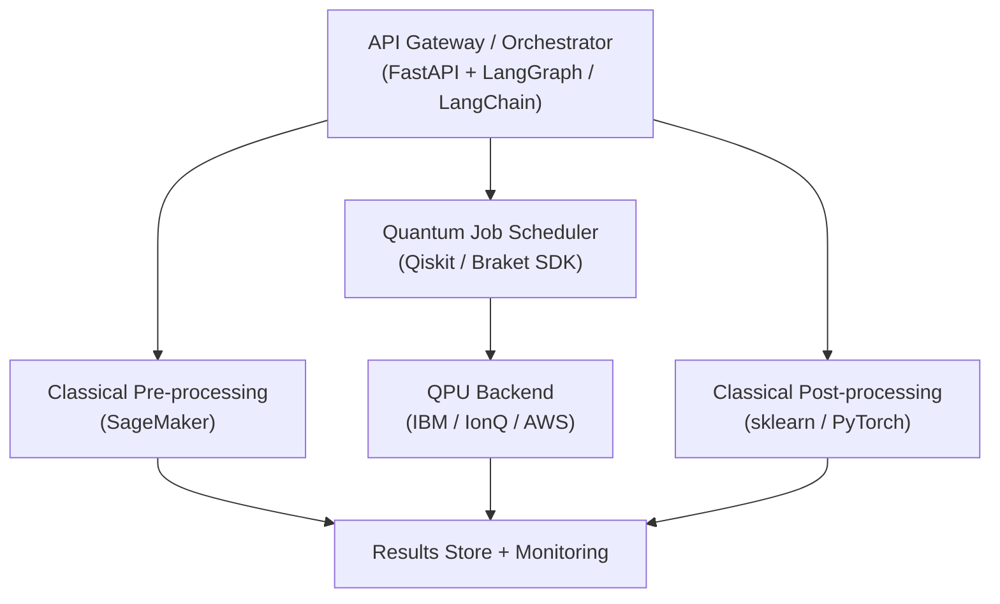
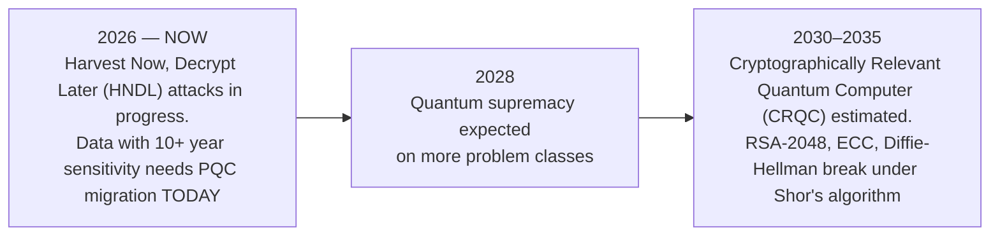

# Quantum AI: Zero to Mastery — Part 3: Mastery & Architecture

**Weeks 9–12 · Principal Architect Track · 2026 Edition**

Continues from [Part 2: Quantum AI](./zero-to-mastery-part2-quantum-ai.md).

---

## Phase 3 — Mastery & Quantum Architecture

### Week 9: Enterprise Quantum Architecture Patterns

#### The Hybrid Quantum-Classical Stack

| Layer | Components | Architect's Responsibility |
| ------- | ------------ | --------------------------- |
| **Application** | Business logic, API, UI | Problem formulation, quantum ROI |
| **Orchestration** | Job scheduler, workflow engine | Circuit queuing, hybrid execution |
| **Quantum Runtime** | Transpiler, error mitigation, sampler | Backend selection, shot budgets |
| **Classical Compute** | GPU cluster, CPU optimiser | Classical-quantum data handoff |
| **Quantum Hardware** | QPU (IBM/Google/IonQ/QuEra) | Hardware benchmarking, topology matching |
| **Network** | Quantum internet (future) | Repeaters, entanglement distribution |

#### Reference Architecture: Hybrid Quantum-Classical ML Pipeline



Cross-reference: [AI Harness & Orchestration](../enterprise-architecture/ai-architecture/ai-harness-architecture-orchestration.md) · [Agent Interoperability](../enterprise-architecture/ai-architecture/agent-interoperability-orchestration.md)

#### Key Architectural Decisions

**Problem Suitability Checklist**

- [ ] Is the problem classically intractable at target scale?
- [ ] Does it map to optimisation, quantum chemistry, or kernel learning?
- [ ] Can input data be efficiently encoded as quantum states?
- [ ] Is the quantum output classically interpretable?
- [ ] Does the circuit depth fit within hardware coherence time?

**Hardware Selection Matrix**

| Requirement | Best Choice | Why |
| ------------- | ------------ | ----- |
| High gate fidelity | IonQ / Quantinuum | Trapped-ion all-to-all connectivity |
| Large qubit count | IBM (433Q Eagle) | Superconducting scalability |
| QML research | PennyLane + any backend | Hardware-agnostic autodiff |
| Multi-provider comparison | AWS Braket | IonQ + Rigetti + QuEra + OQC |
| Microsoft ecosystem | Azure Quantum | Q# + Qiskit + credits programme |
| Quantum networking | QuEra | Neutral-atom reconfigurable topology |

---

### Week 10: Quantum Cloud Platforms & SDK Deep Dive

| Platform | Qubits | SDK | Pricing Model | Best For |
| ---------- | -------- | ----- | -------------- | ---------- |
| **IBM Quantum** | 127–433Q | Qiskit v1.x | Free tier + Premium | Ecosystem maturity, Qiskit Runtime |
| **Google Quantum AI** | 105Q Willow | Cirq | Partnership only | Error correction research |
| **AWS Braket** | Multi-provider | braket-sdk | Pay-per-shot | Multi-provider, SageMaker integration |
| **Azure Quantum** | Multi-provider | Q# / Qiskit | Credits + PAYG | Microsoft stack, hybrid HPC |
| **NVIDIA CUDA-Q** | GPU-simulated + QPU backends | CUDA-Q | Open source | GPU-accelerated simulation before spending QPU budget |
| **Quantinuum** | Trapped-ion | TKET + Qiskit/Cirq plugins | Managed cloud | Hardware-agnostic circuit *compilation and optimisation* — TKET sits in front of whichever SDK you already use |
| **PennyLane** | Framework-agnostic | PennyLane | Open source | QML, autodiff, hardware-agnostic design |

**Circuit portability:** most real deployments don't pick one SDK exclusively — they write circuits in **OpenQASM** (the assembly-level, vendor-neutral circuit format that Qiskit, Braket, and Azure Quantum all import/export) and compile them with **TKET**, which retargets a single circuit's gate set and qubit layout across IBM, IonQ, Quantinuum, and Rigetti backends without a rewrite.

```python
# SDK-agnostic design with PennyLane — switch backend in one line
import pennylane as qml

# Local sim
dev = qml.device("default.qubit", wires=4)

# Switch to IBM
# dev = qml.device("qiskit.ibmq", wires=4, backend="ibm_nairobi")

# Switch to AWS Braket
# dev = qml.device("braket.aws.qubit", device_arn="arn:aws:braket:::device/quantum-simulator/amazon/sv1", wires=4)

@qml.qnode(dev)
def circuit(x):
    qml.AngleEmbedding(x, wires=range(4))
    qml.StronglyEntanglingLayers(weights, wires=range(4))
    return qml.expval(qml.PauliZ(0))
```

---

### Week 11: Post-Quantum Security & Compliance

#### The Quantum Threat Timeline



#### Post-Quantum Cryptography vs. Quantum Key Distribution

These solve the same threat with fundamentally different mechanisms, and enterprises frequently conflate them:

| | Post-Quantum Cryptography (PQC) | Quantum Key Distribution (QKD) |
| --- | --- | --- |
| **Mechanism** | Classical math problems believed hard even for quantum computers (lattices, hashes) | Physics: measuring a quantum state disturbs it, so eavesdropping is detectable |
| **Infrastructure** | Software upgrade — new algorithms on existing networks | New hardware — dedicated fibre or satellite links, distance-limited |
| **Standardisation** | NIST FIPS 203–206 (below) | No equivalent global standard; niche deployments (banking backbones, government links) |
| **Migration path** | The Week 11 checklist below | Not a drop-in replacement for TLS at internet scale — treat as a specialised, high-assurance point-to-point control |

**Cryptographic agility** — the ability to swap a cryptographic algorithm without re-architecting the system around it — is the governance discipline that makes the PQC migration below tractable at enterprise scale; an architect's first PQC deliverable should usually be an agility layer (abstracted crypto provider interfaces), not a big-bang algorithm swap.

#### NIST Post-Quantum Standards — 2025/2026 Status

| Standard | Algorithm | Use Case | Security Basis | Status |
| ---------- | ----------- | ---------- | --------------- | ------- |
| **FIPS 203** | ML-KEM (Kyber) | Key encapsulation | Module lattice | **Final (2024)** |
| **FIPS 204** | ML-DSA (Dilithium) | Digital signatures | Module lattice | **Final (2024)** |
| **FIPS 205** | SLH-DSA (SPHINCS+) | Digital signatures | Hash-based | **Final (2024)** |
| **FIPS 206** | FN-DSA (Falcon) | Digital signatures | NTRU lattice | Finalising 2026 |
| HQC | Code-based KEM | Key encapsulation (backup) | Error-correcting codes | Selected March 2025; finalising ~2027 |

**Deployment reality (as of July 2026):**
- **Microsoft** shipped GA support for ML-DSA in Active Directory Certificate Services on Windows Server 2025 (May 13, 2026) — the most significant enterprise deployment milestone to date.
- **Browsers & CDN vendors** began experimental hybrid TLS support in 2025; major cloud load balancers now offer configurable PQC policies per tenant.
- **US Executive Order EO-14412** mandates government-wide PQC migration for federal systems, with binding deadlines for high-value assets. NIST will deprecate quantum-vulnerable algorithms from its standards by 2035, with high-risk systems transitioning much earlier.
- **UK NCSC** (Feb 2026): financial services urged to complete external TLS hybrids before 2028.
- **Enterprise adoption**: Only 5% of enterprises had PQC deployed as of May 2025 (survey); ~40% report actively transitioning (2026 Entrust/Ponemon study, broadly defined). The gap between "planning" and "deployed" is the architect's problem to close.

> **For architects:** The migration is a $15B+ market opportunity and compliance imperative simultaneously. Start with a crypto inventory (what algorithms are in use, where), then build a cryptographic agility layer *before* swapping algorithms — otherwise every future NIST update becomes another multi-year project.

```python
# PQC implementation using liboqs (Open Quantum Safe)
import oqs

# ML-KEM key encapsulation
with oqs.KeyEncapsulation("ML-KEM-768") as kem:
    public_key = kem.generate_keypair()
    ciphertext, shared_secret_server = kem.encap_secret(public_key)
    shared_secret_client = kem.decap_secret(ciphertext)

assert shared_secret_server == shared_secret_client
```

**PQC Migration Checklist**

- [ ] Crypto inventory: classify all algorithms (vulnerable: RSA, ECC, DH vs safe: AES-256, SHA-3)
- [ ] Identify data with >10 year sensitivity — prioritise for immediate migration
- [ ] Implement hybrid TLS 1.3 (classical + PQC in parallel)
- [ ] Update certificate infrastructure to Dilithium/Falcon signatures
- [ ] Build a cryptographic agility layer so the *next* algorithm swap isn't another multi-year project
- [ ] Map compliance: NIST SP 800-208, NSA CNSA 2.0, EU Quantum Flagship

Cross-reference: [AI Security & Governance](../ai-security-governance/index.md) · [Security Architecture & Guardrails](../enterprise-architecture/ai-architecture/agentic-ai-security-guardrails.md)

---

### Week 12: Capstone — Full Quantum AI System Design

Choose one of four tracks for your portfolio capstone:

<details>
<summary><strong>Option A: Drug Discovery</strong></summary>

**VQE-Based Molecular Energy Estimation Pipeline**

- Molecule encoding (Jordan-Wigner / Parity mapping)
- VQE with UCCSD ansatz for ground state energy
- Error mitigation with ZNE
- Classical ML wrapper using quantum energy estimates as features

**Target metric:** Energy estimate within 5% of classical FCI result on H₂, LiH

</details>

<details>
<summary><strong>Option B: Portfolio Optimisation</strong></summary>

**QAOA Quantum Portfolio Optimiser**

- 10-asset Markowitz optimisation via QAOA
- Quantum covariance estimation for risk modelling
- Classical solver comparison (CPLEX / Gurobi baseline)
- REST API deployment with AWS Braket backend

**Target metric:** QAOA solution within 10% of classical optimal for 10 assets

</details>

<details>
<summary><strong>Option C: Quantum NLP</strong></summary>

**QNLP Text Classification System**

- Text preprocessing + DisCoCat parsing with lambeq
- Quantum circuit generation and training
- 4-class news classification
- Quantum vs classical accuracy comparison

**Target metric:** >75% accuracy on test set

</details>

<details>
<summary><strong>Option D: Custom Domain</strong></summary>

**Architect's Choice — Your Industry**

Propose a Quantum AI application in your domain. Must include:
- Problem formulation with quantum advantage justification
- Algorithm selection with alternatives considered
- Hybrid architecture diagram
- Error mitigation strategy
- Hardware platform selection with cost model

</details>

---

**Next:** continue to [Part 4 — Appendices & Industry Landscape](./zero-to-mastery-part4-appendices.md) for the mathematics reference, solution designs, career roadmap, tooling cheat sheet, and the industry landscape (tech giants, startups, consultancies).
