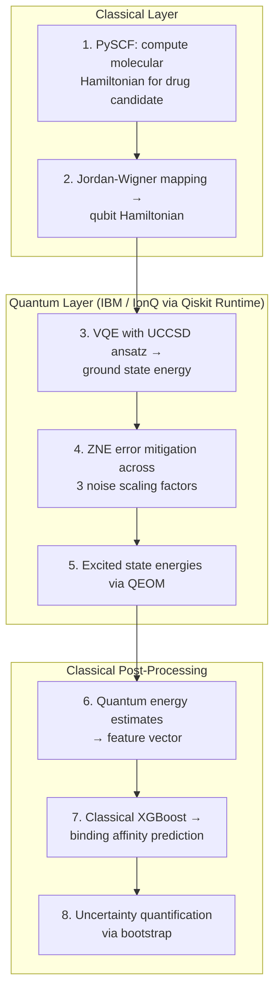
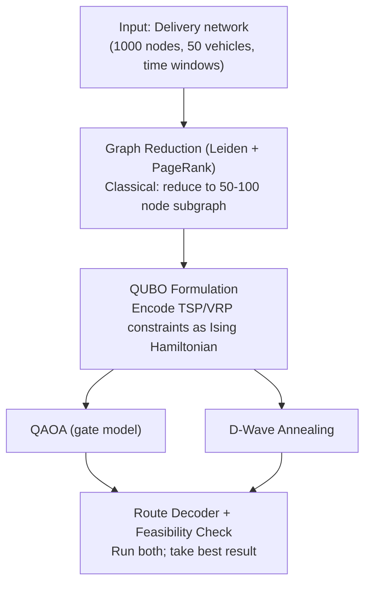
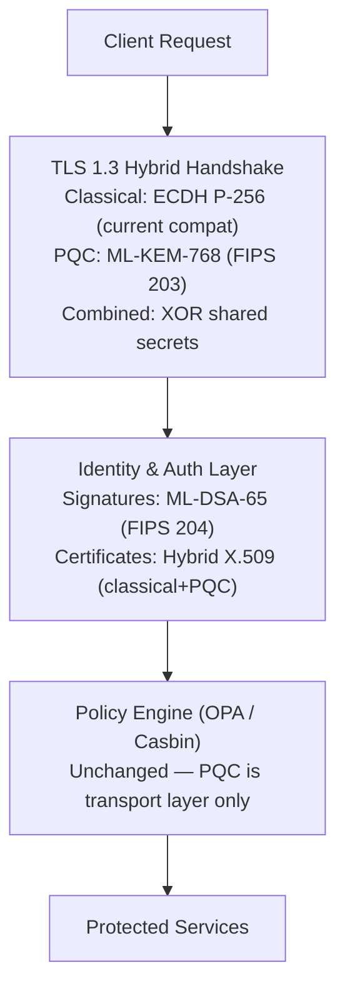
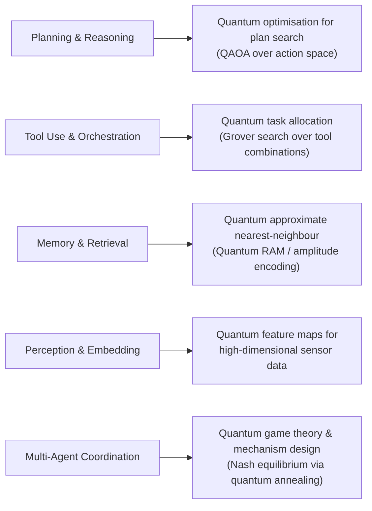

# Quantum AI: Zero to Mastery — Part 4: Appendices & Industry Landscape

**Reference & Industry Landscape · Principal Architect Track · 2026 Edition**

Continues from [Part 3: Mastery & Architecture](./zero-to-mastery-part3-architecture.md).

---

## Appendix A — Mathematics Reference

<details>
<summary><strong>Complex Numbers</strong></summary>

Quantum amplitudes are complex. Key identities:
- `|z|² = probability`
- `z = a + bi`
- `e^{iθ} = cosθ + i·sinθ` (Euler's formula)
- Phase `e^{iθ}` does not affect measurement probability but is critical for interference

</details>

<details>
<summary><strong>Linear Algebra & Hilbert Spaces</strong></summary>

- A **Hilbert space** is a complete complex vector space equipped with an inner product ⟨·|·⟩. Every valid quantum state is a unit vector in one: a single qubit lives in the 2-dimensional Hilbert space ℂ²; n qubits live in the 2ⁿ-dimensional tensor-product Hilbert space (ℂ²)^⊗ⁿ.
- Quantum operations are **unitary matrices** (U†U = I — always reversible).
- Eigenvalues and eigenvectors are the language of measurement.
- Inner product `⟨φ|ψ⟩` is a probability *amplitude*; its squared modulus is a probability.

**Worked example:** what is the probability of preparing `|+⟩ = (|0⟩+|1⟩)/√2` and measuring the outcome associated with `|0⟩`?

```
⟨0|+⟩ = ⟨0| · (|0⟩+|1⟩)/√2 = (⟨0|0⟩ + ⟨0|1⟩)/√2 = (1 + 0)/√2 = 1/√2
P(0) = |⟨0|+⟩|² = |1/√2|² = 1/2
```

This is the calculation underlying every measurement statistic in this series, from the Bell state in [Part 1, Week 2](./zero-to-mastery-part1-foundations.md#week-2-qubits-gates--quantum-circuits) to the QAOA output in [Part 2, Week 6](./zero-to-mastery-part2-quantum-ai.md#week-6-variational-quantum-eigensolvers--qaoa).

</details>

<details>
<summary><strong>Tensor Products</strong></summary>

Multi-qubit states live in tensor product spaces:
- `|ψ⟩ ⊗ |φ⟩ = |ψφ⟩`
- An n-qubit system has a **2ⁿ-dimensional state space**
- Entangled states **cannot** be written as a single tensor product — this is the formal definition of entanglement from Part 1, Week 1

**Worked example:** the Bell state from Part 1, `(|00⟩+|11⟩)/√2`, cannot be factored as `|a⟩⊗|b⟩` for any single-qubit states `|a⟩,|b⟩` — try it and you'll find no assignment of α,β,γ,δ satisfies `(α|0⟩+β|1⟩)⊗(γ|0⟩+δ|1⟩) = (|00⟩+|11⟩)/√2`, since that would require both the `|01⟩` and `|10⟩` coefficients (βγ and αδ) to vanish while `|00⟩` and `|11⟩` (αγ and βδ) don't — impossible unless α or β is already zero, which then also zeroes out one of the terms you need.

</details>

<details>
<summary><strong>Bloch Sphere Geometry</strong></summary>

Recap from [Part 1, Week 1](./zero-to-mastery-part1-foundations.md#the-bloch-sphere-visualising-a-qubit): `|ψ⟩ = cos(θ/2)|0⟩ + e^{iφ}sin(θ/2)|1⟩`. This parametrisation is why single-qubit gates are called "rotations" rather than abstract matrix multiplications — every unitary in SU(2) corresponds to a literal rotation of the (θ,φ) point on the sphere's surface, and gate sequences compose exactly the way rotations do (order matters; rotations about different axes don't commute).

</details>

<details>
<summary><strong>Fourier & Optimisation</strong></summary>

- QFT: O(n²) vs classical FFT O(n·2ⁿ) — underlies Shor's and phase estimation (both in Part 1, Week 3)
- Gradient-based optimisers: ADAM / SGD via **parameter shift rule**
- Gradient-free: COBYLA, Nelder-Mead, SPSA (better under hardware noise)

</details>

---

## Appendix B — Real-World Use Cases & Solution Designs

### Use Case 1: Pharmaceutical — Drug-Target Binding Prediction

**Problem:** Simulating molecular interactions for drug discovery is classically intractable beyond ~50 atoms.

**Quantum Solution Design:**



**Organisations using this today:** Roche + IBM Quantum, Quantinuum + Mimetica (protein folding), Biogen + Accenture Quantum.

**Expected quantum advantage:** 2027–2030 for molecules >100 atoms requiring >50 logical qubits.

---

### Use Case 2: Financial Services — Portfolio Optimisation at Scale

**Problem:** Markowitz optimisation for 1000+ assets has O(N²) to O(N³) classical complexity. Daily rebalancing for large funds is computationally bottlenecked.

**Quantum Solution Design:**

```python
# Quantum Portfolio Optimiser — QAOA approach
from qiskit_finance.applications.optimization import PortfolioOptimization
from qiskit_optimization.algorithms import MinimumEigenOptimizer
from qiskit.algorithms import QAOA

# 1. Formulate as QUBO (Quadratic Unconstrained Binary Optimisation)
portfolio = PortfolioOptimization(
    expected_returns=mu,
    covariances=sigma,
    risk_factor=0.5,
    budget=10  # select 10 of N assets
)
qp = portfolio.to_quadratic_program()

# 2. QAOA solve
qaoa = QAOA(sampler=sampler, optimizer=COBYLA(), reps=3)
optimizer = MinimumEigenOptimizer(qaoa)
result = optimizer.solve(qp)

# 3. Classical post-processing
optimal_weights = portfolio.interpret(result)
```

**Production reference:** D-Wave powers portfolio optimisation for a 135+ enterprise client base including Forbes Global 2000 firms. IonQ Q1 2026 revenue grew 755% YoY to $64.7M — financial services is the leading sector.

**Architecture for production:**

| Component | Technology | Notes |
| ----------- | ----------- | ------- |
| Data ingestion | AWS Kinesis | Real-time market data |
| Problem formulation | Python + Qiskit Finance | QUBO mapping |
| QPU execution | AWS Braket (IonQ + D-Wave) | Multi-provider hedge |
| Classical solver | Gurobi / CPLEX | Fallback + benchmark |
| Results API | FastAPI + Redis | <200ms SLA for pre-computed |
| Monitoring | Grafana + CloudWatch | Shot budget, fidelity tracking |

---

### Use Case 3: Logistics — Supply Chain Route Optimisation

**Problem:** Combinatorial explosion in vehicle routing: N cities = N! routes. Classical heuristics miss optimal by 5–20% at enterprise scale.

**Quantum Solution Design:**



**Reference implementation:** Multiverse Computing's CompactifAI delivers quantum-inspired tensor network solutions for logistics, achieving ~100M EUR ARR by Jan 2026 entirely on classical hardware — proving the market exists before fault-tolerant QPUs arrive.

---

### Use Case 4: Cybersecurity — Post-Quantum Zero Trust Architecture

**Problem:** "Harvest Now, Decrypt Later" (HNDL) attacks require immediate PQC migration for any data with >10 year sensitivity.

**Solution Design: Hybrid PQC Zero Trust Gateway**



Cross-reference: [AI Security & Governance](../ai-security-governance/index.md) · [Auth & Identity Standards](../ai-protocols/auth/entra-3lo-agent-auth-standards-architecture.md)

---

### Use Case 5: Energy — Quantum Grid Optimisation

**Problem:** Power grid load balancing with renewable intermittency is a real-time combinatorial problem with safety constraints.

**Quantum Solution Design:**

| Stage | Technology | Output |
| ------- | ----------- | -------- |
| Grid state ingestion | SCADA → Kafka | Real-time sensor stream |
| QUBO formulation | Qiskit Optimisation | Load-balancing Hamiltonian |
| Quantum solve | D-Wave Advantage (annealing) | Optimal switching schedule |
| Constraint validation | Classical (OR-Tools) | Feasibility guarantee |
| Dispatch | SCADA write-back | Grid switching commands |

**Latency budget:** D-Wave anneal time ~20ms. Total pipeline <500ms — viable for near-real-time grid control.

---

### Use Case 6: Agentic AI — Quantum-Enhanced Agent Orchestration

**Problem:** Multi-agent task assignment is NP-hard at scale. Classical orchestrators use greedy heuristics.

**Quantum Solution Design:**

```python
# Quantum agent task allocation via QUBO
# N agents, M tasks → binary assignment matrix x[i,j]

from docplex.mp.model import Model
from qiskit_optimization.translators import from_docplex_mp
from qiskit_optimization.algorithms import GroverOptimizer

# 1. Classical MILP formulation
mdl = Model("agent_task_allocation")
x = mdl.binary_var_matrix(n_agents, n_tasks, name="x")

# Objective: minimise total cost
mdl.minimize(mdl.sum(cost[i][j] * x[i, j]
             for i in range(n_agents)
             for j in range(n_tasks)))

# Constraint: each task assigned to exactly one agent
for j in range(n_tasks):
    mdl.add_constraint(mdl.sum(x[i, j] for i in range(n_agents)) == 1)

# 2. Convert to QUBO → solve with Grover or QAOA
qp = from_docplex_mp(mdl)
optimizer = GroverOptimizer(num_value_qubits=3, sampler=sampler)
result = optimizer.solve(qp)
```

Cross-reference: [Agentic AI Systems](../agentic-systems/index.md) · [Agent Memory & Planning](../enterprise-architecture/ai-architecture/agent-memory-planning-architecture.md) · [Agent Interoperability & Orchestration](../enterprise-architecture/ai-architecture/agent-interoperability-orchestration.md)

---

## Appendix C — Quantum × Agentic AI

The intersection of quantum computing and agentic AI is the most forward-looking part of this field. Here is a structured map of where these two domains converge.

### Integration Architecture



### Quantum-Enhanced Memory for Agents

The Hopfield network (classical associative memory) has a quantum generalisation that stores exponentially more patterns:

- **Classical Hopfield:** stores ~0.14N patterns for N neurons
- **Quantum Hopfield:** stores ~2^(N/2) patterns — exponential improvement

This matters for agents with large episodic memory stores needing fast pattern recall.

Cross-reference: [Agent Memory & Planning Architecture](../enterprise-architecture/ai-architecture/agent-memory-planning-architecture.md)

### MCP + Quantum: Exposing QPU as a Tool

Quantum computers can be exposed as tools within the Model Context Protocol, making QPU execution available to any MCP-compatible agent:

```python
# Quantum MCP Tool — expose VQE solver as agent-callable tool
from mcp import Server, Tool

@server.tool("quantum_vqe_solve")
async def vqe_solve(molecule_smiles: str, basis_set: str = "sto-3g") -> dict:
    """Compute ground state energy of a molecule using VQE on IBM Quantum."""
    # ... Qiskit Runtime VQE execution
    return {"energy_hartree": result.eigenvalue, "shots_used": shots}
```

Cross-reference: [MCP Deep Guide](../coding-tools/claude/mcp-deep-guide.md) · [MCP & A2A Protocol Deep Dive](../enterprise-architecture/ai-architecture/mcp-a2a-protocol-deep-dive.md)

---

## Appendix D — Career Roadmap & Certifications

### 90-Day Milestone Map

| Milestone | Deliverable | Success Metric |
| ----------- | ------------- | --------------- |
| End of Week 2 | Quantum circuits on real IBM hardware | >95% correct measurement on ibmq backend |
| End of Week 4 | Error mitigation *and* correction strategy designed | Phase 1 architecture brief peer-reviewed, with the mitigation-vs-correction distinction stated explicitly |
| End of Week 6 | VQE or QAOA on a real problem | Energy estimate within 5% of classical |
| End of Week 8 | QNN trained for binary classification | QNN accuracy within 5% of classical NN |
| End of Week 10 | 3-platform comparison on same workload | Platform recommendation doc approved |
| End of Week 11 | PQC migration plan for realistic system | All vulnerable crypto assets catalogued |
| End of Week 12 | Full Quantum AI system capstone | GitHub repo + architecture doc + deck |

### Certifications

| Certification | Provider | Level | Why It Matters |
| -------------- | ---------- | ------- | --------------- |
| [IBM Certified Associate Developer — Quantum](./IBM_Associate_Quantum_CertGuide.md) | IBM | Entry | Best entry-level cert; validates Qiskit proficiency |
| [IBM Certified Developer — Quantum](./IBM_Developer_Quantum_CertGuide.md) | IBM | Professional | Algorithm implementation, Runtime v2, VQE, QAOA, QML |
| MIT 8.370x Quantum Information Science | edX / MIT | Academic | Rigorous physics-based foundations |
| QOSF Mentorship Programme | Quantum Open Source | Structured | 3-month project with researcher mentor |

### Target Roles

| Role | Employers | Requires |
| ------ | ----------- | --------- |
| **Quantum Solutions Architect** | IBM, AWS, Azure Quantum, Quantinuum | Phases 1–3 + business communication |
| **Quantum AI Research Engineer** | Google DeepMind, Quantinuum, national labs | Deep Phase 2 + research publication |
| **Principal Quantum Architect** | Banks, pharma, aerospace | All phases + enterprise delivery track record |
| **Quantum Security Architect** | Gov, defence, finance | Week 11 deep dive + PQC implementation experience |

---

## Appendix E — Tooling Cheat Sheet

| Tool | Category | Install | Primary Use |
| ------ | ---------- | --------- | ------------- |
| **Qiskit** | SDK | `pip install qiskit` | IBM hardware, circuits, simulation |
| **PennyLane** | SDK/ML | `pip install pennylane` | QML, autodiff, hardware-agnostic |
| **Cirq** | SDK | `pip install cirq` | Google hardware, research circuits |
| **CUDA-Q** | SDK | see nvidia.com/cuda-q | GPU-accelerated simulation, hybrid CPU/GPU/QPU kernels |
| **TKET** (`pytket`) | Compiler | `pip install pytket` | Hardware-agnostic circuit optimisation & retargeting |
| **OpenQASM** | Circuit format | built into Qiskit/Braket/Azure | Vendor-neutral circuit interchange |
| **lambeq** | NLP | `pip install lambeq` | Quantum NLP, DisCoCat |
| **Qiskit Nature** | Chemistry | `pip install qiskit-nature` | VQE for molecular simulation |
| **Amazon Braket SDK** | Cloud | `pip install amazon-braket-sdk` | AWS multi-provider access |
| **Q#** | Language | `dotnet tool install -g Microsoft.Quantum.IQSharp` | Azure Quantum, algorithm design |
| **Mitiq** | Error Mitigation | `pip install mitiq` | ZNE, PEC, CDR error mitigation |
| **liboqs** | PQC | see openquantumsafe.org | Post-quantum crypto implementation |
| **QuTiP** | Simulation | `pip install qutip` | Quantum system dynamics, open systems |

---

## Industry Landscape Quick Reference

The three industry research reports in this section provide deep dives into each segment:

<details>
<summary><strong>Tech Giants</strong></summary>

IBM, Google, Microsoft, AWS, and NVIDIA converged on the same architectural pattern in 2025–2026: hybrid quantum-classical pipelines, accessed via cloud APIs, targeting near-term advantage in chemistry simulation, optimisation, and quantum-enhanced ML. Differentiation is in hardware modality, ecosystem maturity, and how aggressively each player frames its quantum timeline. (McKinsey's 2026 Quantum Technology Monitor: a third of large enterprises now allocate >$10M/year to quantum initiatives; quantum computing companies crossed $1B combined revenue in 2025, projected to reach $4.4B by 2028.)

| Giant | Flagship Platform | Strategic Bet | Best Practice | Anti-Pattern to Avoid |
| ----- | ------------------ | -------------- | -------------- | ----------------------- |
| **IBM** | Qiskit + Qiskit Runtime v2, Eagle/Nighthawk QPUs (20–30 cloud-accessible), IBM Quantum Network (280+ partners), Qiskit Functions Catalog | Fault-tolerant roadmap to 2028; embeds quantum specialists via IBM Consulting | Pair every pilot with a partner team that has run that algorithm class before; use Qiskit Functions to abstract circuit complexity from domain teams | Expecting quantum advantage on general-purpose ML today — IBM's own framing is chemistry/optimisation, not broad AI replacement |
| **Google Quantum AI** | Willow chip (105 qubits), Cirq, TensorFlow Quantum | Prove narrow, verifiable advantage first; commercial access stays partnership-driven, not self-serve | Use the 13,000x benchmark as a calibration point for what "quantum advantage" looks like — narrow and falsifiable, not general | Assuming headline speedup numbers generalise to your workload, or building a strategy on Cirq alone without Qiskit interoperability |
| **Microsoft Azure Quantum** | Azure Quantum (IonQ, Quantinuum, Rigetti), Q#, Quantum Ready Initiative, Azure Quantum Elements, topological-qubit research | Organisational readiness first; topological qubits as a long-shot differentiated hardware bet | Run a Quantum Ready-style readiness assessment before procuring any quantum compute; benchmark the same algorithm across all three Azure-hosted backends | Skipping the readiness assessment and jumping straight to procurement; waiting for topological qubits before starting any quantum work |
| **AWS Braket** | Amazon Braket (Rigetti, IonQ, D-Wave, QuEra, OQC, Xanadu, IQM), Ocelot chip (cat qubits), Quantum Embark Program, Braket + SageMaker Hybrid Jobs | Platform aggregation ("quantum hardware app store") plus proprietary cat-qubit hardware to cut error-correction overhead | Architect workloads as Hybrid Jobs from day one, even for simulator-only prototypes; use D-Wave annealing as the lowest-friction entry to combinatorial optimisation | Provider-shopping indefinitely without a benchmark-and-decide cycle; running annealing algorithms with gate-model assumptions |
| **NVIDIA** | CUDA-Q, cuQuantum, DGX Quantum | Own the classical compute layer under every quantum system, regardless of which hardware modality wins | Prototype and debug all variational algorithms (VQE/QAOA/QNN) on cuQuantum GPU simulators before spending QPU budget | Treating GPU simulation results as proof of quantum advantage — simulators are efficient precisely because the circuit is still classically tractable |

**Notable 2025–2026 hardware milestones:**

- **IBM Nighthawk** (Nov 2025) — 120 qubits, 218 tunable couplers (20%+ more than Heron); supports circuits with up to 5,000 two-qubit gates at low error rates. Available to IBM Quantum Network users by end-2025. IBM targets verified quantum advantage by end-2026 on specific workloads.
- **IBM Loon** (Nov 2025, experimental) — First processor to integrate every hardware component required for fault-tolerant quantum computing: six-way qubit connectivity, qLDPC error-correction codes, and real-time error decoding under 480 nanoseconds (one year ahead of IBM's own schedule). Fault-tolerant systems projected for 2029.
- **Google Willow** (Oct 2025) — 105 qubits; demonstrated below-threshold error correction (as code distance increases, errors decrease exponentially — the key theoretical requirement for fault tolerance). Achieved a **13,000× speedup over Frontier** on the out-of-order time-correlator benchmark, one of the most specific and verifiable quantum advantage claims to date.
- **Microsoft Majorana 1** (Feb 2025) — World's first topological QPU. 8 qubits built on an indium-arsenide/aluminium topoconductor; stores information in Majorana zero modes distributed across the material rather than in individual particles, giving hardware-level error resistance. Roadmap claims 1 million qubits on a single chip is achievable with this architecture — versus the current ceiling of ~1,000+ for superconducting chips.
- **Quantinuum** (March 2026) — Demonstrated error-protected logical qubits operating beyond break-even on H-series trapped-ion hardware, the first time a logical qubit outperformed its constituent physical qubits in a real computation.
- **AWS Ocelot** (Feb 2025) — AWS's first proprietary QPU (14 physical qubits using cat-qubit architecture designed to reduce error-correction overhead). D-Wave annealers via Braket used by Volkswagen Labs for routing/scheduling.

**Cross-giant patterns (architect takeaways):**

1. **Hybrid-first, not quantum-first** — every credible win (Project Bob inside SDLC, AWS Hybrid Jobs, Azure Quantum Elements inside HPC pipelines) embeds quantum as one component of an existing classical workflow. Never propose a "quantum-first" redesign — propose a hybrid insertion point.
2. **Readiness spend dominates hardware spend** — McKinsey's data shows enterprise quantum budgets flow overwhelmingly to use-case development, integration, and internal capability building, not QPU access fees. Budget readiness assessment and integration as the largest line items.
3. **Verifiable, narrow benchmarks build credibility** — Google's 13,000x claim was credible because it was narrow, verifiable, and immediately referenced by competitors (IBM, Microsoft, IonQ). Demand specific benchmarks on problem classes similar to yours before trusting vendor claims.
4. **Multi-hardware hedging is the dominant strategy** — Microsoft, AWS, and NVIDIA all build abstraction layers spanning hardware modalities; only IBM and Google lead with proprietary-hardware-first positioning (and even they offer Qiskit/Cirq portability). Avoid irreversible lock-in to one QPU vendor's proprietary SDK without an abstraction layer.

**Master anti-pattern library** (highest-frequency mistakes across tech-giant case studies): committing budget to QPU access before completing a use-case readiness assessment; selecting a hardware vendor on roadmap promises rather than benchmarked results; skipping classical-simulator validation before consuming QPU budget; hard-coding to one vendor's proprietary SDK without a documented reason; designing low-latency systems with quantum in the critical path (current QPU latency runs seconds to minutes including queue time); using gate-model algorithm patterns for problems that are really QUBO/Ising formulations, and vice versa; running quantum pilots as isolated innovation-lab projects disconnected from production data pipelines; treating a single press-release benchmark as evidence your own workload will see similar gains.

*Sources: IBM 3Q25 Earnings (SEC 8-K); IBM Think "Trends Shaping AI and Tech in 2026"; Constellation Research 2025 Year in Review; McKinsey Quantum Technology Monitor 2026; LevelFields Quantum Stocks 2026; The Quantum Insider "Top Quantum Computing Companies" (2026); PatentPC "Quantum Cloud Computing: AWS, Google, IBM"; BQP Sim "Quantum Computing & AI Together 2026"; SpinQ Global Footprint of Quantum Computers 2025.*

**Key pattern:** Every major tech giant converged on hybrid quantum-classical pipelines via cloud APIs, targeting chemistry simulation, optimisation, and quantum-enhanced ML.

</details>

<details>
<summary><strong>Startups</strong></summary>

IonQ ($64.7M Q1 2026, 755% YoY), D-Wave (179% YoY, 135+ enterprise clients), Quantinuum (QNLP bet), Multiverse Computing (~€100M ARR from quantum-inspired classical hardware). See [Quantum AI Startups Report](./Quantum_AI_Startups_Report.md).

**Key pattern:** Each startup picked a different wedge into the "quantum is theoretical" perception problem. The commercialisation race is happening now.

</details>

<details>
<summary><strong>Consultancies</strong></summary>

Accenture, McKinsey QuantumBlack (140+ use-case accelerators), BCG X, Deloitte, IBM Consulting. See [Quantum AI Consultancies Report](./Quantum_AI_Consultancies_Report.md).

**Key pattern:** Consultancies sell the bridge (strategy + vendor translation + change management) between enterprise business problems and quantum-native vendors. The $15B+ AI consulting market now includes quantum as a billable practice.

</details>

---

## Further Reading & References

**Official Documentation**
- [IBM Quantum Learning](https://learning.quantum.ibm.com) · [Qiskit Documentation](https://docs.quantum.ibm.com) · [PennyLane Documentation](https://pennylane.ai) · [Cirq Documentation](https://quantumai.google/cirq) · [Amazon Braket Documentation](https://docs.aws.amazon.com/braket/) · [Azure Quantum Documentation](https://learn.microsoft.com/azure/quantum/) · [TKET Documentation](https://tket.quantinuum.com/)

**Tutorials**
- IBM Quantum Learning's free hands-on modules (start here — real hardware access, no cost)
- [PennyLane Demonstrations](https://pennylane.ai/qml) — the strongest QML-specific tutorials available, covering VQE, QNN, kernels, and QNLP
- Amazon Braket example notebooks (GitHub, see below) and Microsoft Learn's Azure Quantum learning paths

**Books**
- *Quantum Computation and Quantum Information* — Nielsen & Chuang (the definitive reference; read Chapters 1–5 and 10 first — advanced/complete)
- *Programming Quantum Computers* — Johnston, Harrigan, Gimeno-Segovia (beginner-to-intermediate, code-first)
- *Quantum Computing: An Applied Approach* — Hidary (intermediate, strong SDK coverage)

**Research Papers**
- Deutsch & Jozsa (1992), Grover (1996), Shor (1997) — the original algorithm papers referenced throughout Part 1
- Peruzzo et al. (2014) — the original VQE paper; Farhi et al. (2014) — the original QAOA paper
- Tang (2019) — the dequantisation result behind Part 2's HHL/qPCA caveat
- Google Quantum AI, *Quantum error correction below the surface code threshold* (2024) — the Willow result referenced in Part 1, Week 4
- arXiv `quant-ph` — follow Maria Schuld, Nathan Killoran, John Preskill for current QML and NISQ-era commentary

**GitHub Repositories**
- [Qiskit](https://github.com/Qiskit/qiskit) · [PennyLane](https://github.com/PennyLaneAI/pennylane) · [Cirq](https://github.com/quantumlib/Cirq) · [CUDA-Q](https://github.com/NVIDIA/cuda-quantum) · [Amazon Braket Examples](https://github.com/aws/amazon-braket-examples) · [Microsoft Quantum Samples](https://github.com/microsoft/Quantum) · [Quantum Katas](https://github.com/microsoft/QuantumKatas)

**Hands-on Labs**
- IBM Quantum Lab (free real-hardware queue) · Google Colab (run any snippet in this series directly) · Amazon Braket simulators (pay-per-shot) · Azure Quantum sandboxes (credits programme)

**Videos**
- IBM Quantum, Google Quantum AI, and Microsoft Reactor YouTube channels — vendor-specific but technically rigorous
- MIT OpenCourseWare 8.370x lecture recordings — the academic-rigor option

**Community**
- [Qiskit Community](https://qiskit.org/community) · [PennyLane Community](https://discuss.pennylane.ai/) · [Quantum Computing Stack Exchange](https://quantumcomputing.stackexchange.com/) · [Unitary Fund](https://unitary.fund) (open-source quantum software grants + Slack) · Quantum Open Source Foundation (QOSF)

---

This is the final part of the series (4 of 4). *Cross-reference this guide with:*
*[AI Foundations](../ai-foundations/index.md) · [Agentic AI Systems](../agentic-systems/index.md) · [Cloud Platforms](../cloud-platforms/index.md) · [AI Security & Governance](../ai-security-governance/index.md) · [Enterprise Architecture Patterns](../enterprise-architecture/ai-architecture/enterprise-ai-architecture-patterns.md)*
