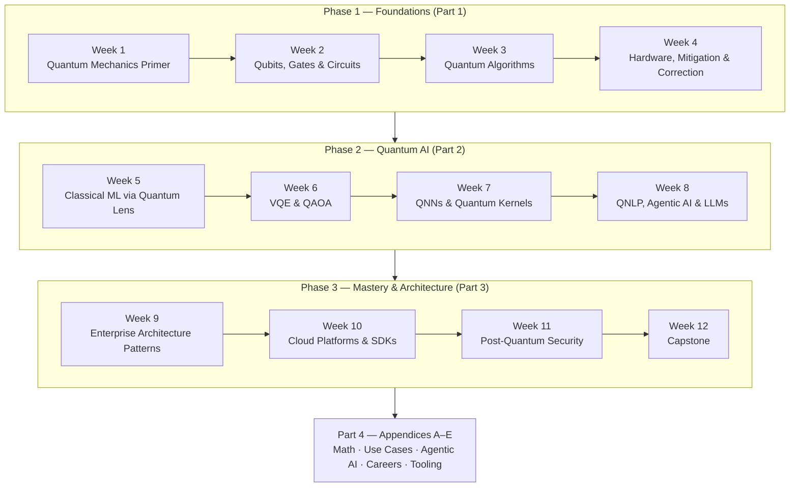

# Quantum AI: Zero to Mastery

**Principal Architect Track · 12-Week Programme · 2026 Edition**

> The quantum era is not coming — it is here. By 2030, quantum advantage will disrupt cryptography, drug discovery, logistics optimisation, financial modelling, and machine learning itself. This guide takes you from first principles to production-grade quantum system design.

---

## How to Use This Guide

This is one continuous programme published as a 4-part series, not four unrelated documents — every week builds on the vocabulary and code from the week before it, including across part boundaries. Jump to any week using the table below, but if a term feels unexplained, it was very likely introduced earlier; use your browser's find-in-page rather than assuming it's missing.

| Phase | Weeks | Theme | Jump to |
| --- | --- | --- | --- |
| **1 — Foundations** | 1–4 | Physics, gates, algorithms, hardware, error handling | [Week 1](./zero-to-mastery-part1-foundations.md#week-1-quantum-mechanics-primer-for-engineers) · [2](./zero-to-mastery-part1-foundations.md#week-2-qubits-gates--quantum-circuits) · [3](./zero-to-mastery-part1-foundations.md#week-3-quantum-algorithms--grover-shor-deutsch-jozsa) · [4](./zero-to-mastery-part1-foundations.md#week-4-quantum-hardware-error-mitigation--error-correction) |
| **2 — Quantum AI & ML** | 5–8 | VQE, QAOA, QNNs, QNLP, agentic integration | [Week 5](./zero-to-mastery-part2-quantum-ai.md#week-5-classical-ml-through-a-quantum-lens) · [6](./zero-to-mastery-part2-quantum-ai.md#week-6-variational-quantum-eigensolvers--qaoa) · [7](./zero-to-mastery-part2-quantum-ai.md#week-7-quantum-neural-networks--kernel-methods) · [8](./zero-to-mastery-part2-quantum-ai.md#week-8-qnlp-agentic-ai--llm-integration) |
| **3 — Mastery & Architecture** | 9–12 | Enterprise patterns, SDKs, PQC, capstone | [Week 9](./zero-to-mastery-part3-architecture.md#week-9-enterprise-quantum-architecture-patterns) · [10](./zero-to-mastery-part3-architecture.md#week-10-quantum-cloud-platforms--sdk-deep-dive) · [11](./zero-to-mastery-part3-architecture.md#week-11-post-quantum-security--compliance) · [12](./zero-to-mastery-part3-architecture.md#week-12-capstone--full-quantum-ai-system-design) |
| **Appendices** | — | Math reference, use cases, agentic AI, careers, tooling | [A](./zero-to-mastery-part4-appendices.md#appendix-a--mathematics-reference) · [B](./zero-to-mastery-part4-appendices.md#appendix-b--real-world-use-cases--solution-designs) · [C](./zero-to-mastery-part4-appendices.md#appendix-c--quantum--agentic-ai) · [D](./zero-to-mastery-part4-appendices.md#appendix-d--career-roadmap--certifications) · [E](./zero-to-mastery-part4-appendices.md#appendix-e--tooling-cheat-sheet) |

Companion material: [IBM Associate Cert Guide](./IBM_Associate_Quantum_CertGuide.md) (Qiskit fundamentals, exam-paced) and [IBM Developer Cert Guide](./IBM_Developer_Quantum_CertGuide.md) (Runtime v2, advanced error mitigation) go deeper on the Qiskit API than this series' code samples do — use them when you want the exam-grade level of detail behind any snippet below.

---

## Why Quantum Now?

The second quantum revolution is commercial. McKinsey's 2026 Quantum Technology Monitor found **a third of large enterprises allocate >$10M annually to quantum initiatives**. Quantum computing companies collectively crossed **$1B in revenue in 2025**, projected to reach $4.4B by 2028.

For a Principal Architect, this matters on three axes:

| Axis | Classical Limit | Quantum Opportunity |
| ------ | ---------------- | --------------------- |
| **Optimisation** | NP-hard problems scale exponentially | QAOA approximates solutions on NISQ hardware today |
| **ML / AI** | Diminishing returns from model scaling | QNNs & quantum kernels access exponentially larger feature spaces |
| **Security** | RSA-2048 / ECC break under Shor's algorithm (2030–2035) | Post-quantum cryptography is an immediate compliance requirement |

Cross-reference: [AI Foundations](../ai-foundations/index.md) · [Enterprise Architecture Patterns](../enterprise-architecture/ai-architecture/enterprise-ai-architecture-patterns.md)

---

## Programme Map

---

## Series Parts

This programme is published as a 4-part series. Each part is self-contained — start with Part 1 and work through in order, or jump straight to the part covering the phase you need.

| Part | Covers | What's unique to this part |
| --- | --- | --- |
| [Part 1 — Foundations](./zero-to-mastery-part1-foundations.md) | Weeks 1–4 | Quantum mechanics primer (superposition, entanglement, interference, measurement), qubits/gates/circuits with Qiskit, core algorithms (Deutsch-Jozsa, Grover, Shor, QAOA), hardware modalities and NISQ-era error mitigation |
| [Part 2 — Quantum AI](./zero-to-mastery-part2-quantum-ai.md) | Weeks 5–8 | Classical ML mapped to quantum analogues, VQE and QAOA implementations, QNN and quantum kernel SVM architectures, QNLP with lambeq, and LLM × quantum integration patterns |
| [Part 3 — Mastery & Architecture](./zero-to-mastery-part3-architecture.md) | Weeks 9–12 | The hybrid quantum-classical enterprise stack, hardware/cloud-platform selection matrices, post-quantum cryptography migration (NIST FIPS 203-206), and the four capstone project tracks |
| [Part 4 — Appendices & Industry Landscape](./zero-to-mastery-part4-appendices.md) | Reference | Mathematics reference, 6 real-world solution designs (pharma, finance, logistics, cybersecurity, energy, agentic AI), quantum × agentic AI patterns, career roadmap & certifications, tooling cheat sheet, and the industry landscape (tech giants, startups, consultancies) |

**Begin with [Part 1 — Foundations →](./zero-to-mastery-part1-foundations.md)**

---

*Cross-reference this guide with:*
*[AI Foundations](../ai-foundations/index.md) · [Agentic AI Systems](../agentic-systems/index.md) · [Cloud Platforms](../cloud-platforms/index.md) · [AI Security & Governance](../ai-security-governance/index.md) · [Enterprise Architecture Patterns](../enterprise-architecture/ai-architecture/enterprise-ai-architecture-patterns.md)*
